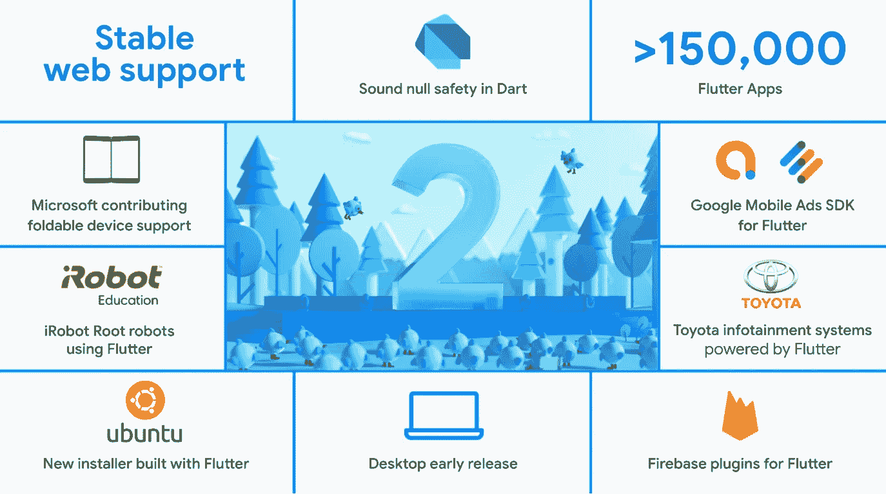
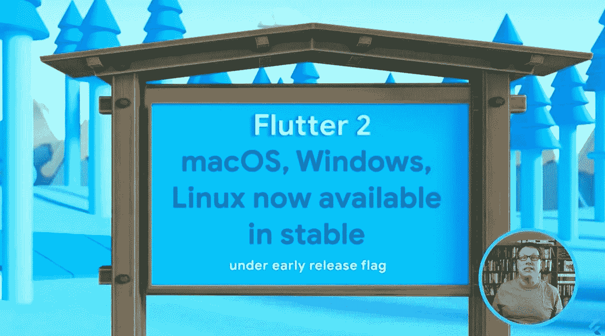
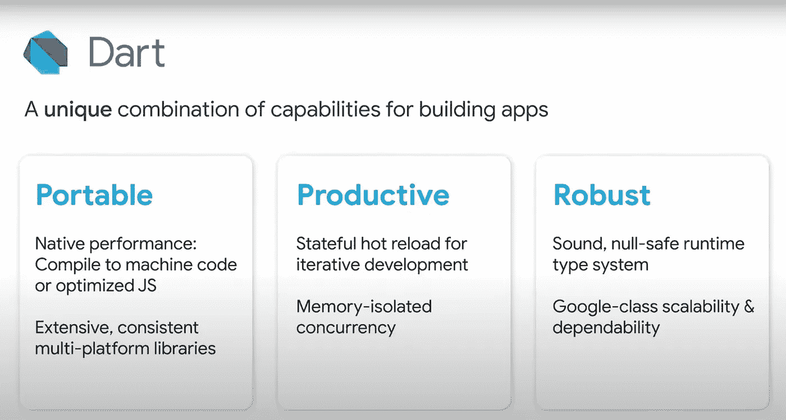
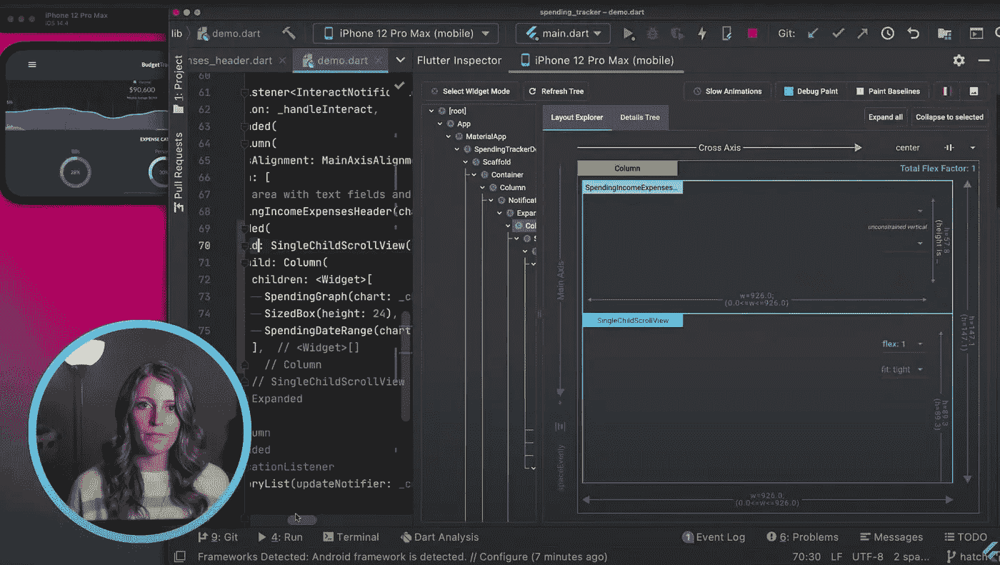

# 颤振接合概述

> 原文：<https://medium.com/nerd-for-tech/flutter-engage-recap-901647c3f577?source=collection_archive---------3----------------------->

大家好！2021 年 3 月 3 日，谷歌组织了一场名为 **Flutter Engage** 的活动！颤振队又有了一场精彩的表演。这是一个轰动的事件，显示了颤振的力量和未来。我很高兴在我的项目中使用这些颤振改进。

如果你错过了这次活动，不要担心。我做了一些笔记，我想从我的角度分享这次活动的公告、发布和新闻。开始吧！

*图片:谷歌*

# 颤振 2.0

Flutter 2.0 发布。这是颤振的主要更新。在这个版本中，Flutter 专注于便携性。**飘起的不仅仅是连移动的框架！**

*   Flutter 的重点是可移植性，这意味着你可以发布你的应用程序 **Windows、macOS、Linux、Web** 以及 **Android** 和 **iOS** 。
*   [**gSkinner**](https://gskinner.com/) 为所有平台创建了名为 [**Flutter Folio**](https://flutter.gskinner.com/) 的 flutter app。你可以去看看！
*   超过 **150.000** 的应用程序在商店中发布。

*   **6000** 发行结束！
*   **GPay** ，移动到 Flutter，每月有 **150M** 活跃用户。

 [## 飘动对开陈列柜

### 一个多平台的 Flutter 应用程序，在每个设备上都感觉很棒。gskinner 用爱制造。

flutter.gskinner.com](https://flutter.gskinner.com/)  [## gskinnerTeam/颤振-对开

### 一个演示应用程序，展示了 Flutter 如何为开发人员提供出色的多平台体验。由 gskinner 建造于…

github.com](https://github.com/gskinnerTeam/flutter-folio) 

*   **折叠式手机**的摆动支架。
*   **微软一直在为 Flutter 贡献**。微软正在扩大对 Flutter 的支持，并与谷歌合作开发 Windows 对 Flutter 的支持。
*   Flutter 2.0 支持嵌入式系统，**丰田**用 Flutter 为汽车开发 app。
*   **超过 15.000 的**包发布在 [**pub.dev**](https://pub.dev/)
*   针对 Flutter 2.0 更新的 Firebase 包
*   Flutter 2.0 包括用于 Flutter 的[谷歌移动广告的测试版，这是一个新的软件开发包，可与**谷歌的 AdMob** 和 **AdManager** 产品配合使用，并使在 **Flutter 应用**中创建各种广告格式成为可能](https://pub.dev/packages/google_mobile_ads)

# 颤动腹板

Web 颤振现在是在**稳定的**版本上。

我认为，Flutter Web 并没有那么快和高效。在过去一年左右的时间里，该团队开始研究所谓的 Canvas Kit。这个基于 WebAssembly 的项目采用了驱动 Android 和 Chrome 本身的相同的 Skia 图形引擎**，并使其可用于 web 应用**。****

****随着颤振 2.0，颤振网页更新和性能的改善。此外，Flutter 2.0 还增加了特定于 Web 的特性和小部件。****

****[**DartPad**](http://dartpad.dev) ，已经更新支持 Flutter 2，可以在不离开自己喜欢的浏览器的舒适环境下尝试全新的 null 安全版 Flutter。****

********

****你可以看到用 Flutter Web 开发的网站。****

 ****[## 镖靶

### 编辑描述

镖靶](https://dartpad.dev/)****  ****[## iRobot 编码

### 编辑描述

code.irobot.com](https://code.irobot.com/)****  ****[## 颤动等离子体

### 演示 Flutter web 渲染的 Flutter 应用程序

flutterplasma.dev](https://flutterplasma.dev/)**** 

# ****颤动桌面****

****桌面颤振现在是在**稳定的**版本上。一个最大的消息是 Flutter 是未来 Ubuntu 应用的默认选择。另外，Ubuntu 安装程序是用 Flutter 开发的，他们共享了一个名为 Yaru 的 Flutter Desktrop 应用程序。****

********

# ****镖****

****Dart 提供了支持 Flutter 应用程序的语言和运行时。Dart 便携、高效且坚固耐用。****

********

****空安全是一个主要的新的生产力特性，它帮助您避免空异常，这是一类通常很难发现的错误。作为一个额外的好处，这个特性还支持一系列的性能改进。Dart 最大的更新之一是，**空安全**现在是 Flutter 的一部分！****

********

# ****工具作业****

****[**Flutter Fix**](https://flutter.dev/docs/development/tools/flutter-fix) 是 Flutter 2.0 附带的新工具。使用此工具，您将能够自动解决警告和错误。****

******Null Safety** 迁移工具有助于将您的应用程序转换为 null-safety。****

****有了新的 **Flutter 开发工具**，你可以在你的 IDE 上找到并修复 UI 错误。此外，您可以探索您的应用程序大小并进行分析。****

********

******Flutter 开发工具**现可用于 VS 代码和 Android Studio****

********

# ****结论****

****Flutter 2.0 提供了大量的功能！我认为，有了 Flutter 2.0，我们可以说 Flutter 不仅仅是一个移动 SDK，你可以使用 Flutter 为所有平台构建应用程序。Flutter 2.0 附带了很多工具，零安全，稳定的多平台支持等等！****

****你可以阅读官方文章了解更多详情:****

**** [## Flutter 2.0 的新特性

### 颤振网页和零安全移动到稳定，颤振桌面移动到测试版等等！

medium.com](/flutter/whats-new-in-flutter-2-0-fe8e95ecc65) 

感谢阅读…****