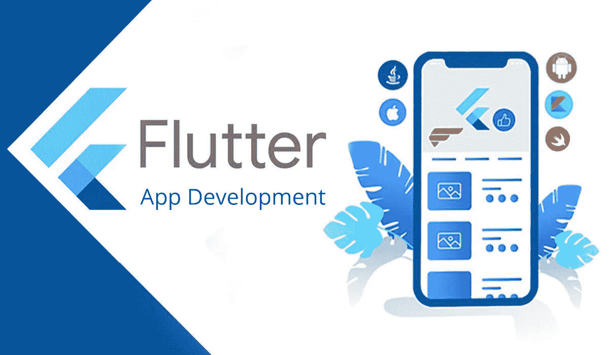

# 适合初学者的颤振

> 原文：<https://medium.com/nerd-for-tech/flutter-for-beginners-fbe03e999dd2?source=collection_archive---------1----------------------->

这篇文章是给那些对学习 Flutter 感兴趣的人的指南，并对基础知识进行了概述。



## 谁，什么，为什么？

Flutter 是 Google 创建的 UI 开发工具包。它可以用来构建跨平台的应用程序，可以在 IOS 设备和 Android 设备上运行的应用程序，甚至可以在 Web 上运行。

我们更喜欢 Flutter，因为你用 Flutter 开发的应用程序可以跨平台运行，不需要修改一行代码。虽然有替代方法可以完成同样的任务，比如 React，但它们基本上都是用一种语言编译成另一种语言来执行任务，因此降低了应用程序的速度。另一方面，Flutter 可以一个像素一个像素地工作，并在任何屏幕上绘制应用程序，而不管设备是什么。

## 装置

你可以按照向导[在这里](https://flutter.dev/docs/get-started/install)安装 flutter。只需安装文件并将其解压缩到 C:/下，然后将其添加到 Windows 控制面板上的环境设置下的路径中。然后，安装一个模拟器，这个工具可以帮助你在任何你喜欢的设备上查看你的应用程序，比如 IPhone 或 Pixel 3，而不需要实际拥有设备。然后，在命令提示符下运行 Flutter Doctor，找到许可协议并全部接受。瞧啊。

## 入门指南

您可以使用任何您喜欢的 IDE。要启动一个基本的 flutter 应用程序，只需使用命令提示符(cd 命令)指向包含您的项目的右文件夹，并使用下面的命令:

> 颤振创建应用程序名称

然后，您可以通过在首选 IDE 中打开提到的文件夹来继续操作。打开一个模拟器来服务您的项目。为了让**真正在模拟器上服务**你的项目，在你的 IDE 上进入 **Run** 选项卡，选择**Run without debug**。该选项将为您提供热重新加载或重新启动等工具，以便您可以看到您在应用程序上所做的更改，而不必终止该进程并再次运行它，这将花费太多时间。您可以通过点击红色方块图标来停止正在运行的进程，并随时使用与之前相同的方法运行它。

大多数 Flutter 应用程序使用 Material Design，这是一个也由谷歌开发的工具，用于设计你开发的应用程序。

每个文件夹在默认的 Flutter 项目中都有其用途。例如，android 文件夹是您的应用程序转换到 Android 平台的地方。Web 文件夹可帮助您制作 Web 应用程序。因此，举例来说，如果你正在开发 Android 应用程序，你可以删除 Web 文件夹以减轻负担。

让我们来研究一下你默认的 Flutter 应用程序自动附带的文件和文件夹。虽然一开始看起来可能很吓人，但是请记住，这些文件和文件夹中的大部分都不是你可以碰的。你的主文件夹将是 **lib 文件夹**，在这里我们做了大部分的工作，并为应用程序放置了我们的代码文件&文件夹。然后是 **pubspec.yaml 文件**，我们在其中定义和声明项目的依赖项。你在模拟器上看到的应用程序是 lib 文件夹中的 **main.dart** 文件的结果。类似于 index.html 的工作方式，这是你的应用程序的第一页和主页面。它的扩展 dart 是一种用于构建 Flutter 应用程序的编程语言。它是面向对象的，非常类似于 C#或 Java。

## 开发您的第一个应用程序

如果您不熟悉编程语言，可以从查看我们的 Dart 开始。如果你是，虽然，你不需要学习 Dart，因为它是相同的经典实践，你会很好地遵循代码。

Flutter 应用程序将从 main.dart 文件开始，特别是 main.dart 文件中的**主函数**。

> void main(){//content}

一个 flutter 应用程序本身就是一个小部件，除了小部件什么也没有。因此，一个 Flutter 应用程序可以被描述为一个**小部件树**。因此，您将拥有一个**根小部件**(一个包含整个应用程序的小部件)，以及其他可能包含也可能不包含其他小部件的小部件。

pubspec.yaml 文件包含 Flutter 作为一个依赖项，您可以从中提取一些函数、小部件和类来轻松构建您的应用程序。您还可以使用这些之前描述的小部件创建自己的小部件。我们来研究一个例子；

```
import 'package:flutter/material.dart';
class MyApp extends StatelessWidget {
  Widget build(BuildContext context) {
    return MaterialApp(home: Text('Hello world!')); }}
```

上面的例子创建了一个名为 MyApp 的类，我们希望这个类是一个**无状态小部件**(一个包含以后不能更改的数据或者根本不包含数据的小部件)，因此，我们继承了 stateless widget 类。你可以在你的 Flutter 应用中使用 **extends** 关键字继承一个类。然后，我们调用小部件构建方法来构建我们的小部件。我们在 parantheses 中使用的, **BuildContext** ,基本上是一个参数，告诉我们的应用程序(它实际上是一个部件树，有所有这些部件分支，记得吗？)当我们构建小部件时，我们在应用程序中的位置。到目前为止，我们已经创建了一个空的小部件。

在我们的新小部件中，我们返回了 **MaterialApp 类**。这个类是 flutter 应用程序的核心组件，在它的构造函数中，包含了所有基本的小部件。你可以创建一个导航栏，一个按钮，一个图标，甚至是纯文本，就像我们在上面的例子中展示的那样。请注意，为了能够使用 MaterialApp 类，该类是在 material.dart 中定义的，并在依赖项中简单地声明为 flutter，我们必须首先使用上面的语法**导入**它。

现在我们已经创建了小部件，我们可以开始使用它了。还记得我们提到过每个 flutter 应用程序都是从 main.dart 文件中的 main()函数开始的吗？因此，我们需要告诉我们的主函数有这样一个小部件，我们希望在运行应用程序时加载这个小部件。我们可以使用材质的 **runApp** 功能来实现:

```
void main(){
runApp(MyApp());
}
```

Flutter 中有两种小部件类型:**无状态小部件**和**有状态小部件**。无状态小部件要么不包含任何数据，要么包含一些不能在内部更改的数据(不同的数据可以使用构造函数传递，因此小部件包含的数据不能在小部件内更改，但可以在外部更改*。另一方面，有状态小部件包含不同的数据，并将数据的状态保存在内存中。您在 Flutter 应用程序中创建或导入的每个小部件都必须扩展其中一个。无状态和有状态窗口小部件都需要一个**构建方法**，这个方法基本上是把你的窗口小部件一个像素一个像素地绘制到屏幕上。*

对于单行函数，Dart 也使用如上所示的语法:

```
void main()=>runApp(MyApp());
```

**注意:**任何其他变量名都使用 Camel Case(即 myFunctionName)，小部件名称使用 Pascal 大小写(即 MyWidgetName)以使代码更易于阅读。

## 定制应用程序

为了定制应用程序，我们使用一个名为 Scaffold from material.dart 的类，就像我们在上面使用文本小部件一样。 **Scaffold** 类基本上是 MaterialApp 的一个容器，因此包含了一堆其他的小部件来帮助我们应用的覆盖和样式。让我们来研究下面的例子；

```
Widget build(BuildContext context) {
  return MaterialApp(home: Scaffold(
    appBar: AppBar(title: Text('My First App'),),
    body: Text('This is my default text'),
  ));
}
```

请记住，使用 Flutter，我们可以将小部件放在小部件内部的小部件中。这就是 Scaffold 小部件的情况，我们甚至可以在 Scaffold 小部件内的小部件中添加小部件。这被称为**嵌套**，这是 Flutter 大部分时间使用的。

在上面的例子中，我们使用支架为我们的主页创建一个包装器小部件。然后，我们在其中声明一个 appBar 变量(已经在材质的 Scaffold 类的构造函数中定义了)并将其分配给 AppBar 小部件。在 a **ppBar 小部件**中，我们可以放置导航标签、按钮，甚至是如上所示的纯文本。因为任何小部件都可以包含多个小部件，所以我们的包装器支架小部件也包含其他小部件，比如**主体小部件**(也在构造函数中定义)。在这个小部件中，我们称之为**文本小部件**，在应用程序的主体中显示一些文本。

我们在上面构建的是所谓的**窗口小部件树**，Flutter 依赖于它。

**注意:**要查看 Scaffold widget 包含哪些 widget，哪些比较多，从列表中选择可以按 Ctrl + Space。随便玩！