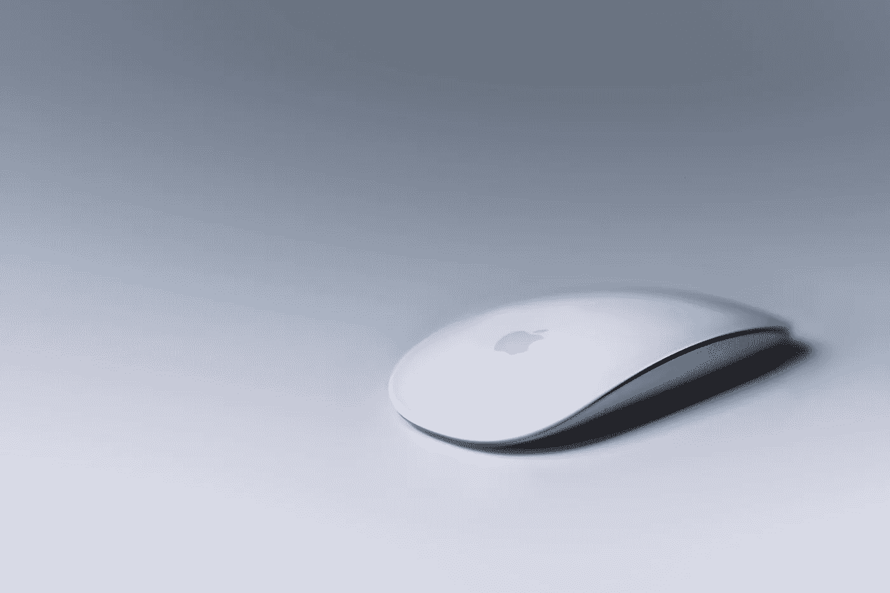

# 颤动:处理鼠标事件

> 原文：<https://medium.com/nerd-for-tech/flutter-handling-mouse-events-241108731537?source=collection_archive---------0----------------------->

随着 [对 Flutter 的 web 支持达到 beta 通道](/flutter/web-support-for-flutter-goes-beta-35b64a1217c0)，一些人可能会尝试在 Flutter 中构建他们的 web 应用。虽然没有太多关于如何处理鼠标事件的讨论或教程，这就是我写这篇文章的原因。

# 鼠标移动事件

对于鼠标移动，您可以使用`[MouseRegion](https://api.flutter.dev/flutter/widgets/MouseRegion-class.html)`小工具。