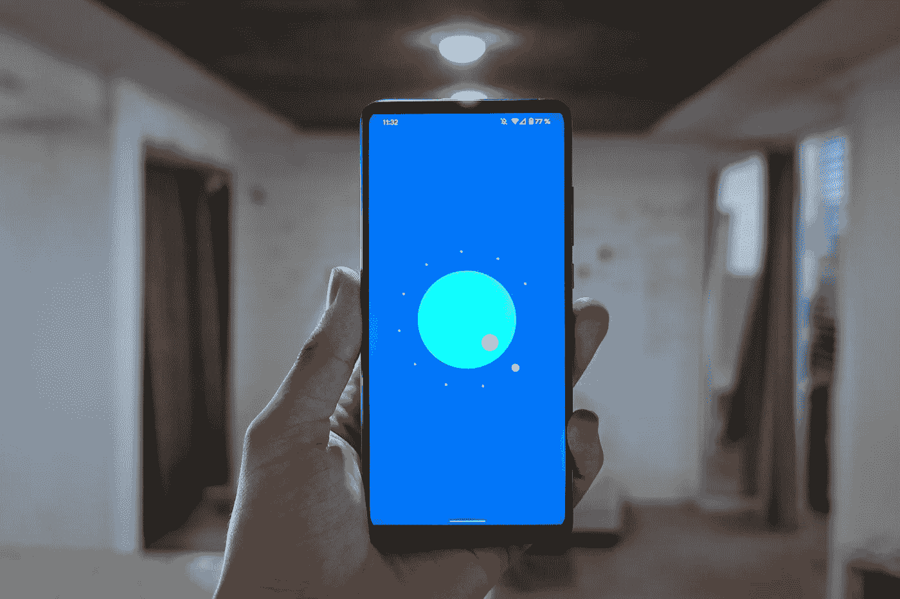

# Flutter:当你的 app 使用 jPush 被 Google Play 拒绝时如何解决

> 原文：<https://medium.com/nerd-for-tech/flutter-how-to-solve-when-your-app-uses-jpush-and-is-rejected-by-google-play-3e264461d309?source=collection_archive---------4----------------------->

昨天，我的应用评论被 Google Play 拒绝，因为它使用了 jPush。如果你不知道 jPush 是什么，它是由一家名为[极光](https://www.jiguang.cn/en/)的中国公司提供的推送通知服务。除了推送通知，该公司还提供许多其他服务，例如分析。这就像是中国版的 Firebase。