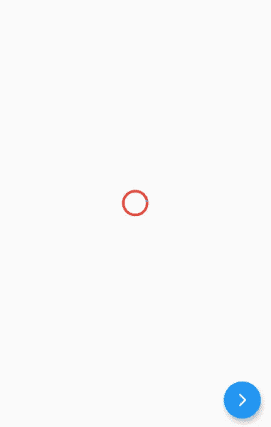

# 颤动进度条

> 原文：<https://medium.com/nerd-for-tech/flutter-progress-bar-b7df22199380?source=collection_archive---------2----------------------->

进度条是一个图形控制元素，用于显示任务的进度，如下载、上传、安装、文件传输等。在这一节中，我们将了解如何在一个 flutter 应用程序中显示一个进度条。

在颤振中有两种类型的进度指示器。

1.  线性渐进指示器
2.  循环渐进指示器

# 线性渐进指示器

线性进度条用于在**水平线**中显示任务的进度。

颤振主要提供**两种类型的**线性进度指示器:

> **确定**

确定的进度条显示任务中每个点的**实际进度。其值将从 **0.0 单调增加到 1.0** ，以显示当时完成的任务量。我们需要使用一个从 0.0 到 1.0 的非空值来创建一个确定的进度指示器。**

> **不确定**

不确定的进度条不指示完成任务的进度。这意味着我们不知道任务何时完成。**它取得了进展，但没有指出还有多少进展**。我们可以通过使用空值来创建一个不确定的进度指示器。

> 性能

**double value:** 用于指定 0.0 到 1.0 之间的非空值，代表任务进度完成。

**颜色背景颜色:**用于指定小工具的背景颜色。

**动画<颜色>值颜色:**用于指定进度指示器的颜色为动画值。

# 循环渐进指示器

这是一个小部件，**旋转它来指示应用程序中的等待进程**。它以**圆形**显示任务的进度。它还以两种方式显示进度条:确定的和不确定的。

当我们想要显示正在进行的任务的进度时，如下载或上传文件的百分比等，使用**确定的进度条**。我们可以通过指定 0.0 到 1.0 之间的值来显示进度。

当我们不想知道正在进行的过程的百分比时，使用**不确定进度条**。默认情况下，CircularProgressIndicator 显示不确定的进度条。

谢谢大家！