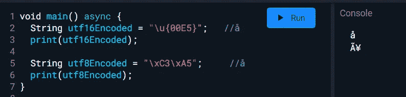
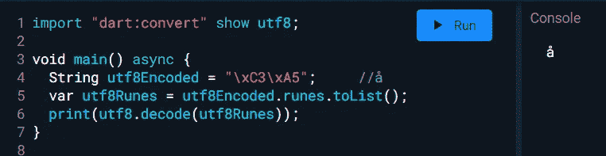

# 从 REST-API 渲染乱码字符？

> 原文：<https://medium.com/nerd-for-tech/flutter-rendering-gibberish-characters-from-rest-api-5d5093ff7ad4?source=collection_archive---------5----------------------->

在我的第一次实习中，我被分配了一个任务，调试为什么来自 REST-API 的一些响应会被渲染成乱码。一开始我很困惑，但当我最终发现 dart 使用 UTF-16 编码的字符串时，我所有的疑虑都消除了。我是如何解决这个问题的？我来和你分享一下。


本·怀特在 [Unsplash](https://unsplash.com/s/photos/confused?utm_source=unsplash&utm_medium=referral&utm_content=creditCopyText) 上拍摄的照片

大多数时候，REST-API 用 UTF-8 编码的字符串来响应。因为 dart 中的字符串是 UTF-16 编码的，所以它将一些字符转换成完全不同的字符。

示例:

*   UTF 8 表示法:`**0xC3 0xA5**`
*   的 UTF-16 表示:`**0x00E5**`



如你所见，它们是如何被解码的。这可能会让新开发人员(比如我)抓狂。在 [Postman](https://www.postman.com/) 中，一切看起来都很好，但是当你渲染文本时，它完全不同。

这就像，你问什么🚗圣诞节你的父母和他们买的东西🎠给你的。

但别担心，达特会支持你的。使用`dart:convert`包，你可以使用`**UTF-8**`而不是默认的`UTF-16`来解码字符串。

1.  从`dart:convert`导入`utf8`

```
import “dart:convert” show **utf8**;
```

2.使用 utf8.decode()解码



步骤:

1.  将字符串转换成符文。
2.  使用 utf8 . decode([字符串])

就这么简单。如果你不满意，想知道一个`rune`到底是什么？我掩护你。请继续🎈读书。

## dart 中的符文是什么？

> 一个**符文**是一个表示 Unicode 码位的整数。

*   `[string].runes`返回字符串中的 **Unicode 码位**。

```
print(utf8Encoded.runes); // **for the above code : (195, 165)**
```

> Dart 将字符串表示为一系列 **Unicode UTF-16 代码单元**。Unicode 是一种为每个字母、数字和符号定义唯一数值**的格式。**

```
String alpha=*"*abcd*"*; 
print(alpha.runes); //**(97, 98, 99, 100)**
```

如您所见，`UTF-16`代码单元就像 ASCII 值，但 **ASCII 代表小写字母(a-z)** 、大写字母(a-z)、数字(0-9)和标点符号等符号，而 **Unicode 代表英语、阿拉伯语、希腊语等字母**。

> **额外知识** : **Mojibake** 是乱码文本，它是使用非预期的字符编码对文本进行解码的结果。

我只是想分享我在实习中学到的一些东西，希望你也能学到新的东西。感谢阅读。拍手声👏如果你喜欢这篇文章。