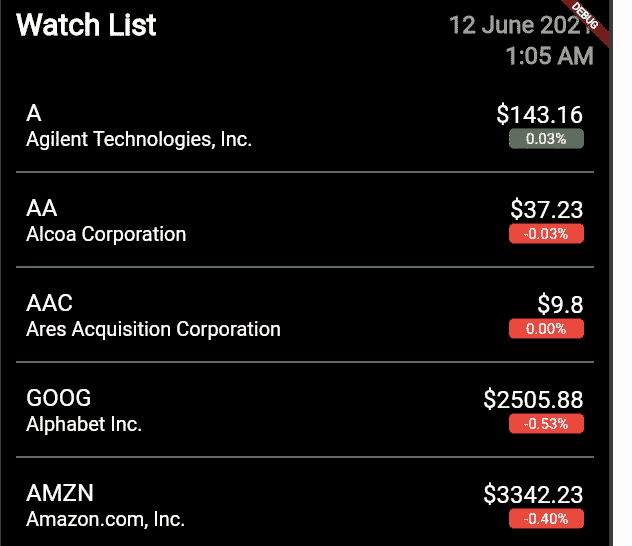

# 颤振系列—连接弹簧靴网络插座市场数据(实时市场数据)

> 原文：<https://medium.com/nerd-for-tech/flutter-series-connecting-the-spring-boot-web-socket-market-data-real-time-market-data-976a07022109?source=collection_archive---------1----------------------->



嗨伙计们。因此，在上一篇教程中，我向你们展示了如何使用 spring boot 应用程序创建 web socket，以便将市场数据实时发送到前端。因此，在本教程中，我将展示如何在我们的 flutter 应用程序中显示这些数据。为了了解到目前为止我们是如何创建我们的 flutter 应用程序的，你可以阅读 flutter 系列的最新帖子。

[](https://billa-code.medium.com/spring-boot-series-creating-a-web-socket-to-send-real-time-market-data-ee5273b3204b) [## Spring boot 系列—创建一个 Web 套接字来发送实时市场数据

### 嗨，伙计们，我们已经完成了创建一个很酷的股票市场应用程序，显示真实的股票市场信息…

billa-code.medium.com](https://billa-code.medium.com/spring-boot-series-creating-a-web-socket-to-send-real-time-market-data-ee5273b3204b) [](https://billa-code.medium.com/flutter-series-connecting-ui-to-spring-boot-backend-f9874dc3dcd5) [## Flutter 系列—将 UI 连接到 spring boot 后端

### 嗨，伙计们，这是股市应用程序创建教程的最后一个教程。将来如果可能的话，我会努力…

billa-code.medium.com](https://billa-code.medium.com/flutter-series-connecting-ui-to-spring-boot-backend-f9874dc3dcd5) [](https://billa-code.medium.com/flutter-series-implementing-stock-market-watch-list-ui-dccd37a9ef34) [## Flutter 系列—实现股票市场观察列表 UI

### 嗨伙计们。在上一个教程中，我告诉你们，我们将使用 Flutter 来创建一个前端应用程序，以便…

billa-code.medium.com](https://billa-code.medium.com/flutter-series-implementing-stock-market-watch-list-ui-dccd37a9ef34) [](https://billa-code.medium.com/flutter-series-creating-the-first-flutter-application-793e5816f816) [## 颤振系列——创造第一个颤振应用

### 嗨伙计们。所以在我们的系列教程中，现在你应该已经创建了一个 spring boot 应用程序，它有一个获取股票的端点…

billa-code.medium.com](https://billa-code.medium.com/flutter-series-creating-the-first-flutter-application-793e5816f816)  [## Spring boot 系列—以 JSON 形式发送股票市场数据

### 嗨伙计们。因此，我们创建了股票数据服务来获取单只股票的数据，在本教程中，我将…

billa-code.medium.com](https://billa-code.medium.com/spring-boot-series-sending-stock-market-data-in-json-form-cce978a9a90d) [](https://billa-code.medium.com/spring-boot-series-unit-testing-basics-3ce566250465) [## 弹簧靴系列—单元测试基础

### 嗨伙计们。所以到目前为止，我们已经开发了一个基本的 spring boot 应用程序，它从 Yahoo finance API 获取数据并显示…

billa-code.medium.com](https://billa-code.medium.com/spring-boot-series-unit-testing-basics-3ce566250465)  [## 春靴系列—股市数据终点

billa-code.medium.com](https://billa-code.medium.com/spring-boot-series-stock-market-data-end-point-356592487254) [](https://billa-code.medium.com/create-the-first-spring-boot-app-4e930d812a22) [## 创建第一个春季启动应用程序

### 我不打算深入了解许多功能和描述，而只是深入了解 Spring boot 的世界…

billa-code.medium.com](https://billa-code.medium.com/create-the-first-spring-boot-app-4e930d812a22) 

您可能还记得我们以前的教程，我们创建了一个名为 HomePage 的类，然后在其中显示了 StockList 类，以显示从 Rest API 获取的股票数据。因此，在本教程中，我将在一个名为 home_stock_socket.dart 的文件中创建一个名为 HomeStockSocket 的新类。

因此，首先我们必须安装这项任务所需的依赖项。这里我们需要在我们的应用程序中有 StompCLient，所以我们必须将 stomp_dart_client 添加到我们的应用程序中。现在 pubsec.yaml 文件中的依赖部分会是这样的。

```
dependencies:
     http: "0.13.3"
     stomp_dart_client: ^0.3.8
     intl: ^0.16.1
     flutter:
         sdk: flutter
```

所以 HomeStockSocket 类被创建为有状态类，因为我们在状态中使用 stockList，所以来自 web socket 的更改应用于我们的 StockList 类。我们在 stateful 类的 initState()中连接到 web 套接字，在 onConnect 方法中我们订阅了 **/topic/message** ，然后我们向 **/app/hello** 发送消息。现在，web socket 将被触发，股票数据将使用调度程序以 2 秒的间隔实时发送。因此，我们将每 2 秒钟获得一次市场数据反馈到前端。如果你看一下上一个教程，你会看到我们已经创建了一个线程池，并在调度器中使用它，这样我们的后端就不会耗尽资源和崩溃。

home_stock_socket.dart 的代码如下。

```
import 'package:flutter/material.dart';
import 'package:stock_ui/stock.dart';
import 'package:stock_ui/stock_list.dart';
import 'package:intl/intl.dart';
import 'package:stomp_dart_client/stomp.dart';
import 'package:stomp_dart_client/stomp_config.dart';
import 'package:stomp_dart_client/stomp_frame.dart';
import 'dart:convert';class HomeStockSocket extends StatefulWidget {
  HomeStockSocket({Key key, this.title}) : super(key: key);final String title;[@override](http://twitter.com/override)
  _MyHomePageState createState() => _MyHomePageState();
}class _MyHomePageState extends State<HomeStockSocket> {
  StompClient stompClient;
  final socketUrl = '[http://localhost:8080/ws-message'](http://localhost:8080/ws-message');String message = '';
  List<Stock> stockList;void onConnect(StompClient client, StompFrame frame) {
    client.subscribe(
        destination: '/topic/message',
        callback: (StompFrame frame) {
          if (frame.body != null) {
            Map<String, dynamic> obj = json.decode(frame.body);
            List<Stock> stocks = new List<Stock>();for (int i = 0; i < obj['stock'].length; i++) {
              Stock stock = new Stock(
                  company: obj['stock'][i]['name'],
                  symbol: obj['stock'][i]['symbol'],
                  price: obj['stock'][i]['price'],
                  chg: obj['stock'][i]['chg']);
              stocks.add(stock);
            }setState(() => stockList = stocks);
          }
        });client.send(destination: '/app/hello', body: "dimuthu");
  }[@override](http://twitter.com/override)
  void initState() {
    super.initState();if (stompClient == null) {
      stompClient = StompClient(
          config: StompConfig.SockJS(
        url: socketUrl,
        onConnect: onConnect,
        onWebSocketError: (dynamic error) => print(error.toString()),
      ));stompClient.activate();
    }
  }[@override](http://twitter.com/override)
  Widget build(BuildContext context) {
    return Scaffold(
        body: Stack(children: <Widget>[
      Container(
        padding: EdgeInsets.all(15),
        width: MediaQuery.of(context).size.width,
        color: Colors.black,
        child: SafeArea(
          child: Column(
            crossAxisAlignment: CrossAxisAlignment.start,
            children: <Widget>[
              Row(
                children: <Widget>[
                  Expanded(
                    flex: 1,
                    child: Text(
                      "Watch List",
                      style: TextStyle(
                          color: Colors.white,
                          fontSize: 30,
                          fontWeight: FontWeight.bold),
                    ),
                  ),
                  Expanded(
                    flex: 1,
                    child: Text(
                      DateFormat('dd MMMM yyyy').format(DateTime.now()),
                      textAlign: TextAlign.right,
                      style: TextStyle(
                          color: Colors.grey[500],
                          fontSize: 24,
                          fontWeight: FontWeight.bold),
                    ),
                  ),
                ],
              ),
              Column(
                crossAxisAlignment: CrossAxisAlignment.stretch,
                children: [
                  Text(
                    DateFormat().add_jm().format(DateTime.now()),
                    textAlign: TextAlign.right,
                    style: TextStyle(
                        color: Colors.grey[500],
                        fontSize: 24,
                        fontWeight: FontWeight.bold),
                  ),
                ],
              ),
              Padding(
                padding: const EdgeInsets.only(top: 8),
                child: SizedBox(
                  height: 50,
                  child: TextField(
                    decoration: InputDecoration(
                        hintStyle: TextStyle(color: Colors.grey[500]),
                        hintText: "Search",
                        prefix: Icon(Icons.search),
                        fillColor: Colors.grey[800],
                        filled: true,
                        border: OutlineInputBorder(
                            borderSide:
                                BorderSide(width: 0, style: BorderStyle.none),
                            borderRadius:
                                BorderRadius.all(Radius.circular(16)))),
                  ),
                ),
              ),
              Padding(
                padding: const EdgeInsets.only(top: 15),
                child: SizedBox(
                    height: MediaQuery.of(context).size.height - 310,
                    child: StockList(
                      stocks: stockList,
                    )),
              )
            ],
          ),
        ),
      )
    ]));
  }[@override](http://twitter.com/override)
  void dispose() {
    if (stompClient != null) {
      stompClient.deactivate();
    }super.dispose();
  }
}
```

现在，我们必须将它添加到 main.dart 文件中，并替换之前显示的 HomePage 类。现在 main.dart 文件的代码如下所示。

```
import 'package:flutter/material.dart';
import 'package:stock_ui/home_stock_socket.dart';void main() {
  runApp(MyApp());
}class MyApp extends StatelessWidget {
  // This widget is the root of your application.
  [@override](http://twitter.com/override)
  Widget build(BuildContext context) {
    return MaterialApp(
      title: 'Flutter Demo',
      theme: ThemeData(
        primarySwatch: Colors.blue,
      ),
      home: HomeStockSocket(title: 'Flutter Demo Home Page'),
    );
  }
}
```

一开始，Flutter app 会给出一个错误，因为 stockList 一开始就是空的。为了处理这个问题，我修改了 stock_list.dart 文件，如下所示。

```
import 'package:flutter/material.dart';
import 'package:stock_ui/stock.dart';class StockList extends StatelessWidget {
  final List<Stock> stocks;StockList({this.stocks});[@override](http://twitter.com/override)
  Widget build(BuildContext context) {
    return ListView.separated(
      separatorBuilder: (context, index) {
        return Divider(color: Colors.grey[400]);
      },
      itemCount: stocks != null ? stocks.length : 0,
      itemBuilder: (context, index) {
        final stock = stocks[index];
        bool isChgNegative = true;if (double.parse(stock.chg) > 0) {
          isChgNegative = false;
        }return ListTile(
          contentPadding: EdgeInsets.all(10),
          title: Column(
              crossAxisAlignment: CrossAxisAlignment.start,
              children: <Widget>[
                Text("${stock.symbol}",
                    style: TextStyle(
                        color: Colors.white,
                        fontSize: 24,
                        fontWeight: FontWeight.w500)),
                Text("${stock.company}",
                    style: TextStyle(color: Colors.white, fontSize: 20))
              ]),
          trailing: Column(
            crossAxisAlignment: CrossAxisAlignment.end,
            children: <Widget>[
              Text(
                "\$${stock.price}",
                style: TextStyle(
                    color: Colors.white,
                    fontSize: 24,
                    fontWeight: FontWeight.w500),
              ),
              Container(
                alignment: Alignment.center,
                width: 75,
                height: 20,
                decoration: BoxDecoration(
                    borderRadius: BorderRadius.circular(5),
                    color: isChgNegative ? Colors.red : Colors.green),
                child: Text(
                  "${stock.chg}%",
                  style: TextStyle(
                    color: Colors.white,
                    fontSize: 15,
                  ),
                ),
              )
            ],
          ),
        );
      },
    );
  }
}
```

现在让我们使用，

```
flutter run -d chrome --web-port 8000
```

**请记得运行我们上次创建的 spring boot 应用程序，以获取实时市场数据。**

所以伙计们喜欢你用雅虎财经 API 制作的实时市场数据应用，spring boot 和 Flutter。因此，从本教程我将结束这个股票市场应用程序的开发。在下一个教程中，让我们从基础开始创建另一个很酷的应用程序。所以下次再见，快乐的编码伙计们！！！。

[](https://www.buymeacoffee.com/billacode) [## 迪穆图·维克拉马那亚克

### 嘿，我是你的科技博客比拉代码。你可以在这里给我买杯咖啡。

www.buymeacoffee.com](https://www.buymeacoffee.com/billacode)