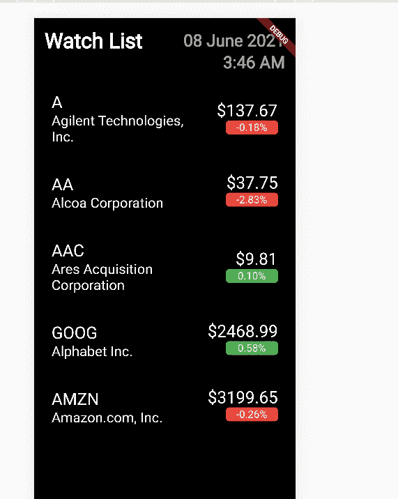

# Flutter 系列—将 UI 连接到 spring boot 后端

> 原文：<https://medium.com/nerd-for-tech/flutter-series-connecting-ui-to-spring-boot-backend-f9874dc3dcd5?source=collection_archive---------4----------------------->


嗨，伙计们，这是股市应用程序创建教程的最后一个教程。在未来，如果可能的话，我会尝试通过向你们介绍网络套接字来修改这一点，并在我们的应用程序中获取实时市场数据。但是不要担心，伙计们，因为到目前为止，我们已经走上了创建一个完整的市场观察列表的道路。

在本教程中，我将讨论如何将 spring boot rest API 连接到我们的 Flutter UI，我们在上一个教程中几乎已经完成了。所以现在我们已经有了大部分我们需要的东西。我们的后端返回我们需要的数据，在前端，当我们获得数据时，我们有一个模型可以使用。所以我们要做的就是把这些点连接起来。

[](https://billa-code.medium.com/flutter-series-implementing-stock-market-watch-list-ui-dccd37a9ef34) [## Flutter 系列—实现股票市场观察列表 UI

### 嗨伙计们。在上一个教程中，我告诉你们，我们将使用 Flutter 来创建一个前端应用程序，以便…

billa-code.medium.com](https://billa-code.medium.com/flutter-series-implementing-stock-market-watch-list-ui-dccd37a9ef34) [](https://billa-code.medium.com/flutter-series-creating-the-first-flutter-application-793e5816f816) [## 颤振系列——创造第一个颤振应用

### 嗨伙计们。所以在我们的系列教程中，现在你应该已经创建了一个 spring boot 应用程序，它有一个获取股票的端点…

billa-code.medium.com](https://billa-code.medium.com/flutter-series-creating-the-first-flutter-application-793e5816f816)  [## Spring boot 系列—以 JSON 形式发送股票市场数据

### 嗨伙计们。因此，我们创建了股票数据服务来获取单只股票的数据，在本教程中，我将…

billa-code.medium.com](https://billa-code.medium.com/spring-boot-series-sending-stock-market-data-in-json-form-cce978a9a90d) [](https://billa-code.medium.com/spring-boot-series-unit-testing-basics-3ce566250465) [## 弹簧靴系列—单元测试基础

### 嗨伙计们。所以到目前为止，我们已经开发了一个基本的 spring boot 应用程序，它从 Yahoo finance API 获取数据并显示…

billa-code.medium.com](https://billa-code.medium.com/spring-boot-series-unit-testing-basics-3ce566250465)  [## 春靴系列—股市数据终点

billa-code.medium.com](https://billa-code.medium.com/spring-boot-series-stock-market-data-end-point-356592487254) [](https://billa-code.medium.com/create-the-first-spring-boot-app-4e930d812a22) [## 创建第一个春季启动应用程序

### 我不打算深入了解许多功能和描述，而只是深入了解 Spring boot 的世界…

billa-code.medium.com](https://billa-code.medium.com/create-the-first-spring-boot-app-4e930d812a22) 

在 Flutter 应用程序中，我们将使用一个名为“http”的库来让实用程序连接到我们的 spring boot rest API。为此，我将更新 pubspec.yaml 文件中的依赖项。

```
dependencies:
  http: "0.13.3"
  intl: ^0.16.1
  flutter:
    sdk: flutter
```

现在让我们创建一个名为 HttpService 的新类来完成数据处理部分。为此，我将创建一个名为 http_service.dart 的文件。该类将用于连接到在 URL[http://localhost:8080](http://localhost:8080)中运行的 spring boot 应用程序，并访问向我们发送数据的特定端点，我们将访问[http://localhost:8080/getStock](http://localhost:8080/getStock)。因此，如果您看一看 spring boot 系列的上一篇教程(上面显示了 URL ),这个端点会返回一组 JSON 格式的数据。使用这个 HttpService 类可以访问这些数据。文件 http_service.dart 的代码如下。

```
import 'dart:convert';
import 'package:http/http.dart';
import 'package:stock_ui/stock.dart';

class HttpService {
  final String stockURL = "http://localhost:8080/getStock";

  Future<List<Stock>> getStocks() async {
    Response res = await get(Uri.parse(stockURL));

    if (res.statusCode == 200) {
      final obj = jsonDecode(res.body);
      print(obj['stock'][0]['symbol']);
      List<Stock> stocks =  new List<Stock>();

      for (int i = 0; i < obj['stock'].length; i++) {
        Stock stock = new Stock(company: obj['stock'][i]['name'], symbol: obj['stock'][i]['symbol'], price: obj['stock'][i]['price'], chg: obj['stock'][i]['chg']);
        stocks.add(stock);
      }

      return stocks;
    } else {
      throw "Unable to retrieve stock data.";
    }
  }
}
```

在 Flutter 中，当我们使用异步方法时，结果被存储到一个名为 Future 的数据类型中。所以为了在 UI 中显示这些数据，我必须使用一个名为 FutureBuilder 的包装器。如果我们快速看一下上面的代码，首先我们使用 get 函数获得响应，然后我们对数据进行解码。之后，我们循环 stock 参数中的数据列表，并将这些值映射到我们的 Stock 对象，并返回 Future 数据类型的股票列表。

现在对于 UI 部分，我们正在从 home_page.dart 文件添加股票数据。如果你快速浏览上一个教程，你可以看到当我们在 home_page.dart 中初始化 StockList 时，我们添加了这些来自 getStocks 方法的股票虚拟数据。现在，我们必须在这里进行更改，以显示我们的真实数据。

正如我之前提到的，当我们使用 Future data type 时，必须首先创建一个 FutureBuilder 包装器，然后在其中我们将从 HttpService 类中获取数据并显示在这里。home_page.dart 的代码如下。

```
import 'package:flutter/material.dart';
import 'package:stock_ui/http_service.dart';
import 'package:stock_ui/stock.dart';
import 'package:stock_ui/stock_list.dart';
import 'package:intl/intl.dart';

class MyHomePage extends StatelessWidget {
  final title;
  HttpService httpService = HttpService();

  MyHomePage({this.title});

  @override
  Widget build(BuildContext context) {
    return Scaffold(
        body: Stack(children: <Widget>[
      Container(
        padding: EdgeInsets.all(15),
        width: MediaQuery.of(context).size.width,
        color: Colors.black,
        child: SafeArea(
          child: Column(
            crossAxisAlignment: CrossAxisAlignment.start,
            children: <Widget>[
              Row(
                children: <Widget>[
                  Expanded(
                    flex: 1,
                    child: Text(
                      "Watch List",
                      style: TextStyle(
                          color: Colors.white,
                          fontSize: 30,
                          fontWeight: FontWeight.bold),
                    ),
                  ),
                  Expanded(
                    flex: 1,
                    child: Text(
                      DateFormat('dd MMMM yyyy').format(DateTime.now()),
                      textAlign: TextAlign.right,
                      style: TextStyle(
                          color: Colors.grey[500],
                          fontSize: 24,
                          fontWeight: FontWeight.bold),
                    ),
                  ),
                ],
              ),
              Column(
                crossAxisAlignment: CrossAxisAlignment.stretch,
                children: [
                  Text(
                    DateFormat().add_jm().format(DateTime.now()),
                    textAlign: TextAlign.right,
                    style: TextStyle(
                        color: Colors.grey[500],
                        fontSize: 24,
                        fontWeight: FontWeight.bold),
                  ),
                ],
              ),
              Padding(
                padding: const EdgeInsets.only(top: 15),
                child: FutureBuilder(
                  future: httpService.getStocks(),
                  builder: (BuildContext context,
                      AsyncSnapshot<List<Stock>> snapshot) {
                    if (snapshot.hasData) {
                      List<Stock> stocks = snapshot.data;
                      return SizedBox(
                          height: MediaQuery.of(context).size.height - 310,
                          child: StockList(
                            stocks: stocks,
                          ));
                    } else {
                      return Center(child: CircularProgressIndicator());
                    }
                  },
                ),
              )
            ],
          ),
        ),
      )
    ]));
  }
}
```

这里我们首先初始化了 HttpService 类，然后在 FutureBuilder 中，我们得到了从 HttpService 类返回的股票集作为未来变量。在加载数据之前，我们只需使用一个 if 条件来检查数据是否存在，从而显示一个循环的 CircularProgressIndicator(内置小部件)。因此，现在当你运行 flutter 应用程序时，你将获得我们在 spring boot 应用程序中硬编码的符号集的实时数据。最终结果将是这样的。



我想你已经从这些教程中学到了一些关于使用 spring boot 和 Flutter 创建 web 应用程序的实用知识。请鼓掌跟随我这里，我将继续张贴这些类型的酷项目教程。

快乐的编码伙计们！！！

[https://www.fiverr.com/share/AL4ej4](https://www.fiverr.com/share/AL4ej4)