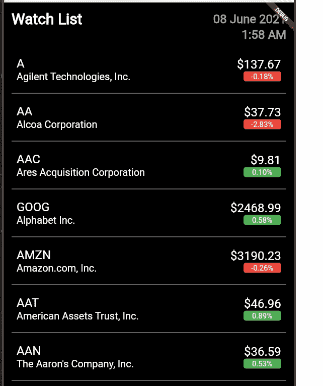

# Flutter 系列—实现股票市场观察列表 UI

> 原文：<https://medium.com/nerd-for-tech/flutter-series-implementing-stock-market-watch-list-ui-dccd37a9ef34?source=collection_archive---------7----------------------->

嗨伙计们。在上一个教程中，我告诉过你们，我们将使用 Flutter 创建一个前端应用程序，然后我们将连接到我们在早期教程中创建的 spring boot web 应用程序。因此，在本教程中，我们将创建这个任务所需的用户界面。在开始本教程之前，我应该感谢 Youtube 频道[的](https://www.youtube.com/channel/UCKvDySsrOVgUgRLhWHeyHJA)[穆罕默德·阿扎姆](https://medium.com/u/2300266301b3?source=post_page-----dccd37a9ef34--------------------------------)阿扎姆沙普提供了关于这个股票市场波动应用程序的酷视频教程。伙计们，大部分的设计都是从那个视频中截取的。请去支持他，他也在 Udemy 上提供了很多很酷的课程。所以这就是我们要实现的 UI。



到目前为止，我们已经有了一个 hello world 应用程序，它是在上一个教程中创建的。找到这个系列以前的教程，

[](https://billa-code.medium.com/flutter-series-creating-the-first-flutter-application-793e5816f816) [## 颤振系列——创造第一个颤振应用

### 嗨伙计们。所以在我们的系列教程中，现在你应该已经创建了一个 spring boot 应用程序，它有一个获取股票的端点…

billa-code.medium.com](https://billa-code.medium.com/flutter-series-creating-the-first-flutter-application-793e5816f816)  [## Spring boot 系列—以 JSON 形式发送股票市场数据

### 嗨伙计们。因此，我们创建了股票数据服务来获取单只股票的数据，在本教程中，我将…

billa-code.medium.com](https://billa-code.medium.com/spring-boot-series-sending-stock-market-data-in-json-form-cce978a9a90d) [](https://billa-code.medium.com/spring-boot-series-unit-testing-basics-3ce566250465) [## 弹簧靴系列—单元测试基础

### 嗨伙计们。所以到目前为止，我们已经开发了一个基本的 spring boot 应用程序，它从 Yahoo finance API 获取数据并显示…

billa-code.medium.com](https://billa-code.medium.com/spring-boot-series-unit-testing-basics-3ce566250465)  [## 春靴系列—股市数据终点

billa-code.medium.com](https://billa-code.medium.com/spring-boot-series-stock-market-data-end-point-356592487254) [](https://billa-code.medium.com/create-the-first-spring-boot-app-4e930d812a22) [## 创建第一个春季启动应用程序

### 我不打算深入了解许多功能和描述，而只是深入了解 Spring boot 的世界…

billa-code.medium.com](https://billa-code.medium.com/create-the-first-spring-boot-app-4e930d812a22) 

因此，在本教程中，让我们改变代码，这样我们就可以创建一个很酷的股票市场观察列表用户界面。现在我有两个了。我的 Flutter 应用程序中的 dart 文件。main.dart 和 home_page.dart. home_page.dart 具有在 UI 中央显示 hello world 的代码。为了以下降的方式创建这个页面，我将首先使用 Scaffold 类来包装 home_page.dart 的整个 UI，这将为我们的应用程序的 UI 提供一个材质设计。所以在这里，当我们创建 Scaffold 类时，我们必须在里面添加 body 参数的细节。在主体内部，我将首先实现一个堆栈，其中包含我们正在实现的容器，在容器内部，我们将添加一个名为 SafeArea 的包装类，以便将应用程序放入可见区域。在这个 SafeArea 类中，我们首先添加文本“Watch List ”,然后是日期和时间，最后是股票价值列表。这个列表将被包装在一个名为 StockList 的类中。为了获得日期时间格式选项，我将使用一个名为“intl”的库。首先，让我们将它添加到我们的从属文件中。在 pubspec.yaml 文件中有一个名为 dependencies 的部分，我们在这里添加了 inlt 包。

```
environment:
    sdk: ">=2.7.0 <3.0.0"

dependencies:
    intl: ^0.16.1
    flutter:
        sdk: flutter
```

所以现在我们必须创建 StockList 类来显示我们的股票列表。我将创建另一个名为 Stock 的类来模拟这个列表的一个项目中显示的数据。所以 stock.dart 文件如下。'

```
class Stock {
    String symbol;
    String company;
    String price;
    String chg;

    Stock({this.symbol, this.company, this.price, this.chg});

    static List<Stock> getStocks() {
        List<Stock> stocks = List<Stock>();
        stocks.add(new Stock(symbol: "GOOG", company: "Google", price: "220", chg: "11"));

        return stocks;
    }
}
```

这里我们有一个简单的类，它有一个返回股票集合的方法，它是静态的，所以我们不用初始化这个类就可以访问它，我们现在用这个方法来创建虚拟数据。现在我们必须创建 stock_list.dart 文件，如下所示。

```
import 'package:flutter/material.dart';
import 'package:stock_ui/stock.dart';

class StockList extends StatelessWidget {
    final List<Stock> stocks;

    StockList({this.stocks});

    @override
    Widget build(BuildContext context) {
        return ListView.separated(
                separatorBuilder: (context, index) {
            return Divider(color: Colors.grey[400]);
        },
        itemCount: stocks.length,
                itemBuilder: (context, index) {
            final stock = stocks[index];
            bool isChgNegative = true;

            if (double.parse(stock.chg) > 0) {
                isChgNegative = false;
            }

            return ListTile(
                    contentPadding: EdgeInsets.all(10),
                    title: Column(
                    crossAxisAlignment: CrossAxisAlignment.start,
                    children: <Widget>[
            Text("${stock.symbol}",
                    style: TextStyle(
                    color: Colors.white,
                    fontSize: 24,
                    fontWeight: FontWeight.w500)),
            Text("${stock.company}",
                    style: TextStyle(color: Colors.white, fontSize: 20))
              ]),
            trailing: Column(
                    crossAxisAlignment: CrossAxisAlignment.end,
                    children: <Widget>[
            Text(
                    "\$${stock.price}",
                    style: TextStyle(
                    color: Colors.white,
                    fontSize: 24,
                    fontWeight: FontWeight.w500),
              ),
            Container(
                    alignment: Alignment.center,
                    width: 75,
                    height: 20,
                    decoration: BoxDecoration(
                    borderRadius: BorderRadius.circular(5),
                    color: isChgNegative ? Colors.red : Colors.green),
            child: Text(
                    "${stock.chg}%",
                    style: TextStyle(
                    color: Colors.white,
                    fontSize: 15,
                  ),
                ),
              )
            ],
          ),
        );
        },
    );
    }
}
```

所以在这里，我们向 StockList 类构造函数传递股票列表，然后在这个类中，它被迭代并显示为一个列表。添加这些更改后，现在我们可以更改 home_page.dart 文件以在其中显示该列表。所以代码如下。

```
import 'package:flutter/material.dart';
import 'package:stock_ui/stock.dart';
import 'package:stock_ui/stock_list.dart';
import 'package:intl/intl.dart';

class MyHomePage extends StatelessWidget {
    final title;

    MyHomePage({this.title});

    @override
    Widget build(BuildContext context) {
        return Scaffold(
                body: Stack(children: <Widget>[
        Container(
                padding: EdgeInsets.all(15),
                width: MediaQuery.of(context).size.width,
                color: Colors.black,
                child: SafeArea(
                child: Column(
                crossAxisAlignment: CrossAxisAlignment.start,
                children: <Widget>[
        Row(
                children: <Widget>[
        Expanded(
                flex: 1,
                child: Text(
                "Watch List",
                style: TextStyle(
                color: Colors.white,
                fontSize: 30,
                fontWeight: FontWeight.bold),
                    ),
                  ),
        Expanded(
                flex: 1,
                child: Text(
                DateFormat('dd MMMM yyyy').format(DateTime.now()),
                textAlign: TextAlign.right,
                style: TextStyle(
                color: Colors.grey[500],
                fontSize: 24,
                fontWeight: FontWeight.bold),
                    ),
                  ),
                ],
              ),
        Column(
                crossAxisAlignment: CrossAxisAlignment.stretch,
                children: [
        Text(
                DateFormat().add_jm().format(DateTime.now()),
                textAlign: TextAlign.right,
                style: TextStyle(
                color: Colors.grey[500],
                fontSize: 24,
                fontWeight: FontWeight.bold),
                  ),
                ],
              ),
        Padding(
                padding: const EdgeInsets.only(top: 15),
        child: SizedBox(
                height: MediaQuery.of(context).size.height - 310,
                child: StockList(
                stocks: Stock.getStocks(),
                    )),
              )
            ],
          ),
        ),
      )
    ]));
    }
}
```

现在，当我们运行它时，我们将得到如上图所示的精确输出。因此，为了查看列表是否正常工作，让我们向 Stock 类 getStocks()方法添加一些虚拟数据并进行检查。

```
class Stock {
    String symbol;
    String company;
    String price;
    String chg;

    Stock({this.symbol, this.company, this.price, this.chg});

    static List<Stock> getStocks() {
        List<Stock> stocks = List<Stock>();
        stocks.add(new Stock(symbol: "GOOG", company: "Google", price: "220", chg: "11"));
        stocks.add(new Stock(symbol: "GOOG", company: "Google", price: "220", chg: "11"));
        stocks.add(new Stock(symbol: "GOOG", company: "Google", price: "220", chg: "11"));
        stocks.add(new Stock(symbol: "GOOG", company: "Google", price: "220", chg: "11"));
        stocks.add(new Stock(symbol: "GOOG", company: "Google", price: "220", chg: "11"));
        stocks.add(new Stock(symbol: "GOOG", company: "Google", price: "220", chg: "11"));
        stocks.add(new Stock(symbol: "GOOG", company: "Google", price: "220", chg: "11"));
        stocks.add(new Stock(symbol: "GOOG", company: "Google", price: "220", chg: "11"));
        stocks.add(new Stock(symbol: "GOOG", company: "Google", price: "220", chg: "11"));
        stocks.add(new Stock(symbol: "GOOG", company: "Google", price: "220", chg: "11"));
        stocks.add(new Stock(symbol: "GOOG", company: "Google", price: "220", chg: "11"));
        stocks.add(new Stock(symbol: "GOOG", company: "Google", price: "220", chg: "11"));
        stocks.add(new Stock(symbol: "GOOG", company: "Google", price: "220", chg: "11"));
        stocks.add(new Stock(symbol: "GOOG", company: "Google", price: "220", chg: "11"));

        return stocks;
    }
}
```

好的，酷，滚动也很好。


所以伙计们，如果有任何地方你不明白，请在评论中提出来，我会尽快澄清。编码快乐！！！在下一个教程中，我们将从 Spring boot 中获取数据，然后显示这些真实的股票市场价值。