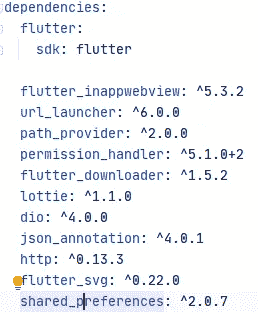
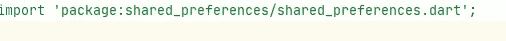
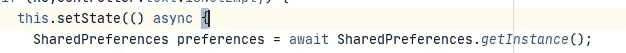
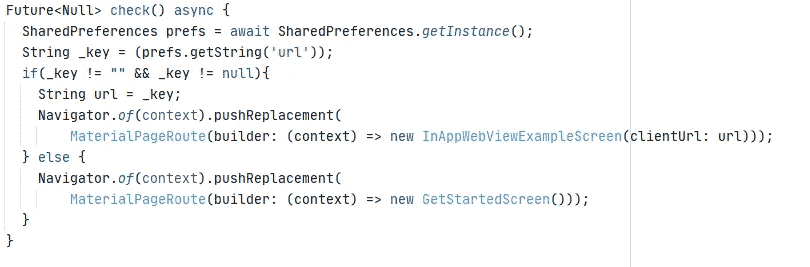

# 颤振:使用 shared_preferences 的 shared preferences:^2.0.7

> 原文：<https://medium.com/nerd-for-tech/flutter-sharedpreferences-using-shared-preferences-2-0-7-73d318cc74a1?source=collection_archive---------5----------------------->

> 从 Api 获取数据并将其存储在共享偏好设置中


这是一个非常常见的话题，用于在应用程序内存中存储一些单个值。它常用于保存登录凭证的详细信息。

在 ShardPreferences 中，数据异步保存到磁盘。NSUserDefaults(在 iOS 上)和 SharedPreferences(在 Android 上)，为简单数据提供持久存储。

让我们看看如何实现这一点

**背景:**基本上，我的场景是使用 Get 方法从 API 获取数据(这是一个单独的主题),但是的，我想从 API 获取数据，然后将其保存到共享首选项中，然后在闪屏上，我想检查数据是否存在，这样它将出现在主屏幕上，否则它将进入开始屏幕，用户将再次从 Api 获取数据。

**实施**:

**第一步:**添加依赖关系



在 Yaml 文件中，您将把依赖项添加为“shared_preferences”

**注意:**您可以在 [*链接*](https://pub.dev/packages/shared_preferences#-installing-tab-) 中找到最新的依赖关系

**第二步** : **导入共享偏好**



**第三步:存储数据**



之后，当我点击 API 并获取数据时，我将该数据放入我的首选项中，这样每当用户点击 API 并获取时，它都会被填充，因此它会根据它运行，并且每次它都会将数据放入首选项中


像 setString()一样，我们有其他方法来存储不同的数据类型值

例如:setInt()、setDouble() & setBool()，

**第四步:检索值**

因此，根据我的场景，在启动画面中，我希望通过放入一些检入启动画面来检查数据是否存在



然后我像这样调用这个方法，


所以每次当总管的时候。dart 将会打开，因此它会检查每次出现闪屏的时间。

检索值的其他方法，如 getBool()、getInt() & getDouble()

**第五步:使用价值**

```
String value = await getValue() ?? "";
```

？？用于确保如果 getValue()返回 null，那么它应该使用空字符串作为值，而不是 null。

请欣赏它，这样我就可以在未来写更多！

> 快乐编码。

如果我做错了什么？请在评论中告诉我。我很想进步。

拍手声👏如果这篇文章对你有帮助。

**Github**:[https://github.com/SaaifKhan](https://github.com/SaaifKhan)

电子邮件:Saif_khan09@hotmail.com(如有任何疑问)