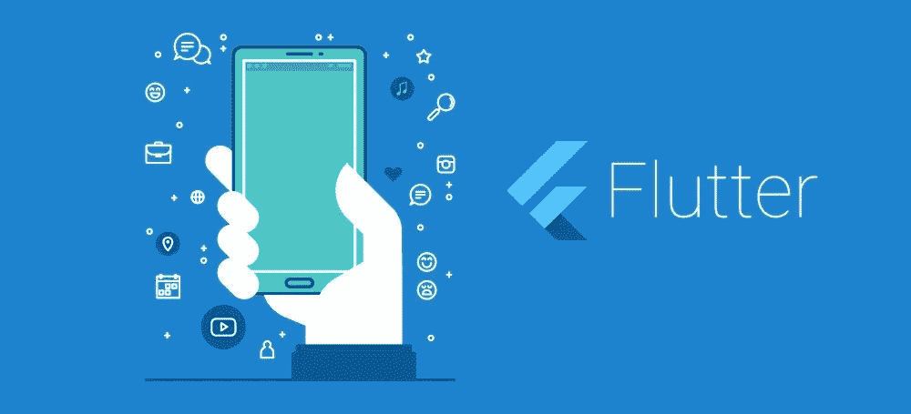
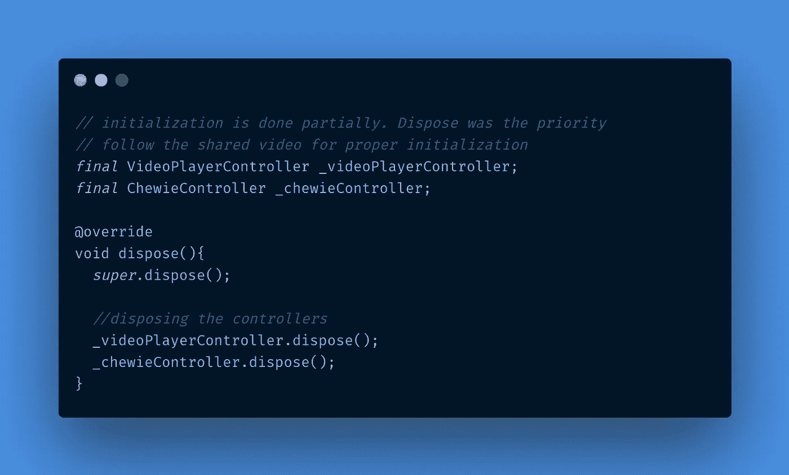
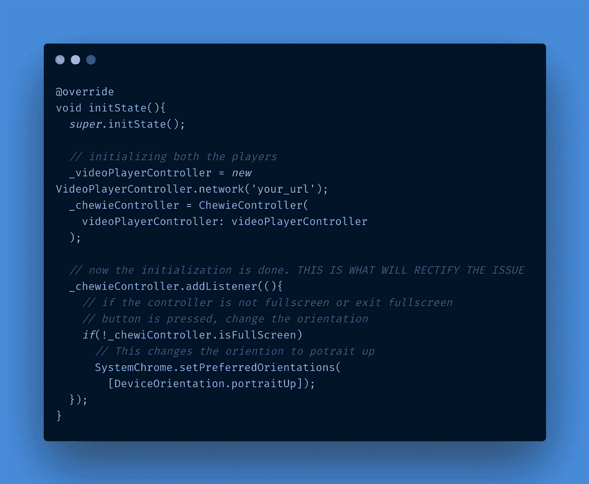
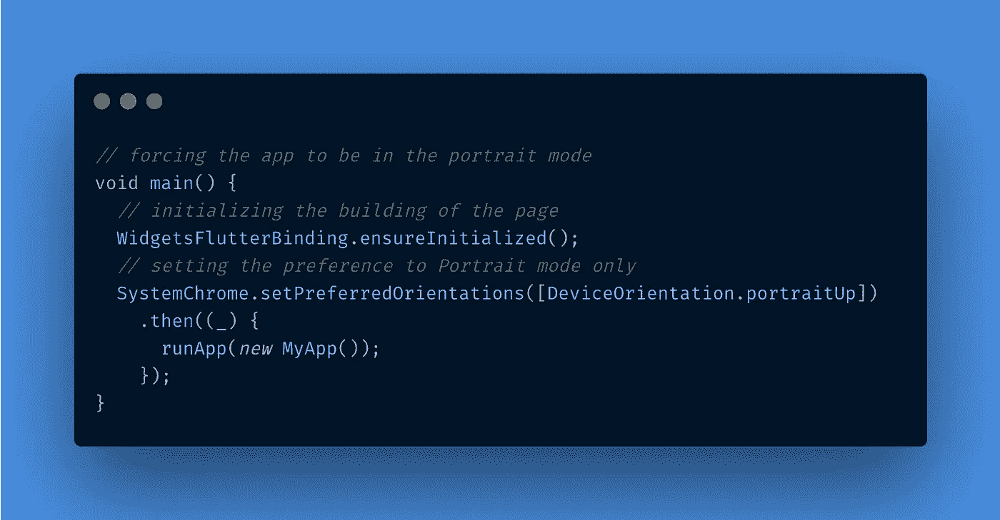
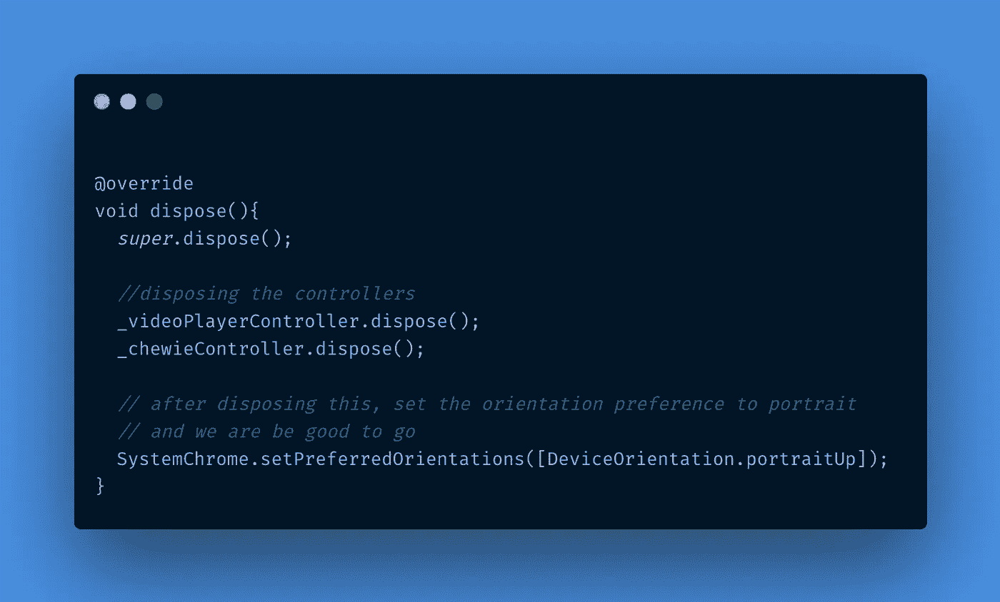

# Flutter 视频播放器和 Chewie 播放器

> 原文：<https://medium.com/nerd-for-tech/flutter-video-player-chewie-player-2f8536f2e924?source=collection_archive---------0----------------------->

对于 flutter 中的视频播放器开发，开发人员想到的一个插件是这样的:

 [## 视频播放器| Flutter 包

### 一个适用于 iOS、Android 和 Web 的 Flutter 插件，用于在 Widget 表面播放视频。请将您的约束设置为…

公共开发](https://pub.dev/packages/video_player) 

这确实给了开发者制造你的视频播放器的权力，并在你的跨平台移动应用中使用它。现在这变得非常方便，但有一些事情你没有做到，那就是，对视频播放器的更多控制。

每个人都想聪明地工作，因此，flutter 插件/包出现了。我希望每个人都知道这个包，但如果没有，那么它就是:

 [## 朱伊|颤振包

### 一个带有 Cupertino 和素材播放控件的视频播放器

公共开发](https://pub.dev/packages/chewie) 

> d**ISCLAIMER:****朱伊**使用的视频播放器插件在 iOS 模拟器上无法运行。**开发/测试期间必须使用 iOS 设备**

现在，这是一个很棒的软件包，它在以下几个方面提供了更多的功能:

*   对视频播放器的更多控制
*   基于操作系统的视频播放器素材 UI

它基本上包裹了 **video_player** 插件，并在其中加入了一些很酷的素材 UI 控件。现在，我不在这里解释如何使用 **chewie 插件**，你可以在下面找到它。您可以根据自己的意愿浏览更多选项。

现在，让我们来谈谈最重要的东西，那就是， ***如何更有效地使用这个*** 。

WHY？？这是因为，大多数刚刚开始视频播放器或 flutter 之旅的人，可能会忽略一些重要的指示，并在使用这个应用程序时看到许多错误或低效的性能。这些是:

1。

答案是，我们中的许多人经常忘记处理所需控制器的必要性，这些控制器是:[**video player controller**](https://pub.dev/documentation/video_player/latest/video_player/VideoPlayerController-class.html)**和[**chewie controller**](https://pub.dev/documentation/controller_chewie/latest/controller_chewie/ChewieController-class.html)**[**【dispose()**](https://api.flutter.dev/flutter/widgets/State/dispose.html)。****

> ****请注意，**要使用 chewie 播放器，您还需要添加 video_player 插件**。你会在视频讲座中发现。****

****你是如何做到这一点的？好吧，这就是你的答案****

********

****当我们这样做时会发生什么？它处理两个控制器，最终告诉机器不再使用它。因此，一旦您离开该页面，将不会播放任何视频。****

****2。 **当移动设备中的自动旋转打开时，退出全屏无法顺利进行******

****这是我在使用这个插件时注意到的第二件事，当自动旋转在移动设备上打开时。当你点击退出全屏模式的选项时，它实际上并没有改变它的方向。当“自动旋转”关闭时不会观察到，但可能会出现这种情况。那么，**有什么解决办法呢？？******

****解决方法很简单，隐藏在 **ChewieController 初始化**本身。看，这个播放器很聪明，但是你需要在初始化的时候添加监听器，并且告诉控制器， ***嘿！！你需要这样做，当我退出全屏模式，而我仍然在我的移动设备的自动旋转模式。【无所谓咄！】*******

********

****3。 **方向适用于应用程序中的每个页面，即使应用程序仅设置为纵向模式******

****在使用 **chewie** 和 **video_player** 开发视频播放器时，开发人员会面临的一个更大且最令人恼火的问题是，很多时候你会看到，即使应用程序通过这段代码设置为纵向模式:****

********

****我可以向你保证，这段代码是有效的，但是一旦你从控制器中使用全屏模式选项，它就会覆盖你通过上面的代码提供的定义，整个应用程序就会变得，旋转友好，**当然，当你处于自动旋转模式**时。****

****W **帽子是解？？**解决方案是，同样不是火箭科学。你只需要再告诉机器一遍，那个， ***嘿！！当我退出全屏并离开此页面时，请这样做。看在上帝的份上，不要让它旋转友好！！*******

****这也可以通过 **dispose()来完成。**在从视频播放器页面走出来的同时，我们再次定义了 app 的原理，就是让它变成人像模式。****

****我们如何做到这一点？？****

********

****而且，如果你要从这个页面转到另一个页面，只需在离开页面之前定义这个**system chrome . setpreferedorientations()。这就是如何让你们自己走出在定位问题上死记硬背的陷阱。******

****这就是现在所有的人！！如果你想陈述什么，欢迎你的宝贵意见。请吧，我也会从中学到一些东西。到那时**编码快乐！！******