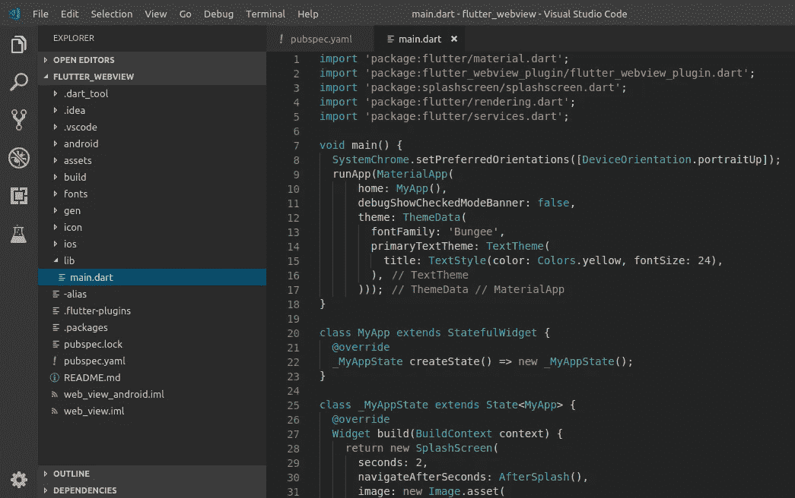
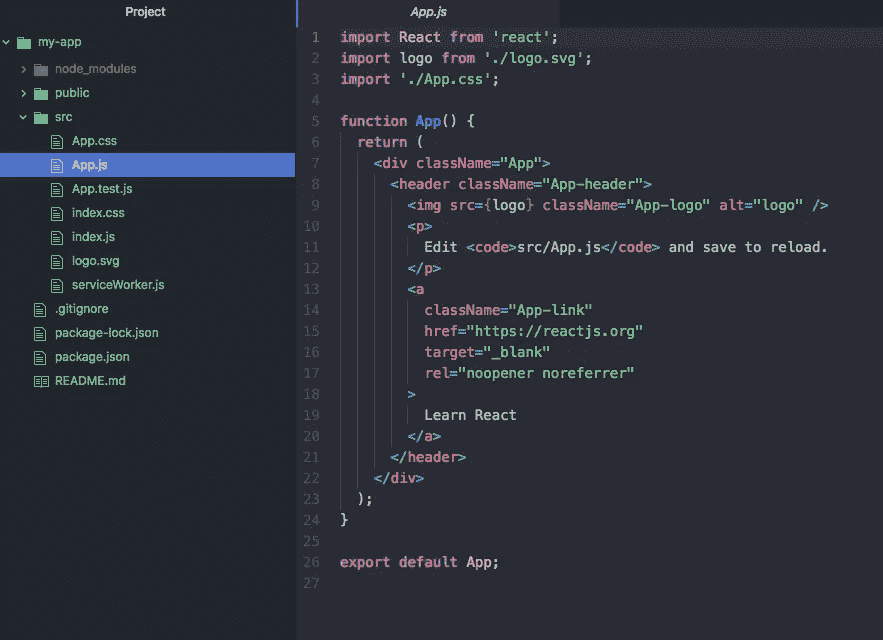
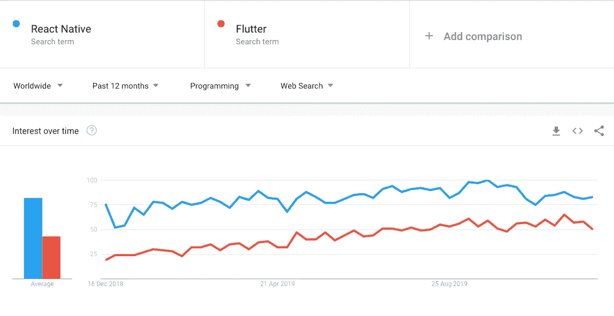

# 颤振与反作用力:完全指南

> 原文：<https://medium.com/nerd-for-tech/flutter-vs-reactjs-a-complete-guide-87da86995112?source=collection_archive---------4----------------------->

在过去的几年里，信息技术垂直行业一直处于繁荣期。同样，移动应用程序开发行业也获得了巨大的人气。尤其是在疫情期间，移动应用在人类生活中扮演了重要角色。

因此，人类变得高度依赖移动应用和技术。企业利用这些优势，开始投资移动应用开发。

因此，移动应用市场相当大，有 348 万个 android 应用和 222 万个 iOS 应用。如果你也计划创业，但在犹豫和犹豫之间感到困惑，那么请继续读下去。

在 IT 领域，ReactJS 和 Flutter 在全球范围内都非常受欢迎。Flutter 是由谷歌创建的，React 是由脸书创建的。两者的功能互不相同。

因为 ReactJS 是 JavaScript 库，Flutter 是框架。但两者有一个相似之处:ReactJS 和 Flutter 都是用于[前端开发](https://bootesnull.com/front-end-development-company/)。

在全球开发者社区中，Flutter 是最受欢迎的跨平台移动框架，2021 年[有 42%的软件开发者](https://www.statista.com/statistics/869224/worldwide-software-developer-working-hours/)使用它。另一方面，ReactJS 是使用最多的 web 框架，因为在 2021 年有 40.14%的开发者使用过它。

如果你对下一个项目有一个商业想法，但你不知道最好的技术或框架。或者如果你不知道在 Flutter 和 Reactjs 之间选择什么，那么这个博客绝对适合你。

在这里，将带你了解颤振和反应的所有重要方面。今天的讨论:什么是颤振和反作用力，颤振和反作用力之间哪个更好？我们开始吧！

在继续之前，让我们更深入地了解 ReactJS，以便更好地理解它。

# 关于颤振

[Flutter](https://flutter.dev/) 是谷歌的一个开源[软件开发](https://digibharata.com/best-software-development-companies/)套件，允许开发者基于单一代码库为 Android、iOS、Linux、macOS 和 Windows 创建跨平台应用以及 web 和移动应用。

这是 Google 的 SDK，使用现有代码创建有吸引力的、跨移动、web 和桌面的快速体验。Flutter 集成了现有的代码，被世界各地的公司使用。

Flutter 使用一个高效、可扩展的开放平台来创建优雅、快速的应用程序，为 iOS、Android、web、Windows、macOS、Linux 构建应用程序，或将 Flutter 嵌入为您选择的任何平台的 UI 框架。

# Flutter 是如何工作的？

Flutter 框架包括一个引擎、基础库以及小部件。在 Flutter 中开发移动应用程序的方法非常有特色，因为它具有声明式 UI，所以开发人员只需从末尾开始。

因此，在开始某些元素的开发过程之前，编码人员/企业所有者需要清楚地了解 UI 需求。因为开发者可以通过不同小部件的组合来创建整个用户界面。

Flutter 还允许专业人员创建定制的小部件。这些部件可以在以后与已经存在的部件融合。为了增强 [UX](https://www.interaction-design.org/literature/topics/ux-design) (用户体验)开发者需要增强应用能力。Flutter framework 还提供了几个软件包，允许访问 Firebase 和 Redux 数据仓库。

# 颤振的主要特征

现在你知道 Flutter 是一个流行的移动应用程序开发框架。让我们继续探索 Flutter 的主要特性或优势:-

*   **开源平台** — Flutter 是一个用于前端开发的开源平台。它允许开发者将想法转化为漂亮的应用程序创作。
*   **热重新加载** — Flutter 提供了热重新加载功能，这意味着代码中的最新变化可以立即获得/看到。所以开发者不需要刷新代码来查看最新的变化。
*   **丰富的小部件** — Flutter 为结构元素、风格元素等提供丰富的小部件。因此，开发人员可以根据客户的业务模型创建一个优雅且富于表现力的 UI。
*   **单一代码库** —在 Flutter 中，开发人员不必为 iOS 或 Android 应用程序编写不同的代码，因为它为[跨平台应用程序](https://fullscale.io/blog/what-is-cross-platform-app-development/)开发提供了单一代码库。
*   **Google Firebase 支持** — Flutter 也提供 Google Firebase 支持，尤其是针对后端开发。
*   **快速应用开发** —使用 Flutter，开发人员可以轻松快速地开发具有强大功能的应用。
*   **富于表现力的界面** —在 Flutter 中，开发人员可以非常有效且毫不费力地创建富于表现力的界面。
*   **更快的调试** — Flutter 具有强大的功能，允许开发人员进行更快的开发和调试。
*   **简单的学习曲线** — Flutter 是一个非常容易学习的框架，因此，任何背景的开发人员都可以轻松地学习它。
*   **社区支持** — Flutter 有一个庞大的开发者社区需要支持。

# Flutter 的热门应用

*   阿里巴巴
*   汉密尔顿应用
*   谷歌广告应用
*   反射地
*   Topline 应用程序

# 关于反应堆

React 是一个免费的开源 JavaScript 库，web 开发人员使用它来构建使用 UI 组件的用户界面。ReactJS 通常用于构建单页面 web 应用程序。

事实上，React 可以通过 Next.js 等框架构建单页面、移动或服务器呈现的应用程序，但 React 只关心处理状态并将其呈现给 DOM。因此，React 应用程序通常需要特定的客户端功能以及用于路由的附加库。

在 React 中，代码由可重用的组件组成，这些组件位于 SRC 文件夹中，并使用 Pascal 大小写(大写 camelCase)命名。使用 React DOM 库，可以将组件呈现给 DOM 中的特定元素。在渲染一个组件时，它的值可以通过“props”在组件之间传递。

# ReactJS 是如何工作的？

使用 ReactJS 的最大优势是它允许开发人员将 JavaScript 注入 HTML 代码。开发人员可以通过声明 Element 函数来构建一个 DOM 节点的表示。

它还允许开发人员检查 HTML 代码的语法。所以 ReactJS 没有使用传统的 DOM 类，而是使用 className。名称、子元素和属性的 JSX 标签。

在 ReactJS 中，数值以及表达式必须写在括号{}内。JSX 属性中的“引号”代表字符串。在大多数用例中，ReactJS 是使用 JSX 编写的，与标准 JavaScript 不同，以简化组件并保持代码整洁。

ReactJS 应用程序通常只有一个根 DOM 节点。它将元素呈现到 DOM 中，并更改页面的 UI。

# ReactJS 的主要特性

在前端开发中， [ReactJS](https://bootesnull.com/hire-developers/hire-reactjs-developers/) 是一个非常流行的库，被开发人员广泛用于健壮开发。看看 ReactJS 向开发者呈现的顶级特性:-

*   **虚拟 DOM** — React 提供了虚拟 DOM，它有助于加快开发过程，并具有编码的灵活性。
*   **JavaScript XML 或 JSX** — XML 使语法像 HTML 一样创建 React 组件。JSX 让编写积木变得超级简单。
*   [**React Native**](https://bootesnull.com/hire-developers/hire-react-native-developers/) —该功能转换 React 代码，使其与 iOS 或 Android 平台兼容。
*   **单向数据绑定** —控制数据流，使之更加灵活有效。因此，它迫使开发人员使用回调特性来编辑组件，并阻止他们直接编辑组件。
*   **声明式 UI** —这使得 React 代码更具可读性，也更容易修复 bug。
*   **基于组件的架构** — ReactJS 由几个组件组成，每个组件都有其特定的逻辑，用 JS 编写。因此，开发人员可以跨应用程序传递数据，而不会影响 DOM。
*   **提高开发人员的生产力** — ReactJS 有助于提高生产力，因为它具有难以置信的特性，如重用组件。
*   **开发人员工具包** —它为开发人员构建健壮的解决方案提供了一个很棒的工具包。

# React 的热门应用

*   照片墙
*   脸谱网
*   脸书广告经理
*   Wix.com
*   特斯拉

# 颤振与反应——选择哪个更好？

尽管 ReactJS 和 Flutter 对于优秀的 [UI 开发和设计](https://bootesnull.com/ui-ux-design-company/)来说都很棒，但它仍然高度依赖于需求和使用。React 和 Flutter 都有很多相似之处，例如使用一个代码库构建跨平台应用程序、热重装、出色的 UI、令人敬畏的工具和 React 功能。但是，他们确实有他们的不同之处。

为了在反作用力和颤振之间选择最佳方案，有三个要点需要考虑。这些要点将帮助你更好地理解这两者，你可以做出一个好的决定。

# 反应堆和颤振哪个更好？

*   程序设计语言
*   技术架构
*   UI 组件和 API 开发

现在，让我们继续深入了解这些要点，以便更好地理解这些框架。我们开始吧！

## **编程语言**

开发人员可以使用跨平台应用技术 ReactJS 为 iOS 和 Android 设备编写一段代码。但是在这个过程中使用了 JavaScript 作为编码语言。

ReactJS 是一个 JavaScript 库，使用 JavaScript 开发用户界面。JavaScript 是一种动态类型的语言，允许开发人员用它做很多事情，但它也很烦人。

由于 JavaScript 是一种常用语言，学习它并不需要太多的时间和精力。这使得开发人员更容易掌握和合并 ReactJS。

另一方面，Flutter 编程语言基于 Dart 语言，该语言由 Google 于 2011 年首次发布。Dart 是 JavaScript 和 Java 的结合。如果您有一些 JS、C#和其他面向对象编程语言的经验，那么这种语言更容易学习。

由于其表现力，Flutter 很快证明了自己是跨平台移动应用程序开发人员的热门创作。因为 JavaScript 已经存在了很长时间，并被 web 开发人员广泛使用，所以实现 ReactJS 很容易。

Dart 具有广泛的功能，但很少使用，也不太为人所知。

## **技术架构**

在比较两种不同技术时，理解它们的技术架构是很重要的。ReactJS 使用 JavaScript bridge，这是一个允许与[本机模块](/@dev_one/react-native-native-modules-ee5a8f390a7)通信的运行时环境。

ReactJS 在运行时使用脸书的 Flux 技术将 JS 代码编译成本地代码。在某些情况下，在运行时用 JavaScript 代码连接本机模块的要求会导致应用程序变慢。但是框架的性能通常是令人满意的。

然而，框架的性能通常是令人满意的。事实上，大多数基本组件都已经内置到了 Flutter 中。出于这个原因，你不需要一个桥梁，因为除了 Skia C++引擎之外， [Flutter](https://bootesnull.com/hire-developers/hire-flutter-developers/) 已经使用了 Material Design 和 Cupertino 等框架。

与 ReactJS 相比，基于 Flutter 构建的应用更加稳定，因为 Flutter 提供了所有需要的通道和协议。各种功能的可用性通常消除了开发人员使用其他技术的需要。

## **UI 组件&API 开发**

开发跨平台应用程序需要支持原生组件。如果没有这种支持，你的应用就不会有本土感。框架必须提供对本机模块的访问，而不会有任何不适，因为在开发跨平台应用程序时，对本机模块的访问是至关重要的。

除了 [ReactJS](https://bootesnull.com/course/reactjs-training-in-chandigarh-mohali/) 和 [React Native](https://bootesnull.com/course/react-native-training-in-chandigarh-mohali/) 之外，ReactJS 还能够用 JS Bridge 创建一个原生环境。但是 ReactJS 需要第三方库来访问原生模块，这导致了应用程序中不可预测的行为。

使用 Flutter，您可以在导航、访问设备 API、管理状态和使用许多库时轻松呈现 UI 组件——无需第三方库。它提供了用于材质设计和 Cupertino 的小部件，因此开发人员可以轻松地渲染 UI。

因此，Flutter 拥有丰富的开发 API 和 UI 组件。但是 ReactJS 对第三方库也有很大的依赖性。

# 结论

[移动应用程序开发行业](https://www.statista.com/forecasts/1262892/mobile-app-revenue-worldwide-by-segment)日益高速快速增长。因此，对于那些想自己创业的人来说，这是一个很好的机会。因为数字化极大地推动了移动应用程序开发领域。

此外，人们正在积极接受并推动这一趋势，因为手机让人们的生活变得更加轻松。但是大多数企业经常面临一个两难的问题，即选择哪种框架或技术来开发最好的移动应用程序以获得最好的结果。

目前，移动应用开发垂直领域的首选框架和库是 Flutter 和 ReactJS。在这里你可以找到创业的[商业应用创意](https://bootesnull.com/blog/top-80-business-app-ideas-for-a-good-start/)。

颤动和反应，当根据项目的需要正确使用时，两者都是健壮的。尽管如此，如果你处于两难境地，那么不要忘记考虑这个博客，以便比较 Reactjs 和 Flutter 的利弊。或者，如果您有一个与这些技术相关的商业想法或项目，那么请与 BootesNull 联系，以获得出色的成果。

原博客:[https://read write . com/flutter-vs-react js-2022 年选哪个/](https://readwrite.com/flutter-vs-reactjs-which-one-to-choose-in-2022/)