# 使用 Lighthouse 进行颤振 Web 生产构建测试

> 原文：<https://medium.com/nerd-for-tech/flutter-web-production-build-testing-with-lighthouse-bf3c9d3e275f?source=collection_archive---------1----------------------->

构建 Flutter Web 应用程序有两种渲染方法。我想测试这两种方法的基准。结果令人困惑。

# 颤动网络渲染器

1.  HTML 渲染器。

> 使用 HTML 元素、CSS、Canvas 元素和 SVG 元素的组合。**该渲染器的下载量较小**

来源:[颤振文档](https://docs.flutter.dev/development/platform-integration/web/renderers)

2. **CanvasKit 渲染器。**

> “T 他的渲染器与 Flutter mobile 和 desktop 完全一致，**具有更快的性能和更高的小部件密度，但下载大小增加了大约 2MB** 。”

来源:[颤振文档](https://docs.flutter.dev/development/platform-integration/web/renderers)

# 托管应用程序

我创建了一个新的 Flutter Web 项目，没有任何改动。

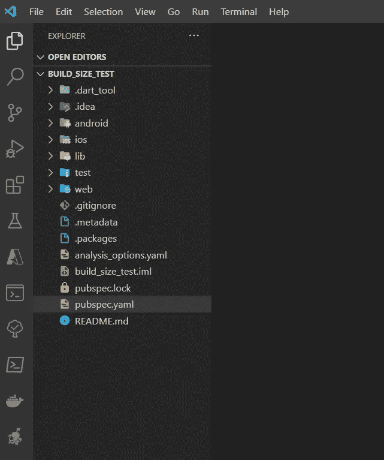

Flutter web 默认应用。

我用这两种方法构建应用程序。Flutter 将应用程序构建到 ***project_name*/build/web 中。**

```
flutter build web --web-renderer canvaskit --release
```

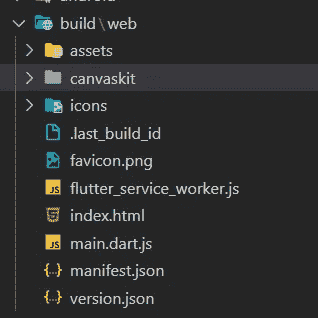

CanvasKit 渲染器构建目录。

```
flutter build web --web-renderer html --release
```

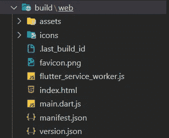

Html 呈现器构建目录。

我把两个版本都上传到了 Netlify 的托管服务上(免费使用)。

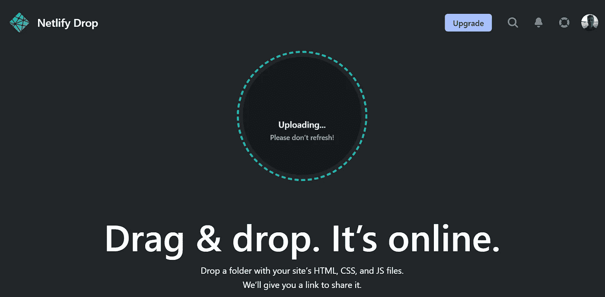

用 Netlify 手工制作网页原型很容易。

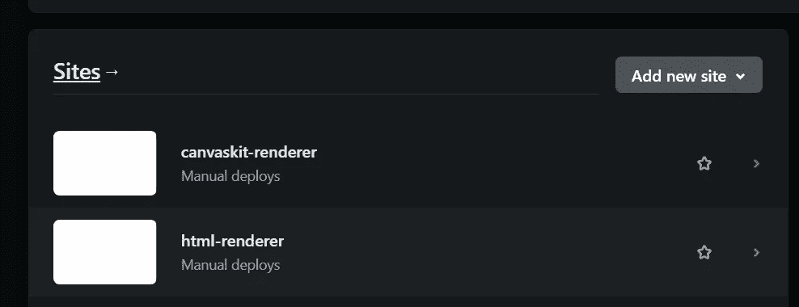

这两个应用程序都托管在 Netlify 中。

您也可以访问应用程序。我会离开他们。
1。 [**CanvasKit 渲染应用**](https://canvaskit-renderer.netlify.app/#/)

2. [**Html 渲染应用**](https://html-renderer.netlify.app/#/)

# 测试

最后，我运行了 Chrome 的 Lighthouse 来测试性能。我还显示了下载大小，尽管在 Flutter 文档中已经提到了。

## **桌面灯塔测试**

**设置 CanvasKit 渲染器桌面**

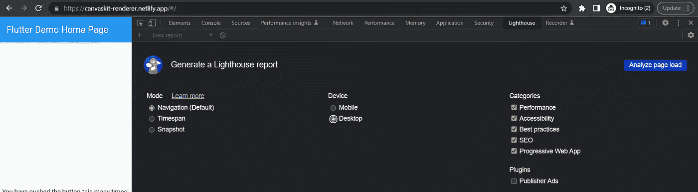

CanvasKit 桌面灯塔测试设置。

**总评 CanvasKit 渲染器桌面**

有趣的是，Lighthouse 无法为颤振应用创建**性能分数**。我尝试了很多次，但我总是对性能打个问号。

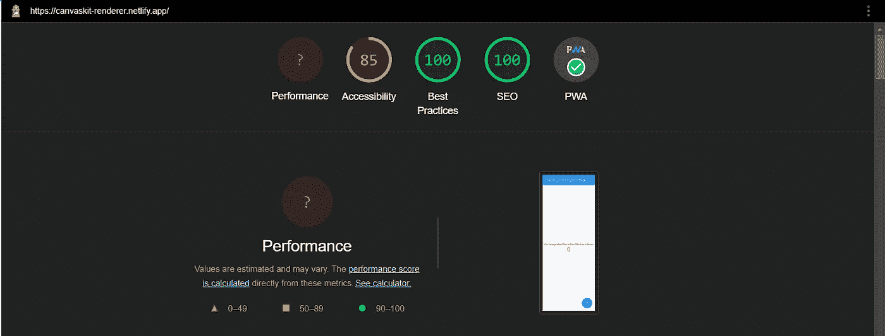

由于某种原因，Lighthouse 无法生成性能分数。

另一个概念是**可访问性**，它缺少了一些小东西。

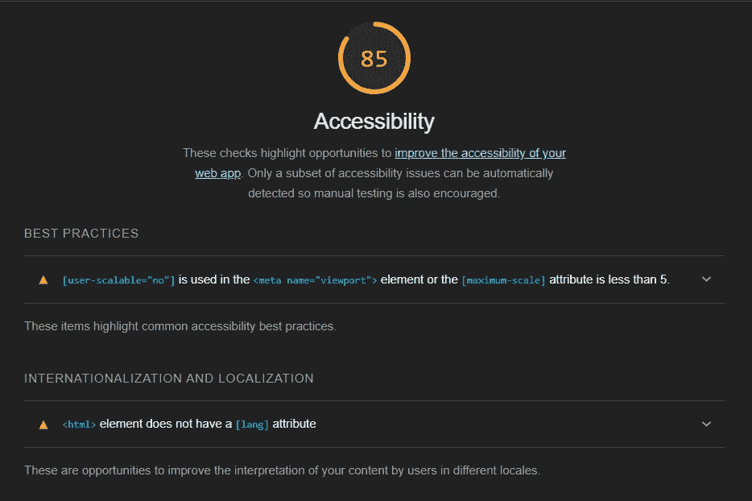

缺少 lang 属性，并且视口缩放有问题。

这些问题也出现在 Html 渲染器上，所以我不会再重复了。

**Metrics CanvasKit 渲染器桌面**


CanvasKit 指标。

**设置 Html 渲染器桌面**

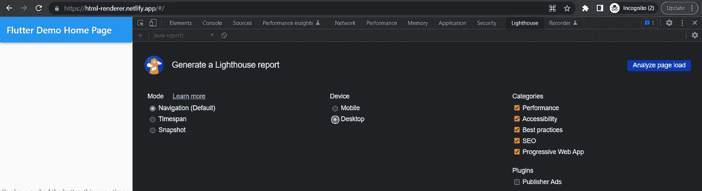

Html 桌面灯塔测试设置。

**总分 Html 渲染器桌面**

总得分与 CanvasKit 相同。

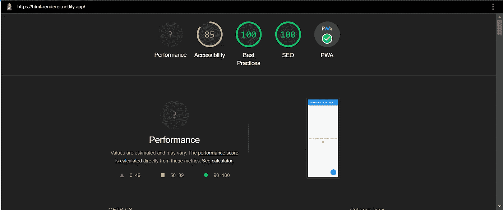

Html 渲染器总分。

**度量 Html 渲染器桌面**

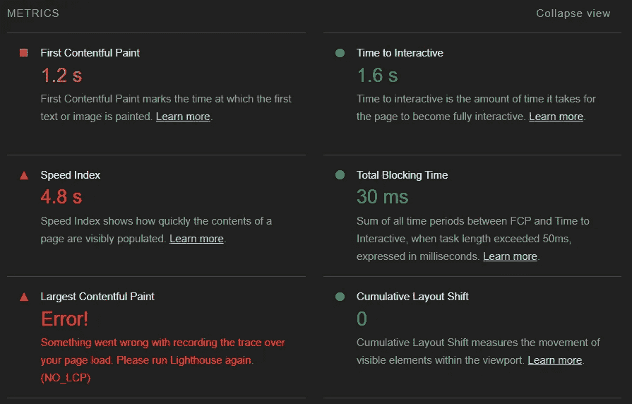

有趣的是， **Html 渲染器的构建基本上在所有现有指标上都比较慢。**

## **移动灯塔测试**

我也对手机版进行了同样的分析。

**设置 CanvasKit 渲染器移动**

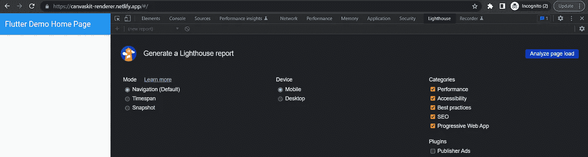

CanvasKit 移动灯塔测试设置。

**指标 CanvasKit 渲染器**

运行移动分析时，其他参数没有变化，所以我只显示指标。在这里，我们可以看到，与桌面版相比，速度变慢了。

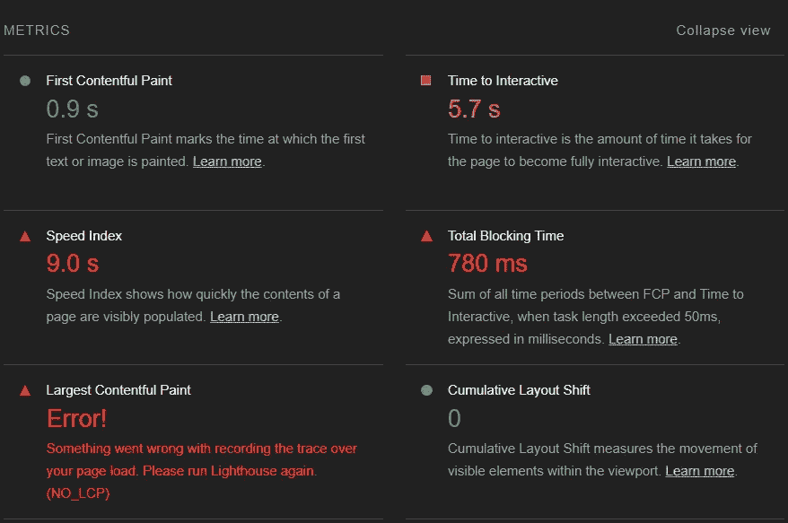

**设置移动 Html 渲染器**

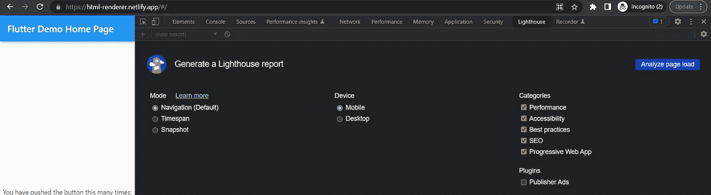

Html 移动灯塔测试设置。

**度量 Html 渲染器移动版**

Html 渲染构建似乎比移动设备中的 CanvasKit 还要慢。

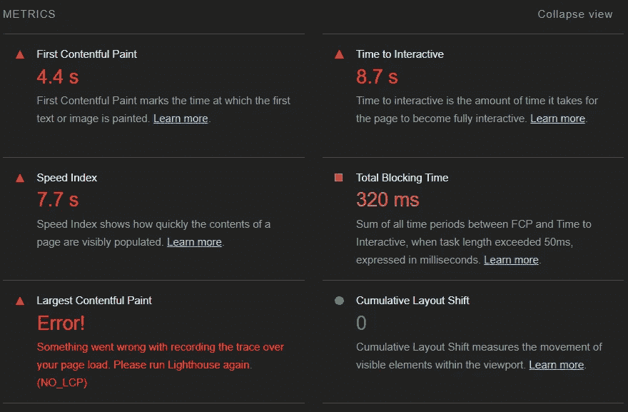

**第一次装载**

为了好玩，我还测试了第一次加载的时间。正如预期的那样， **CanvasKit 版本有一个 2.8 MB 的包，加载起来比较慢**。(缓存被禁用。)

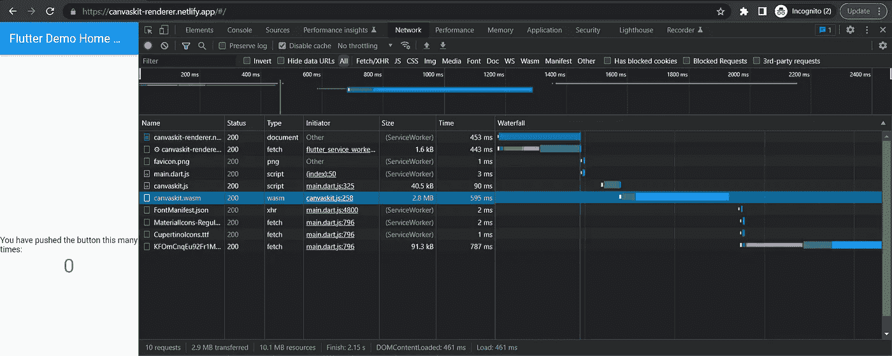

CanvasKit 首次加载时不缓存。

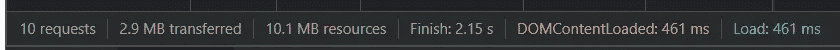

Html 构建加载速度快了一点，但不是很多。这是相当令人惊讶的，因为与 CanvasKit 相比，它应该是一个较小的包。

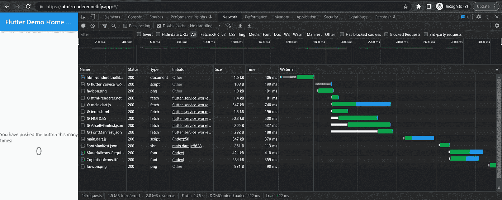

Html 第一次加载不缓存。

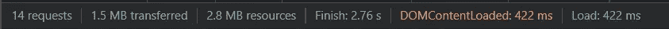

然而，这也不是真正精确的测量，因为它只是一个负载。但这就是我得到的。显然，有了缓存，后续加载的速度会更快。

## 绩效洞察力测试

最后，我运行了 Performance Insights，这也是一个 Chrome 评测工具。结果类似于负载测试。

**CanvasKit 渲染器**


CanvasKit 渲染构建的性能洞察。

**Html 渲染器**

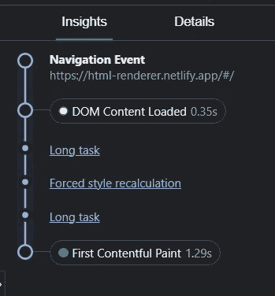

Html 呈现构建的性能洞察。

# 结论

我不知道根据我运行的这些灯塔测试能说些什么。似乎结果与颤振文件中所说的相矛盾。也可能是我误解了。我原以为 html 渲染的构建会加载得更快，但 Lighthouse 的情况似乎正好相反。此外，它还会给出奇怪的错误，因此可能有些地方不对劲。

在真实世界的加载测试中，Html 呈现的构建加载更快，包含的包更小。在 Chrome 的性能洞察测试中也是如此。

我不会把这篇文章看得太重，因为它是在一个不太严肃的晚上写的。如果你想亲自尝试，这些构建都在 Netlify 中。:)

# 链接

[**我的 Youtube**](https://www.youtube.com/channel/UCjCeTp2PUd3cqXhEHsx9NHw?view_as=subscriber)

[**我的网站**](http://ktcoding.fi)

[我的 Github](https://github.com/thevikke)