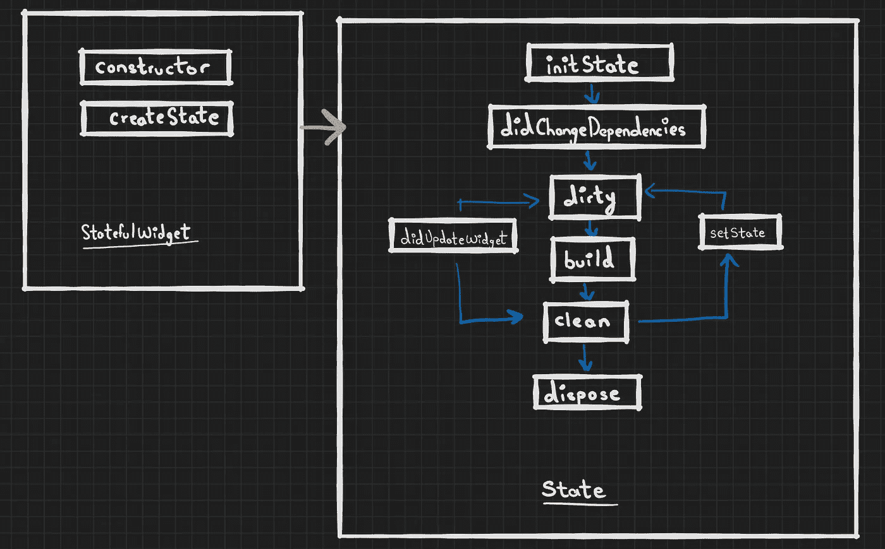
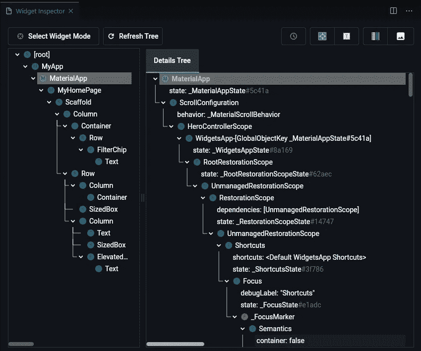

# Flutter Widgets 生命周期，Widgets 树和元素树。

> 原文：<https://medium.com/nerd-for-tech/flutter-widgets-lifecycle-widget-tree-and-element-tree-ac41ab1918da?source=collection_archive---------2----------------------->

Artur Shamsutdinov 在 [Unsplash](https://unsplash.com?utm_source=medium&utm_medium=referral) 上拍摄的照片

## **目录:**

⦿ [什么是 widgets？🎯](#01cc)
⦿ [小部件生命周期🧬](#aaaa)
⦿ [小部件、元素和渲染对象树🌲](#c9bf)
⦿ [如何查看你的 Flutter app 的 Widget 树](#1def)🔍

# 什么是 widgets？🎯

小部件是 Flutter 应用程序的组成部分。它们是 UI 不同部分的配置。部件可以是结构化元素、输入元素、UI 布局、交互元素、动画、资产、图像、图标和您可以自己创建的自定义部件！

在 flutter 中有两种类型的小部件

*   无状态小部件:无状态小部件是基于它自己的配置构建的，不会动态变化
*   有状态小部件:有状态小部件是基于它自己的配置构建的，但是可以动态改变。

# 小部件生命周期🧬

**无状态小部件生命周期**

无状态小部件是用一个类构建的。它的 build 方法可以在三种不同的情况下调用:

*   首次创建小部件时
*   当它的父更改/更新时
*   当 InheritedWidget 发生更改时

**有状态小部件生命周期**

有状态小部件由两个类声明，有状态小部件类和状态类。当小部件的配置改变但状态类保持不变时，有状态小部件被重新构建。需要注意的一点是，当有状态小部件从树中移除然后再插入时，会创建一个新的状态对象。以下是有状态小部件的生命周期事件:

⁍ **initState()** :当对象被插入到树中时，这个方法被调用一次

⁍ **dispose()** :当这个对象从树中永久移除时调用

⁍**didchangedependencies()**:当状态对象改变时调用

⁍**didupdatewidget(contancts old widget)**:当小部件配置改变时，触发该方法

⁍:当这个对象从树中移除时调用

⁍**build(BuildContext CTX)**:这个方法被多次调用，build context 包含诸如小部件在小部件树中的位置之类的信息。

⁍ **setState()** :通知框架这个对象的状态已经改变，触发这个状态对象的构建，并更新 UI。

# 小部件、元素和渲染对象树🌲

当我们将小部件组合在一起时，它们创建了小部件树。这类似于浏览器上的 DOM 如何生成树结构。呈现在屏幕上的所有已安装元素创建了元素树。运行 Flutter 应用程序时，main 函数调用 runApp()方法。runApp()函数获取给定的小部件，并使其成为小部件树的根。flutter 框架处理所有的小部件，并且安装每个相应的元素。对于树中的每个元素，Flutter 将通过调用小部件上的 createRenderObject()创建一个渲染对象，从而创建一个渲染对象树。Render Object 知道如何调整和绘制小部件，并监听输入和点击测试。

## 无状态小部件和元素树🍂

每个无状态小部件都有一个相应的无状态元素。Flutter 框架使用 createElement 方法从小部件发出请求，然后将元素安装到元素树上。每个元素都包含一个对小部件的引用。元素触发小部件构建方法并检查子小部件，每个子小部件都创建自己的元素并挂载到元素树中。

## 有状态小部件和元素树🌱

每个有状态小部件都有一个相应的有状态元素。Flutter 框架调用 createElement 方法来创建有状态元素，有状态元素被挂载到元素树上。由于这是一个有状态的
小部件，stateful 元素通过调用 StatefulWidget 类的 createState 方法请求小部件创建一个状态对象。stateful 元素现在在元素树的给定位置有了对状态对象和小部件的引用。stateful 元素调用 state 对象小部件的 build 方法来检查子小部件，每个子小部件创建自己的元素，并安装到元素树中。

# 如何检查你的 Flutter 应用程序的部件树🔍

Flutter widget 检查器可帮助您可视化和浏览 Flutter widget 树，并可用于了解现有布局和诊断布局问题

要调试布局问题，请在[调试模式](https://flutter.dev/docs/testing/build-modes#debug)下运行应用程序，并通过单击 DevTools 工具栏上的**颤振检查器**选项卡来打开检查器。

这是对 Flutter 窗口小部件、窗口小部件树和元素树的基本概述。下面列出了深入研究这些概念的一些资源:

*   【Flutter 在内部实际上是如何工作的？
*   [开始跳动——了解 Widget 树和元素树](https://www.youtube.com/watch?v=4W8eN_6mO2E)
*   【Flutter 是如何工作的？基本指南
*   【Flutter 如何渲染 Widgets