# 使用单层感知器和多层感知器的目标预测

> 原文：<https://medium.com/nerd-for-tech/flux-prediction-using-single-layer-perceptron-and-multilayer-perceptron-cf82c1341c33?source=collection_archive---------1----------------------->

本文主要是为那些想要开始数据科学之旅或者愿意用 python 编码从头开始学习神经网络的初学者而写的。

**目标:**

*   基本感知器
*   多层感知器
*   用一个小数据集深入编码
*   优化者
*   管道和应用部署
*   结论

# 基本感知器

感知器是一种神经网络单元(人工神经元)，它执行某些计算来检测输入数据中的功能或商业智能。

感知器是弗兰克·罗森布拉特在 1957 年提出的。他提出了基于原始 MCP 神经元的感知器学习规则。

感知器是用于二进制分类器的监督学习的算法。这种算法使神经元能够一次一个地学习和处理训练集中的元素。

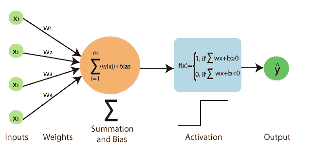

来源:[https://www . Java point . com/single-layer-感知器-in-tensorflow](https://www.javatpoint.com/single-layer-perceptron-in-tensorflow)

单层感知器只能学习线性可分模式。对于分类，我们用激活函数作为阈值来预测类别。对于回归，我们不需要激活函数(阈值)，或者我们可以使用线性函数来预测连续值。

输入通常是一个**特征**向量`x`乘以**权重** `w`并加到一个**偏差** `b` : `y = w * x + b`

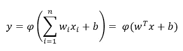

其中 **w** 表示权重向量， **x** 是输入向量， **b** 是偏差， **φ** 是非线性激活函数。

用于通过反向传播进行权重更新或感知器学习。我们将在下一节中详细了解这一点。

# 多层感知器

单层感知器不能计算出数据的非线性或复杂性。因此，研究人员利用单层感知器的思想开发了多层感知器。

来源:[https://www . tutorialspoint . com/tensor flow/tensor flow _ multi _ layer _ perceptron _ learning . htm](https://www.tutorialspoint.com/tensorflow/tensorflow_multi_layer_perceptron_learning.htm)

使用多个隐藏层来发现数据的非线性。这种指令也称为前馈网络。

多层感知器在一组输入-输出对上进行训练，并学习对这些输入和输出之间的相关性(或依赖性)进行建模。 ***训练包括调整模型的参数或权重和偏差，以最小化误差。*** *反向传播用于使那些权重和偏差相对于误差进行调整。*

现在，模型如何从错误中学习？让我们看看学习过程:

学习有两种方式，向前传播和向后传播

1.  **正向传播**:在*正向传递*中，信号流从输入层通过隐藏层移动到输出层，输出层的决策根据地面真实标签进行测量。然后将发现错误与地面真相和真实标签相对照。
2.  **反向传播**:下面是提及反向支柱如何工作的步骤。

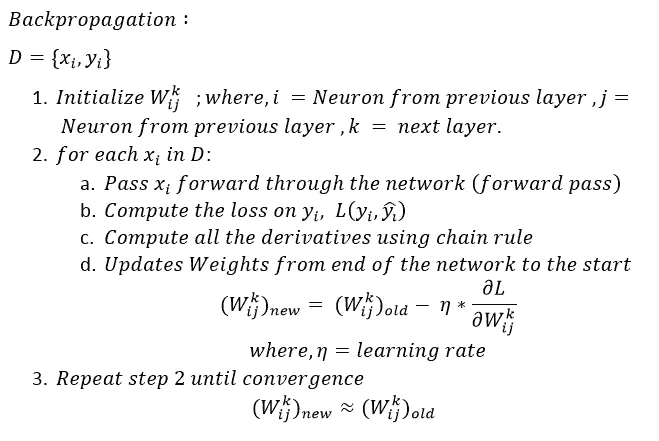

在上面的例子中，我使用 SGD 作为权重更新的优化算法。但是有各种优化算法，我将在本文中使用 **SGD、Momentum、**和 **Adam**

# 优化算法:

优化器是用来改变神经网络属性的算法或方法，如权重和学习速率，以减少损失。关于优化者的更多信息，请查看这篇 [***文章***](https://cs231n.github.io/neural-networks-3/)

1.  **新币**

这是梯度下降的一个变种。它试图更频繁地更新模型的参数。在这种情况下，在计算每个训练样本的损失之后，更新模型参数。因此，如果数据集包含 1000 行，SGD 将在数据集的一个周期内更新模型参数 1000 次，而不是像梯度下降那样更新一次。

这意味着每个数据点的权重/参数都会更新。

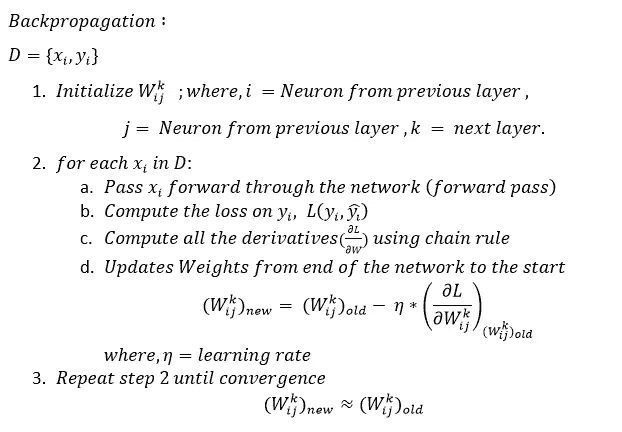

2.**势头:**

动量是为了减少 SGD 中的高方差和软化收敛而发明的。它加速了向相关方向的收敛，减少了向无关方向的波动。

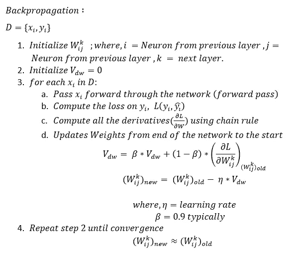

3.亚当:

自适应矩估计(Adam)适用于一阶和二阶动量。Adam 背后的直觉是，我们不希望滚动得太快，因为我们可以跳过最小值，我们希望稍微降低速度，以便仔细搜索。除了存储像 **AdaDelta** ，***Adam****这样的过去平方梯度的指数衰减平均值之外，还保存过去梯度的指数衰减平均值*

*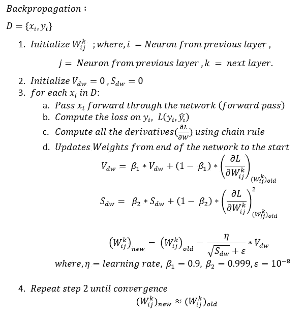*

*因此，这里将总结感知器和多层感知的历史和介绍，包括各种优化算法。现在，我们将通过一个例子(使用小数据集)和 python 从头开始编码来说明这一切是如何工作的。*

# ***数据集***

*为了训练单层感知和多层感知，我使用了一个小数据集。让我们看看数据是怎样的，*

*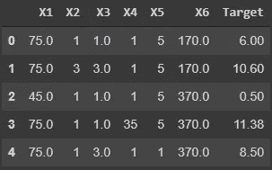*

*我们有 6 个特征，**目标**是我们必须预测的因变量。这显然是一个回归问题，因为输出变量是一个连续的数值。*

*上述数据组具有它们自己的方程，这些方程非常特定于领域，*

*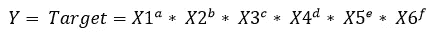*

*其中 a，b，c，d，e，f 是未知参数。*

*为了简化上述方程，我们将两边的对数都取为，*

*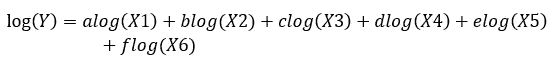*

*让，*

*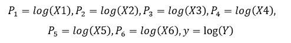*

*我们得到，*

*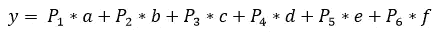*

*最后，我们需要优化上面的方程，需要找到像 a，b，c，d，e，f 这样的优化参数。*

# ***单层感知器:***

*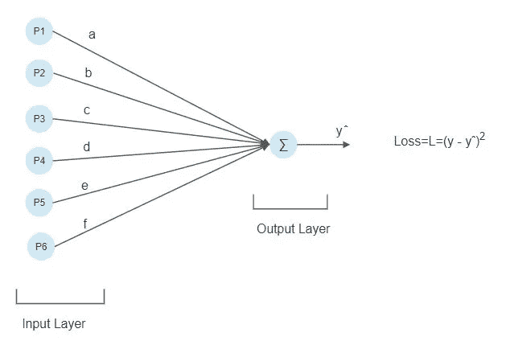*

*对于这个问题，我使用 MSE 作为损失函数，它可以为单个点定义为，*

*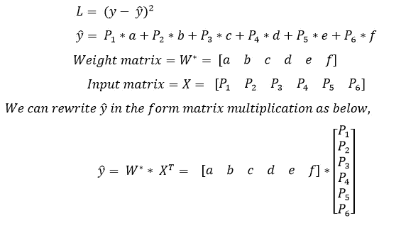*

*现在，除了梯度之外，所有方程都已定义，*

*现在我们需要计算梯度来更新权重，以最小化损失，从而获得最优解。这是我们在反向传播中看到的。*

*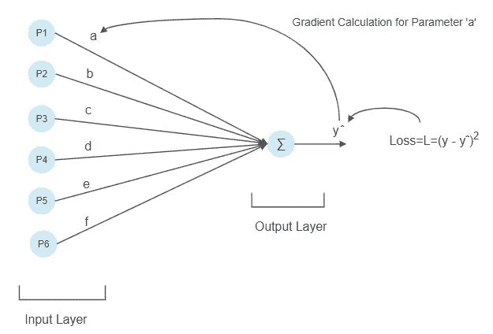*

*在上图中，我们正在计算“a”的梯度。我们将按照箭头方向计算导数，我们将使用链式法则。*

*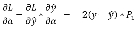*

*类似地，我们要找到所有参数的导数*

*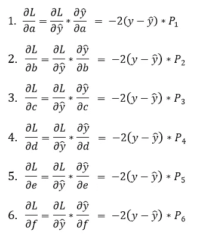*

*最后，我们得到如下所示的梯度矩阵，*

*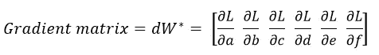*

*现在是时候更新权重了，*

*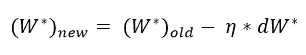*

*现在我们将使用 python 实现所有方程，*

*首先，我们将看到正向传播，*

*在上面的代码中，np.dot(X，w)将进行矩阵乘法，就像我们在上面的等式中看到的那样*

*现在我们将看到反向传播，*

*现在是参数/权重更新的时候了，以减少误差/损失。首先，我们将使用一个 **SGD** 优化器，*

*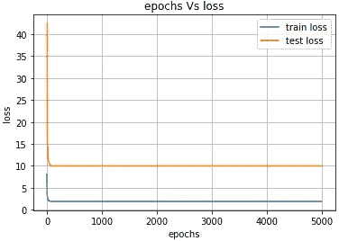*

*使用 SGD 优化器的损失图*

*我们可以从损失-时期图中清楚地看到，模型过拟合。与测试损失相比，训练损失非常低，这意味着模型在减少训练损失方面做得很好，但未能减少测试损失。此外，训练和测试损失之间的差异很大，这清楚地表明模型过度拟合。*

*现在我们将看到当我们使用**动量**优化器时会发生什么，*

*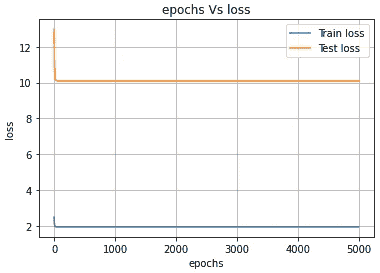*

*这里同样的故事再次重复，因为我们看到与 SGD 优化。*

*现在我们将看到当我们使用 **Adam** 优化器时会发生什么，*

*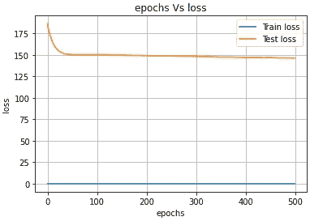*

*这也是训练和测试损失之间的巨大差距。一般情况下*单层感知无法将测试损失降至最低*。所以我们会看到如果我们使用多层感知会发生什么。*

# *多层感知:*

*针对这个问题，我们设计多层感知如下图所示:*

*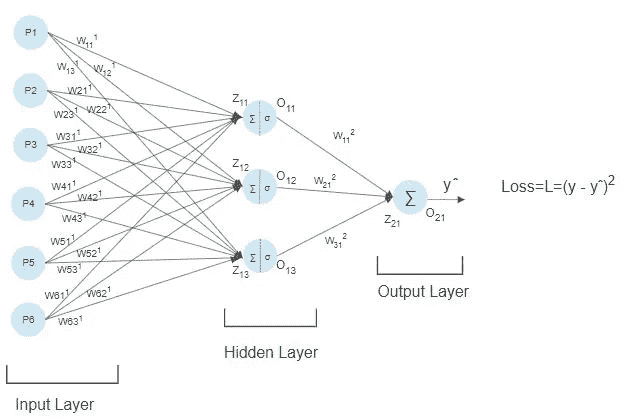*

*在这里，我只使用了一个隐藏层之间的输入和输出的 sigmoid 激活函数。*

*权重矩阵 W1(在输入层和隐藏层之间)和 W2(隐藏层和输出层)是，*

*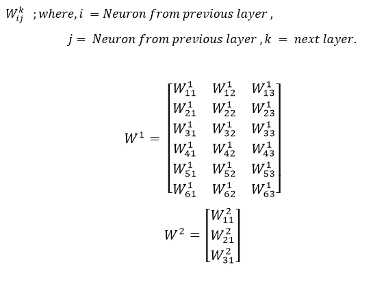*

*每个权重/参数的梯度计算如下:*

*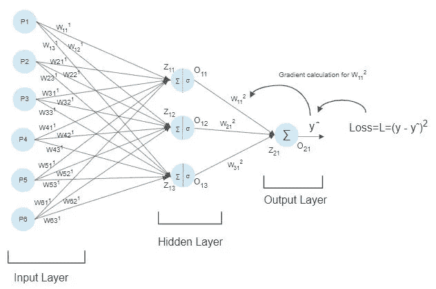**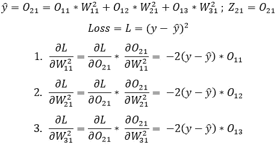**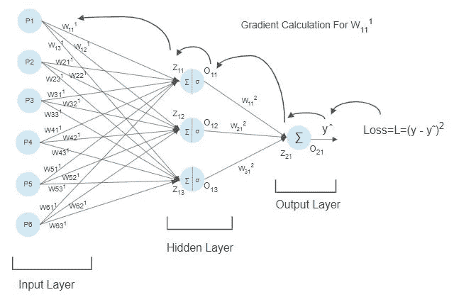**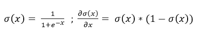*

*Sigmoid 函数及其导数*

*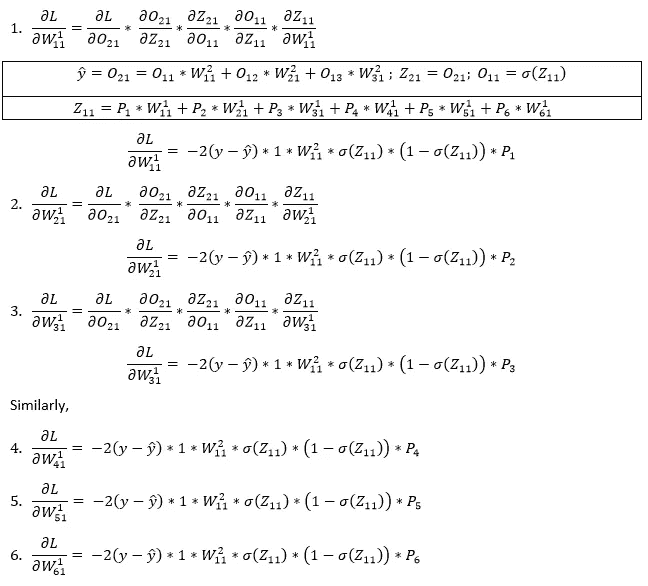**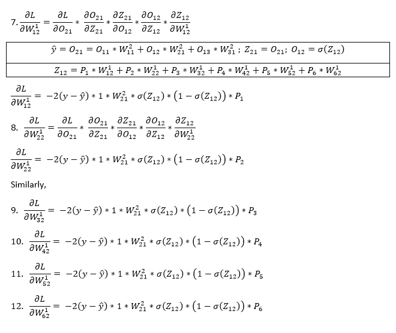**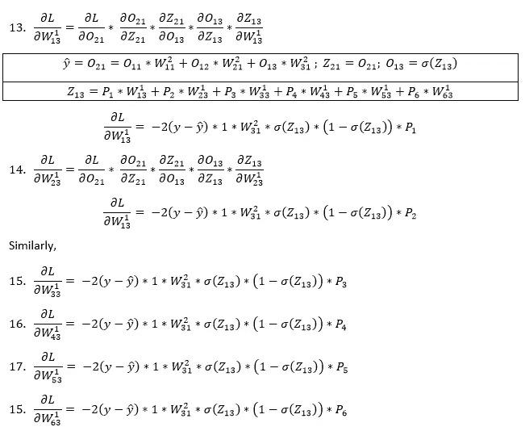*

*最后，我们得到梯度矩阵，*

*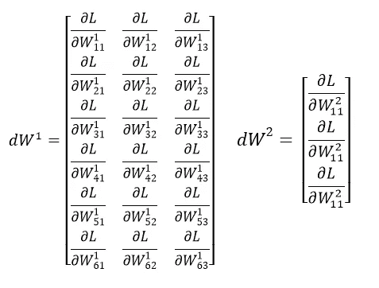**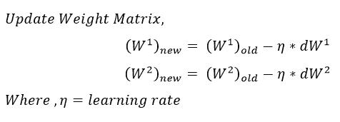*

*在此之前，我们计算了所有参数的导数，现在是使用 python 实现的时候了。首先，我们看到正向传递函数，*

*代码中使用的所有具有变量表示的方程与我们在上面理论上看到的相同。*

*现在我们将看到反向传播函数，*

*首先，我们使用 **SGD** 优化器来更新权重，*

*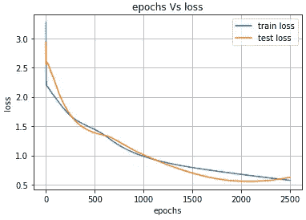*

*从上面的图中我们可以清楚地看到，MLP 做得很好，训练和测试损失彼此非常接近，因此我们可以说模型没有过度拟合。*

*现在我们看看如果我们使用**动量**优化器，*

*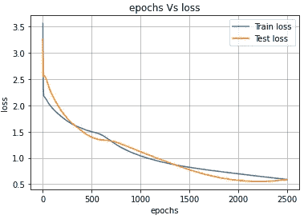*

*从上面的图中我们可以看出 SGD 和 Momentum 的工作原理几乎相似。*

*现在我们看看如果我们使用**亚当**优化器，*

*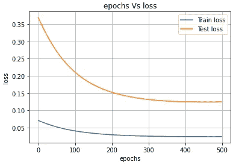*

*与新币和动量相比，亚当在很大程度上减少了损失。所以相比 SGD 和动量优化器，Adam 表现不错。*

*简而言之，与单层感知器相比，多层感知器工作得非常好。*

# ***管道和 App 部署***

*我已经建立了端到端的管道，并使用 Stramlit 和 Heroku 部署了 web 应用程序。整个管道和部署代码是[***这里的***](https://github.com/Ananda-Hange/heroku_stramlit_app/blob/main/app.py) ***。*** *你可以在我下面提到的 GitHub 回购链接中查看全部代码。**

* [## Ananda-Hange/heroku _ stramlit _ app

### 在 GitHub 上创建一个帐户，为 Ananda-Hange/heroku _ stram lit _ app 开发做出贡献。

github.com](https://github.com/Ananda-Hange/heroku_stramlit_app) 

对于 Web App 演示，可以在这里 查看

# *结论*

*正如我们从损失-时期图中看到的，多层感知器明显优于单层感知器。正如我们已经看到的，多层感知从数据中捕捉非线性。我们还没有使用任何像 TensorFlow 和 Keras 这样为解决深度学习问题而开发的库。但是当你开发一个更深的网络(不止一个隐藏层)时，我们必须使用这些库，因为它们已经被很好地优化了。*

*快乐学习！！！**