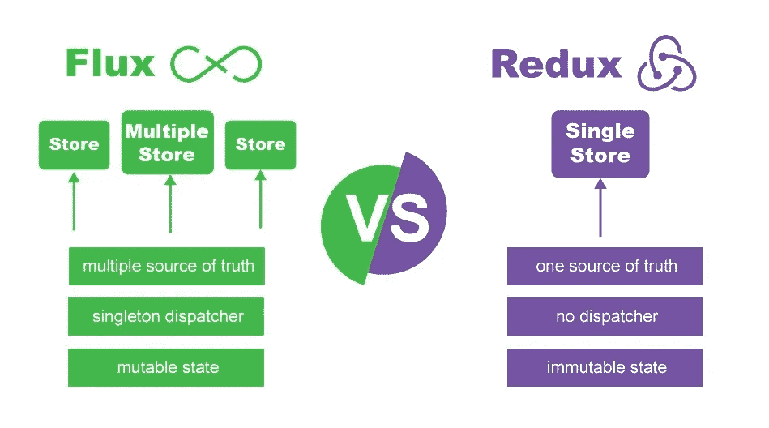
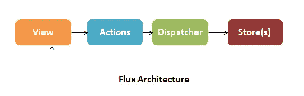
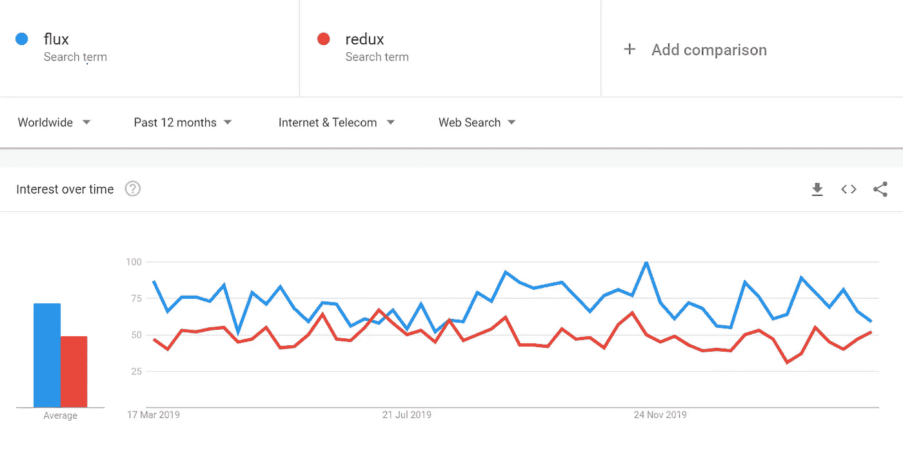

# 通量与还原

> 原文：<https://medium.com/nerd-for-tech/flux-vs-redux-6cb572f8d7f8?source=collection_archive---------0----------------------->

如果你熟悉设计模式和架构，你可能会有 Flux 和 Redux 的概念，但仍然可能没有一个清晰的图像。我们将学习 Flux 和 Redux 的概念以及使用它们的目的。最后，你会对你的项目有所了解。

## **通量架构介绍**

Flux 是脸书在与 React 合作时内部使用的一种架构。Flux 是*不是*一个框架或库，它只是一种新的架构，补充了 React 和单向数据流的概念，这意味着更新视图流是单向的:

也就是说，脸书确实提供了一个包含调度程序库的 repo。dispatcher 是一种全局发布/订阅处理程序，它将有效负载广播给已注册的回调。

一个普通的 Flux 架构将包含这个 Dispatcher 库，以及 NodeJS 的 Event Emitter 模块，以便建立一个帮助管理应用程序状态的事件系统。

单个组件更好地解释了通量:

1.**动作**——是在视图或任何其他地方调用的方法集合，用于向调度程序发送动作。动作是通过调度程序交付的实际有效负载。

2.调度员——基本上是整个过程的管理者。它是您的应用程序的中枢。分派器接收动作并将动作和数据分派给注册的回调。所提供的 Dispatcher 模块中最酷的部分之一是定义依赖关系和编组存储回调的能力。

3.**存储—** 管理应用程序中特定域的应用程序状态。从较高层次来看，这基本上意味着每个应用程序部分、存储管理数据、数据检索方法和调度程序回调。

4.**控制器** **视图**——它们实际上只是 React 组件，侦听变更事件并从存储中检索应用程序状态。然后，它们通过 props 将数据传递给它们的子组件。

## **Redux 架构介绍**

Redux 是一个开源的 JavaScript 库，用于管理应用程序状态，类似于 flux architecture，但方式完全不同，它是由 Dan Abramov 和 Andrew Clark 在 2015 年创建的。它通常与 React 或 Angular 等库一起用于构建用户界面。Redux 架构引入了新组件，如:

*   **Reducer:** 决定数据如何变化的逻辑存在于纯函数中
*   **集中存储**:保存一个状态对象，表示整个应用的状态

在这个体系结构中，应用程序事件被表示为一个动作，该动作被分派给 reducer，即纯函数。然后 reducer 根据收到的动作类型用新数据更新中央存储。商店创建一个新的状态并将更新发送给视图。当时，视图被重新创建以反映更新。

## 数据流

Flux 和 Redux 强制单向流，以确保干净的数据流架构。单向方法的显著优点是，由于数据在应用程序中单向流动，因此您可以更好地控制它。

## 商店类型

Flux 包含多个商店，但 redux 包含每个应用程序的单个商店，因为在应用程序中保存多个商店 Redux 会将所有内容保存在应用程序的一个区域中，但 flux 使用多个商店来跟踪多个状态。

您可能会想，为什么 redux 要实施单个全局存储而不是多个存储呢？考虑到用户操作使用多个存储，在某些存储中很可能会忘记处理操作，这可能会导致应用程序管理出现问题。很难获得用户状态包括的内容的概要，并且更新是多个不断变化的存储的主要问题。这些问题将用户引向 Redux 中的单一集中存储所提供的东西，Redux 中的所有变化都是通过一个名为 Reducers 的纯函数来实现的，这解决了流量的冲突。

## 在架构中如何处理调试？

Flux 架构包括单一调度程序，所有的动作都通过该调度程序。这种设计保护难以调试的级联更新。也有助于包含副作用的操作，如使代码更清晰、更新其他视图和新开发人员调试。

Redux 没有调度程序，管理数据和调试要容易得多，因为你的整个应用程序的状态都在一个单独的存储中维护，如上所述。此外，所有组件的状态都依赖于一个对象树。可以记录为了达到某一点而执行的所有操作。这使您能够将应用程序作为一个整体来看待，并轻松地进行调试。除此之外，它还提供了一个很棒的实时代码编辑选项，带有时间旅行调试特性。此功能使您能够回退和重放调试操作。

## 用在哪里？

相比之下，Flux 和 Redux 在很大程度上是一种前端设计模式。Flux 解决了在客户端处理应用程序状态的问题。因此，前端框架&像 Angular2、Vue.js 和 Polymer 这样的库都可以与 Flux 进行自然的交互。

当比较 Flux 和 Redux 的可用性时，两者得分相同。但 Redux 不仅仅是一个状态管理库，它还为您的前端应用程序提供了几个好处，包括确保数据一致性、在组件之间共享数据以及为代码组织提供模板。Redux 主要与 React 相关联，但它也可以与其他库一起工作，包括 Vue.js、AngularJS、Ember、Backbone.js、Meteor 和 Polymer。

## 结论

我不会推荐选择 Flux 或 Redux，你要考虑 Flux 和 Redux 之间的所有这些比较，你现在必须对这两种架构都有很好的了解，你应该考虑什么最适合这个项目。这完全取决于您采用的技术、您的应用程序的目标以及您喜欢使用的范例。这是谷歌趋势的结果，显示了过去一年全球范围内 Flux 和 Redux 的使用情况。

## 参考

 [## MVC 与 Flux 和 Redux 的真正区别

### 在 web 应用程序开发过程中，我们创建解决方案来满足客户的需求并解决…

www.clariontech.com](https://www.clariontech.com/blog/mvc-vs-flux-vs-redux-the-real-differences)  [## Flux 和 Redux 的区别

### 这都是关于约束

medium.com](/edge-coders/the-difference-between-flux-and-redux-71d31b118c1)