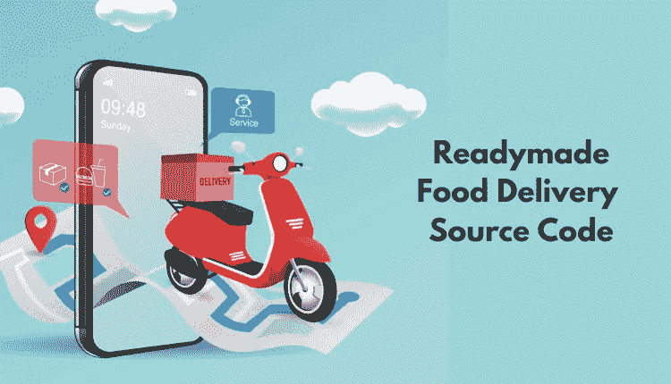
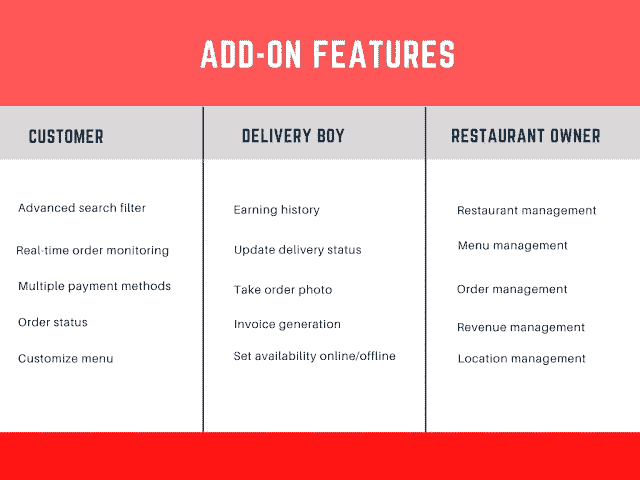

# 送餐应用程序源代码——革新餐厅运营

> 原文：<https://medium.com/nerd-for-tech/food-delivery-app-source-code-revolutionizing-restaurant-ops-de47f2510013?source=collection_archive---------1----------------------->

我们生活在一个应用程序的世界里，每天都有这些独特的解决方案。从订票到点餐，应有尽有；一旦你进入应用程序，只需轻按几个按钮就可以实现。

在本文中，我们将讨论食品配送应用程序的相关性，以及由于创建了现成的食品配送解决方案，它们对提高食品配送市场利润的贡献。另外，你还将深入了解现成应用对初创企业的优势，理解为什么将它们整合到运营中是有意义的。您还将了解实现它们的不同方式。这是在进行送餐 app 开发的时候。

因此，让我们不要再浪费时间，深入研究解决办法。在此之前，让我们了解一下市场统计数据，以了解他们对食品配送市场增长的贡献。

## 按需送餐应用的市场统计

看一看这些数字，就能了解按需送餐应用的盈利性质，了解它们为送餐市场提供利润丰厚的价值的贡献。

*   到 2029 年，市场规模将达到 3200 亿美元。
*   2022 年的当前收入为 0.77 万亿美元。
*   2022 年至 2027 年间，收入将以 13.68%的 CAGR 增长。
*   预计到 2027 年，市场规模将达到 1.45 万亿美元。
*   到 2027 年，用户数量将达到 26.442 亿。
*   2028 年利润将在 3887.4 亿美元左右。

## 食品配送应用程序的布局元素

让我们观察一下食品配送应用程序的独特元素，这些元素使它获得了出众的形象。

## 关于送餐克隆应用的一切

食品配送克隆应用程序是现成的解决方案，专为餐厅初创公司打造，特别是那些离线运营的餐厅，以帮助他们在短期内获得可扩展性和增长。这是由于它们可修改的性质。该解决方案使用食品交付应用程序源代码构建，使企业能够根据自己和客户的未来需求轻松进行修改。

因此，简而言之，对于创业公司来说，它们是变相的福音，因为它们根本不需要在应用开发上投入太多。下面提到的是他们的一些优点。

## 购买送餐应用程序的好处

当你[购买现成的食品交付源代码](https://www.fooddeliveryclone.com/)时，或者就此而言，当你购买食品交付应用程序源代码时，你会获得以下优势。

*   在更大比例的客户中实现快速的业务可见性。
*   能够根据业务和客户的未来需求进行简单的修改。
*   在食品交付应用程序开发服务过程中节省成本的自由。

了解了这些优势后，我们相信您一定想知道如何通过该解决方案让您的餐厅运营得到应有的推动。别担心，我们会保护你的。

## 买菜送餐 App 源代码

想成为利润数十亿美元的食品配送市场的一部分，而不需要投入太多吗？购买送餐 app 源代码，实现餐厅业务转型，获得想要的支持，实现可扩展性和增长。将食品交付应用程序开发服务外包给海外的专门合作伙伴。检查开发食品交付克隆应用程序的专业知识。一旦你觉得他们有能力观察你的收入，就告诉他们你的要求。