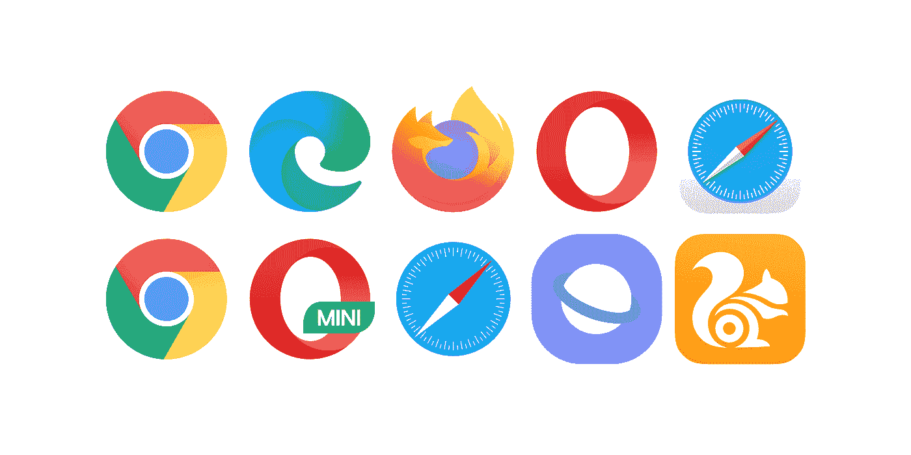

# 让所有浏览器在所有操作系统中共享选项卡

> 原文：<https://medium.com/nerd-for-tech/for-all-browsers-to-share-tabs-in-all-os-c43c69214288?source=collection_archive---------16----------------------->

因为我们喜欢它们，只要它们能给我们提供我们需要网页，而且它们都这样做了，所以各种各样的浏览器都应该合作，共享每个操作系统中的标签，供你我这样的用户使用，因为我们都使用它们，这使我们的生活变得更容易。我现在碰巧遇到了这个浏览器阻塞，因为我在 Microsoft Edge 中阅读这个 pdf 文档，并在 Chrome 中查看这个网站，但为了让这个网站更接近我正在阅读的文档，我本能地试图将这个 tap 从 Chrome 中分离出来，并将其连接到 Microsoft Edge，但这在 Windows 中是不可能的操作，我确信在 mac 和 Linux 中也是如此。这让我想起了互操作性，我们应该在我们正在开发的伟大技术产品和服务中推广这一功能，因为它让人们的生活变得更加轻松，让通信和运输变得更加顺畅和容易。

对于我所写的这个互操作性问题，我无能为力，因为只有像微软这样的操作系统所有者才能解决它，但我认为通知你这一点是好的，并希望你也会注意到另一个人，如果我们都畅所欲言，也许有一天我们可以从 chrome 中取出一个标签，并将其附加到 Edge 上。这并不是针对微软、谷歌或任何其他大型科技公司，而是一个功能主张，这个功能确实是技术化的，可以说这是一个可以构建的功能，考虑到当前的技术水平。

这是我向你描述的屏幕视频，你可以打开你的 Edge 浏览器和 Chrome 浏览器，自己测试一下，看看它是否能工作。

 [## 让浏览器在所有操作系统中共享选项卡

### 编辑描述

www.loom.com](https://www.loom.com/share/2d7abf846a244e6e83132e09b61e6d4b)