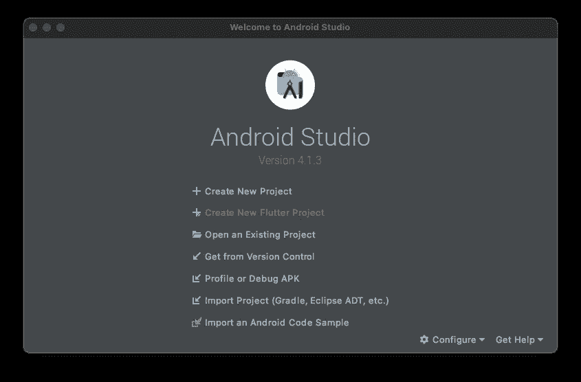
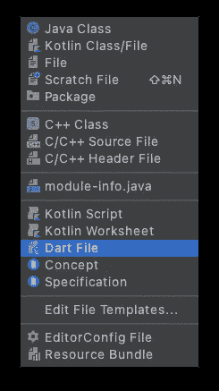
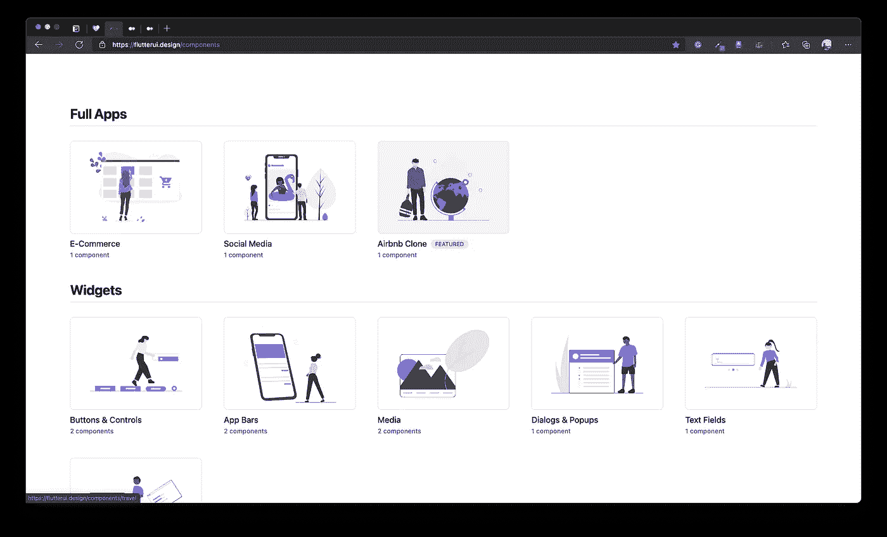
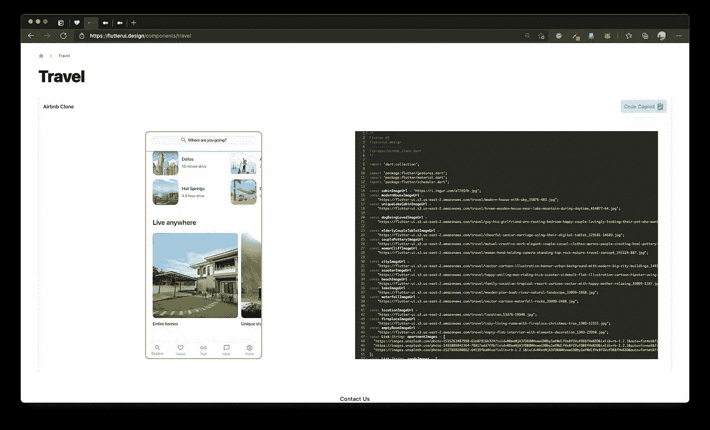
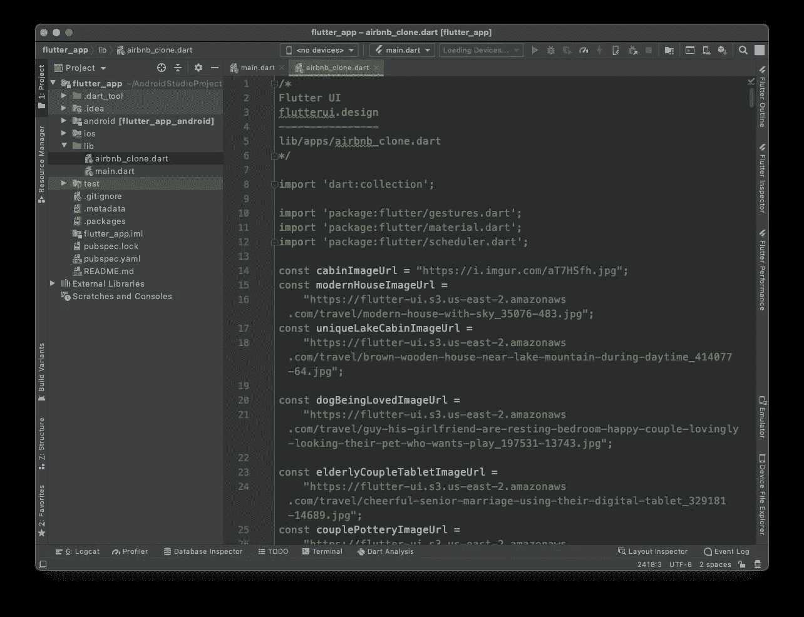
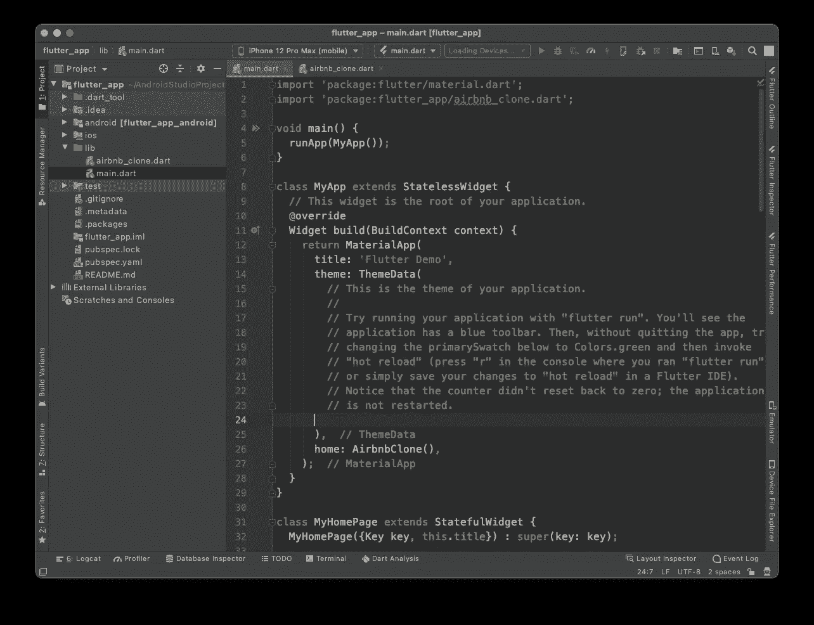

# 忘记下一个 Flutter 应用程序中的 UI 包

> 原文：<https://medium.com/nerd-for-tech/forget-packages-for-ui-in-your-next-flutter-app-161dc1beb83a?source=collection_archive---------1----------------------->

## 特色:早期访问— FLUTTER UI

是的，你没看错。

你对颤振感兴趣？
- *是的，我是。太棒了。*

**你是否愿意加快自己的 UI 开发进程，专注于核心逻辑？**
- *耶。*

**你目前做什么来加快自己的发展？**
- *预制的 UI 包。*

**你对持续的“导入”和显式包满意吗？**
- *可惜，没有。*

好了，让我们从魔法开始吧。
(想跳过阅读，头转向[飘起的 UI——提前进入](https://flutterui.design/))

## 指数

1.  **关于**
2.  **演示**
3.  **视觉演示**
4.  **资源**

## **关于**

> [**Flutter UI widgets，专为任何项目打造**](https://flutterui.design/)
> *利用 15 个以上预制的 Flutter 代码片段辅助设计和功能。节省数百小时的开发时间，所有这些都不依赖于任何因素。*

## **突出特色:**

*   通过使用预构建的小部件节省数小时的开发时间。
*   所有都有 0 个依赖项；只要复制，粘贴，它就进来了！

## **当前可用部分:**

1.  **完整应用** ——电子商务、社交媒体、克隆应用的 UI。
2.  **Widgets**
    ——与你现有的应用整合
3.  **屏幕**
    -大多数应用所需的普通屏幕
4.  **实用程序**
    -实用程序代码&小部件

## **由 Zachery Gentry 开发**

**推特:** [扎克里·金特里(@zacherygentry) /推特](https://twitter.com/zacherygentry)

## **演示——AirBnb 克隆(精选)**

**探索四重方法论**

1.  创建一个新的 Flutter 项目
    *-根据你的选择使用任何编辑器。创建项目后，您可以构建适合自己的项目文件和文件夹，而不会受到任何约束。*
2.  **新增。dart 文件
    -** *添加一个. dart 文件，这将有助于保持代码的整洁。这是我们的“神奇”代码所在的文件。*
3.  **前往 Flutter UI
    -**有各种类别，在“完整应用”部分选择“AirBnb 克隆”。点击复制代码，现在我们有一个完整的应用程序在我们的剪贴板上(是不是很吸引人)
4.  **粘贴并运行** *——将复制的代码粘贴到新的。dart 文件，根据需要放置名为 AirbnbClone()的小部件。(大多数情况下，在 MaterialApp 的“主页”上。)*

## **视觉演示**

创建新的颤振项目

新的。dart 文件

> *注意——明智地使用这一资源，并确保你清楚自己的概念。没有理解的盲目复制粘贴是愚蠢的。*

Flutter UI 网站

代码复制到剪贴板

粘贴到新创建的。dart 文件

用 AirbnbClone()替换 MyHomePage()

创始人 Zachery Gentry 的工作演示

## 提前购买可额外享受八五折优惠

> 使用结账时的优惠券—[Flutter UI—Flutter 应用程序的代码片段](https://flutterui.design/components)
> FLUTTER15

## 资源

[**Flutter & Firebase:为 iOS 构建完整的 App&Android**](https://courses.codewithandrea.com/courses)—[Andrea Bizzotto](https://medium.com/u/374ee4d0e153?source=post_page-----161dc1beb83a--------------------------------)授课

