# 使用 NODEJS 和 EXPRESSJS 时忘记密码

> 原文：<https://medium.com/nerd-for-tech/forgot-password-using-nodejs-and-expressjs-295fad58fdf5?source=collection_archive---------0----------------------->


丹·尼尔森在 [Unsplash](https://unsplash.com?utm_source=medium&utm_medium=referral) 上拍摄的照片

保存客户的**密码**一直是开发中不可忽视的重要过程。有时，客户的**忘记**他们的**密码**，因此**限制**他们登录他们的账户。

作为一名在后端工作的软件工程师，当这种情况发生时，您会希望客户端**请求** **检索**他们的登录凭证。

在这篇文章中，我将带领我们完成实现这一目标的路线图。

我将使用视觉

Studio code(vscode)作为我的代码编辑器，但可以随意使用您选择的任何编辑器。

让我们在桌面文件夹中创建一个名为 forgot-password 的文件夹，并在代码编辑器中打开它，如下所示；

**先决条件**

*   安装 node.js 和 yarn
*   在您的系统上安装 MongoDB

打开终端运行；

```
 cd Desktopmkdir forgot-passwordcd forgot-passwordcode .
```

在 forgot-password 文件夹中，创建一个名为 forgotPassword.js 的文件。

```
touch forgotPassword.js .gitignore app.js index.jsyarn -yyarn add cors express mongooseyarn add -D nodemon --save
```

打开。gitignore 文件并添加以下内容；

```
/node_modules/
```

这使得我们的节点模块文件夹不会提交给 GitHub。

在 package.json 文件中包含以下内容；

```
"name": "forgot-password-using-nodejs-and-express","version": "1.0.0","description": "This is an application that illustrates how to implement the forgot password process using nodejs and expressjs","main": "index.js","scripts": {"start": "node index.js","dev": "nodemon index.js"},"keywords": ["nodejs","expressjs","forgot password"],"license": "ISC",
```

在 app.js 内部，让我们授予来自所有浏览器的访问权限，并设置服务器接受 JSON 数据；

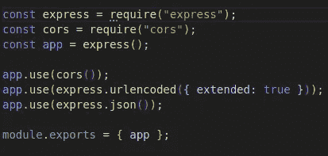

app.js 文件

在 index.js 中添加以下内容；

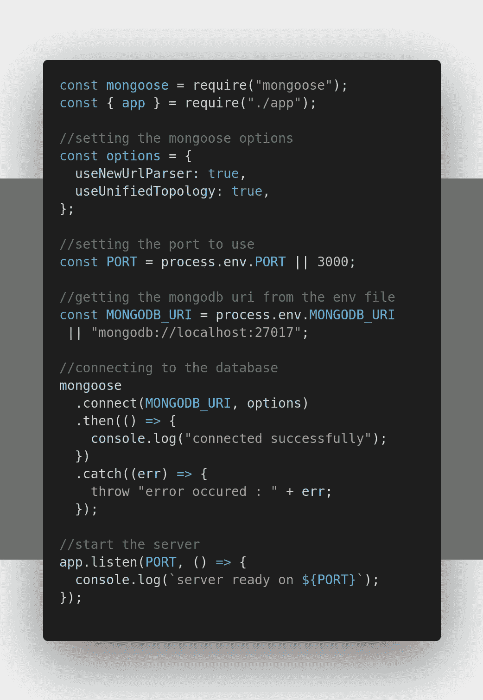

index.js 文件

上面的代码片段已经用每个代码块前的注释解释了自己。

如果您的代码是我的最新代码，让我们通过在终端中运行以下命令来启动服务器；

```
yarn dev
```

您的终端应该如下所示:


已启动服务器

上面显示了我们的服务器已经在端口 3000 启动，并成功连接到 MongoDB atlas。

在**忘记密码**目录中，让我们创建将要使用的文件夹。在终端中添加以下内容:

```
mkdir models controllers routes
```

在模型内部，让我们创建一个名为 register.js 的新文件，并为客户端设计一个模式，如下所示；

```
cd modelstouch register.js
```

在我们创建的 register.js 模型文件中添加以下内容；

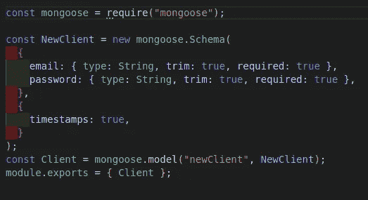

注册. js

我创建了一个客户机模式，它只接受客户机的电子邮件和密码，数据类型被分配给模式属性，所有的属性都是必需的，修剪空白，生成当前时间戳，最后导出它供其他文件访问。

在我们已经创建的控制器文件夹中，创建一个名为 signupClient.js 的新文件，并在其中添加以下代码行；

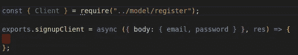

注册客户端. js

上面，客户机模型被导入到文件中，定义并导出了一个函数，该函数将处理将新客户机保存到数据库中。客户端将要发送的电子邮件和**密码**是从请求的主体属性中析构出来的。

在下面，让我们处理当我们发出 post 请求时发生的事情；

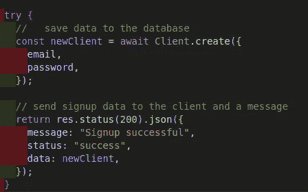

如果 email 和**密码**属性包含值，那么服务器继续创建一个新的客户端。一种叫做 **trycatch** 的方法被用来管理可能出现的服务器错误。之后，新的客户端数据被发送到客户端，并显示一个成功消息状态。

如果在过程中出现错误，则发生与上述相反的情况；

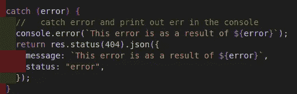

在我们之前创建的 route 文件夹中，创建一个名为 routes.js 的文件，并在其中添加以下内容；

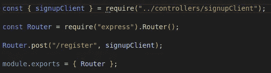

路线文件

这里我创建了一个 post 请求，它监听指定的路径“/register”，并将控制器函数作为 post 方法的第二个参数传递。

如果我们都做到了这些，那就让我们去 app.js 文件，导入**路由器**如下使用；

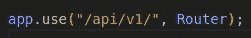

上面，代码行被添加到 app.js 文件中。该方法的第一个参数定义了路由的初始 **URL** 。我这么说是什么意思？是一种应该出现在主 **URL 之前的 **URL** 路径中的前缀。**

以上我们都已经实现了，现在我们可以进行测试了。我将使用 postman 作为我的测试客户端，但你可以使用任何前端语言/框架与服务器通信。

使用邮差，下面是服务器的成功响应；

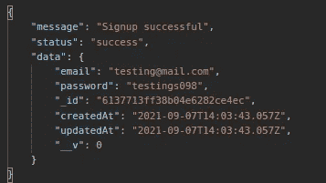

注册请求-响应

我们已经成功地渡过了文章的第一部分。接下来，我们都将看到我将如何实现**忘记** **密码**的过程，以防客户忘记**密码**。

在注册模型中，让我们通过添加两个属性来调整客户机模式，如下所示；

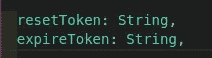

客户机模式中添加了 reset 标记和 expire 标记，我将数据类型指定为 string 类型。

在控制器文件夹中，让我们创建一个名为；忘记密码并在里面加上以下内容；

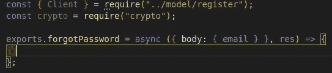

forgot 密码文件

在上面的截图中，我导入了客户端模型和一个名为 **crypto —** 随机令牌生成器的内置模块。定义了一个函数来处理 **forgotPassword** 过程。就像我们之前在 signupClient.js 文件中所做的那样，我们从请求体中析构了电子邮件。

一旦电子邮件被发送到服务器，该电子邮件将被验证，以了解该电子邮件是否存在于数据库中。所以在下面，让我们验证客户端的电子邮件如下；

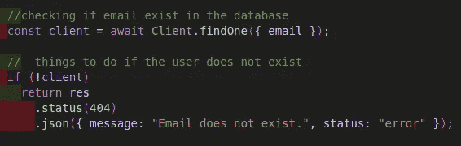

进行检查以验证电子邮件是否存在，如果不存在，则向客户端发送响应以通知客户端错误。

如果电子邮件存在于数据库中，将生成 32 位令牌，并转换成十六进制字符串。还将进行检查，以了解令牌生成是否成功，如果不成功，将向客户端发送一条消息，通知客户端该错误。将以下内容添加到 **forgotPassword** 函数中；


一旦令牌生成成功，我们现在将把转换后的字符串分配给客户端的 **resetToken** 属性，并为生成的令牌创建一个过期持续时间，还将其分配给客户端模式属性的 **expireToken** 。下面是前面解释的地方；

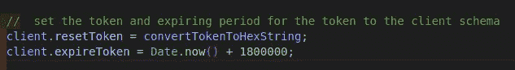

从上面的屏幕截图中，我们可以看到重置令牌和过期令牌持续时间是如何创建的。过期令牌持续时间设置为仅持续 3 分钟，令牌过期后，客户端将不得不再次重复该过程。

让我们使用 **trycatch** 方法来管理将令牌和过期令牌持续时间保存到数据库中的客户端属性的过程，如下所示；


令牌和令牌过期持续时间已保存，成功响应已发送到客户端。如果出现错误，将向客户端发送一条错误消息。

在 routes.js 文件内部，我们将导入 **forgotPassword** 控制器函数，并将其传递给 post 方法，如下所示；

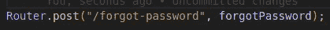

让我们测试一下，看看在下面使用邮递员作为我们的客户机是否有效；

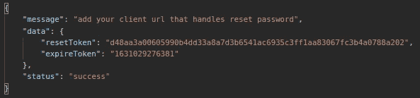

成功响应

让我们检查一下 MongoDB，看看我们的令牌更新是否符合下面的响应数据；


数据库

有了这些，你就可以称自己为赢家了！终于，我们看到了这篇伟大文章的结尾。所以我有一个问题:从现在开始你能实现**忘记** **密码**流程吗？

对于 raw 文件遵循 [***这里的***](https://github.com/chibuike07/forgot-password) ***。***

如果这篇文章对你有帮助，别忘了点击拍手图标，分享这篇文章，关注我的 [***中的***](https://princewillchime43.medium.com/) 和[***Linkedin***](https://www.linkedin.com/in/chime-princewill-3a2b1b192/)来看更多我的精彩文章。

请放弃任何评论或建议。如果你有一个基于 JavaScript/React.js 生态系统的主题，请随时联系我，我很乐意就此进行写作。谢了。