# 叉、克隆、推、拉:使用 Git & GitHub 的基本指南

> 原文：<https://medium.com/nerd-for-tech/fork-clone-push-pull-a-basic-guide-to-using-git-github-63ad4f5975a3?source=collection_archive---------2----------------------->


如果你以前从未使用过 GitHub， **Github** 是一个使用 **Git** 的代码托管平台，开发者和不同的合作者可以在任何地方参与不同的项目。它非常适合存储和跟踪项目的变更以及版本控制。

什么是版本控制，为什么它如此重要？**版本控制**基本上确保每个人在作为一个团队一起合作一个项目时都在同一页上。Git 可以存储一个项目的完整历史，这允许更快的协作而没有延迟，这使得 Git 更加可靠，因为每个贡献者都有他们自己的本地版本的备份以防崩溃。([来源](https://about.gitlab.com/topics/version-control/what-is-git-version-control/))

在本指南中，我们将一步一步地讲解使用 Git 和 GitHub 的一些基础知识，包括分叉、克隆、推送和拉取。相信我，一切都会有意义的，坚持住。

**您需要什么来开始:**

*   通过命令终端使用 SSH(安全套接字 shell 端口 22)连接到本地云服务器
*   进入你的指挥终端
*   GitHub 账户
*   安装了 GitBash 的设备

> 步骤 1:派生一个现有项目

首先，我们需要登录 GitHub 主页，选择一个我们想要派生的项目。我已经选择了一个示例，但是您可以使用左上角的搜索栏或“ ***浏览*** ”按钮选择您想要的任何项目，如此处所示…

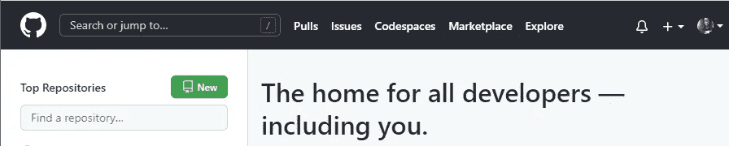

GitHub 主页

当你找到一个项目(存储库)时，我们就要分叉它。**存储库**包含所有的项目文件和每个文件的修订历史。分支库仅仅意味着制作一个你将要管理的副本。当您派生一个存储库时，您可以在不影响原始存储库的情况下进行更改。([来源](https://docs.github.com/en/pull-requests/collaborating-with-pull-requests/working-with-forks/about-forks))

在存储库的右上角，您将会看到“***”***”按钮。如果你点击下拉箭头，你会看到选项“ ***创建一个新的分支*** ”。一旦你选择了这个，它会要求你命名你的库，然后点击“ ***Create Fork*** ”。

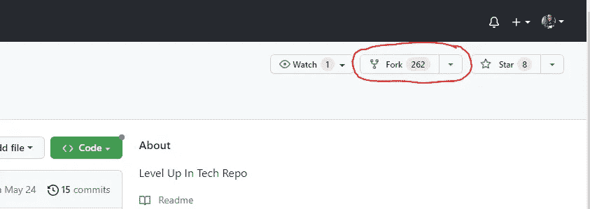

> 步骤 2:克隆分叉的存储库

当我们在我们自己的分叉版本的库上时，我们现在需要克隆我们的分叉库。您可以看出您正在使用自己的分叉版本，因为它将包含您的用户名和您为存储库选择的名称，以及左上角的从分叉而来的“**”。**

我们要点击“ ***代码*** ”然后是面包屑“ ***SSH*** ”。

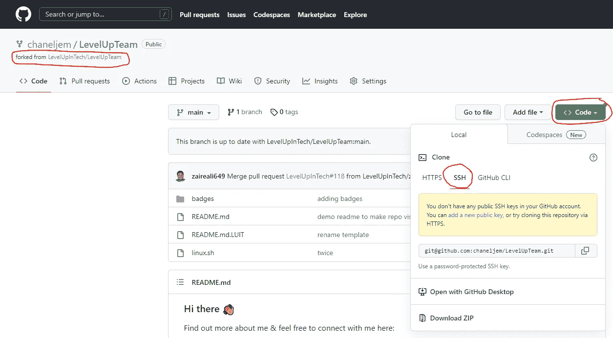

我们需要获得远程访问权，以便与另一台计算机进行安全通信。这将为我们提供两个网络端点之间的加密连接。**对于 SSH，我们需要首先添加一个公钥。**

还记得我告诉过你需要安装 Git Bash 吗？Git Bash 是一个在操作系统上提供 Git 命令行体验的应用程序。Git Bash 是 Git for Windows 的一部分，通常内置于 Linux 中。([来源](https://www.geeksforgeeks.org/working-on-git-bash/))。

*为了确保您已经安装了它，请打开您的终端，我们将输入以下命令……*

```
git --version
```

如果安装了 Git，您应该会收到带有 Git 版本的消息。

*现在，在我们的终端中，我们将键入以下命令……*

```
ssh-keygen -t ed25519 -C "your_email@example.com"
```

你要输入你的电子邮件，显示“your_email@example.com ”,然后按回车键。

然后，您将看到这样的消息…

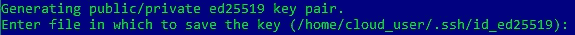

您可以选择保存公钥的位置，或者只需按下 ***输入*** 即可保存到默认位置。然后，您必须输入一个密码短语(口令),也可以留空不输入密码短语。

在命令提示符下，如果你选择默认位置，它会告诉你你的公钥保存在哪里。我们需要知道在哪里可以找到这个公钥来输入 GitHub。

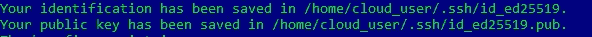

进入您的文件系统，检索实际的密钥并复制它。如下所示，进入保存您的密钥的文件，使用 ***cat*** 命令查看其内容。确保您使用的是**公钥**。

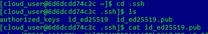

授权密钥

现在我们可以回到 GitHub，选择“ ***添加新的公钥*** ”

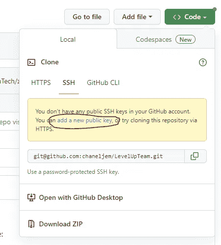

然后，系统会提示您为密钥命名。这可以是您选择的任何名称。将密钥类型保留为“ ***认证密钥*** ”，并将密钥复制并粘贴到“ ***密钥*** ”部分。如果您不确定是否复制了正确的文本，它甚至会提供提示。然后点击 ***添加 SSH 密钥*** 。

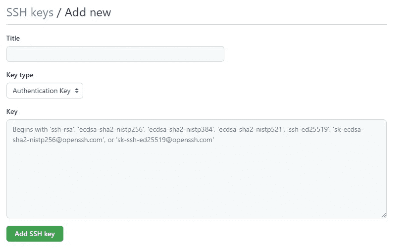

现在，当我们回到分叉的存储库时，我们的 messaged 已经消失了，因为我们已经添加了我们的公钥。我们现在需要点击两个重叠的方块来复制我们的文本并放入命令行。

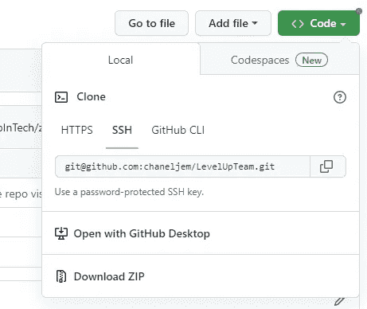

在克隆我们的存储库之前，我们需要一个存放克隆的存储库的地方。您可以使用以下命令创建一个新目录…

```
mkdir "chooseyourname"
```

这将创建一个新的空目录。您可以选择将目录命名为您喜欢的任何名称，或者类似于您正在处理的存储库的名称。*现在我们有了存储库的目录，我们将使用下面的命令…*

```
git clone git@github.com:copiedtextfromgithub/copiedtext.git chooseyourname
```

在 git 克隆之后，你粘贴从 GitHub 复制的文本，然后将位置添加到你的克隆将要去的地方，这将是我们刚刚创建的目录。

命令提示符将显示您正在克隆的内容，如果您创建了密码，将会询问您之前创建的密码。您应该在最后看到 done，以显示克隆成功。

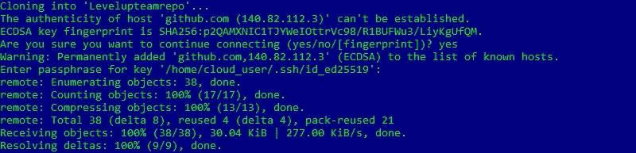

> 步骤 3:对文件进行更改

有各种各样的文本编辑器可以学习和使用，有时这只是一个偏好的问题，有时这是一个你最先学习或使用最多的问题。我们将使用 **VIM 文本编辑器**来修改一个文本文件。在我的示例文件中有一些文件。

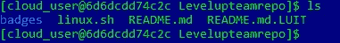

*要使用 VIM 编辑文件 linux.sh，我们将使用简单的命令…*

```
vim linux.sh
```

现在我们在 VIM 编辑器中，我们将使用以下文件在 bash 中创建一个基本的 shell 脚本…

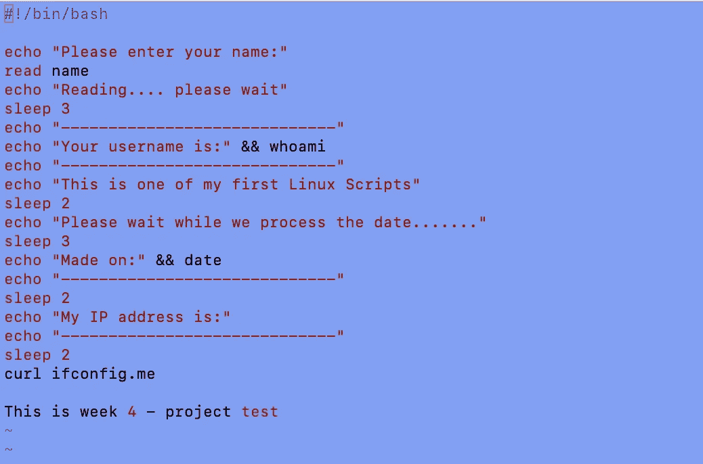

要修改我们的脚本，我们必须首先通过键入字母“I”进入插入模式。在输入 bash 脚本的所有必要信息后，我们需要保存并退出 VIM 文本编辑器。我们通过按下键盘上的“esc”键，然后按下“:wq”键来完成编写，同时退出编辑器。

现在我们回到了命令行，我们必须改变我们的脚本修改，使我们的脚本运行。*为此，我们将键入以下命令……*

```
chmod u+x linux.sh
```

我们更改了修改(chmod ),并使它在文件 linux.sh 上对用户(u+x)是可执行的。

*为了确保我们的脚本正确运行，我们将使用以下命令进行测试…*

```
./linux.sh
```

您可以使用您选择的文件名，并在。/"来运行脚本。

> 步骤 4:将我们的文件添加到本地存储库中

修改完文件后，我们可以使用命令…来查看所做的更改

```
git status
```

*您应该会看到一条与此类似的消息，表明发生了变化……*

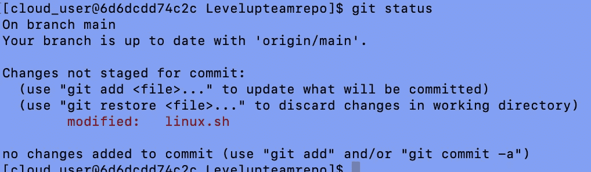

正如您可以看到的红色突出显示的，我们的文件已被修改，现在我们需要继续添加文件并提交它。

**添加**文件就像将文件放入暂存区或等待区，以便在下一次提交时包含它。

**提交**一个文件就像它听起来的那样，你正在提交修改。它会将您的更改保存到本地存储库中。

*我们将使用以下命令添加我们的文件…*

```
git add linux.sh
```

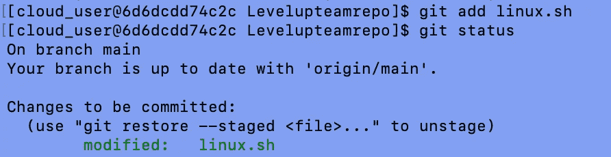

如您所见，我们已经添加了文件，现在它看起来不同了。语法从红色变为绿色，现在可以提交了。

我们可以用下面的命令提交文件…

```
git commit -m "Message about changes made"
```

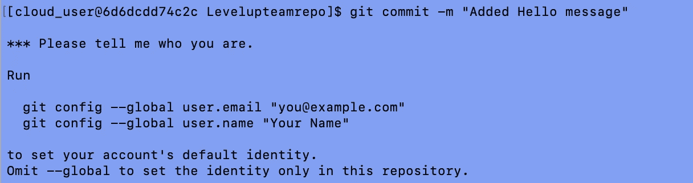

使用 GitHub 是非常用户友好的，如果在继续某个动作之前你需要做某些步骤，甚至如果你拼错了什么，它会返回一条消息，它会一直指引你。

**git config 命令**不用于认证，而只是用于跟踪和识别是谁对存储库进行了更改。

*因为我们只想对这个存储库进行更改，所以我们将使用以下命令…*

```
git config user.email “you@example.com”
git config user.name “Your Name”
```

GitHub 也不会让你提交修改，除非你对实际修改的内容给出评论。这也是团队协作如此伟大的原因，因为您可以很容易地查看由谁在何时进行了哪些更改的历史。

*我们将使用以下命令提交我们的更改…*

```
git commit -m "Message Describing Change Made"
```

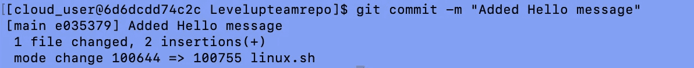

我们现在已经确认了我们对存储库所做的更改。

> 步骤 4:将文件推回 GitHub

所以请记住，这个文件只在我们自己的本地存储库上被修改过，所以我们希望将我们的更改返回到 GitHub，这将通过推送来完成。我们利用推送将本地存储库内容上传到远程存储库。

现在我们想运行下面的命令来看看远程服务器被设置成什么样子…

```
git remote
```

我们得到单词"***【origin】***，这只是一个别名，表示项目的来源。

*我们现在将运行以下命令，将远程存储库上已更改的任何新内容下载到我们的本地存储库……*

```
git fetch orgin
```

这有助于确保您所做的任何更改不会干扰其他人所做的更改。

在您合并之前，您使用 fetch 命令下拉的内容还不属于您的本地存储库。这必须在你推动它之前完成。

我们还可以运行以下命令来确保我们是最新的…

```
git pull
```

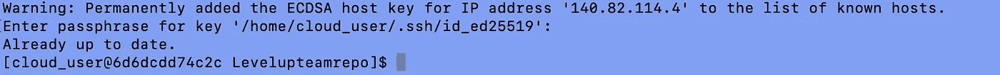

*既然我们都是最新的，现在我们想通过使用以下命令将我们的文件推回到 GitHub 上的存储库…*

```
git push origin main
```

您应该得到类似于以下内容的确认…

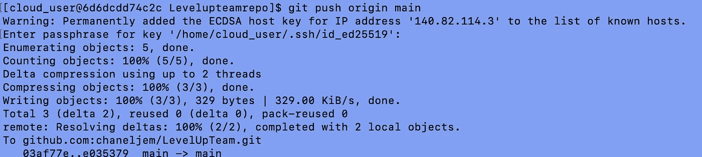

我们现在看到我们的变化反映在 GitHub 上！

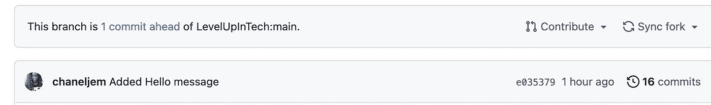

> 步骤 5:发送拉取请求

GitHub 中的 pull 请求基本上是告诉其他人您已经对一个存储库进行了更改。这使得维护人员可以审查你的贡献，如果他们愿意的话可以接受。

要提交拉动请求，我们只需单击“拉动请求”选项卡，然后单击按钮“*新拉动请求*”。

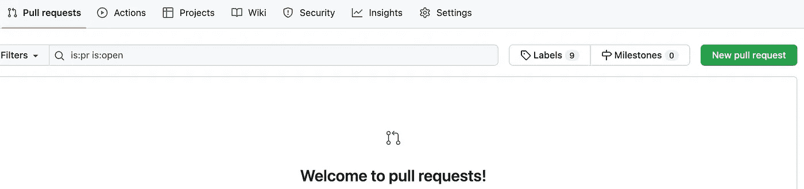

您将看到我们所做的更改，然后我们将添加一条注释，并单击“*创建拉动式请求*”。因为我们确保我们的文件是最新的，我们没有合并冲突！

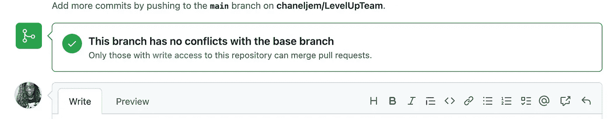

我们成功了！这些是使用 Git & Github 进行分叉、克隆、推和拉的基础。感谢您的阅读，如果您想通过其他方式与我联系，请通过 [LinkedIn](https://www.linkedin.com/in/chaneljemmott/) 联系我！

谢谢你，香奈儿·杰莫特