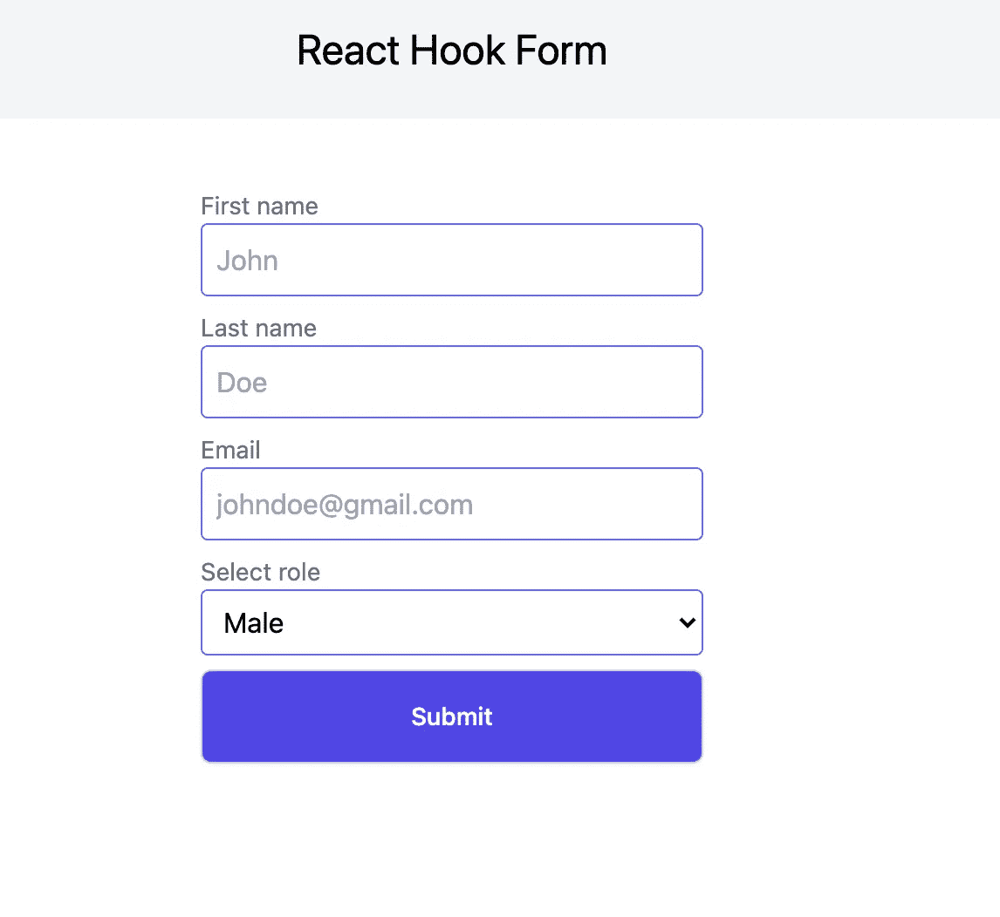

# React 中的表单和验证

> 原文：<https://medium.com/nerd-for-tech/forms-and-validation-in-react-6f185108037f?source=collection_archive---------2----------------------->

React 钩子形式入门。

[在这里阅读更多](http://i-hate-reading-logs.vercel.app/)

为您的应用程序创建一个带有适当验证的表单对于获得令人满意的用户体验是必不可少的。但是开发一个带有适当验证的表单从来都不是一件容易的事情，但是我们有一个不错的第三方库，可以让 React 开发一个表单。所以这个博客是一个使用`React Hook Form`创建表单的尝试。

# 入门指南