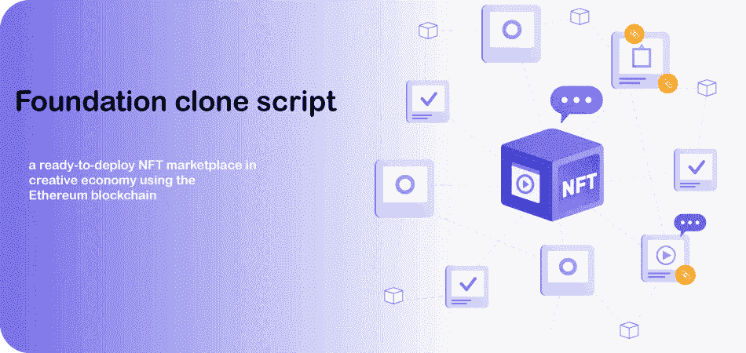
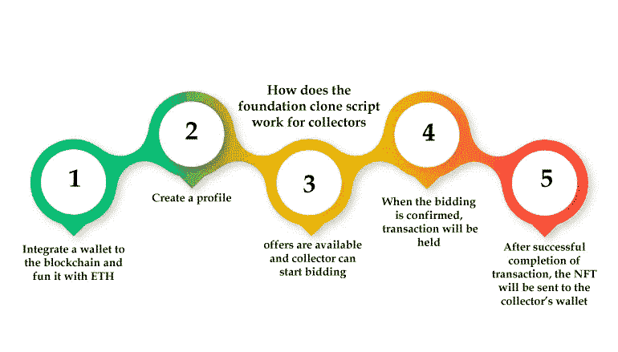
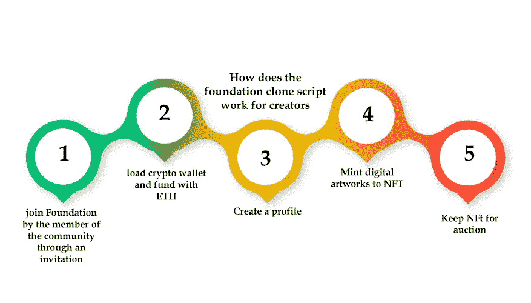
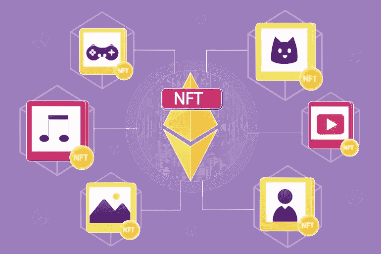
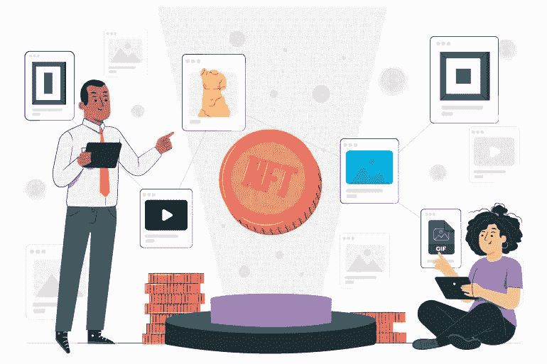

# 基金会克隆脚本-像基金会一样创建您自己的 NFt 市场

> 原文：<https://medium.com/nerd-for-tech/foundation-clone-script-create-your-own-nft-marketplace-like-foundation-c53afb24a9b8?source=collection_archive---------2----------------------->

基于近年来 NFT 交易量的增长，人们对作为投资者参与“NFT 市场世代”有着浓厚的兴趣。有几个 NFT 市场克隆脚本的最佳选择，你可以创建一个这样的市场。一个流行的 NFT 拍卖脚本是基金会克隆脚本。

企业家倾向于参与不可替代代币市场的形成。你可以构建自己的 opensea、foundation、币安克隆脚本等。基础克隆开发需要您业务的所有需求。在这篇文章中，我们将讨论开发你自己的 NFT 市场需要什么，需要多少成本，需要什么必需品，需要多少时间等等。接下来的部分会告诉你所有的细节。

# **什么是基金会克隆脚本？**

[**基金会克隆剧本**](https://radindev.com/foundation-clone-script/) 是一个令人向往的 NFT 市场。它基于以太坊区块链——最值得信赖的区块链——并且它的交易是通过智能合约完成的。智能合约技术提供安全可靠的交易。这个克隆脚本经过多重测试，随时可用，并且安全，因为它包含智能合同。

## **基础克隆脚本的特性**

店面

多钱包整合

NFT 铸币厂

资产分类

分析学

资产列表

不同类型的资产

性能监控器

高级搜索选项

## **基础克隆软件的安全特性**

传入和传出 API 安全性

多重设置认证

安全加密钱包集成

安全交易

对数字艺术的全面保护

端到端加密

支持 SSL 协议

本机的安全功能

内置 SSL 协议

数字艺术的加密和解密

## **为什么要推出像基金会克隆脚本这样的 NFT 市场？**

艺术品资产总是有价值的，近年来数字资产变得流行起来。它们就像实物资产一样，你可以交易它们，买卖不可替代的代币。作为创作者，你可以在市场上铸造你的作品，也可以在拍卖中铸造它们。作为购买者，你可以购买 NFTs，并将所有权据为己有。你可以在拍卖结束后把它转移到你的钱包里，然后在二级市场上出售。

# **如何启动类似基金会克隆脚本的 NFT 市场？**

启动一个类似基金会的 NFT 市场是一种潜在的商业模式。如果你是一个企业家，你正在寻找建立自己的 NFT 市场，那么你将在 NFT 市场行业获得很大一部分收入。有一些最受欢迎和功能完善的 NFT 市场克隆脚本，您可以根据您的业务需求选择获得最佳市场。Opensea 克隆脚本，币安克隆脚本，以及我们建议的基金会克隆脚本。

每个 NFT 市场都有其专门的功能，您可以根据自己的需要扩展选项。基金会克隆是最受欢迎的。它声称，NFT 市场总收入的很大一部分属于基金会克隆脚本。因此，深入了解如何启动像 foundation clone app 这样的 NFT 市场以及利润是一个不错的主意。

# **为什么创建 NFT 市场有利可图**

多资产格式

在**基金会克隆应用**上可以获得对数字资产的多重支持。Minters 可以将他们的 NFT 制作成多种格式，如 3D 艺术、视频和图像。

重要的用户群

基金会拥有庞大的用户群，因为它有 100，000 个活跃销售。

以以太坊为后盾

加密领域最可靠的区块链区块链以太坊支持基金会的克隆脚本。

费用

这个 NFT 市场克隆脚本在二级市场收取总价的 15%作为费用。这可以为平台所有者带来很高的投资回报率。

基本的炒作

大量的法定金融部门支持加密资产，所以它说，NFT 在金融部门的统治。

## **创建基础克隆脚本有什么好处？**

高定制范围

启动 NFT 市场的现代化低成本解决方案

组织即时 NFTs 拍卖

将数字收藏品转化为杰出的非传统收藏品

产生高投资回报率

不需要专业技术知识

所有的主要因素，如拍卖和招标可以由管理员管理

由实时性能跟踪功能设计

包含仪表板用户和前沿管理员

# **基础克隆脚本是如何工作的？**

基础克隆脚本是一个易于使用的平台。在这个 NFT 市场上提供的特性和功能就是对这一事实的支持。用户的基础克隆脚本的一般工作流程是:

创建一个帐户

为加密钱包提供资金

如果你是一个创作者，你可以上传一个文件(JPEG，PNG，3D 等)

平台会将列表状态通知给创建者

验证完成后，创建者可以修改出价

拍卖结束后发送给投资者买方的 NFT

收藏家可以在他们的钱包足够鼓的时候参加拍卖

# **基金会克隆脚本如何为收藏者工作？**

# **基础克隆脚本如何为创作者工作？**

# **基金会克隆脚本中的拍卖是如何进行的？**

拍卖完全由收藏家负责，NFT 一上线，拍卖流程就开始了:

艺术家列出保留价格的 NFT

该过程在第一次出价后持续 24 小时

如果出价被另一个价格取代，拍卖将延长 15 分钟

如果任何一个收藏家赢得了拍卖，他们将会把想要的价格支付给创作者，而 NFT 则会被送到收藏家的钱包里

# **基金会交易费**

当与实体艺术品市场进行比较时，基金会克隆脚本中的交易费用要少得多。

当拍卖结束时，总价格的 85%通过 ETH 转移到卖家的钱包，剩下的 15%由市场收取费用

由于所有的 NFT 都建立在区块链以太坊上，并且所有的交易都通过区块链以太坊进行，所有的费用都通过以太坊扣除

一旦一幅 NFT 在二级市场上被转售，创作者最终成本的 10%作为对创作者的认证，就会出现在创作者的钱包里

# **基础克隆软件**

基金会克隆软件是一个分散的 NFT 市场，创作者可以将他们的数字作品铸造成重要的不可替代的代币。用户可以在基金会克隆平台上公开竞标他们的数字资产。NFT 基金会市场软件中提供了透明的工具，因此，创建者可以使用工具创建新的体验，就像他们在财务上使用以太坊区块链一样。

# **什么是白标基金会克隆脚本？**

white label foundation 克隆脚本包含 foundation 平台中所有可用的重要功能和安全选项模块。Foundation white label clone script 是一个现成的 NFT 市场，具有 foundation 的所有特性。

# **为什么您应该选择白标解决方案？**

要启动像 foundation 克隆脚本这样的 NFT 市场，使用现成的克隆脚本更容易。它需要更少的时间，它可以根据业务偏好定制。由于其安全特性，基金会克隆脚本中集成了令人难以置信的功能和高度安全的交易空间。foundation clone 平台提供了简单的部署，并且该产品没有任何麻烦。

## **基础艺术品**

任何数字资产都可以制作成 NFT，赋予其专属所有权。对 NFTs 和数字资产有很好的理解是很重要的，这样当你需要创建一个像 foundation clone script 这样的 NFT 市场时，你就可以根据你的需求定制它。这里有一个数字艺术作品，所有人都可以把它变成非艺术作品。

照片

录像

音乐

运动

名人

虚拟空间

博客

域名

比赛

不动产

时尚

艺术

# **可在基础克隆上定制的区块链技术**

以太坊

创

多边形

厄俄斯

新的

科尔达

开链

主要的

超级分类帐

波尔卡多特

天蓝色木块

## **基金会克隆脚本支持的 ERC 令牌标准**

ERC-721

ERC-20

ERC-1155

# **周一**周五**改编自基础克隆脚本**

企业家们都在全神贯注地开创一个 NFT 市场，就像基金会克隆剧本一样，这将带来足够的收入。

管理员列出创作者的费用，一旦他们在不同类别中列出他们的作品

一旦每个 NFT 显示在平台上，管理员设置排行榜广告费用

收集者和创建者都必须支付交易费用

# **基金会克隆 app 开发流程**

1.令牌类型拾取

2.操作框架选择

3.市场亮点容器

4.可靠性编译

5.令牌标准设置

6.用户验证设置

7.采购市场的主要文件

8.令牌规范

9.辅助文件容器

10.基本 URI 配置

11.网络兼容性增强

12.合同地址设置

13.所有者地址设置

14.Mainnet 部署

# **基础应用克隆功能**

铸造:铸造是鉴定创作者作品的过程，这意味着数字作品如何成为以太坊区块链的一部分。数字艺术作品在区块链以太坊上被描绘成一个 NFT，所以一旦艺术作品被创作出来，你就可以把它们带到 NFTS。

清单:当你铸造你的作品时，你必须支付与区块链互动的费用，这叫做汽油费。由于交易量的原因，交易期间的汽油费可能会有所波动，但要处理每笔交易，您必须支付汽油费。

拍卖:在你铸造了你的艺术品后，你可以把它们列出来。基金会克隆脚本列表采用拍卖形式。一旦有人对你的 NFT 出价，拍卖就会继续进行，如果没有人出价，你可以改变标价，但必须支付另一笔汽油费。你的拍卖推广也可以在社交平台上看到。

# **基础克隆脚本多少钱？**

一些因素可以决定创建一个 NFT 市场的近似成本。像[基金会](https://foundation.app/)、[**opensea**](http://opensea.io)**、 **rarible** 这样的 NFT 市集，是根据你的要求重新打造的。以下是影响因素:**

**1.您选择创建 NFT 市场克隆脚本的方式**

**从基础开始建造**

**准备部署来自可信提供商的 NFT 市场**

**2.您需要内置在市场克隆脚本中的选项**

**店面**

**用户概要**

**高级令牌搜索**

**多重过滤器**

**正在创建列表**

**等级**

**钱包**

**卖方/买方小组**

**用户仪表板**

**列表状态**

**投标选择权**

**3.选择 NFT 市场提供商解决方案**

**要选择一个可靠的 NFT 市场提供商解决方案，请考虑您自己的市场需要的功能，并选择一个价格合理的解决方案。**

# ****结论****

**基金会被列为 NFT 十大市场之一，它似乎已经在加密市场打下了深厚的基础。基金会克隆脚本是一个 NFT 市场，包含类似于基金会应用程序的功能。它使 NFT 爱好者能够对不可替代的代币进行竞价。**

**基础克隆应用程序可以根据您的业务需求进行专门定制。这是一个可定制的 NFT 市场克隆脚本，你可以在区块链以太坊上创建社区运营的 NFT。要开始启动像基金会 NFT 拍卖脚本，你可以得到我们的演示，这样你就可以建立自己的 NFT 市场增强和执行用例。**