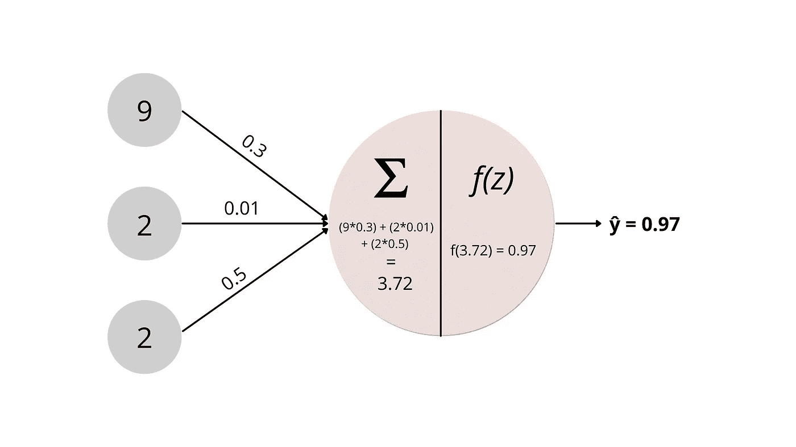
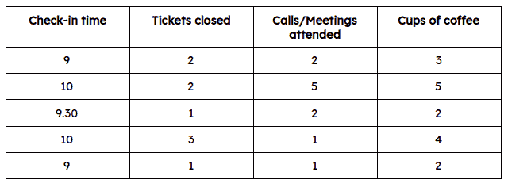
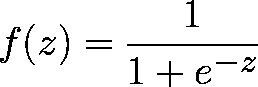
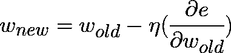
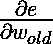

# 专注于这 4 个主题，以更快地学习神经网络

> 原文：<https://medium.com/nerd-for-tech/four-topics-to-learn-neural-networks-faster-a261220d9234?source=collection_archive---------17----------------------->

## 通过专注于神经网络中的这四个关键区域来删除不必要的信息，从而更快地学习深度学习。

如果你在互联网上花了一定的时间试图了解神经网络，你知道有许多资源可供我们使用。有这么多的选择可能会造成瘫痪，可悲的是，我们对此无能为力。相反，我们可以缩小我们的关注范围，让我们的隐喻得到最大的回报。

在你进一步阅读之前，我假设你对编程很熟悉。如果没有，我建议你学习 Python 或者 r，这应该是你的首要任务；它将确保你有一个坚实的基础。此外，请阅读我之前的[帖子](/nerd-for-tech/a-neural-network-is-just-a-glorified-math-equation-a13b3b220abb)，以便更好地理解本文中使用的基本术语。

学习神经网络时需要关注的四个主要方面是:

*   **图书馆**
*   **激活功能**
*   **误差/成本/损失函数**
*   **优化器**

现在，我同意在神经网络中还有其他重要的主题，但这些将为轻松理解任何概念提供一个极好的基础。

# 1.图书馆

我们可以用来开始学习神经网络的两个最流行的库是 Google 的 Tensorflow 和脸书的 PyTorch。这些库让任何一个没什么经验的人都可以轻松上手，做一个神经网络。Keras 是你一定见过的另一个库。它是一个为 Tensorflow 增加了一层抽象的库。所有预先训练的模型都经过高度优化，这使得它们非常适合生产质量的软件。

你不必花几个月的时间学习数学概念来建立一个简单的神经网络。你可以建立模型，在几个小时内解决复杂的问题。如果你好奇的话，你可以理解网络是如何运作的。

# 2.激活功能

隐藏层的激活函数决定了网络模型学习训练数据集的程度。输出图层中使用的激活函数将决定模型可以做出的预测类型。

为了理解激活函数如何适合神经网络，让我们看下面的图，并手动求解该节点的预期输出。

作者图片|神经元的工作

隐藏层中的神经元接收来自前一层中所有神经元的输入。一个神经元有两部分。一个是将接收到的所有加权输入相加，并将其存储在一个变量中，比如 z，另一个是激活函数 *f(z)* 。

根据您的需求，您有多种激活功能可供选择。每个功能都有优点和缺点，最适合特定的情况。不存在“一个激活函数就能统治所有人”的说法。

让我们尝试求解一个感知器的输出，以更好地理解引擎盖下发生的事情——回到我们可靠的示例数据集，即你从同事那里收集的数据集。输入将是 9，2，2。

假设每个边到该节点的权重是 0.3、0.01、0.5。

将输入和权重相乘得到 2.7，0.02，1。

接下来，我们必须将它们相加得到 z = 3.72。

作者图片| Sigmoid 函数

假设在这种情况下，激活函数是 sigmoid 函数。f(3.72) = 0.97。

因此，这个神经元的输出是 0.97。对网络中的所有神经元进行类似的计算，给出一个预测值， *ŷ* 。

# 3.损失或成本函数

到目前为止，我们只生成了一个预测值，还没有发生*学习*。在神经网络的情况下，当权重改变时，学习发生。以确定我们是否需要调整权重以及我们使用多少误差。损失或成本函数用于计算误差。

绝对误差是计算误差最直接的方法，因为它只是实际值和预测结果之间的差异。让我们假设当前例子中的ŷ是 2。在这种情况下，绝对误差为 1，因为实际值为 3。

其他几个损失函数有不同的用例。你可以用最适合你需要的那个。

# 4.乐观主义者

现在我们有了一个错误，我们的网络终于可以在优化器的帮助下学习了。其中一个优化者如下。

作者图片|优化者

乍一看，这个等式可能看起来让人不知所措，但是如果我们把它分解，它是一个相当简单的等式。这意味着，为了计算新的权重，我们必须从学习率η(读作 eta)和相对于旧权重的错误率的乘积中减去旧的权重。

在上面的等式中，我们对重量有一个相当好的概念。但是，什么是学习率呢？

图片作者|微分方程

学习速率本质上是您希望模型学习的速率。所以越高越好。对吗？

不对。

均衡的学习速度对最佳学习至关重要。太小，网络什么也学不到，因为收敛到*最小值*或最低可能损失需要很多时间。太大，它也不会学到任何东西，因为它可能会跳过最小值，因此永远不会收敛。

相对于旧权重的误差变化率稍微复杂一些，需要一些数学来解释，所以我将在下周的文章中讨论这个问题。

# 结论

专注于库、激活函数、损失函数和优化器将为你轻松理解任何其他神经网络相关概念打下良好的基础。我希望这篇文章对你有所帮助。我将在接下来的文章中列出不同的激活函数、成本函数和优化器。请随时将您的反馈发送到我的电子邮件或在下面的评论中。