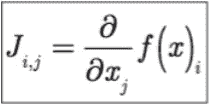
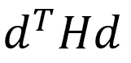
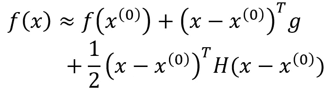
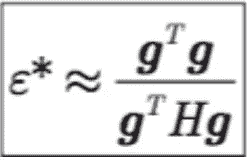

# 傅立叶变换提高了机器学习分类器的性能

> 原文：<https://medium.com/nerd-for-tech/fourier-transforms-improve-the-performance-of-a-machine-learning-classifier-e0f061af1c31?source=collection_archive---------1----------------------->


# 介绍

最近，我参与开发了一个促进学习的数据集。根据我对源自分布的建筑物布局的邻域进行分类的发现，我想强调的是，使用傅立叶变换极大地改进了特征搜索和特征识别过程。我使用的合成数据利用高斯分布和均匀分布来生成每个数据行的维度。

在这个例子中，我使用了一个 LinearSVR 回归器，将所有生成的有界区域的领域知识整合到一个回归器算法中。

我将这些标签转换成符号值，这些符号值来自傅立叶变换。

 [## en scalo/neighborhood-分类/源/ -位桶

### 使用质量流量作为参数对布局和有界区域进行分类。

bitbucket.org](https://bitbucket.org/enscalo/neighborhood-classification/src/master/) 

如果算法的初始实现现成可用，该算法似乎可以提高其训练精度。

使用简单代码产生傅立叶变换，如下所示:

```
**import numpy as np****# classes ranging from 0 to 9****np.fft(np.arange(0,10,1))**
```

使用傅立叶变换的结果有助于从最初分配的标签中得出如何设置标签的结论。在我的例子中，这很简单，因为邻域分类值来源于公式化的值。我的想法是使用窗户、门和通道(开放通道)的尺寸来关联两个独立的度量标准，这两个标准符合我们对邻居的了解。

准确度分数如此显著提高的原因是因为雅可比矩阵。雅可比矩阵衡量一个度量的体积变化程度。G [梯度下降示例](https://en.wikipedia.org/wiki/Gradient_descent)具有成本函数导数，其可以表示为参数形式的雅可比矩阵和函数的乘积。

我的算法将错误率从 2.x%提高到了 1.x%。

# 更多解释

雅可比矩阵表示为:



**雅可比是可微函数的一阶导数**

> 雅可比是要微分的函数的导数，该函数是输入特征的成本函数( **x** )。

> **黑森的特征值**

Hessian 是函数的二阶导数，这意味着 Hessian **H** 的特征向量 vector **d** 被写成沿着 **d** 方向的二阶导数:



**沿特征向量 d 的二阶导数或 Hessian**

因此，采用成本函数的泰勒级数展开，它可以写成:



**代价函数的泰勒级数展开**

***于是我们的学习率就变成了:***



**涉及雅可比和海森的梯度下降学习率**

# 示范

> 在这个例子中，已经仔细选择了类。例如与相反值相关的那些特征被标记为负的和正的，保持幅度相同。在对存在负对应物的一半值进行快速傅立叶变换之后，最终的变换给出了性能改进。

> 很明显，当我们改变我们的回归目标值时，我们确实得到了性能改善，但是这在傅立叶值上是显著的。

# 参考

[](https://uk.mathworks.com/help/images/ref/psf2otf.html) [## psf2otf

### 这个 MATLAB 函数计算点扩展函数(PSF)数组的快速傅立叶变换(FFT ),并创建…

uk.mathworks.com](https://uk.mathworks.com/help/images/ref/psf2otf.html)