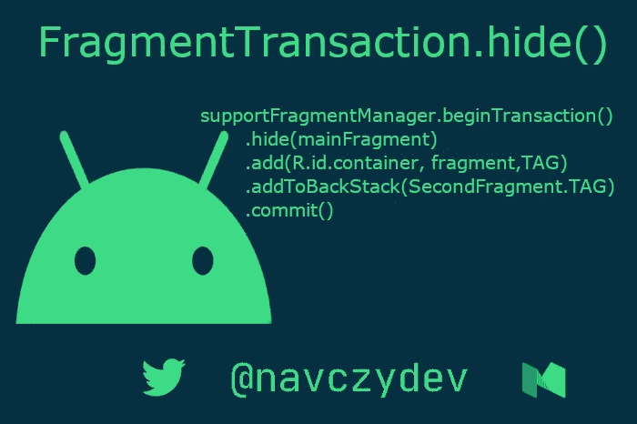
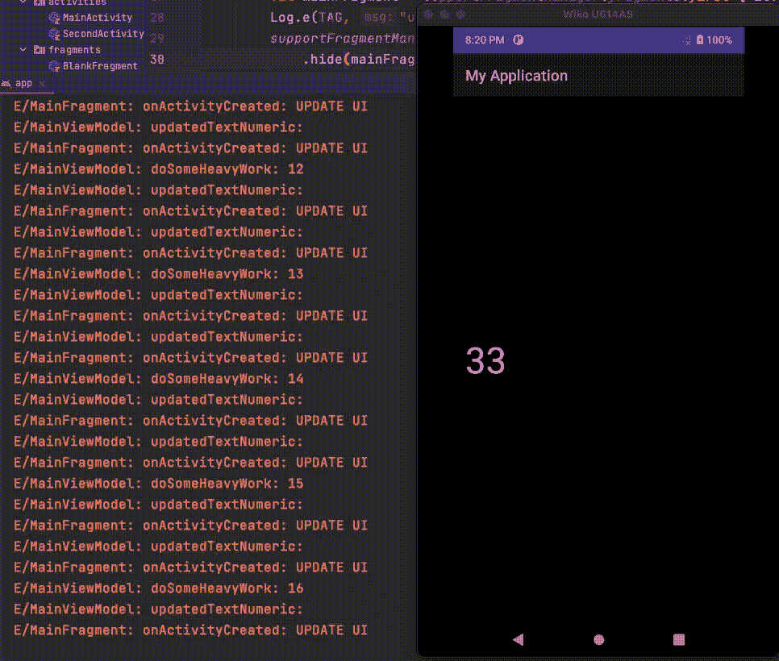
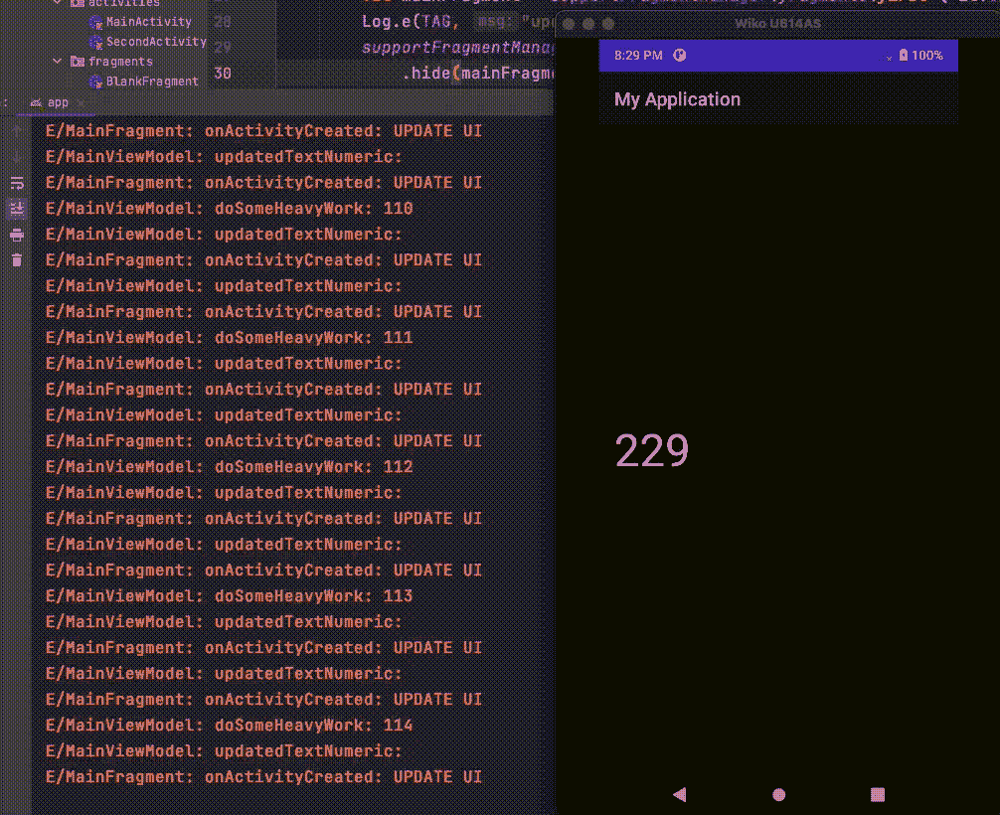
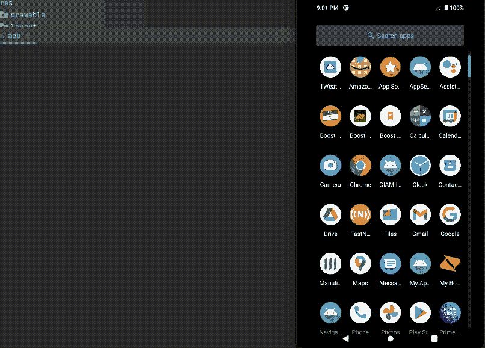

# FragmentTransaction.hide()-结果

> 原文：<https://medium.com/nerd-for-tech/fragmenttransaction-hide-findings-5b998e959c82?source=collection_archive---------1----------------------->

故事标题

今天，我们将了解隐藏碎片比替换碎片的隐藏成本。

最近，我在我的一个示例项目中发现了以下代码的问题，所以我决定与您分享它。

片段事务

# **当我们对任何** `**fragment**` **事务调用** `**hide**` **时会发生什么:**

*   它隐藏了一个现有的片段。
*   这将导致视图被添加到容器中的`fragment`的`view to be hidden`。
*   它在`fragment`触发`onHiddenChanged(hidden: Boolean)`方法

onHiddenChanged 方法

> 它只是隐藏了视图，**片段**仍处于`**RESUMED**` **状态**🤯🤯🤯🤯

# **它如何影响应用程序的性能:**

*   假设您通过从`ViewModel`观察`livedata`来更新`Textview’s text`，那么它将继续向 UI 发送更改，因为`fragment`处于`RESUMED`状态。

基于 livedata 值更新 UI

正如你所看到的,`MainFragment`对用户来说不是`visible`,但是我们没有用`SecondFragment`来代替它，而是调用了`hide on fragment transaction`,它只是隐藏了它的视图。它仍然处于`RESUMED`状态，并继续向 UI 发送更新

*   正如我们所讨论的，因为 fragment 仍然处于`RESUMED`状态，这意味着它为`all the resources`保留了`references`，这导致了内存泄漏/浪费问题。
    **例如:** ViewBinding 保持存活，并保留对其所有视图、资源等的引用。
*   在有 1 或 2 个片段的小应用程序中，它可能不会显示大规模的影响，但想象一下，如果你有一个带`100+ fragments` 的应用程序，而你只有`hide the current fragment and add new fragment on top of it`。最终会因为 `memory or resource consumption`而导致`ANR’s`或者`crashes`。

# popBackStack:

*   从管理器的片段后堆栈中弹出**最后一个片段过渡**
*   从后面的堆栈中弹出顶部状态。
*   它是异步的——它将请求排入 pop 队列，但是直到应用程序返回到它的事件循环时才会执行操作。

popBackStack

*   查看`POP BACK STACK` **按下**时的日志，可以看到它触发了`MainFragment`的`onHiddenChanged`，由**将**的**可见度**设置为`TRUE`

popBackStack 日志

# 重叠内容问题:

在某些时候，如果你想加载全屏片段，那么你可以将它加载到`android.R.id.content`而不是添加到现有的容器中，但是此时在现有的容器中(`R.id.container` ) `RESUMED`片段仍然是可访问的，尽管它被添加到`android.R.id.content`的片段所覆盖。

重叠内容可访问

正如你在日志中看到的`fragment`的`content`是`android.R.id.content`下的`hidden`仍然是`accessible.`

# 解决这一问题的巧妙方法是:

*   你可能会耍花招让`add background color` 到最上面的`fragment’s layout’s parent tag`，这样`underlying content`就会`not be visible`但是任何`random click on UI`都会把你置于一个你意想不到的境地。

## 或者

*   将`parent tag of fragment’s layout`上的`clickListener`设置为加载到`android.R.id.content`中，这样屏幕上的任何点击都不会超出其内容。

parentTag 点击监听器

# 建议解决此问题的解决方案:

*   在将片段加载到`android.R.id.content`之前，清除`backStack`，这样只有`required content` 是`visible`

清除背景

## **或**

*   **隐藏所有以前的片段**，因为`2 different fragments` 在`2 different containers`中处于`RESUMED`状态

因此，无论何时处理多个片段，你都需要小心确保自己没有浪费资源，并且在特定情况下，只有需要的内容可见，而不是不重要或与当前流无关的内容。

> 这完全取决于你**无论什么工作(隐藏/替换)**你去做吧。

# 检查完整的示例代码:

 [## navczydev/FragmentHideReplaceDemo

### 示例应用程序用于与隐藏/替换片段相关的演示目的-navczydev/FragmentHideReplaceDemo

github.com](https://github.com/navczydev/FragmentHideReplaceDemo) 

# 😊😊 👏👏👏👏快乐编码👏👏👏👏 😊😊

# 参考

[https://developer . Android . com/reference/Android/app/fragment transaction # hide(Android . app . fragment)](https://developer.android.com/reference/android/app/FragmentTransaction#hide(android.app.Fragment))

 [## Android 生命周期备忘单——第三部分:片段

### 在本系列中:*第一部分:活动—单个活动生命周期*第二部分:多个活动—导航和返回…

medium.com](/androiddevelopers/the-android-lifecycle-cheat-sheet-part-iii-fragments-afc87d4f37fd) 

# 保持联系

 [## navczydev -概述

### GDG-蒙特娄 Android 开发者组织者。navczydev 有 86 个存储库可用。在 GitHub 上关注他们的代码。

github.com](https://github.com/navczydev)  [## 纳夫·辛格-作家-媒体| LinkedIn

### 在世界上最大的职业社区 LinkedIn 上查看 Nav Singh 的个人资料。Nav 列出了 7 个职位…

www.linkedin.com](https://www.linkedin.com/in/navczydev/)  [## JavaScript 不可用。

### 编辑描述

twitter.com](https://twitter.com/navczydev)