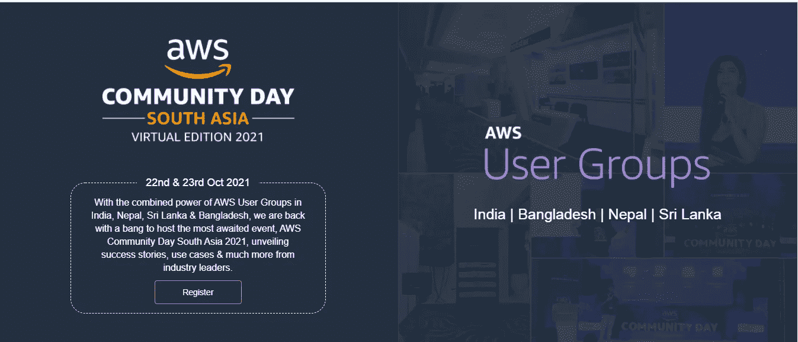
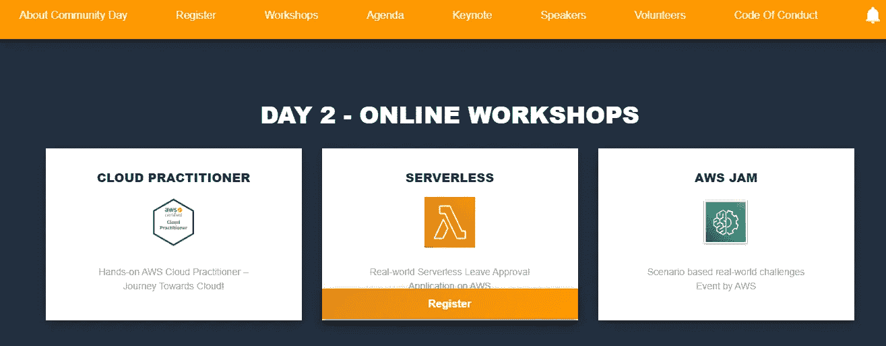
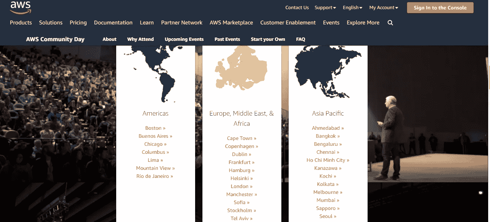

# 针对学生| AWS 活动的免费亚马逊赃物和糖果|

> 原文：<https://medium.com/nerd-for-tech/free-amazon-swags-and-goodies-for-student-aws-events-ef40ea939f26?source=collection_archive---------1----------------------->

## 南亚 AWS 社区日-2021 年虚拟版。

## * * *警告:

**博客未经任何人付费、推广或推广。我只想把这个信息分享给每个人，这样每个人都可以提高他们的技能和知识。**

大家好，亚马逊最近宣布为所有 AWS 极客(印度|孟加拉|尼泊尔|斯里兰卡)提供免费的 **AWS 社区日 2021 南亚虚拟版**。这是一个了解 AWS、提高技能和丰富知识的绝佳机会。

**注****:本次活动为虚拟活动。**

## **就诊费用:**

*   **南亚**地区免**。**
*   **在大多数地区，AWS 社区日是免费提供给与会者的。**

## ****资格:****

*   **对 AWS 感兴趣的学生(有经验和无经验)。**
*   **AWS 员工、与会者、供应商、赞助商、演讲者、志愿者和客人。**

## **会议/研讨会详情:**

*   ****第 1 天:**转到[**链接**](https://communityday.awsug.asia?referred_by=ed8dbfad&referral_mode=workshop-email)向下滚动页面并注册，即可访问 2021 年 10 月 22 日的在线会议。**
*   ****第 2 天:**前往 [**链接**](https://communityday.awsug.asia?referred_by=ed8dbfad&referral_mode=workshop-email) 向下滚动页面并注册，即可访问 2021 年 10 月 23 日**在线研讨会。****

****

## ****关于 AWS 群落天数:****

**AWS 社区日是**社区组织的**云教育活动，由来自世界各地的专家 AWS 用户和行业领导者主持，以技术讨论和实践研讨会为特色。在 AWS 社区日，您将学习以下方面的最佳实践**

1.  **在 AWS 上部署应用程序，**
2.  **优化性能，**
3.  **监控云资源，**
4.  **管理安全，**
5.  **降低成本等等。**

**社区日活动是由社区为社区举办的，这意味着外部社区组织者拥有整个活动。社区学习是通过相互分享知识、交流经验和例子来强化概念的最佳方式之一。**

# **保障利益:**

*   **亚马逊提供了令人惊叹的免费赠品和糖果，所有参与者都可以在社区日参加各种活动并赢得奖品。**
*   ****免费获得亚马逊 AWS 认证的专业证书**。**

## ****为何出席？****

*   **与当地学习专家面对面交流。**
*   **与当地技术专家建立关系。**
*   **所有城市免费或低价注册。**
*   **深入了解最新主题和 AWS 服务。**

## **AWS 社区日有什么值得期待的？**

*   **更新，复兴&重新焕发活力，来证明你对你所做的工作的兴奋**
*   **从 AWS 专家那里了解创新实施的行业趋势和复杂性**
*   **利用 AWS 用户、开发人员、开发人员和解决方案架构师的网络力量**
*   **休息时与 AWS 资深员工和技术人员交流**
*   **坚持不懈地追求学习的新手可以在同一个屋檐下享受 AWS 产品和成功故事。**
*   **将有用和有价值的信息带回企业**
*   **提高知名度，为贵公司赢得更多宣传**
*   **积极参与者有机会赢得 AWS 奖品**

## ****其他:****

**AWS 社区日在世界各地的城市举行。 [**转到附加链接、** **滚动和** **点击您附近的城市**](https://aws.amazon.com/events/community-day/?developer-center-activities-cards.sort-by=item.additionalFields.startDateTime&developer-center-activities-cards.sort-order=asc) 以了解有关该活动的更多信息，并获得该社区中共享的见解。**

****

**欢迎各种技能水平的人来帮助我们实现学习、分享和交流的座右铭。让我们携起手来，让这个技术社区变得更大更好！**

## **更新:**

**我们距离南亚最大的在线 AWS 社区会议只有 4 天时间。您知道吗，除了我们在 10 月 22 日安排的深度技术会议之外，我们在 23 日还有许多动手实践研讨会和 AWS run Jam 比赛。这里是一个什么是排队的预览:**

*   **[AWS JAM](https://communityday.awsug.asia?referred_by=ed8dbfad&referral_mode=workshop-email) :在 4 个小时内，解决这些基于场景的现实世界挑战。Jam 活动由 AWS 设计，旨在挑战所有技术技能水平的个人。你所需要的只是 AWS 服务的基本知识和一个强制的 AWS Jam 帐户。**
*   **[无服务器](https://communityday.awsug.asia?referred_by=ed8dbfad&referral_mode=workshop-email) **:** 在这个 3 小时的“真实世界无服务器请假审批应用”研讨会中，您可以学习构建真实世界的无服务器应用。如果你知道 Node。JS 基础知识，然后创建一个活跃的 AWS 帐户，并开始这样做！**
*   **[云从业者](https://communityday.awsug.asia?referred_by=ed8dbfad&referral_mode=workshop-email):通过基于 AWS 云从业者认证的实践实验室开始您的 AWS 云之旅。该研讨会持续 3 个小时，深入探讨简单存储服务(s 3)、虚拟私有云(VPC)、EC2、弹性负载平衡和自动扩展。**

## **重要链接:**

1.  ****本次活动报名链接**:[https://community day . awsug . Asia？referred _ by = ed8 db fad&referral _ mode = workshop-email](https://communityday.awsug.asia?referred_by=ed8dbfad&referral_mode=workshop-email)**

****结论:**
我希望这篇博客能帮到你，帮你节省时间和金钱，这样你就可以和你爱的人一起度过了。保持微笑，展现爱心！
**引用:****

**[https://communityday.awsug.asia/](https://communityday.awsug.asia?referred_by=ed8dbfad&referral_mode=workshop-email)**

**[https://aws.amazon.com/events/community-day/?开发者中心-活动-卡片. sort-by = item . additional fields . startdatetime&开发者中心-活动-卡片. sort-order=asc](https://aws.amazon.com/events/community-day/?developer-center-activities-cards.sort-by=item.additionalFields.startDateTime&developer-center-activities-cards.sort-order=asc)**

****作者领英:****

** [## 印度马哈拉施特拉邦 ankit Gupta-Pune |职业简介| LinkedIn

### 我是深度学习爱好者/学习者，正在寻找一个可以贡献和提高技能的机会…

www.linkedin.com](https://www.linkedin.com/in/ankit-gupta2/) 

**其他博客:**

 [## 如何在亚马逊注册域名

### 使用 AWS Route53 注册域名。

aws .平原英语. io](https://aws.plainenglish.io/how-to-register-a-domain-name-with-amazon-80a1bf809859)  [## 在亚马逊 S3 存储桶之间迁移数据

### 在同一个账户里。

aws .平原英语. io](https://aws.plainenglish.io/migrate-data-between-amazon-s3-buckets-db9c37d81708)  [## 什么是亚马逊 S3 复制？

### 关于 AWS S3 复制，您需要知道的一切:类型、要求、使用、时间控制

aws .平原英语. io](https://aws.plainenglish.io/what-is-amazon-s3-replication-fbb9c45507b3) 

[https://medium . com/nerd-for-tech/Amazon-launch-re-skill-program-2021-free-Amazon-t-shirts-free-Amazon-courses-88 C4 b95c 9752](/nerd-for-tech/amazon-launched-re-skill-program-2021-free-amazon-t-shirts-free-amazon-courses-88c4b95c9752)

感谢您的阅读，如果您喜欢，请点击“鼓掌”按钮。

**关注我们了解更多内容。**

**查看更多 AWS 相关内容** [书呆子科技](https://medium.com/nerd-for-tech) **。**

*更多内容看* [**书呆子看理工**](https://medium.com/nerd-for-tech) ***。*****