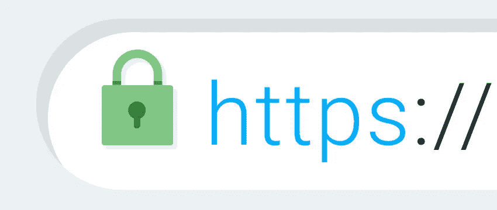
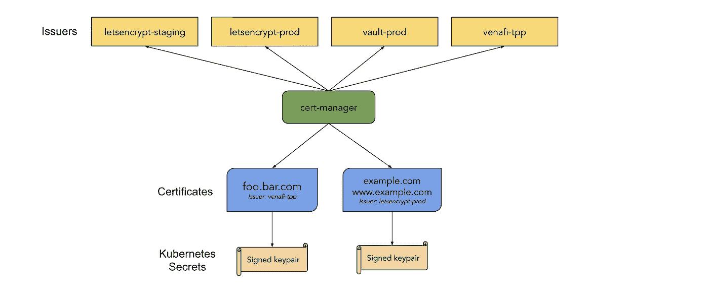
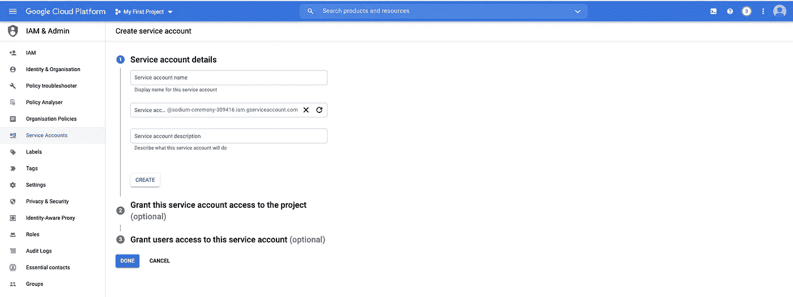
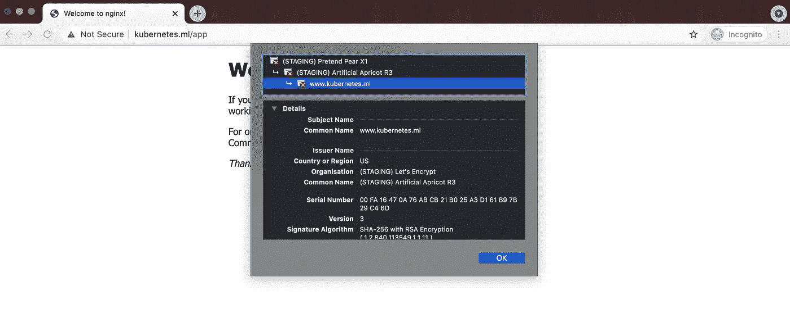
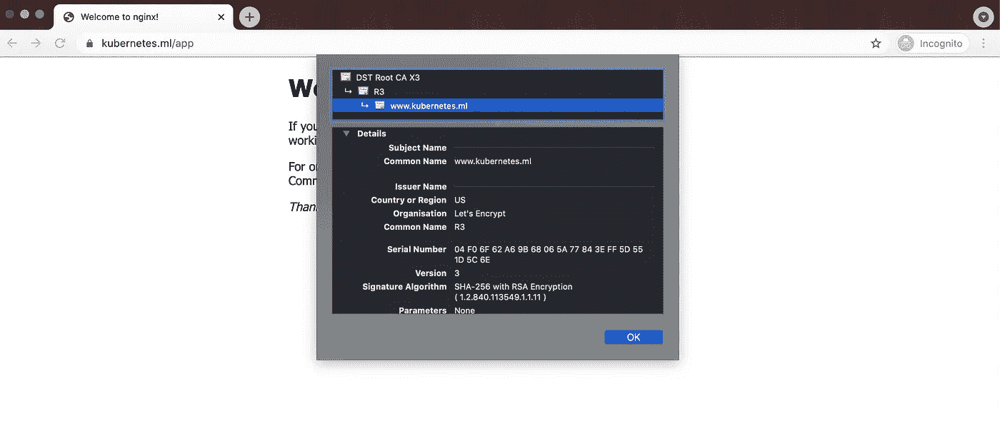

# 使用证书管理器在 Kubernetes 中免费提供自动 SSL 证书

> 原文：<https://medium.com/nerd-for-tech/free-and-automatic-ssl-certificates-in-kubernetes-using-cert-manager-6fb65ac63d5?source=collection_archive---------2----------------------->

使用证书管理器获得免费和自动 SSL 证书，让我们加密

在今天的场景中，SSL 证书是将应用程序部署到互联网的最重要部分。只有最重要的属性才能决定你的网站是否安全。



图片来源:谷歌

这个拨片锁符号向您的客户传达他们正在访问的网站是安全的、受保护的和经过验证的。那么你如何在你的网站上实现 HTTPS 呢？

HTTP + SSL = HTTPS。

获得 SSL 证书并不容易。此外，它也很贵。在当今世界，Kubernetes 无处不在。由于 Kubernetes 中有大量的入口资源，获取如此大量的证书、监控它们并每次轮换它们变得非常困难。这对 DevOps 工程师来说将是一场噩梦。如果我告诉你，有一种工具可以让你免费获得 SSL 证书，并在证书过期时自动轮换它们，那会怎么样？这里来了[证书管理器](https://cert-manager.io/docs/)。Cert-manager 是由 [Jetstack](https://jetstack.io/) 创建的，很多开发仍然由他们赞助。根据证书管理器的官方指南，证书管理器是一个本地的 [Kubernetes](https://kubernetes.io/) 证书管理控制器。它可以帮助从各种来源发布证书，例如 [Let's Encrypt](https://letsencrypt.org/) 、 [HashiCorp Vault](https://www.vaultproject.io/) 、 [Venafi](https://www.venafi.com/) 、简单签名密钥对或自签名。它将确保证书是有效的和最新的，并尝试在到期前的配置时间续订证书。



图片来源:[证书管理器](https://cert-manager.io/docs/)

# 整个故事是关于什么的？(TLDR)

1.  理解证书管理器的概念
2.  了解各种 ACME 挑战(DNS01、HTTP01)
3.  从“让我们加密暂存”中创建一个证书，最后从“让我们加密生产”中获取证书。

# 先决条件

1.  GCP 帐户(创建 GKE 群集和云 DNS 托管区域。您可以获得 300 美元免费积分的免费等级帐户)。
2.  一个领域。(可以从 [freenom](https://my.freenom.com/) 获得一个免费域名)。

# 故事资源

1.  GitHub 链接:[https://github.com/pavan-kumar-99/medium-manifests](https://github.com/pavan-kumar-99/medium-manifests)
2.  GitHub 分支:证书管理器。

# 创建 GKE 集群

在本文的范围内，我们将使用 gcloud CLI 来创建集群。我们可以使用 [Github actions](https://pavan1999-kumar.medium.com/creating-a-gke-cluster-with-github-actions-dd34e2de50a6) 自动化创建 GKE 集群的过程。你可以参考我的[文章](https://pavan1999-kumar.medium.com/creating-a-gke-cluster-with-github-actions-dd34e2de50a6)关于如何使用 GitHub 动作创建 GKE 集群。你也可以克隆我的 [GitHub 库](https://github.com/pavan-kumar-99/medium-github-actions/tree/master/gke_tf)来应用它。

```
gcloud auth login **#Create a GKE Cluster**gcloud container clusters create "production-cluster" \
 --num-nodes 3 \
 --scopes   "https://www.googleapis.com/auth/ndev.clouddns.readwrite" \
--zone us-central1-a \
--node-locations us-central1-a,us-central1-b \ 
--project **<project_name>****#Connect to the GKE Cluster**gcloud container clusters get-credentials production-cluster --zone us-central1-a --project **<project_name>**
```

# 创建谷歌云域名系统和云域

您可以按照此处的步骤注册一个新域，或者将现有域导入 GCP，然后创建一个受管理的公共区域。或者，你可以使用 [freenom](https://www.freenom.com/en/index.html?lang=en) 为自己获得一个免费域名，并在你的 GCP 账户中创建一个公共区域。

[](https://cloud.google.com/dns/docs/quickstart) [## 快速入门|云 DNS |谷歌云

### 发送反馈本页解释了如何为您的域名设置云 DNS 管理区域和资源记录。它…

cloud.google.com](https://cloud.google.com/dns/docs/quickstart) 

## 安装证书管理器舵图

让我们知道在我们的集群上安装证书管理器的舵图。

```
$ helm repo add jetstack [https://charts.jetstack.io](https://charts.jetstack.io)$ helm repo add jetstack [https://charts.jetstack.io](https://charts.jetstack.io)$ helm install \
  cert-manager jetstack/cert-manager \
  --namespace cert-manager \
  --version v1.2.0 \
  --create-namespace \
  *--set installCRDs=true*
```

您应该看到在证书管理器的名称空间中安装了以下组件

```
$ k get po -n cert-managerNAME                                      READY   STATUS    RESTARTS   AGEcert-manager-7c6df46cf4-k9xnt             1/1     Running   0          39scert-manager-cainjector-794f5cd9d-ppkmv   1/1     Running   0          39scert-manager-webhook-7f97b786f5-7ltnn     1/1     Running   0          39s
```

还有接下来的 CRD 的

```
$ k get crd | grep cert-manager | cut -d " " -f1certificaterequests.cert-manager.iocertificates.cert-manager.iochallenges.acme.cert-manager.ioclusterissuers.cert-manager.ioissuers.cert-manager.ioorders.acme.cert-manager.io
```

## 安装入口控制器舵图

我们将使用 helm 图表在集群中安装入口控制器。但是，您可以参照 [**本**](https://kubernetes.github.io/ingress-nginx/deploy/#using-helm) 使用其他方法进行安装。

```
$ helm repo add ingress-nginx https://kubernetes.github.io/ingress-nginx $ helm repo update $ helm install ingress-nginx ingress-nginx/ingress-nginx
```

让我们创建一个包含部署、服务(类型:ClusterIP)和入口(类型:ingress)的示例 Nginx 应用程序。

```
$ ip=$(k get ing certmanagerapp-ingress -o jsonpath='{.status.loadBalancer.ingress[0].ip}')$ echo | openssl s_client -connect $ip:443 2>/dev/null | openssl x509 -noout -issuerissuer=O = Acme Co, CN = Kubernetes Ingress Controller Fake Certificate
```

由此可以清楚地看出，该证书不是一个有效的证书，但它是入口控制器默认提供的证书。

## 使用证书管理器创建证书

Cert Manager 支持从 ACME 服务器请求证书(自动证书管理环境)。这种 ACME 服务器的一个例子是 Let's Encrypt。大多数电脑都信任由“让我们加密”颁发的证书。要从 Let's Encrypt 获得此证书，必须解决一个 ACME 挑战。这证明了客户端拥有他实际请求证书的 DNS 主机。ACME 协议支持各种机制。

1.  HTTP01
2.  DNS01(在本文中有解释)。

与 DNS01 机制相比，HTTP01 机制相对更容易。但是 DNS01 机制比 HTTP01 安全。

在 **DNS01** 挑战赛中，当证书管理器可以在您的托管区域中成功创建 TXT 记录时，您的域的所有权就得到证明。

在 **HTTP01** 中，当证书管理器能够成功地确保一个文件存在于给定路径下的域中时，你的域的所有权被证明。

让我们加密 2 个 ACME 服务器 URL

1.  分期:`[https://acme-staging-v02.api.letsencrypt.org/directory](https://acme-staging-v02.api.letsencrypt.org/directory)`
2.  产量:`[https://acme-v02.api.letsencrypt.org/directory](https://acme-v02.api.letsencrypt.org/directory)`

在生产服务器上有一些受限的速率限制(例如:**每个注册域的证书** - >每周 50 个等等)。因此，总是建议对暂存 URL 执行任何类型的测试，然后进入生产环境。

好了，说够了。让我们现在行动起来。

现在让我们为我们的证书管理器创建一个秘密，以便它可以访问我们的 clouddns 进行 **DNS01** 挑战。



Google 服务帐户

您可以从 GCP 控制台创建一个服务帐户，并创建一个具有所需权限的 JSON 密钥。下载密钥后，让我们通过以下方式在 cert-manager 名称空间中创建秘密

```
$ kubectl create secret generic clouddns --from-file="./clouddns.json" -n cert-manager 
```

现在，让我们使用临时 ACME 服务器创建一个集群发布者，以验证我们的 DNS01 质询是否按预期工作

```
$ git clone [https://github.com/pavan-kumar-99/medium-manifests.git](https://github.com/pavan-kumar-99/medium-manifests.git) \
-b cert-manager $ kubectl apply -f cert-manager-staging.yaml
```

现在让我们仔细观察清单。

1.  集群颁发者:颁发者代表一个证书颁发机构，从该机构获取证书。发布者是一个命名空间对象，而集群发布者是一个非命名空间对象。在 spec.acme 部分下面，我们给 acme 服务器提供我们之前创建的临时 URL 和 GCP 秘密，以及作为我们网站名称的 dns 名称。
2.  证书:这是实际的证书资源。因此，这里我们要求证书管理器创建一个名为 bettercallpavan 的 TLS 秘密(使用获得的证书)。这里的群集发布者是让我们加密 staging 以及我们网站的 dns 名称。
3.  入口的 TLS 机密名称与证书资源中提到的名称相同。

现在让我们访问我们的网站来检查证书。



哎，我们的证书现在已经从假的入口控制器证书变成了让我们加密暂存证书。我们现在准备将这一更改推广到生产环境，让我们加密 ACME 服务器。

```
$ git clone [https://github.com/pavan-kumar-99/medium-manifests.git](https://github.com/pavan-kumar-99/medium-manifests.git) \
-b cert-manager$ kubectl apply -f cert-manager-production.yaml
```

现在让我们仔细观察清单。

1.  集群颁发者:颁发者代表一个证书颁发机构，从该机构获取证书。发布者是一个命名空间对象，而集群发布者是一个非命名空间对象。在 spec.acme 部分，我们给出了 ACME server be 生产 URL 和我们之前创建的 GCP 秘密，以及作为我们网站名称的 dns 名称。
2.  证书:这是实际的证书资源。因此，这里我们要求证书管理器创建一个名为 bettercallpavan-production 的 TLS 秘密(使用获得的证书)。这里的群集发布者是让我们加密生产以及我们网站的 dns 名称。
3.  入口的 TLS 机密名称与证书资源中提到的名称相同。

现在让我们访问我们的网站来检查证书。



啊呀，我们的网站现在安全了。所有证书的默认持续时间为 90 天，默认续订窗口为 30 天。这意味着证书的有效期为 3 个月，到期后 1 个月内将尝试续订。

**清理**

```
$ git clone [https://github.com/pavan-kumar-99/medium-manifests.git](https://github.com/pavan-kumar-99/medium-manifests.git) \
-b cert-manager$ cd medium-manifests $ kubectl delete -f ./* $ kubectl delete secret clouddns -n cert-manager 
```

# 结论

1.  Cert-Manager 可用于获取有效期为 90 天的免费 SSL 证书。
2.  这些证书可以在到期后一个月内自动尝试更新。
3.  这些证书也可以从 HashiCorp Vault PKI 后端获得(将在我以后的文章中发布)。

感谢阅读我的文章。希望你喜欢它。以下是我的一些其他文章，你可能会感兴趣。

直到下次……..

# 被推荐的

[](https://www.techmanyu.com/creating-self-hosted-github-runners-in-a-kubernetes-cluster-fd05560de34a) [## 在 Kubernetes 集群中创建自托管 GitHub 运行程序

### 在您自己的 Kubernetes 集群上运行 GitHub 操作

www.techmanyu.com](https://www.techmanyu.com/creating-self-hosted-github-runners-in-a-kubernetes-cluster-fd05560de34a) [](/nerd-for-tech/autoscaling-in-kubernetes-hpa-vpa-ab61a2177950) [## Kubernetes 中的自动缩放(HPA / VPA)

### 使用垂直 Pod 自动缩放器(VPA)和水平 Pod 自动缩放器(HPA)在 Kubernetes 中自动缩放您的应用程序

medium.com](/nerd-for-tech/autoscaling-in-kubernetes-hpa-vpa-ab61a2177950) [](https://faun.pub/introduction-to-bitnami-sealed-secrets-bb5ae74d9a25) [## 比特纳米密封秘密介绍

### 如何使用 Sealed Secrets 和 Kubese 在 GitHub 中存储您的秘密

faun.pub](https://faun.pub/introduction-to-bitnami-sealed-secrets-bb5ae74d9a25) [](/nerd-for-tech/introduction-to-crossplane-2f873ae0f9f3) [## 交叉平面简介

### 如何使用 Kubernetes 清单和 Crossplane 在云上创建任何资源。

medium.com](/nerd-for-tech/introduction-to-crossplane-2f873ae0f9f3)