# 免费培训、课程和证书——谷歌云技能提升。

> 原文：<https://medium.com/nerd-for-tech/free-training-course-and-certificates-google-cloud-skill-boost-6ee61548f915?source=collection_archive---------1----------------------->

## 谷歌将免费为 4000 万新生提供云计算培训。

图片来源:[安基特·古普塔](/@ankitgupta_974)

# * * *警报:

**这不是任何人付费或推广或推广的博客。我只是想把这些信息分享给大家，这样每个人都可以在谷歌云技能提升平台(由 Qwiklabs 提供支持)上提高自己的技能。**

嗨，极客们，在这个博客中，我与你们分享免费谷歌云认证的信息，并亲自操作谷歌云平台。你必须关注这个博客。

# 什么是谷歌云技能提升？

在全球范围内，多个行业的组织都在进行业务的数字化转型。对许多人来说，新冠肺炎疫情只是加速了事情的发展。这些数字化转型已经影响到我们的工作和生活方式:

*   从实现更可持续的，
*   碳中性增长，
*   创造由人工智能塑造的新商业模式，
*   让全球范围的虚拟协作达到前所未有的水平。

谷歌宣布为超过 4000 万人配备谷歌云技能，疫情加速了面临技能短缺的多个行业组织的数字化转型。

谷歌最近宣布推出谷歌云技能提升(Google Cloud Skills Boost)，这是一个由谷歌云直接管理和交付的在线学习、技能发展和认证平台。谷歌表示，云技能提升将使学习和职业发展达到前所未有的规模。

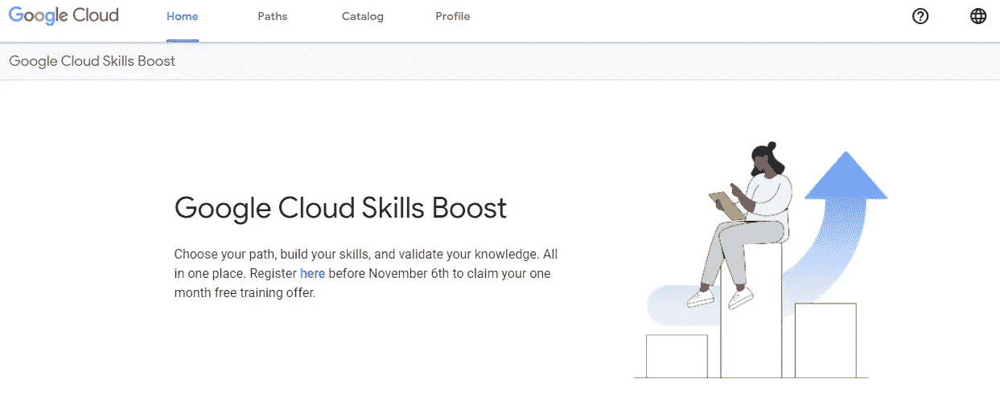

图片来源:[安基特·古普塔](/@ankitgupta_974)

## **你为什么要入学-**

Google Cloud Skills Boost 计划将提供对**700 多个实践实验室、基于角色的课程、技能徽章和认证资源的访问，**包括 16 条新的学习路径，所有这些都可以在全球范围内按需提供。

选择你的道路，培养你的技能，验证你的知识。都在一个地方。在 11 月 6 日之前在此[注册](https://inthecloud.withgoogle.com/free-training-21/register.html?utm_source=skillsboost&utm_medium=et&utm_campaign=FY21-Q4-global-NA1483-website-of-gc_free_training_october_campaign&utm_content=skillsboost)，申领您一个月的免费培训优惠。

# 主要亮点

1.  从合作伙伴平台提供的所有课程中学习，**包括 Coursera，**全球最大的学习社区之一。
2.  获得**技能徽章**。
3.  参与**动手挑战的机会**，
4.  一项新的免费在线学习活动，**将于 12 月 8 日、9 日以及后续活动中推出。**您可以在这里 注册**活动** [**，预订您的席位**。**。**](https://cloudonair.withgoogle.com/events/learn21?utm_source=google&utm_medium=blog&utm_campaign=FY21-Q4-global-NA1399-onlineevent-er-seekho&utm_content=blog)
5.  提供**三个基于角色的课程**供选择，涵盖从**谷歌云基础知识**到更为**密集的谷歌云认证准备的所有内容。**
6.  获得对**额外学习资源的访问权。**

## **重要日期:**

*   你在 11 月 6 日之前注册谷歌云技能提升，你将免费获得第一个月的内容。
*   12 月 8 日和 9 日，谷歌将举办 Cloud Learn，这是一个新的免费在线学习活动，面向所有职业水平的开发人员、IT 专业人员和数据从业人员。

# 谁应该出席/参与？

所有 T21 的科技爱好者、学生、商人和任何人都可以参加。如果你有科技创新的天赋，这可能是你的机会。浏览**学习视频**并接受**挑战，**并有机会**赢得徽章、点数和证书。**

# 如何入学？

1.  点击此链接访问网站— [**谷歌云技能提升**](https://inthecloud.withgoogle.com/free-training-21/register.html?utm_source=skillsboost&utm_medium=et&utm_campaign=FY21-Q4-global-NA1483-website-of-gc_free_training_october_campaign&utm_content=skillsboost) **。像这样打开一页。**

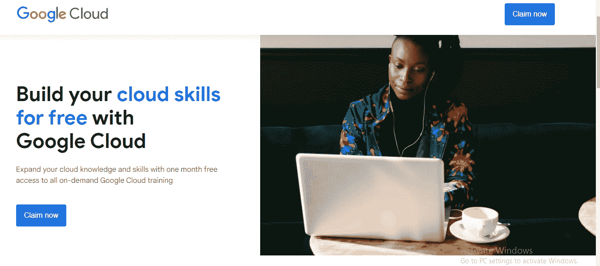

图片来源:[安基特·古普塔](/@ankitgupta_974)

2.**填写所需的电子邮件、手机号码和其他信息，申领**您的免费培训。

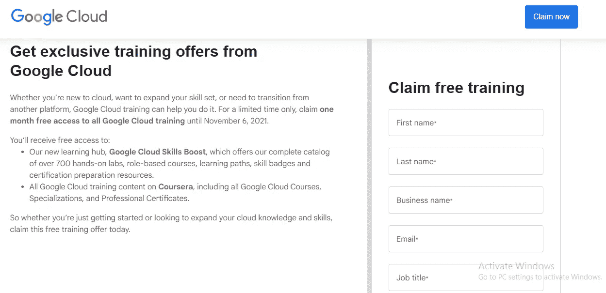

图片来源:[安基特·古普塔](/@ankitgupta_974)

3.填写所有详细信息后，点击提交按钮。

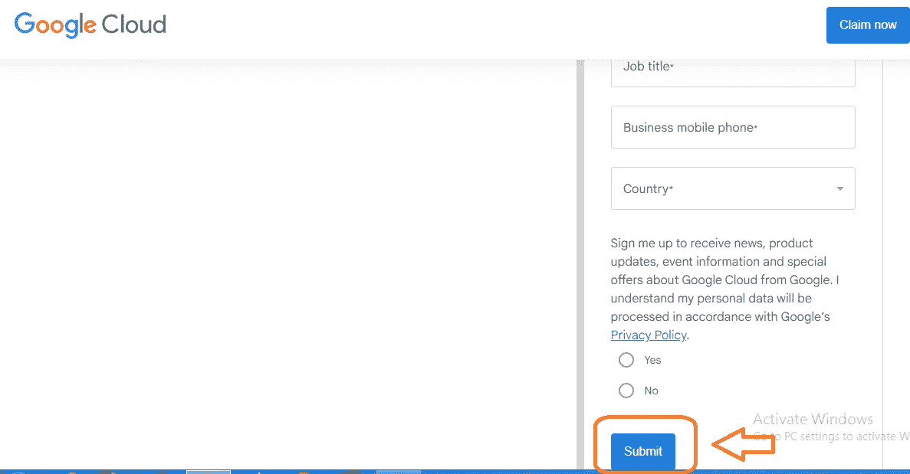

图片来源:[安基特·古普塔](/@ankitgupta_974)

4.通过 Google cloud 在注册的电子邮件帐户上接收邮件。

图片来源:[安基特·古普塔](/@ankitgupta_974)

5.在邮件中你获得**唯一访问码，**复制代码并点击**开始学习**。

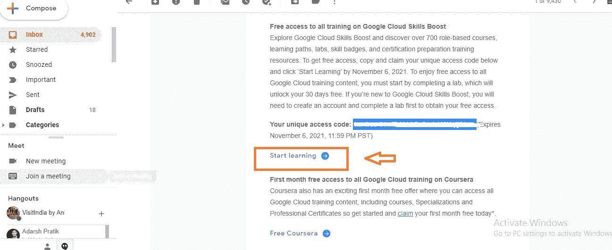

图片来源:[安基特·古普塔](/@ankitgupta_974)

6.一个新的标签被打开，粘贴你的代码并点击**提交**按钮。

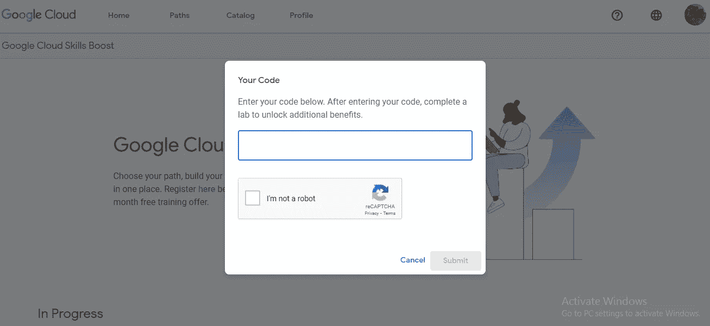

图片来源:[安基特·古普塔](/@ankitgupta_974)

7.您已经准备好参与，并点击登录或使用谷歌帐户登录。

**谷歌云平台的一些预告或细节:**

在谷歌云平台中有四个选项:

1.  **主页** —您可以了解已注册课程的进度，并找到下面的一些特色学习路径，或者在路径页面上浏览它们。学习路径是课程、任务和实验室的集合，旨在提升您在特定领域的云技能。

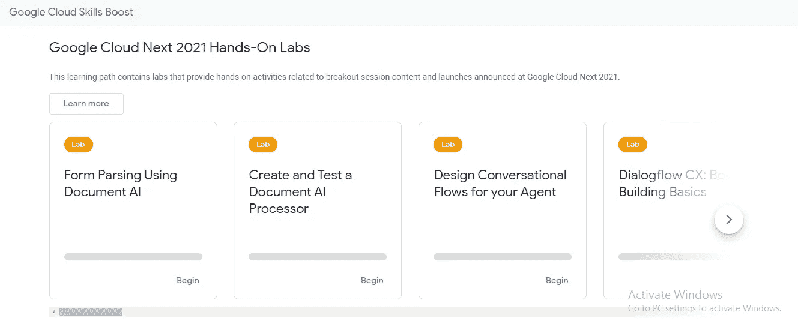

图片来源:[安基特·古普塔](/@ankitgupta_974)

2.**路径:**在此部分，您可以按标题搜索学习路径。点击其中一个学习路径并**订阅该路径**，然后您将获得不同类型的模块或学习**活动**。

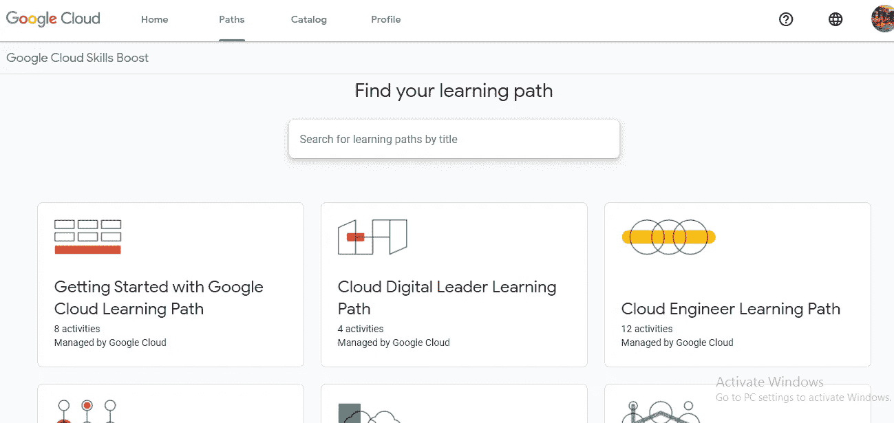

图片来源:[安基特·古普塔](/@ankitgupta_974)

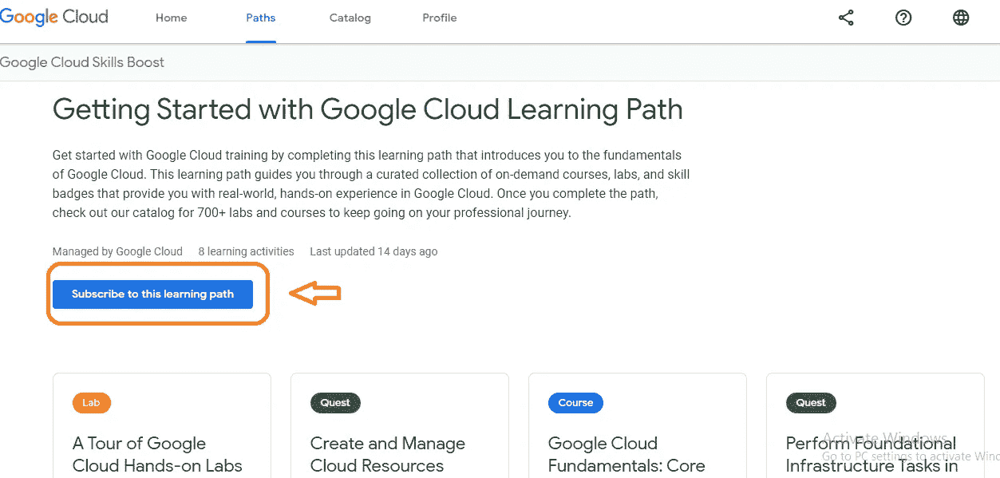

图片来源:[安基特·古普塔](/@ankitgupta_974)

点击**开始。**

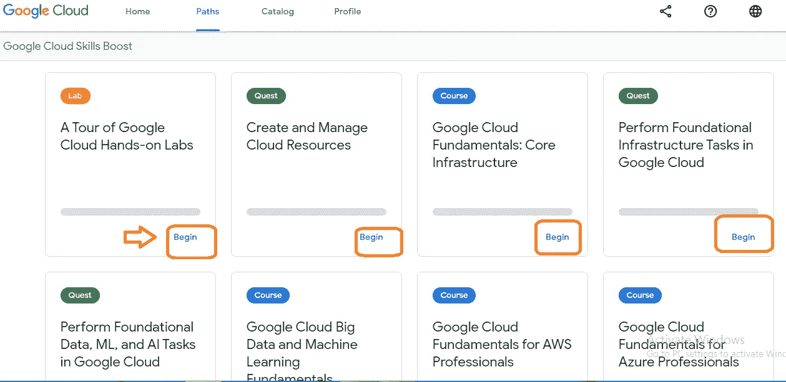

图片来源:[安基特·古普塔](/@ankitgupta_974)

在这里，您可以从课程、动手实验和 Quest 中学习。

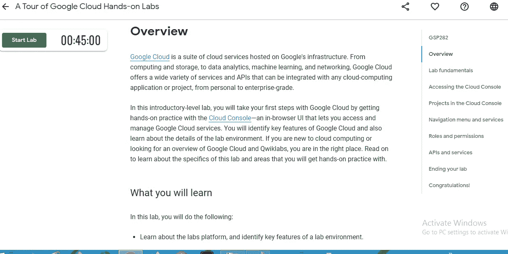

图片来源:[安基特·古普塔](/@ankitgupta_974)

3.**目录:**谷歌云为你设计了全面的目录。该目录包含多种活动形式供您选择。您可以选择小型的个人实验、由一系列实验组成的简短任务，或者由视频、文档、实验和测验组成的多模块课程。通过使用 Google Cloud 完成、定义、跟踪和衡量您的成功，赢取徽章！。

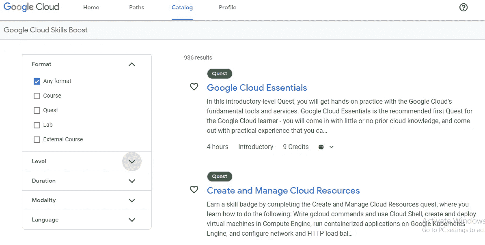

图片来源:[安基特·古普塔](/@ankitgupta_974)

完成一个任务后，你将获得一枚完成徽章。一些任务通过最终评估挑战实验室测试你应用知识的能力。对于这些任务，你将获得一个技能徽章。徽章可以在您的个人资料中查看，并与您的社交网络共享。

4.**个人资料:**在个人资料中，您可以查看/跟踪您的学习路径、活动和徽章。

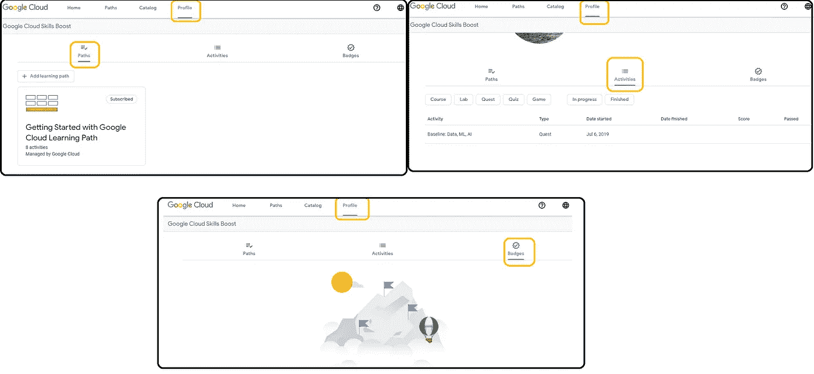

图片来源:[安基特·古普塔](/@ankitgupta_974)

## **重要链接:**

> 1.**Google 云技能平台报名链接**:[https://inthecloud . with Google . com/free-training-21/register . html？UTM _ source = skills boot&UTM _ medium = et&UTM _ campaign = FY21-Q4-global-na 1483-website-of-GC _ free _ training _ October _ campaign&UTM _ content = skills boot](https://inthecloud.withgoogle.com/free-training-21/register.html?utm_source=skillsboost&utm_medium=et&utm_campaign=FY21-Q4-global-NA1483-website-of-gc_free_training_october_campaign&utm_content=skillsboost)
> 
> 2.活动报名链接:[https://cloudonair.withgoogle.com/events/learn21?**UTM _ source = Google&UTM _ medium = blog&UTM _ campaign = FY21-Q4-global-na 1399-online event-er-seek ho&UTM _ content = blog**](https://cloudonair.withgoogle.com/events/learn21?utm_source=google&utm_medium=blog&utm_campaign=FY21-Q4-global-NA1399-onlineevent-er-seekho&utm_content=blog)

**结语:**
希望这篇博客对你有所帮助，为你节省时间和金钱，让你可以和你爱的人一起度过。保持微笑，展现爱心！

**参考文献:**

 [## 谷歌云技能提升

### Qwiklabs 提供真正的谷歌云环境，帮助开发人员和 IT 专业人员学习云平台和…

www.cloudskillsboost.google](https://www.cloudskillsboost.google/) 

**作者领英:**

 [## 印度马哈拉施特拉邦 ankit Gupta-Pune |职业简介| LinkedIn

### 我是深度学习爱好者/学习者，正在寻找一个可以贡献和提高我技能的机会…

www.linkedin.com](https://www.linkedin.com/in/ankit-gupta2/) 

**其他博客:**

 [## 亚马逊推出 Re:Skill Program 2021 |免费亚马逊 t 恤|免费亚马逊课程

### AWS re:技能——赚取奖励。

medium.com](/nerd-for-tech/amazon-launched-re-skill-program-2021-free-amazon-t-shirts-free-amazon-courses-88c4b95c9752)  [## 在亚马逊 S3 存储桶之间迁移数据

### 在同一个账户里。

aws .平原英语. io](https://aws.plainenglish.io/migrate-data-between-amazon-s3-buckets-db9c37d81708)  [## 如何在亚马逊注册域名

### 使用 AWS Route53 注册域名。

aws .平原英语. io](https://aws.plainenglish.io/how-to-register-a-domain-name-with-amazon-80a1bf809859)  [## Ankit Gupta 是一名技术作家，他喜欢写关于 Python、ML 和云计算的文章..

### 嘿👋我刚刚在这里创建了一个页面。你现在可以给我买杯咖啡了！给我买一杯咖啡，给我发一个你会…

www.buymeacoffee.com](https://www.buymeacoffee.com/AnkitGupta1) 

**感谢您的阅读，如果您喜欢请点击拍手按钮。**

**关注我们了解更多内容。**

**查看更多 AWS 相关内容** [书呆子科技](https://medium.com/nerd-for-tech) **。**

*更多内容看* [书呆子看理工](https://medium.com/nerd-for-tech) ***。***