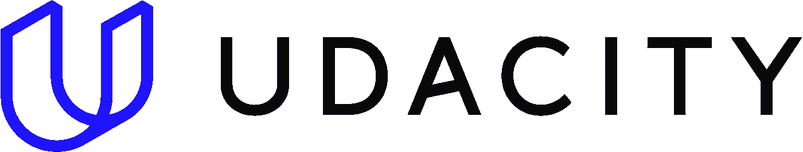

# 【免费 Udacity 课程】谷歌的云数字领导者

> 原文：<https://medium.com/nerd-for-tech/free-udacity-course-googles-cloud-digital-leader-58794263c9e0?source=collection_archive---------1----------------------->

谷歌的云数字领袖免费课程。为您的组织了解云计算

[参观课程→](https://imp.i115008.net/b3KL1P)

云不仅仅是技术专家的专利。现在，每个业务专业人员都可以了解云计算，甚至指导他们的组织走向数字化转型。

为了支持您获得云知识，Google Cloud 和 Udacity 合作为您提供免费的云数字领导者培训。本课程旨在提高与技术谷歌云从业者一起工作的个人和团队的技能，以便他们能够为与云相关的战略业务决策做出贡献。

**本课程为您参加云计算数字领导者认证**做准备。

完成 2022 年 apr‍il 2‍9-ju‍ne 3‍0 课程的学生将获得谷歌云数字领袖认证的 **50%折扣券(价值 50 美元)。**

从今天开始学习，开始你职业生涯的下一步！

**什么是云数字领袖认证？**

为了支持您获取云知识，Google Cloud 推出了云数字领导者认证。这一基础认证旨在提高与技术谷歌云从业者合作的个人和团队的技能，以便他们能够为与云相关的战略业务决策做出贡献。

我们期待着支持您的旅程

快乐学习

披露:这篇文章包含附属链接，意思是当你点击链接并购买，收到佣金。