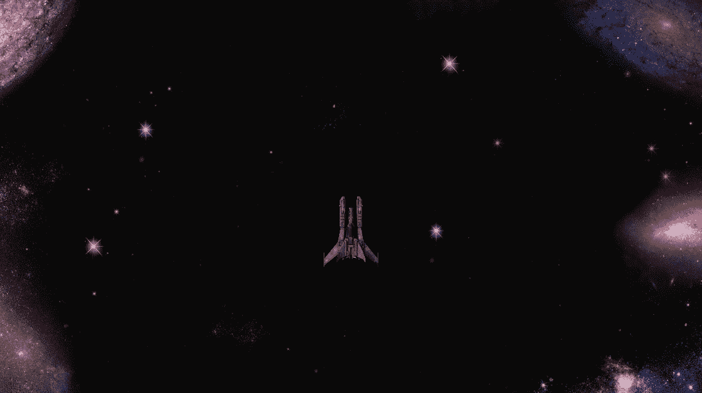
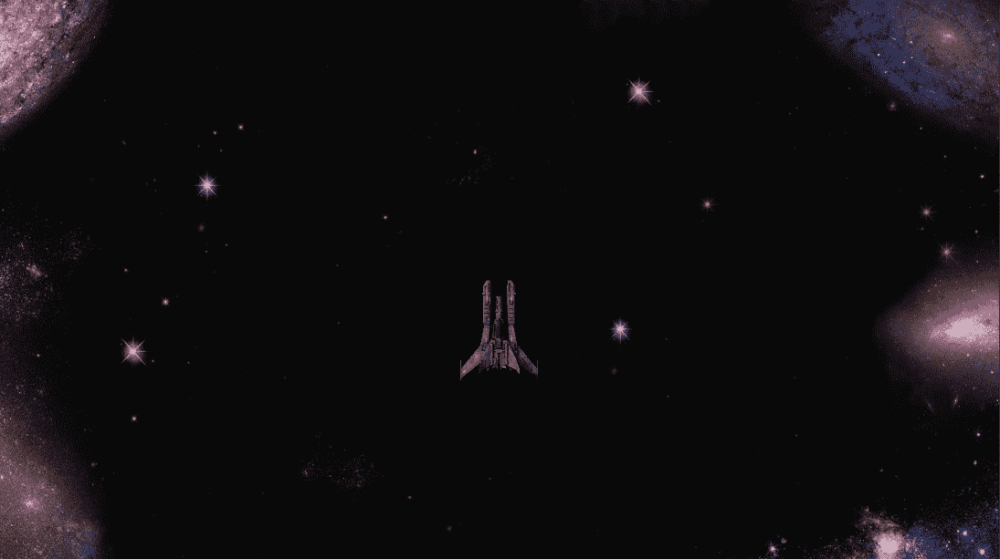
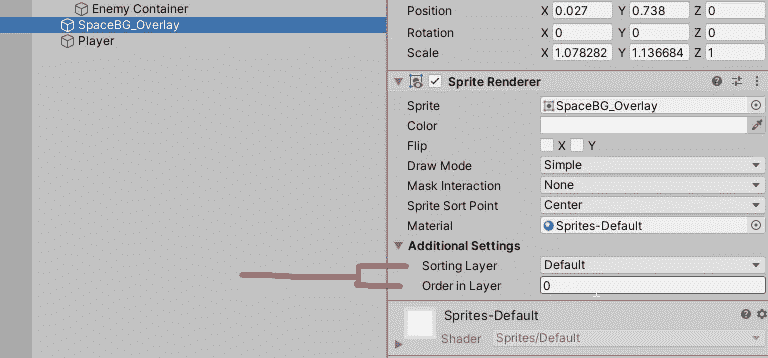
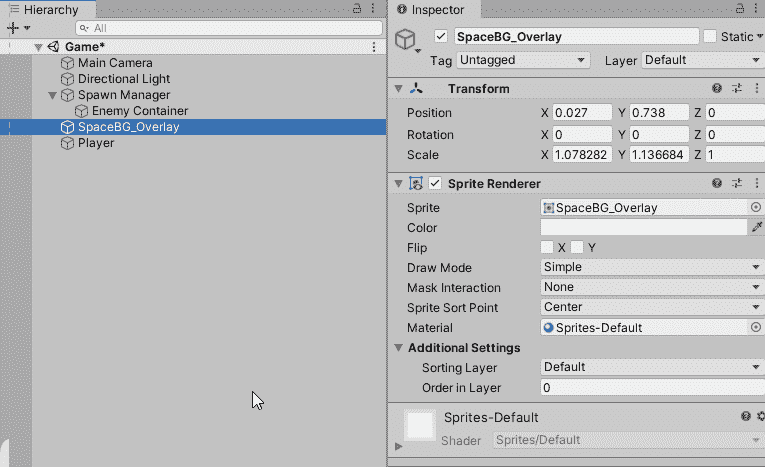
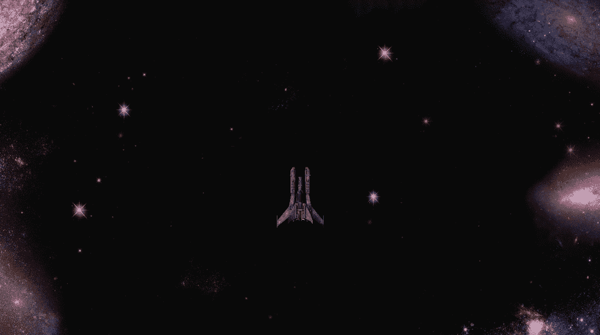
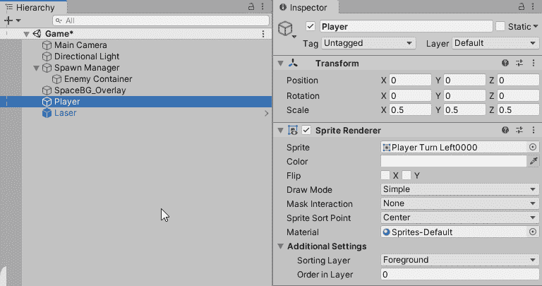
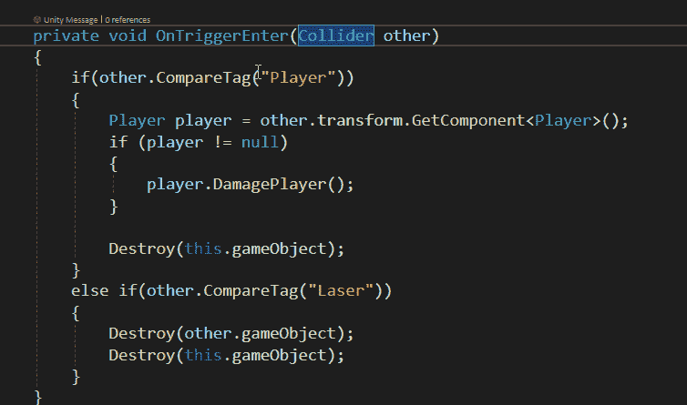

# 从 3D 原型到 2D 资产，第三部分——讨厌的 bug

> 原文：<https://medium.com/nerd-for-tech/from-3d-prototype-to-2d-assets-part-3-pesky-bugs-c625ff063229?source=collection_archive---------28----------------------->

没有对你的理智的小小挑战的生活是什么样的？

**虫子**会那样对你。

在这一节中，我们将清除所有的小错误，让我们的游戏看起来和反应起来都非常精彩！

我们注定的结局！

这里是我们停止的地方:

充满 Bug 的转换。

到目前为止，我发现了 3 个问题。

*   我们的**玩家**和其他**小精灵**在后台后面**。**
*   我们的**激光**正在**穿过**我们的**敌人**
*   而我们的**玩家**正在穿越**敌人**。

# 修复背景后面的精灵

这很容易被忽视，尤其是如果你不熟悉 2D 的工作流程。2D 精灵是在**排序层**上**书写/渲染**的，它们的**顺序**在那层。

就像蛋糕的各层一样，糖衣是在实际蛋糕之前看到的——首先看到的是**更高的层**，而**更高的数字顺序**是该层中首先看到的。

排序层和有序层。

为了解决这个问题，我们将**创建** 2 个排序层；a **背景**和**前景**:

确保背景是最顶层——这是场景中最远的一层。

现在一切都浮在背景之上！但是没有东西相互作用:(

多层万岁！

# 修复玩家、激光和敌人的碰撞

当一个物体正穿过另一个物体时，这通常是一个**错误碰撞检测**的指示。对我们来说，情况就是这样——我们的代码需要为 2D 做**修改**！

不过首先，我们将**再次检查**我们的**标签**是否仍然完好无损，因为它们对于我们的**碰撞检测方法**来说是**必不可少的**:

修复我们的标签。我为敌人创造了一个。

接下来我们将跳转到我们的**敌人代码**。

**以前的**，在我们的**碰撞检测**中，我们使用**来控制**输入。但现在这是不正确的。我们正在使用一个 **2D 触发器**，所以我们必须修改我们的代码，使之类似于 **OnTriggerEnter2D** 和 **Collider2D** :

修复代码。

如果一切顺利，我们现在又有一个工作游戏了！现在我们可以继续在 2d 领域实现特性了！

我们的虫子在阿尔伯克基左转了！

接下来我们将致力于创造一些**能量**来让游戏更有趣一点！