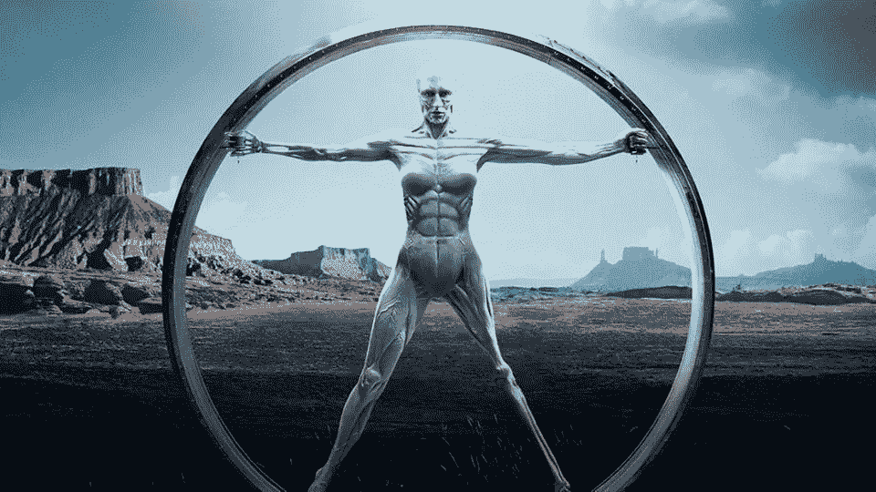
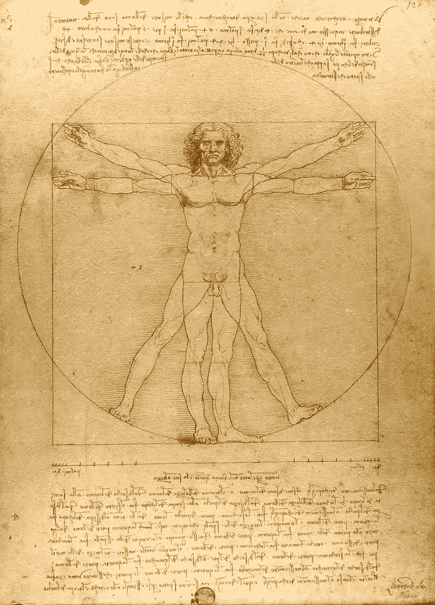
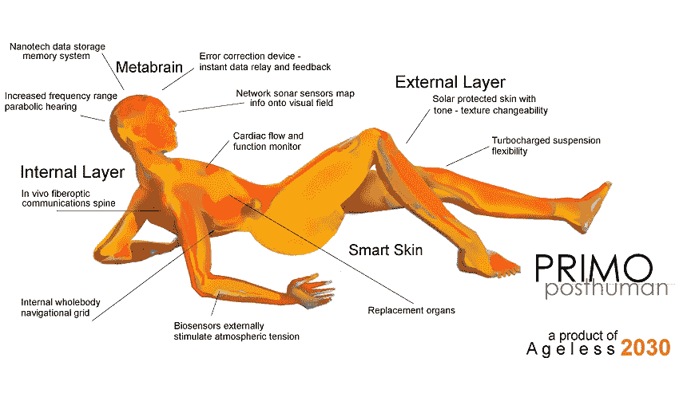
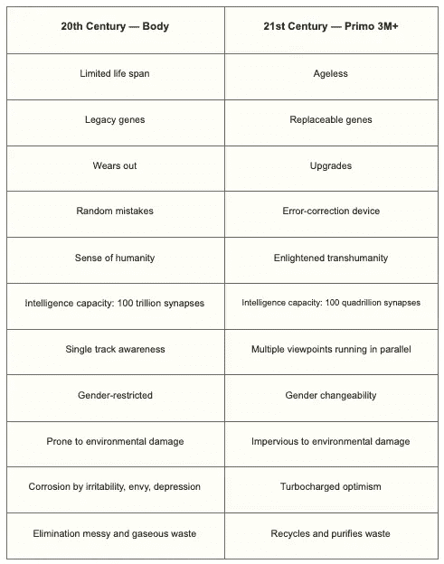
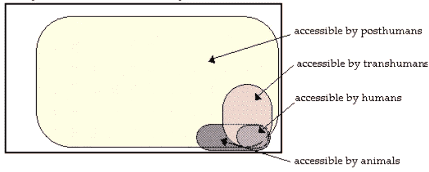
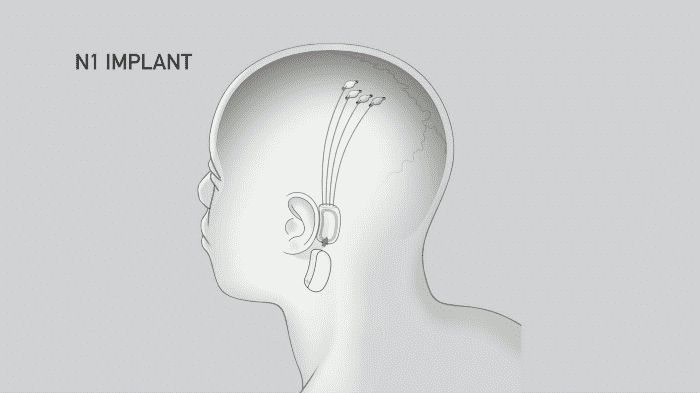
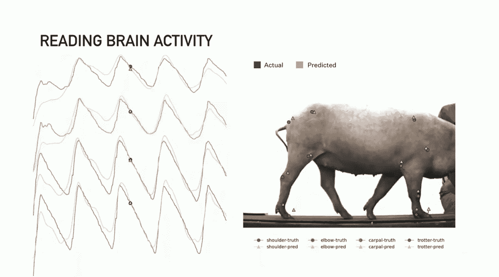

# 从维特鲁威人到第一后人类:理解后人类主义

> 原文：<https://medium.com/nerd-for-tech/from-a-vitruvian-man-to-a-primo-post-human-understanding-posthumanism-ffa0c6d0c662?source=collection_archive---------3----------------------->

来源:美国大兵的西部世界

他的帖子旨在讨论从人类是宇宙的中心到维特鲁威人的转变，并质疑我们对 21 世纪人类状态的看法。在弗朗西丝卡·费兰多(Francesca Ferrando)和尼克·博斯特罗姆(Nick Bostrom)等著名的后人类主义理论支持者的帮助下，它进一步理解了后人类主义的概念，并通过脑机接口 Neuralink、艺术家对具有 Primo Posthuman 的后人类身体的描绘以及超人类主义的想法等例子，探索了博斯特罗姆描述的后人类能力。

**人文主义方法和维特鲁威人**

我们的导师 Sai Shruthi Chivukula 在“人机交互基础”讲座中讨论了 teve Matthewman 的阅读材料，该材料将人文主义方法作为技术理论化的一种方式，其中人类占据中心舞台，并且他们是主要演员(Matthewman，2011)。

这让我想起了小时候，在惊悚小说《达芬奇密码》中，我第一次见到著名学者莱昂纳多·达芬奇的《维特鲁威人》。2003).也被称为“宇宙人”，它是古希腊哲学信仰的几何解释，即人是整个宇宙的缩影或缩影(Livescience，2012)。莱昂纳多认为，人体内部的机制是对整个宇宙运作的类比，以及“人是万物的尺度”(阿什布鲁克，2012 年)

## 图 1:维特鲁威人

(达芬奇，1490 年)。这个男人的身体完美地融入了一个圆形和一个方形，分别象征着神的象征和世俗的象征。

**谁是后人类？**

> “我们逐渐意识到，人类不是宇宙的中心，我们需要扩大对今天作为人类意味着什么的理解”(Margaret，2019)。

生物学家和女权主义者唐娜·哈拉威在她 1985 年的论文《电子人宣言》中有一段著名的陈述，关于拒绝严格的界限，特别是将“人”与“动物”和“人”与“机器”分开，以及种族、性别和社会阶级不再能够定义一个人。

处于超越人类状态的系统或实体被称为后人类(ResearchGate，2012)。更进一步，NYU 教授 Francesca Ferrando 称之为一个开放的概念，以及 21 世纪的人们如何知道共存不仅包括作为一个群体的人类，还包括动物、植物、自然和宇宙(Tec MX，2021)。

哲学家尼克·博斯特罗姆(Nick Bostrom)试图在他 2008 年的文章《为什么我长大后想成为后人类》中给后人类主义一个更精致的形式，他在文章中指出，后人类具有以下能力之一，这超过了任何现有人类所能达到的最大限度:

1.  **健康寿命**——保持身心完全健康、积极和富有成效的能力
2.  **认知**——一般智力能力，如记忆、演绎和类比推理、注意力，以及特殊能力，如理解和欣赏音乐、幽默、色情、叙事、灵性、数学等的能力。
3.  情感——享受生活并对生活环境和他人做出适当反应的能力

**设计师设计的“Primo Posthuman”增加了健康寿命**

人体在不断地变化。修复术、电子和数字化声带、机器人技术、微调大脑功能的化学物质、基因工程和克隆器官只是提升我们体质的几种方法(Kurzweil，2002)。

Primo 3M+是一款未来车身的设计原型，以超长寿命为主要关注点。它是“多功能的、可靠的、可改变的、可升级的，并且具有增强的感觉。”娜塔莎，2002 年

**图 2: Primo 3M+**

维塔-莫尔，娜塔莎。(2002) *第一波后人类。*通过[https://archi morph . com/2011/01/23/primo-post-human-trans-humanist-culture/](https://archimorph.com/2011/01/23/primo-post-human-trans-humanist-culture/)检索

**图 3:人体与原始身体对比图**

维塔-莫尔，娜塔莎。(2002)激进的车身设计“Primo Posthuman”。通过[https://www . kurzweilai . net/radical-body-design-primo-post human](https://www.kurzweilai.net/radical-body-design-primo-posthuman)检索

Primo Posthuman 原型与**超人类主义**观点是同步的，它描绘了一个过渡人类，认为人性是一个发展中的工作，有可能重塑我们的基本生物极限。可能性从增强人类的智力、身体和情感能力到用超级智慧生物或高级后人类进行太空殖民。这可以在最新技术的帮助下实现，如基因工程和分子纳米技术。(博斯特罗姆，2003 年)

**图 3:存在的可能模式的空间**

超人类的能力介于未强化的人类和成熟的后人类之间。博斯特伦尼克。(2003 年)通过[https://www.nickbostrom.com/ethics/values.html](https://www.nickbostrom.com/ethics/values.html)检索

**用脑机接口(BMIs)改善认知**

脑机接口是一种将来自大脑的神经信息翻译成命令的技术，这些命令与外部硬件或软件如机械臂或计算机进行通信。(自然作品集，未注明日期)

商业巨头埃隆·马斯克的 Neuralink 就是这样一款身体质量指数，其目标是在机器人的帮助下，将其直径为 8 毫米的 N1 芯片组植入人类头骨。它里面的电线和大脑中的神经元一样粗，比 100 微米的一缕头发还细。

事实上，可以在颅骨内放置不止一个这样的装置来瞄准大脑的不同部分。该平台表示，截至目前，N1 芯片可以连接大约 1000 个不同的脑细胞，一个病人可以插入 10 个 N1 芯片(马斯克，2019 年)。

**图 4:人类头骨中 N1 植入物的示意图**

CNET。(2020)从[https://www.youtube.com/watch?v=KsX-7hS94Yo](https://www.youtube.com/watch?v=KsX-7hS94Yo)检索到的图像

为了展示神经植入物的能力，一头名叫“格特鲁德”的猪被用作实验对象，她的大脑活动被显示在屏幕上。她大脑中的处理器发出无线信号，表明她在寻找食物时鼻子中的神经活动。她似乎没有受到任何不良影响，被描述为“一只健康快乐的猪，植入了两个月大的植入物，工作正常。”

**图 Gertrude 在跑步机上行走时的大脑活动，由 Neuralink 设备描绘**

CNET。(2020)从[https://www.youtube.com/watch?v=NqbQuZOFvOQ](https://www.youtube.com/watch?v=NqbQuZOFvOQ)检索到的图像

Elon 继续谈论早期 BMI 可以帮助解决的医疗问题:

> “这项技术的第一个用途将是修复因中风或切除癌症病灶而导致的脑损伤，在这种情况下，某人从根本上失去了某种认知元素。它可以通过提供从运动皮层到肌肉激活处的神经分流来帮助四肢瘫痪或截瘫的人。它可以通过增强记忆来帮助那些随着年龄增长而出现记忆问题、记不起自己孩子名字的人，这可以让他们在以后的生活中保持良好的状态——这对于治疗这种或那种精神残疾在医学上是有利的，当然当我们足够老的时候，我们所有人都会发生这种情况，这是非常重要的。”(马斯克，2019 年)

**用护理机器人和社交人形机器人增强情商**

H ealth-Tech 公司**，** Expper Technologies 公司设计了一款名为 Robin 的护理机器人，为接受治疗的儿童提供情感支持。他向他们解释医疗程序，并在治疗过程中分散他们的注意力，以减少他们对疼痛的感知。他还玩游戏和给他们讲故事，并记住面部表情和对话以产生共鸣，并为后续会议建立适当的对话。(发现号，2020 年)

此外，总部位于香港的 Hanson Robotics 因其开发的 Sophia 而获得了认可，Sophia 是第一个拟人化的社会人形机器人，能够显示 60 多种不同的情绪(Faraj 等人，2020 年)。她于 2017 年成为沙特阿拉伯公民，也是第一个获得任何国家公民身份的机器人。索菲亚还可以处理一系列情况，从帮助管理活动中的大量人群，到成为养老院老人的伴侣(汉森，2020)。

人性在不断进化，我们对人类的定义也在不断进化。后人类主义只是试图给我们一个开端，告诉我们我们的物种将如何在生物增强方面进化得更先进，以及在当代人类设计的设备的帮助下，吸收我们在健康寿命、认知和情感方面的后人类能力是多么有益。

博斯特罗姆也给了我思考的食粮，他在写这篇论文的时候说他不是一个后人类。(Bostrom，2008)随着当前人类群体的某些部分开始转变为后人类，我们将更好地了解他们对世界的看法，以及与有意识机器人和有意识类人生物等物种共存的未来。

## **参考文献**

1.  马修曼史蒂夫。(2011 年，第 1-10 页)将技术理论化。*技术与社会理论。*发表于帕尔格雷夫·麦克米伦
2.  凯瑟琳·海耶斯。(1999) *我们如何成为后人类。*出版于芝加哥大学出版社
3.  博斯特伦尼克。(2008，第 107–137 页)*为什么我长大后要成为后人类，*发表在:医学增强与后人类，eds。伯特·戈迪金和露丝·查德威克
4.  玛格丽特·安德森(2019 年 3 月 11 日)。[“后人类设计”到底是什么意思？](https://eyeondesign.aiga.org/what-does-posthuman-design-actually-mean/)
5.  自然投资组合。 [*脑机接口*](https://www.nature.com/subjects/brain-machine-interface) *。*
6.  托拉尔多硕士和托拉尔多医学博士(2020 年)。[后人类还是新维特鲁威人？当代新人文主义革命](https://doi.org/10.4236/ojpp.2020.101004)。哲学开放期刊，10(01)，36–44。
7.  马斯克，E. (2019)。拥有数千个通道的一体化脑机接口平台。 [BioRxiv](https://doi.org/10.1101/703801) 。
8.  维塔-莫尔，娜塔莎。(2002) [Primo Posthuman](https://archimorph.com/2011/01/23/primo-post-human-trans-humanist-culture/) 。
9.  [罗伯逊，莎拉。(2012)](https://www.researchgate.net/post/When-does-a-human-become-posthuman)
10.  [Mx，Tec。(2021 年 6 月 22 日)。什么是后人类主义？](https://tec.mx/en/news/puebla/education/what-posthumanism-nyu-professor-explains)
11.  t . urban(2021 年 7 月 13 日)。Neuralink 和大脑的神奇未来。等等但是为什么。
12.  [超人类价值观](https://www.nickbostrom.com/ethics/values.html)。(2003).NB。
13.  哈拉威博士(1985 年)。电子人宣言:20 世纪后期的科学、技术和社会主义女权主义。虚拟学习环境国际手册，117–158。
14.  汤姆阿什布鲁克。"达芬奇和人文主义的蓝图."波士顿 NPR 新闻台汤姆·阿什布鲁克的观点:90.9 Wbur，2012 年 2 月 6 日。
15.  你好，罗宾。(2020).发现。 [*情感机器人:能识别人类感情的机器*。](https://www.discovery.com/science/emotional-robots--machines-that-recognize-human-feelings)
16.  汉森机器人有限公司。(2020 年 9 月 1 日)。*索菲亚*。[汉森机器人](https://www.hansonrobotics.com/sophia/)。