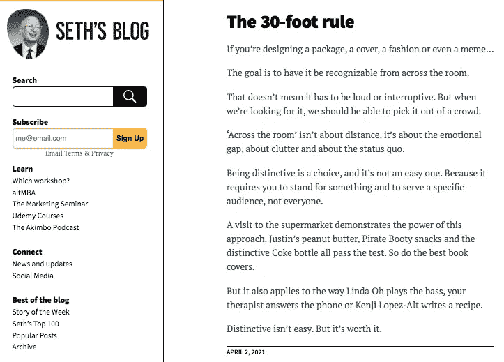
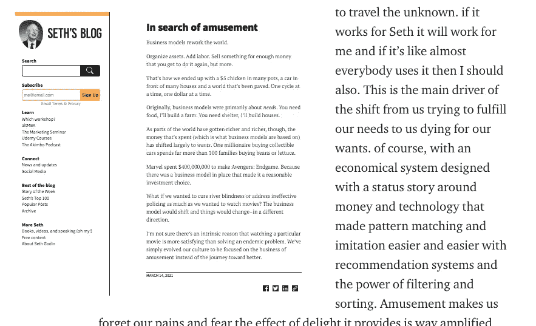

# 从书籍封面到颠覆性的想法和平台

> 原文：<https://medium.com/nerd-for-tech/from-book-covers-to-disruptive-ideas-and-platforms-8b9459e4e928?source=collection_archive---------19----------------------->

赛斯·戈丁的博客文章

这本书的封面是讲述这本书代表什么的第一个元素。它应该是非凡的设计，就像无聊的普通奶牛部落中的紫色奶牛，所以聘请专业设计师会有所帮助，不是所有的设计师，而是关键的书籍封面设计师，像克里斯·福斯或像你这样的人。具体是产品、服务、软件、作家、出版商或企业家成功的关键，但互联网让我们相信，我们所做的是为每个人服务的，因为我们可以通过在谷歌广告、脸书广告或 youtube 广告上做广告来接触每个人，就像大预算的大机构过去在电视上向我们推销东西一样。我们忽略了一个事实，那就是互联网不像电视那样是大众媒体，它是一个微型媒体的集合，每个微型媒体都挤满了有共同之处的群体和部落。

你的书应该针对一个特定的群体，向他们提供大量的信息和知识，让他们渴望在家里、与家人和朋友、或者在办公室与同事和老板谈论它。要做到这一点，你的书的封面和包装方式应该像这本书一样与众不同

[赛斯·戈丁](https://seths.blog/)建议并测试了一种在线展示图书封面的新方法，不像这样在上面放标题

塞思·戈丁的书《捅箱子》

我建议但我还没有试验过[这本书拉链](https://mkrdiop.medium.com/the-book-zippers-and-curiosity-gap-76ec5e090f6)的想法。

本文是关于值得一谈的博客文章和关于截图故事系列文章的又一次测试。这些文章描述了它的内容

 [## 情绪市场还是棍子市场

### 塞斯，似乎这个世界的生活就像一个情感市场，我们每天都在买卖情感…

mkrdiop.medium.com](https://mkrdiop.medium.com/emotional-market-or-stick-market-b8b0a7a452cf)  [## 防止中断营销的系统设计

### 赛斯正如我们已经知道的，我们人类大部分时间是通过匹配模式和…

mkrdiop.medium.com](https://mkrdiop.medium.com/the-muse-of-a-system-against-interruption-marketing-4d3a8a19b755)  [## 下一个博客

### 过去和个人博客是我现在写的类似这种类型的下一个东西，右边是我的截图…

medium.com](/nerd-for-tech/the-next-blogs-4ef123ebca2a)  [## 也许它代表斯坦福

### 它代表这个故事，神在这本书里告诉我们，他教导亚当伟大的名字…

mkrdiop.medium.com](https://mkrdiop.medium.com/maybe-it-stands-for-standford-5d1c0ae8ad74) 

它们共享相同的模因，因为它们都是关于我每天阅读的博客中的一篇特定文章的文章。这很简单，只需截取文章的截图，然后使用这样的模板来撰写文章

博客截图故事模板

这个模板如果实现了这里解释的[阅读器体验和 UI 会更好。](https://mkrdiop.medium.com/reader-experience-and-medium-35cf28ff29a2)

如果你想的话，去测试一下。