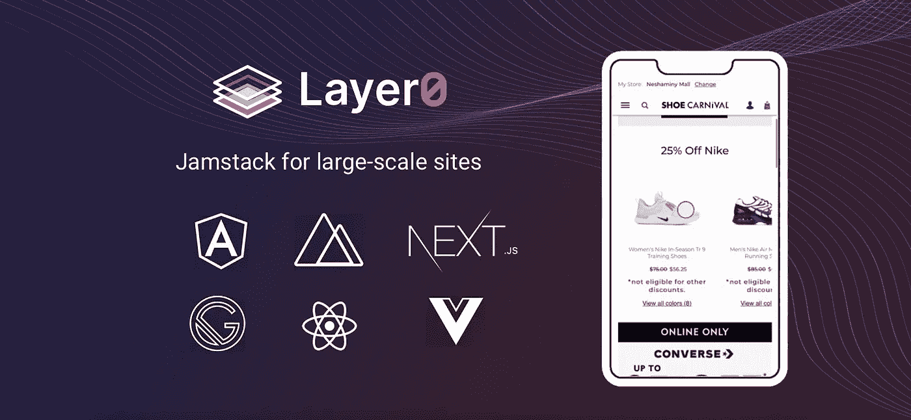
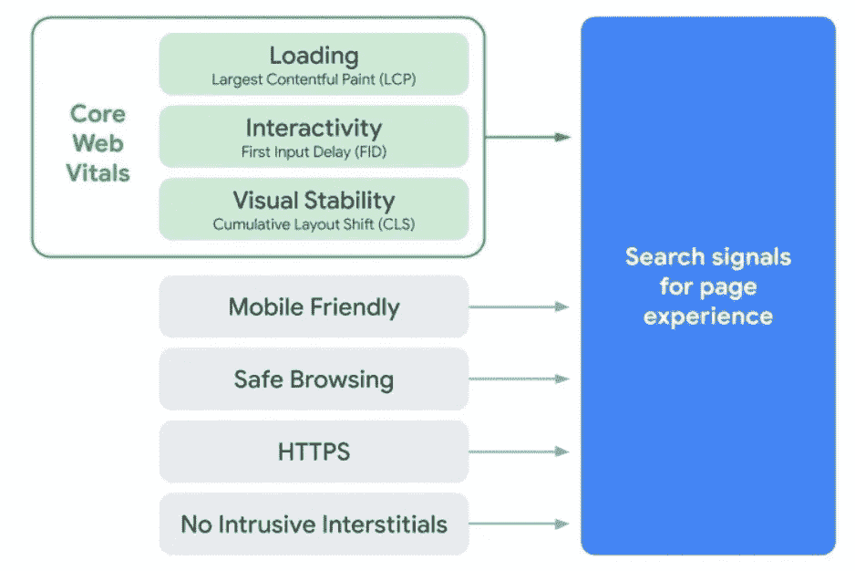
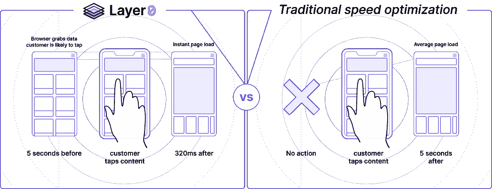
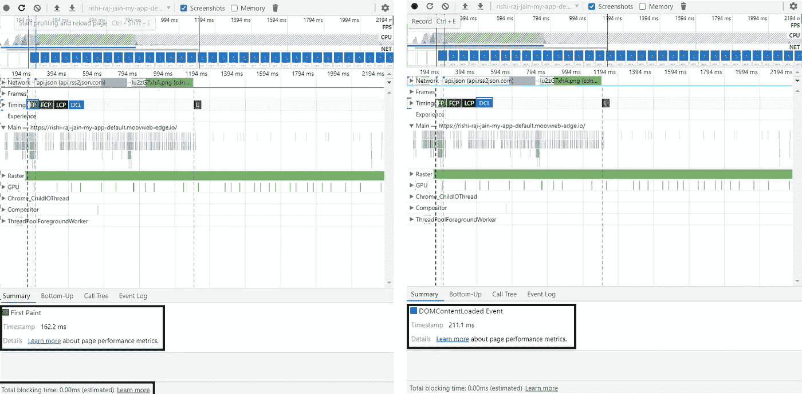

# 从交付内容到体验——作为一名前端 D̶e̶v̶e̶l̶o̶p̶e̶r 工程师，Layer0 如何改变了我的体验

> 原文：<https://medium.com/nerd-for-tech/from-delivering-content-to-experience-how-layer0-has-changed-my-experience-as-a-front-end-191d48437e72?source=collection_archive---------8----------------------->

我做前端开发已经一年多了，最近一直在探索**前端** - **末端工程**的领域，在那里，创作者超越开发，专注于可用性&用户体验。自从我开始用 Next.js 开发以来，我一直是 Vercel 的粉丝，现在 Layer0 无疑已经成为了列表的顶部。这个博客将让你了解我从 Next.js Conf 学到的东西，我使用 Vercel 的经历，是什么让我相信 Layer0，以及我部署一个由最快的后端支持前端(BFF)layer 0 的应用程序的经历。



# 我从 Next.js Conf 学到的东西

我过去常常想，一个人能从会议中学到什么？但是在参加了 [Next.js 第一次全球用户大会](https://nextjs.org/2020/conf)之后，我现在非常兴奋能够参加这样的会议并不断从中学习。开发者在 Next.js 10 中带来了几个令人瞠目结舌的特性，比如:

*   [**内置图像组件和自动图像优化**](https://nextjs.org/blog/next-10#built-in-image-component-and-automatic-image-optimization) **:** 允许用户高枕无忧，让 next.js 通过调整大小、优化和以现代格式提供图像来提高网站性能&在运行时延迟加载图像。
*   [](https://nextjs.org/blog/next-10#automatic-resolving-of-href)****` href `:**开发者不需要`as``属性来配置他们的路线如何显示在地址栏中。**
*   **[**getStaticProps/getServerSideProps 快速刷新:**](https://nextjs.org/blog/next-10#getstaticprops--getserversideprops-fast-refresh) 在编辑数据取数方法时，函数重新运行，现在不需要重新加载页面🎉。**

**但对我来说，这是会议的关键收获→**

> ****谷歌最近在** [**上宣布，为更好的网络评估页面体验**](https://webmasters.googleblog.com/2020/05/evaluating-page-experience.html) **，根据该公告，除了内容，网站的性能现在将是在谷歌搜索结果中优先考虑它们的一个主要因素！****

****

**([页面经验排名因素](https://webmasters.googleblog.com/2020/05/evaluating-page-experience.html)**

> **这将推动全球每一个开发者提供具有更好用户体验的网站，以保持领先地位和排名。**

# ****我在 Vercel(前 Zeit)的经历【为 Next.js 打造的平台】****

**从静态网站到托管用 Angular、Vue & React 构建的动态网站，我几乎什么都用 Vercel。也许我一直使用它的原因是因为用户可以免费部署无限的域名，不需要任何配置。通过 Vercel CLI 轻松部署，部署过程变得再顺利不过了。**

**但是通过各种各样的部署，我了解到一些关于 Vercel 托管的问题。对于我可以在互联网上打开的同一个网站，我经常被告知[“网站显示错误信息，无法加载”](https://www.facebook.com/groups/DevCDelhiNCR/permalink/1211002872566803/?comment_id=1211049259228831&reply_comment_id=1212322355768188)或[“网站无法加载”](https://www.facebook.com/groups/DevCDelhiNCR/permalink/1211002872566803/?comment_id=1211049259228831&reply_comment_id=1212322355768188)。偶尔，这样的消息可以被忽略，但这是导致我进入第 0 层的决定性因素，我必须托管一个 [Angular SSR](https://angular.io/guide/universal) [应用程序](https://github.com/rishi-raj-jain/Blogging)，而 [Vercel 目前不支持](https://github.com/vercel/ng-deploy-vercel/issues/9)！😲(触目惊心，对！？)**

# ****layer 0 提供了什么？****

**我是在 [Next.js Conf](https://nextjs.org/2020/conf) 上知道 Layer0 的，然后发现了这个平台，它承诺即时网站加载，非常流畅的部署体验，所有这些都在一个平台上开发、部署、预览、运行、监控、试验和保护自己最喜欢的前端框架！**

****

**( [CDN-as-JavaScript 在需要数据前 5 秒*将数据放入浏览器)*](https://www.moovweb.com/products)**

> **“Layer0 **扩展了**传统 CDN 的功能，不仅托管您的静态内容，还为渐进式网络应用提供**服务器端渲染**，以及在网络边缘缓存您的 API 和 HTML**，为您的用户提供**最快的浏览体验**。”~ [第 0 层单据](https://docs.layer0.co/guides/overview#section_what_is_an_layer0_)****

# ****它与内容交付网络(CDN)有何不同？****

****随着电子商务网站变得越来越具有交互性和动态性，从 JSON 创建不被 CDNs 缓存的布局是影响世界各地正在建设的几个网站的性能的一个因素。****

****拥有这种 cdn 的电子商务网站导致更大的[第一内容丰富的绘画(FCP)](https://web.dev/fcp/) 谷歌最近宣布的页面体验中列出的核心网络活力之一，从此恶化了用户体验。这导致客户甚至在浏览器可以在屏幕上呈现页面之前就等待需要从数据库中提取的产品数据！****

****这意味着我肯定可以马上托管我的 Angular SSR 博客应用程序，并且非常渴望测试他们声称的亚秒级页面加载时间。🤓****

# ****我真的需要做什么吗？****

****因此，我已经完成了 Angular SSR 应用程序( [Github Link](https://github.com/rishi-raj-jain/Blogging) )的开发，现在必须通过 app.layer.co 的[进行部署。我刚刚浏览了他们关于部署 Angular @](https://app.layer0.co/)[https://docs.layer0.co/guides/angular](https://docs.layer0.co/guides/angular)的文档，并运行了这两个命令来将 layer0 与我现有的 Angular 项目集成:****

```
**npm install -g [@layer0/cli](http://twitter.com/layer0/cli)
layer0 init**
```

****集成部分已经完成了！哇哦。****

****在通过`layer0 run`进行了一次试运行后，我在本地测试了这款应用，它将通过`layer0 build && layer0 run --production`使用无服务器离线上传到第 0 层云，令我高兴的是，它运行得完美无缺！****

****为了让它在第 0 层的边缘网络上运行，我运行了`layer0 deploy`，瞧！我现在是世界上最快的 xD 网站的所有者****

****不相信我？自己看看吧@[https://rishi-raj-jain-my-app-default.moovweb-edge.io/](https://rishi-raj-jain-my-app-default.moovweb-edge.io/)****

# ****令人满意的经历****

****我运行了 Google Lighthouse，相信我，我被网站的表现惊呆了。我从 Wi-Fi 切换到手机数据网络上的流媒体，但它继续让我惊讶，第一个内容丰富的绘画(FCP)只有 162 毫秒(基本上当用户能够处理来自网页的输入)，估计总阻塞时间(TBT)为 0，整个 DOMContent 加载时间为 211.1 毫秒！****

********

****([https://rishi-raj-jain-my-app-default.moovweb-edge.io/](https://rishi-raj-jain-my-app-default.moovweb-edge.io/)的绩效指标)****

# ****结论****

****一个更快的网站会吸引更多的用户。简单吧？虽然这似乎是公平的，但如果我说一秒钟的延迟也可以呢？会是吗？如果是，这里有一些事情需要你注意:****

****“据亚马逊计算，页面加载速度每慢一秒钟，每年就会损失 16 亿美元的销售额。谷歌已经计算出，只要将搜索结果的速度降低 0.4 秒，他们每天就会损失 800 万次搜索——这意味着他们会少提供数百万条在线广告。”——[(基特·伊顿，快公司)](https://www.fastcompany.com/1825005/how-one-second-could-cost-amazon-16-billion-sales)****

****这可能会让人感到惊讶，但毫无疑问，甚至每一秒钟的延迟都很重要！看起来 Layer0 做得很好，通过他们的一体化部署平台提供了更好的开发人员体验，以及我所见过的最快加载的更好的用户体验。****