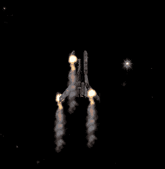
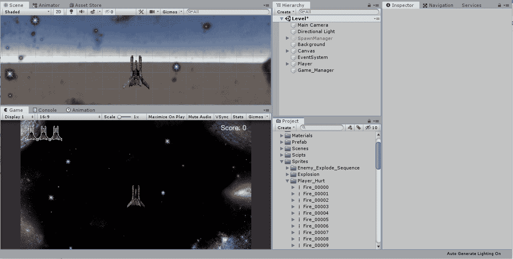
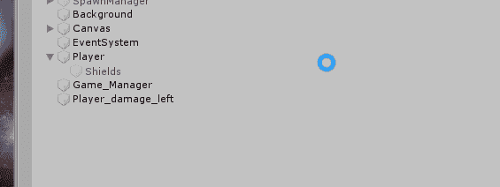
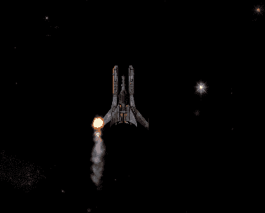
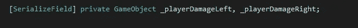
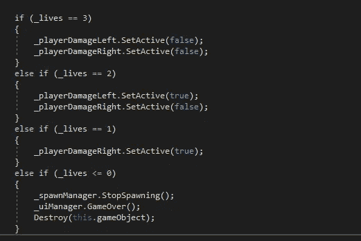
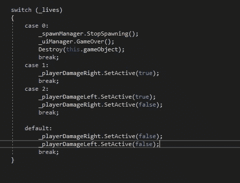
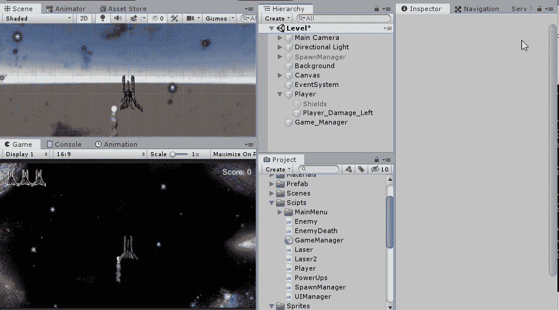
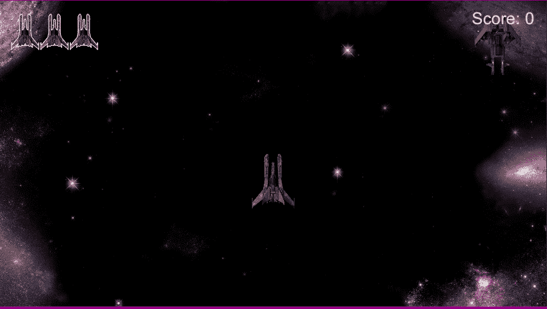

# 从爆炸到破坏 VFX

> 原文：<https://medium.com/nerd-for-tech/from-explosions-to-damage-vfx-a423359ad0ca?source=collection_archive---------20----------------------->

## 在 Unity 中使用动画精灵伤害 VFX

目标:在玩家受到伤害时加入一些动画。

增加伤害和增加爆炸没有太大区别。等到满足一个条件，打开动画。也许离防护罩启动更近了。

首先，我们将想要在动画中加入伤害。将第一帧拖动到层次中，创建动画，排列玩家的伤害。关于动画的帮助，点击[这里](https://asealiea.medium.com/animating-sprites-in-unity-fafb27bf5f4)。

不得不把 Unity 做得很小，这样你就可以看任何东西了。

如果你移动 atm，它会留下新的动画，我们可以通过使伤害成为玩家的孩子来解决这个问题。通过将伤害动画拖动到层级中的玩家上，这将会使伤害动画成为子动画。

现在让它只在我们受到伤害的时候才显现出来。编码时间！

在玩家脚本中，当我们失去一个生命开启动画时，我们会想要将伤害动画添加到我们受到伤害的区域。下一部分我们可以使用一些 If 和 Else If 语句，但是让我们使用 Switch 语句来代替。

添加一个包含伤害动画的游戏对象的参考，因为我们要添加船的左边和右边的伤害，添加两个。

因为它们是同一种类的游戏对象，让它们在同一条线上是没问题的。

现在来说说破坏方法。在我们取走一条生命后，让我们看看我们还剩下多少条生命，根据我们还有多少条生命，我们可以开启/关闭伤害。用 IF 和 Else If 语句这样做，看起来会有点像这样，还有我们将要使用的 switch 语句。

现在剩下要做的就是复制左边的伤害，将其重命名为右边的伤害，并将它们放入我们在播放器上创建的引用中。我们可以把它们关掉，让它们看起来好像不存在，当我们受到伤害时，它们又会被打开。

完成所有这些工作后，剩下要做的就是测试一切是否正常。

看起来不错！

就这样，我们从没有额外的伤害 VFX 变成了每次受伤都有新的伤害。基于我们已经学到的，我们可以实现游戏的新功能。您可能已经注意到，不久前，相同的代码只是以稍微不同的方式使用，结果令人惊叹。