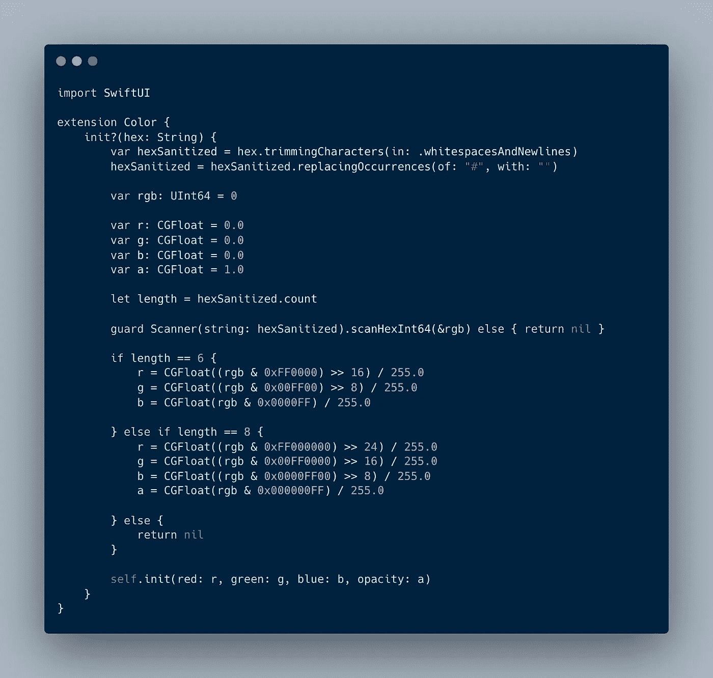
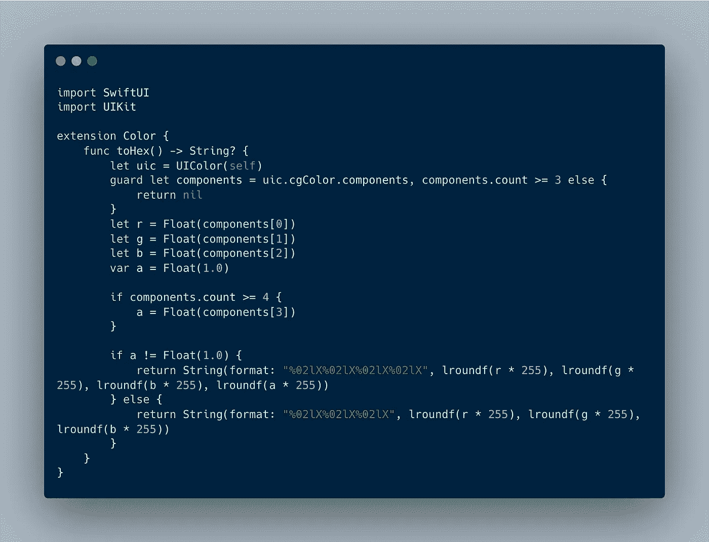
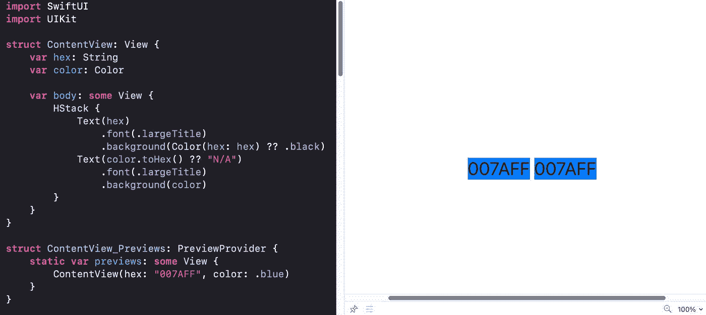

# SwiftUI 中从 Hex 到 Color 的转换

> 原文：<https://medium.com/nerd-for-tech/from-hex-to-color-and-back-in-swiftui-b2398da68a29?source=collection_archive---------4----------------------->

Bart Jacobs 写了一篇从 Hex 到 UIColor 再回到 Swift 的精彩文章，我的文章基于他的工作。我想知道如何在 SwiftUI 中用它的`Color`结构实现同样的功能。

# SwiftUI 中从十六进制到彩色

你不需要 UIKit 来做这个。创建一个扩展，使用一个`Foundation`字符串解析器从十六进制表示中扫描一个 *long long 值*，最后在底层`CGColor`的帮助下初始化`Color`。

扩展“在 SwiftUI 中从十六进制到彩色”

与 Barts 的文章有两点不同:

*   这里我用了`UInt64`和`scanHexInt32`，因为`scanHexInt32`在 iOS 13 中已经被弃用了
*   这里我使用了`Color`初始化器，并将 alpha 作为不透明度传递(在`Color`的初始化器中没有`alpha`参数)。我可以避免使用 UIKit:)

备注:也可以用核心图形表示初始化`Color`。请注意，您必须使用`init(srgbRed:green:blue:alpha:)`而不是`init(red:green:blue:alpha:)`，因为 **iOS 使用 sRGB 色彩空间**。

# SwiftUI 中从颜色到十六进制

根据苹果的文档，我希望通过可选的实例属性`cgColor`直接利用`Color`中颜色*的核心图形表示。*

> *你可以从一个常量 SwiftUI color 得到一个 CGColor 实例。这包括从核心图形颜色、从 RGB 或 HSB 组件或从常量 UIKit 和 AppKit 颜色创建的颜色。对于动态颜色，例如使用 init(_:bundle:)从资产目录中加载的颜色，或者从动态 UIKit 或 AppKit 颜色中创建的颜色，此属性为零。*

然而，在我的测试中，属性总是`nil`。即使是像`Color.blue`这样的恒定 SwiftUI 颜色。

**需要 ui kit**来确保获得底层核心图形表示。一旦我们从`Color`创建了`UIColor`，那么访问核心图形表示和颜色组件就很容易了。如果您想了解更多关于这里使用的字符串格式化程序的信息，请阅读 Bart 的文章。

SwiftUI 中“从颜色到十六进制”的扩展

没有 UIKit，也可以从十六进制字符串创建一个`Color`实例。但是你需要用`UIKit`作为桥接机制来从`Color`实例创建一个十六进制字符串。

这两个扩展很好地工作，并产生相同的视觉颜色，如下所示。

*原发布于*[*https://blog . eidinger . info*](https://blog.eidinger.info/from-hex-to-color-and-back-in-swiftui)*。*