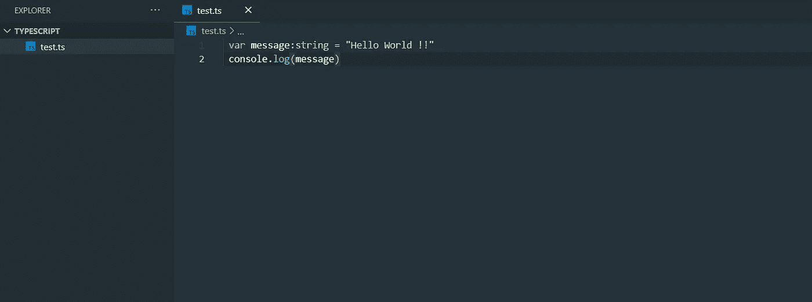
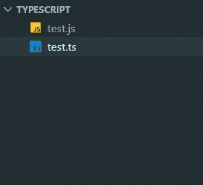
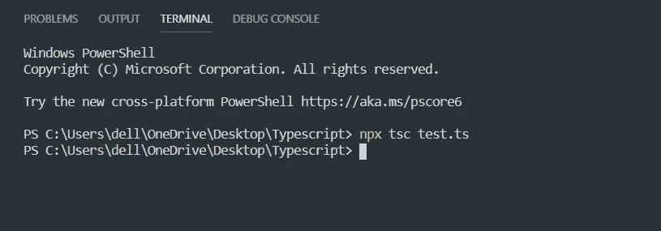
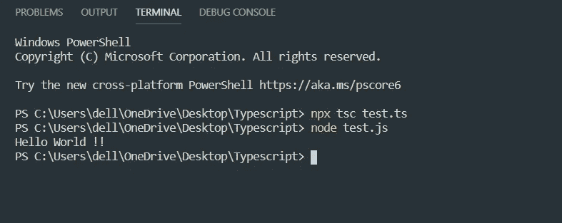
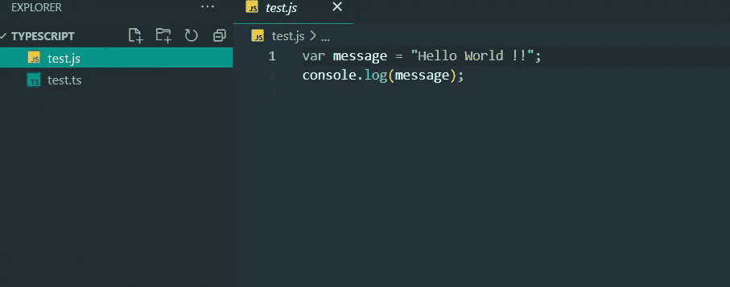

# ✔✔从 JavaScript 到 TypeScript！！！

> 原文：<https://medium.com/nerd-for-tech/from-javascript-to-typescript-1757e106ee7b?source=collection_archive---------21----------------------->

> TypeScript 是微软开发和维护的开源面向对象语言，在 Apache 2 许可下授权。它是 JavaScript 的类型化超集，可以编译成普通 Javascript。

# 为什么打字稿？？？

1.  **编译**—JavaScript 是一种解释型语言。因此，需要运行它来测试它是否有效。这意味着你写了所有的代码，却发现没有输出，以防出错。因此，你不得不花费数小时试图找出代码中的错误。TypeScript transpiler 提供了错误检查功能。如果发现某种语法错误，TypeScript 将编译代码并生成编译错误。这有助于在脚本运行之前突出显示错误。
2.  **强静态类型**——JavaScript 不是强类型的。TypeScript 通过 TLS (TypeScript 语言服务)附带了一个可选的静态类型和类型推理系统。没有类型声明的变量的类型可以由 TLS 根据它的值来推断。

> 我使用的是安装了 **Node.js** 和 **Visual Studio 代码**编辑器的 **Windows 系统**。

# 先决条件:

1.  [**Node.js**](https://nodejs.org/en/download/)
2.  预先了解 JavaScript 将是蛋糕上的樱桃。
3.  [**Visual Studio 代码**](https://code.visualstudio.com/download)

# 1.创建类型脚本文件:

打开 VScode 编辑器，创建一个名为“ **test.ts** 的文件。**。ts** 是类型脚本文件的扩展名。并键入这几行代码&点击保存。

在文件 **test.ts** 中

> 在这段代码中，我们声明了一个类型为**字符串**的变量。所以它应该总是字符串。如果现在试图给它赋值，typescript 会抛出错误。

**2。编译打字稿代码:**

在 VS 代码中打开终端，键入" **npx tsc test.ts** " - >这将把您的类型脚本代码转换为 JavaScript 代码，并添加一个名为" **test.js"** 的文件，然后检查是否有错误。

**文件结构**

**端子**

如果它有错误，它会在编译时抛出错误，这是 typescript 最好的地方。

# 3.运行 Typescript 文件:

只需在您的终端中键入“ **node test.js** ”。

嗯，我们成功了。现在您已经打开了同一个 **test.js** 文件，您会看到您用 typescript 编写的代码已经转换为它的 javascript，如下所示:

这就是你如何开始打字之旅😊😊😊😊

> https://linksankandas.netlify.app/:✔✔✔跟我来
> 
> 请随意问任何问题…