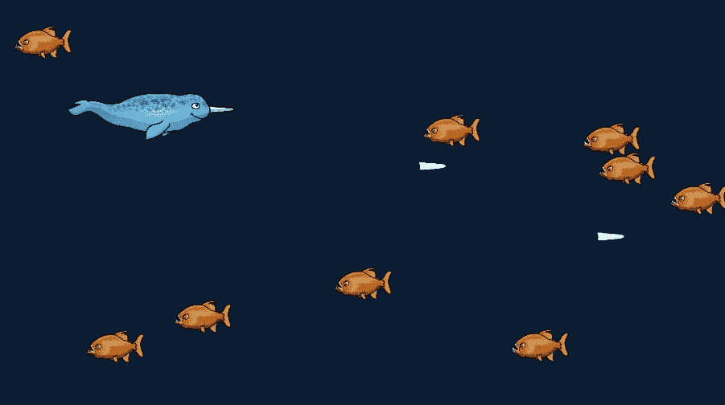

# 从原型到艺术作品

> 原文：<https://medium.com/nerd-for-tech/from-prototype-to-work-of-art-7440d82ab173?source=collection_archive---------24----------------------->

在我的上一篇文章中，我为我的游戏制作了一些 2D 资产。我现在可以**将**导入到 Unity 中，**替换**我的 **3D** 原始资产。

虽然有几种方法可以将资产导入 Unity，但这是我喜欢的方式。我首先制作一个**精灵**文件夹，在我的项目窗口中有**敌人**、**玩家**和**武器**的子文件夹。然后我把 PNG 资产放到我的 **Unity project** 文件夹中它们各自的文件夹里，在我的 **hard** 上…