# 从反应到还原

> 原文：<https://medium.com/nerd-for-tech/from-react-to-redux-350fd0f5e3a?source=collection_archive---------12----------------------->

如果您对 React 很熟悉，并且想要了解 Redux，那么您来对地方了。Redux 应用程序有很多样板文件。本文将帮助您理解数据流，并习惯使用新术语。

假设您的 React 应用程序有一个受控制的表单。您在表单组件中处理它的状态，并通过父组件的 props 传递函数，这样您就可以向上传递表单的状态，这样您就可以将该状态向下传递给另一个子组件来显示它。在 Redux 中，您不需要指定将数据发送到哪里——所有数据都存储在存储中，并且可以从任何组件访问。

在我的应用程序中，我创建了一个我喜欢的颜色列表。让我们从一个组件开始，它看起来仍然与它的 React 对应物`AddColorForm`相对相似。

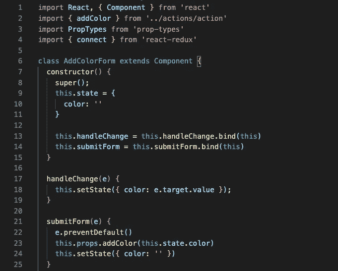

这里没有什么新的东西:我们在顶部导入了一些文件和函数(我们一会儿就会看到)，这是一个类组件，带有一些绑定的更改处理程序。

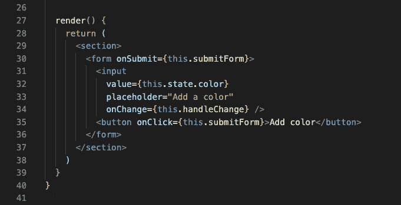

我们用文本呈现一个表单，将输入的值放入这个组件的状态，然后在中显示它，这样用户就可以看到他们输入了什么。单击按钮时，我们从 state 中获取颜色，并将其作为参数传递给' this.props.addColor '。

在这里，我们检查“addColor”是一个带有 PropTypes 的函数。我们还使用了名为“mapDispatchToProps”的新方法，该方法允许我们将“addColor”函数引入该组件，并使用“this.props.addColor”调用它。“connect”是另一个 Redux 方法，它在这里连接我们的文件。

我们可以在导入中看到，`addColor`来自一个名为`actions/action`的文件，所以让我们来看看这个文件。

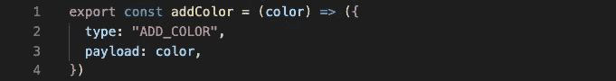

在“mapDispatchToProps”中，我们在名为“dispatch”的方法中调用了“addColor”。这允许我们的操作调用我们的 reducers，并通过它发送类型和有效负载。在这种情况下，作为参数传递给' addColor '的任何内容都将是调用' addColor '时返回的对象的' payload'。

`ADD_COLOR`动作将发送它的类型和有效负载，并触发我们的缩减器，所以让我们看看我们的缩减器文件，`colorsReducer.js`。

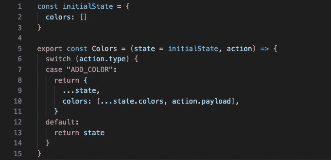

我们在这里为我们的应用程序创建了一个“initialState ”,我们将它和我们的“action”一起传递给我们的“colors”reducer。“开关”正在检查“action.type”是否与它的任何一种情况相匹配。我们传递了“ADD_COLOR”作为我们的类型，因此 case 将返回“state”和我们的新颜色(在“action.payload”中找到)。所有的 reducers 都是同时触发的，所以如果这里的类型不匹配，我们将返回默认的“state”。

好了，我们已经将新的颜色添加到 state 中，但是我们如何从我们的`ColorList`组件中访问它呢？

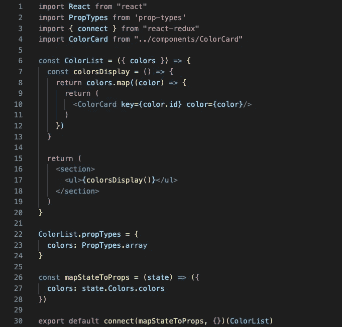

这里，我们引入了“商店”中的“颜色”数组，并对其进行映射，为每种颜色创建一个“色卡”组件。我们使用了另一种常见的方法“mapStateToProps ”,来接触“商店”,只带来我们需要的东西。在这种情况下，我们希望将 colors 数组称为“colors ”,并且我们已经告诉了“mapStateToProps”如何在“store”对象中找到该数组。

`ColorCard`组件与它在 React 中的外观没有太大的不同:

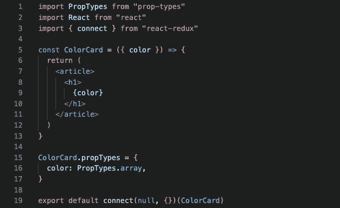

因为我们在创建每个“颜色卡”组件时传入了“颜色”,所以我们可以在参数中析构它，并在这里简单地将其称为“颜色”。

现在我们有了一个简洁的`App`组件，因为我们不需要在这个级别处理任何状态:

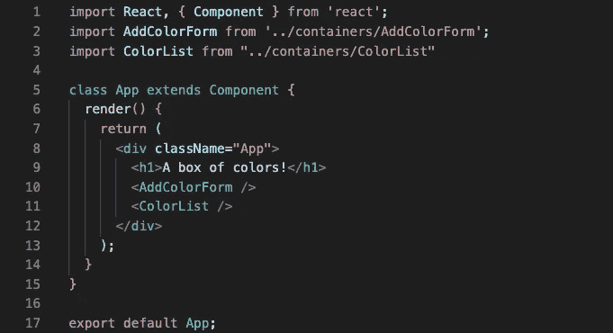

我们所要做的就是调用表单组件和列表组件，它们能够根据需要将状态发送到存储区或从存储区接收状态。

最后，在我们应用程序的最顶端，我们有`index.js`和`reducer.js`:

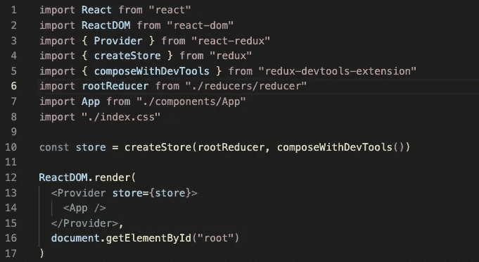

` index.js '位于文件结构的根中，并且是我们创建` store '的地方，传入我们的` rootReducer '和我们想要使用的任何中间件。(注意:Redux 开发工具非常有用和强大，必须作为 Chrome 扩展和中间件添加到您的应用程序中。)我们还将我们的应用程序包装在一个“Provider”标签中，这使得“store”可用于这个标签下的任何组件。

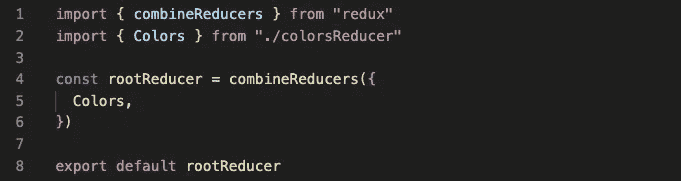

如果你有多个 reducer 文件，你可以把它们都列在“reducer.js”里，这样整个应用程序都可以使用它们。

一点点`html`和`css`:

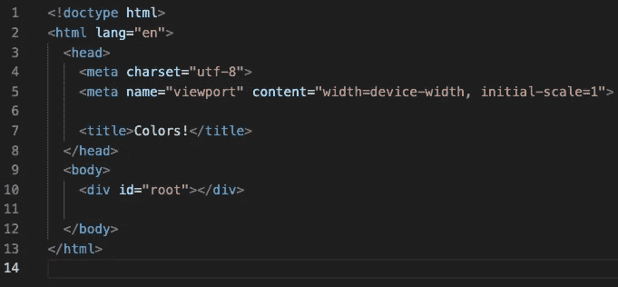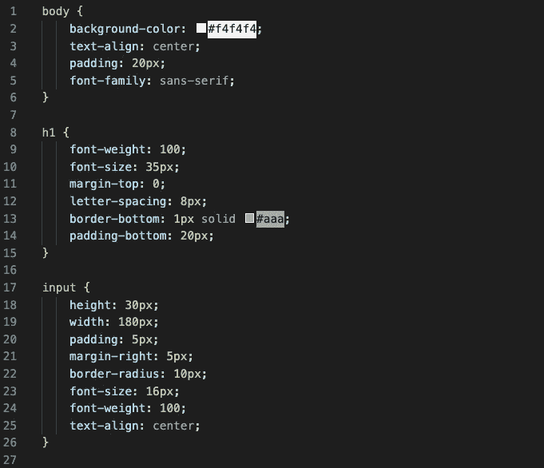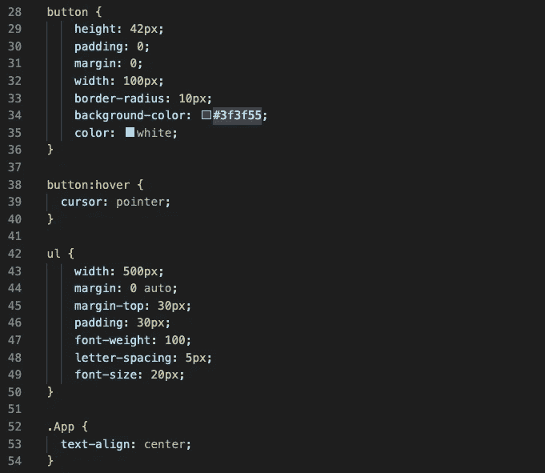

你应该有一个功能列表应用程序！

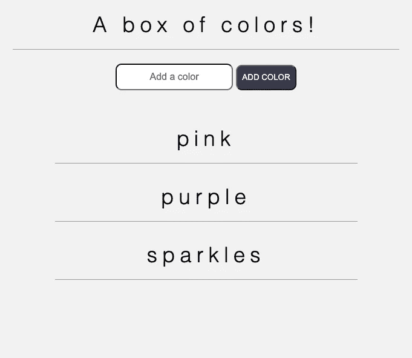

如果你在想“这个应用似乎不需要使用 Redux”，那你就对了。Redux 对于有许多层组件的复杂应用程序来说是最强大的——但是这应该让你知道它有多强大。

更多 Redux 的练习，请查看 Traversy Media 的[教程](https://www.youtube.com/watch?v=93p3LxR9xfM&t=1880s)和【Scrimba 课程。如果你想构建自己的 Redux 应用，[这是一个很好的基本 Redux 样板。](https://github.com/tsaiDavid/simple-redux-boilerplate/tree/master/src/components)