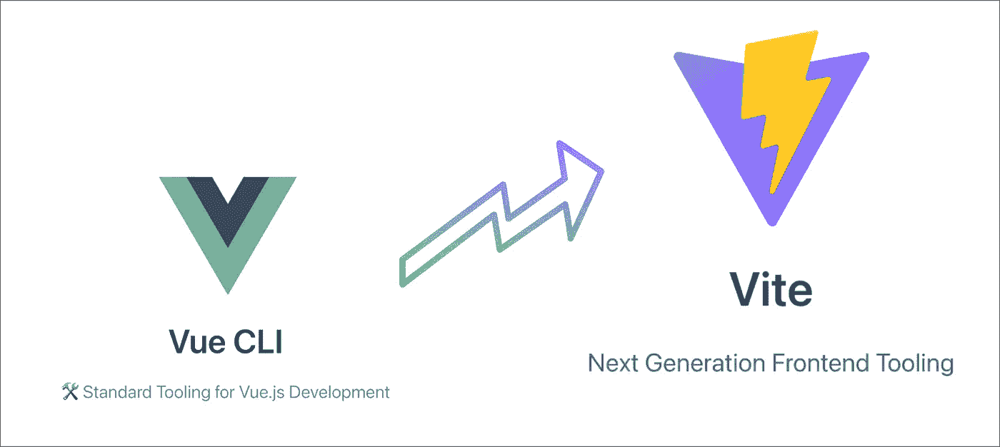

# 从 vue-cli 到 vitejs

> 原文：<https://medium.com/nerd-for-tech/from-vue-cli-to-vitejs-648d2f5e031d?source=collection_archive---------0----------------------->

我最近把一些 Vue2 项目从 vue-cli / webpack 迁移到了 [**vitejs**](https://github.com/vitejs/vite) 。在第三次这样做之后，我开始对这个过程做了一些详尽的笔记，我想在这篇文章中重述一下。



# package.json

## 开发依赖性

让我们移除“@vue/cli-service”依赖项，并将其替换为 *vite* 🚀

```
npm un @vue/cli-service…
```