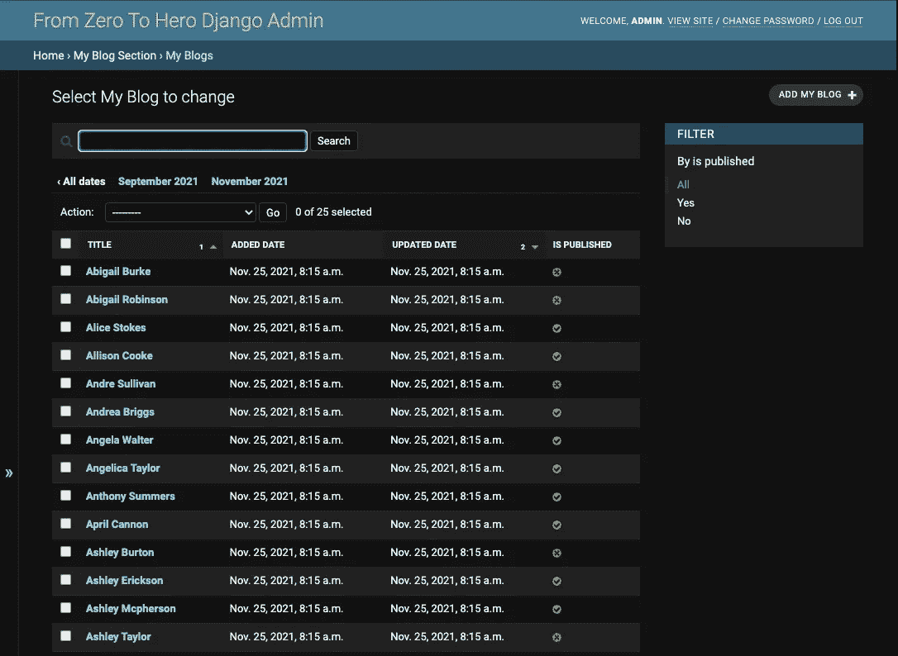
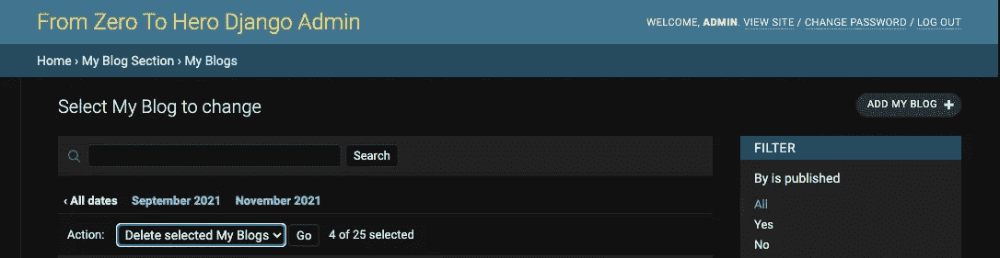
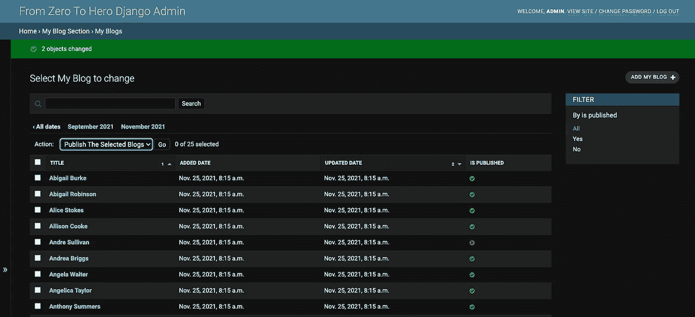
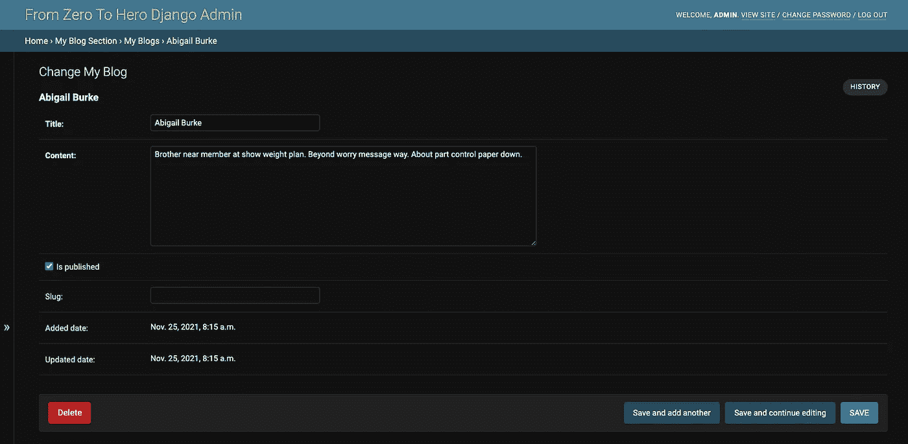
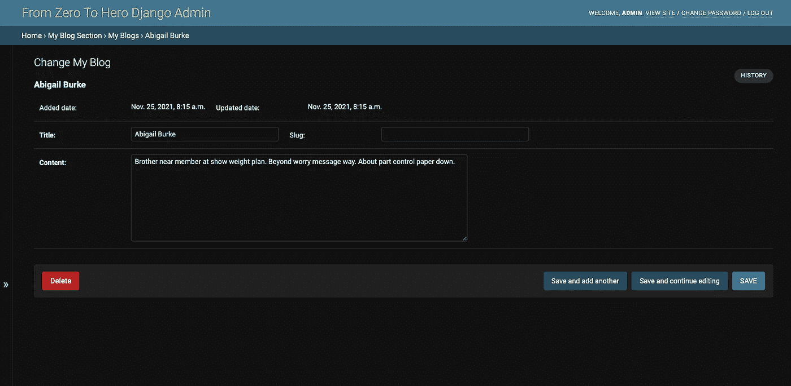
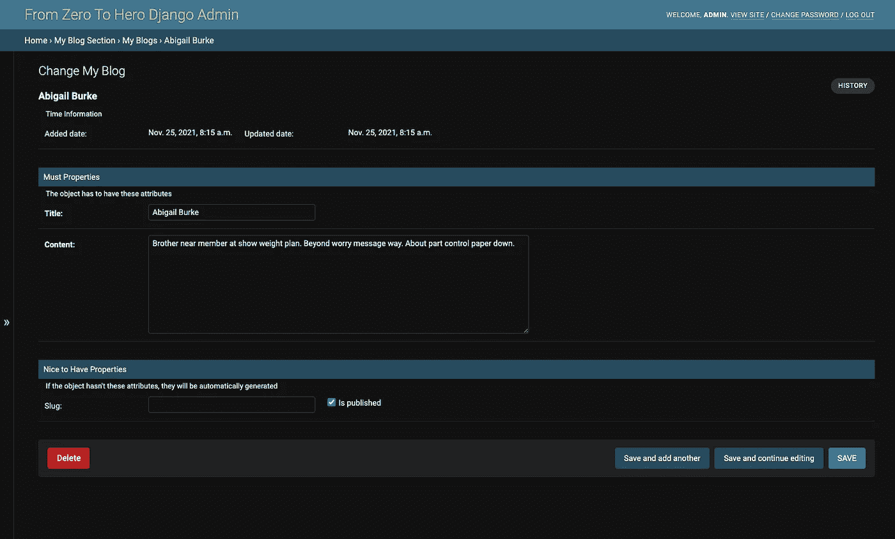

# 从零到英雄姜戈管理员:高级模型管理员 1 级(第三部分)

> 原文：<https://medium.com/nerd-for-tech/from-zero-to-hero-django-admin-advanced-level-modeladmin-class-1-part3-b4a9c4a21cc2?source=collection_archive---------0----------------------->

## 日期层次结构，管理操作，字段，字段集

我们已经在上一个故事的[中潜入了`ModelAdmin`类。在这个故事中，我们将继续尝试学习高级`ModelAdmin`类的功能。还有，你可以从下面得到这个故事的源代码。因此，在这个系列中，我们将致力于同一个项目。](/nerd-for-tech/from-zero-to-hero-django-admin-modeladmin-class-part2-2c8665d6cd5)

[](https://github.com/mebaysan/DjangoAdminForMedium) [## GitHub-mebaysan/djangodadminformedium:为中型 Django 管理博客系列创建

### 我开始准备这个 repo 来解释我们如何在 Django 中定制管理应用程序。本次回购依赖于一个媒介…

github.com](https://github.com/mebaysan/DjangoAdminForMedium) 

[Faisal](https://unsplash.com/@faisaldada?utm_source=unsplash&utm_medium=referral&utm_content=creditCopyText) 在 [Unsplash](https://unsplash.com/@faisaldada?utm_source=unsplash&utm_medium=referral&utm_content=creditCopyText) 上拍摄的照片

# 介绍

在本节中，我将向您介绍我们将要做的事情。

*   扩展`ModelAdmin`类
*   向`ModelAdmin`类添加管理动作
*   在管理类中编辑`date_hierarchy`
*   编辑`ModelAdmin`类中的字段和字段集

# 扩展模型管理

首先，我将从`date_hierarchy`开始。然后，我将继续向类中添加动作。

## 日期层次结构

我们可以使用这个属性逐月拆分数据。

```
class BlogAdmin(admin.ModelAdmin):
   ...
   date_hierarchy = 'updated_date'
```

我们可以在搜索栏下看到拆分的月份。九月、十一月等。



作者图片

## 添加管理操作

首先，我想从解释“什么是模型管理动作”开始。我们可以说，在进行批处理时，动作可以帮助我们。当然，我们可以用它们来做特定的工作。例如，给未发表的博客作者发电子邮件，等等。在本例中，我们将使用它们对表中选定的对象执行函数。

我们有一个默认的 Django 动作。我们可以使用这个默认操作从数据库中删除对象。操作出现在操作下拉列表中。



作者图片

*   我们使用 ModelAdmin 类的`actions`属性来添加动作函数。
*   我们编写一个带有 3 个参数的函数:`self`、`request`、`queryset`
*   我们可以通过使用它的`short_description`属性来改变函数的显示名称。

我要写一个函数:`make_published`

我们可以通过使用该功能来发布选定的文章。执行该函数后，我们将在管理页面上显示一条消息。为了显示消息，我们使用 ModelAdmin 类的`message_user`属性。

```
def make_published(self, request, queryset):
   count = queryset.update(is_published=True)
   self.message_user(request, f"{count} objects changed")make_published.short_description = 'Publish The Selected Blogs'
```

现在我需要将这个函数注册到 ModelAdmin 类中。

```
class BlogAdmin(admin.ModelAdmin):
   ...
   actions = ('make_published',)
```

我会把前两个博客列在名单上。



作者图片

此外，我们可以添加一些功能来导出选定的数据等。

## 田地（复数）；场；域；字段

我们可以使用这个属性对对象的详细页面中的表单元素进行重新排序(实际上是`change_form.html`，但是我们稍后将进一步讨论它)。

例如，当您转到一个详细页面时，您会看到如下所示的内容。



作者图片

如果我们想改变表单元素的位置，我们需要在 ModelAdmin 类中使用`fields`。

我将把下面的代码添加到 ModelAdmin 类中。至此，我们使用`list`来设置 ModelAdmin 的属性。实际上，在 Django 的官方文档中，他们建议使用`tuple`来设置属性。我们将使用`tuple`来设置`fields`。

```
class BlogAdmin(admin.ModelAdmin):
   ...
   fields = (
      ('added_date','updated_date'),
      ('title','slug'),
      'content'
      )
```

第一个`tuple`中的每个`tuple`，代表一行。比如我们把`added_date`和`updated_date`放在同一行。因此，我们更改了对象的详细页面的表单结构。



作者图片

## 字段集

我们可以通过设置`fieldsets`向表单添加更多的规范。记住，我们不能同时使用`fields`和`fieldsets`。

字段集的结构如下。

```
( # wrapping tuple
   # Set 1 (tuple)
   ('Set1 Title', {
      'fields': (('row1_item1', 'row1_item2'), 'row2_item1'),
      'description': 'Set1 description'
      }
   ),
   # Set 2 (tuple)
   ('Set2 Title', {
      'fields': (('row1_item1', 'row1_item2'), 'row2_item1'),
      'description': 'Set2 description'
      }
   )
)
```

我将向 ModelAdmin 类添加一个字段集。

```
class BlogAdmin(admin.ModelAdmin):
   ...
   fieldsets = ((None, {'fields':(('added_date','updated_date'),), 'description':'Time Information'}),('Must Properties', {'fields':('title','content'), 'description':'The object has to have these attributes'}),('Nice to Have Properties', {'fields':(('slug','is_published'),), 'description':'If the object hasn\'t these attributes, they will be automatically generated'}))
```

恭喜你。我们改变了形式。



作者图片

# 最后

在这个故事中，我们深入探讨了高级`ModelAdmin`职业的属性。希望这是有帮助的，你喜欢它。我喜欢写&代码。你可以从下面得到代码。我将回购协议一章一章地拆分，然后为每一章创建一个分支。

[](https://github.com/mebaysan/DjangoAdminForMedium/tree/chapter3) [## 第三章 GitHub-mebaysan/djangodadminformedium

### 我开始准备这个 repo 来解释我们如何在 Django 中定制管理应用程序。本次回购依赖于一个媒介…

github.com](https://github.com/mebaysan/DjangoAdminForMedium/tree/chapter3) 

亲切的问候。