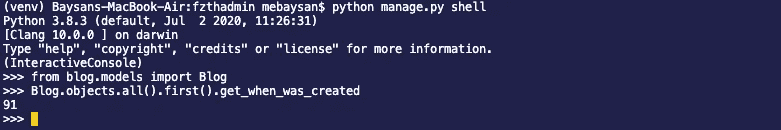
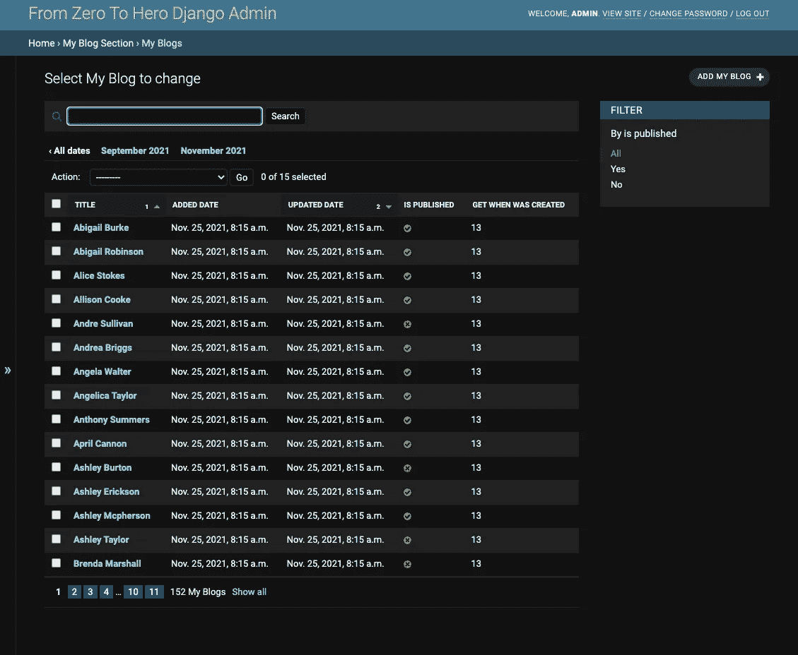
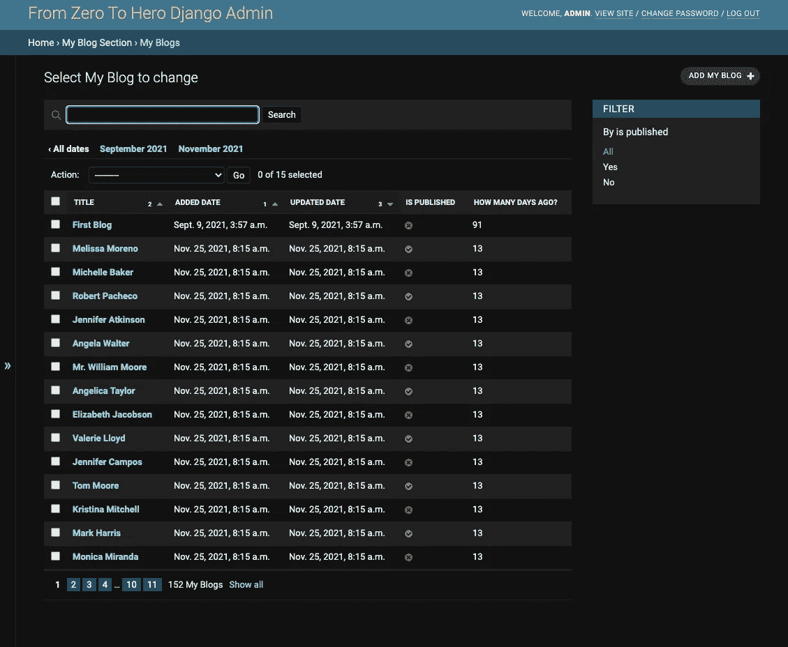
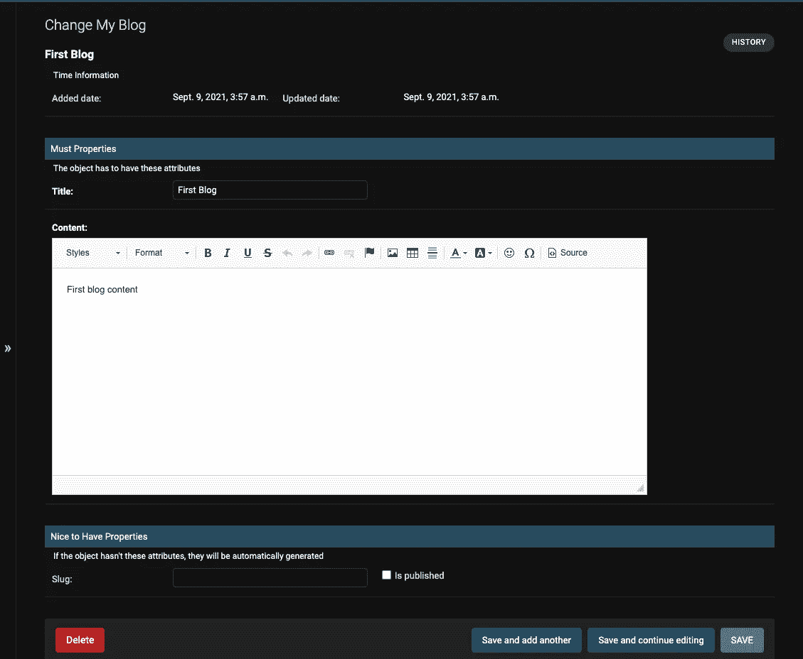
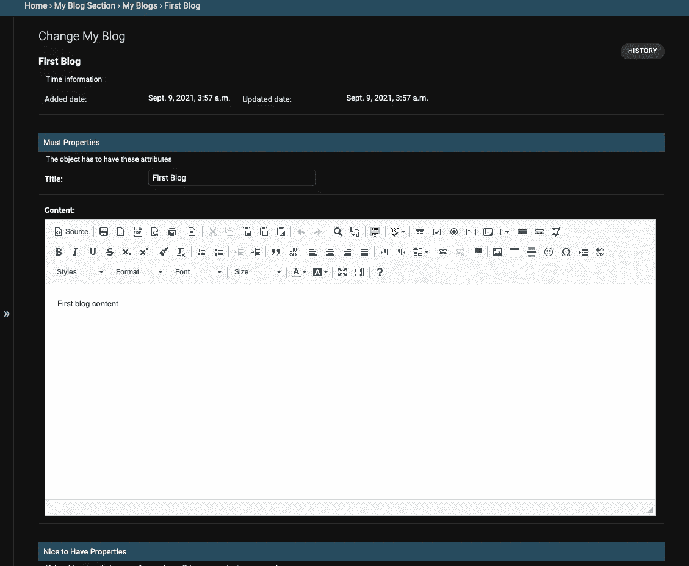

# 从零到英雄姜戈管理员:高级模型管理员 2(第 4 部分)

> 原文：<https://medium.com/nerd-for-tech/from-zero-to-hero-django-admin-advanced-level-modeladmin-class-2-part4-75608978bd76?source=collection_archive---------2----------------------->

## 在管理应用程序中使用模型属性，添加富文本编辑器

在这个故事中，我们将继续向 ModelAdmin 类添加新的属性。我们的目标是通过添加一些属性来扩展博客模型，并在本章的应用程序中实现 CK 编辑器。你可以从下面得到第四章的代码。

[](https://github.com/mebaysan/DjangoAdminForMedium/tree/chapter4) [## 第 4 章 GitHub-mebaysan/djangodadminformedium

### 我开始准备这个 repo 来解释我们如何在 Django 中定制管理应用程序。本次回购依赖于一个媒介…

github.com](https://github.com/mebaysan/DjangoAdminForMedium/tree/chapter4) 

照片由 [Faisal](https://unsplash.com/@faisaldada?utm_source=unsplash&utm_medium=referral&utm_content=creditCopyText) 在 [Unsplash](https://unsplash.com/@faisaldada?utm_source=unsplash&utm_medium=referral&utm_content=creditCopyText) 上拍摄

# 扩展博客模型

我们将向模型添加一个属性。因此，我们将获得博客对象的创建时间。

```
from django.utils import timezoneclass Blog(models.Model): @property
   def get_when_was_created(self):
      return (timezone.now() - self.added_date).days
```

该属性将返回对象创建以来的天数。记住，我们需要导入`timezone`模块来计算这个。



作者图片

# 扩展 ModelAdmin 类

## 列表 _ 显示

我们可以在这个领域使用模型属性。如果我们将之前创建的属性添加到 ModelAdmin 类的`list_display`字段中，我们可以在列表中看到它。

```
class BlogAdmin(admin.ModelAdmin):
   ...
   list_display = ['title', 'added_date', 'updated_date', 
   'is_published',
   'get_when_was_created' # the property we created
   ]
```



作者图片

此外，我们可以在 ModelAdmin 类中使用稍微不同的方法做同样的事情。我将向 admin 类添加一个方法。

```
from django.utils import timezoneclass BlogAdmin(admin.ModelAdmin):
   def get_when_was_created_from_admin(self, obj):
      return (timezone.now() - obj.added_date).days

   get_when_was_created_from_admin.short_description = 'How Many Days Ago?'
```

实际上，代码看起来类似于我们上面的代码。我们刚刚添加了`obj`参数。因为，当 admin 类调用这个函数时，会传递一个对象给它。然后，我们可以通过使用传递给函数的对象来应用或计算一些东西。我再次在`list_display`字段中添加了方法名。正如我们所料，我们看到一个新的列:“多少天前？”。



作者图片

有一点小小的不同，如果我们使用 admin 类添加列，我们可以使用`short_description`属性来更改列名。但是我们不能通过使用模型类属性来改变列名。

# 添加富文本编辑器:CK 编辑器

[有一堆编辑器可以用](https://blog.devgenius.io/best-free-wysiwyg-editor-python-django-admin-panel-integration-d9cb30da1dba)。我将使用 [CK 编辑器](https://ckeditor.com/)。

首先，我要通过`pip`安装`django-ckeditor`。

```
pip install django-ckeditor
```

然后添加到`INSTALLED_APPS`中。

```
INSTALLED_APPS = [
'django.contrib.admin',
'django.contrib.auth',
'django.contrib.contenttypes',
'django.contrib.sessions',
'django.contrib.messages',
'django.contrib.staticfiles',
'blog.apps.BlogConfig',
'ckeditor'
]
```

现在，我们需要在博客模型中实现它。我将从`blog/models.py`文件中的`ckeditor.fields`导入`RichTextField`。然后，更改`content`字段。

```
from ckeditor.fields import RichTextFieldclass Blog(models.Model):
   ...
   content = RichTextField()
```

我通过将更改迁移和推送到数据库来完成这个实现过程。

```
python manage.py makemigrations 
python manage.py migrate
```

我们可以通过任何博客对象的详细信息页面看到实现的 CK 编辑器。



作者图片

此外，我们可以自定义编辑器。我打算给`settings.py`文件添加一本字典。

```
CKEDITOR_CONFIGS = {
   'default': {
      'toolbar': 'full',
      'height': 700,
      'width': 1000
      }
   }
```

我们可以看到这个选项字典的完整工具栏。如果你想更多的定制，你可以查看文档。



作者图片

# 最后

我在写作和编码的时候喜欢这个故事。希望你在阅读的时候也喜欢它。如果你喜欢这个故事，你可以在下面看到更多。

[](https://github.com/mebaysan/DjangoAdminForMedium) [## GitHub-mebaysan/djangodadminformedium:为中型 Django 管理博客系列创建

### 我开始准备这个 repo 来解释我们如何在 Django 中定制管理应用程序。本次回购依赖于一个媒介…

github.com](https://github.com/mebaysan/DjangoAdminForMedium) 

亲切的问候。