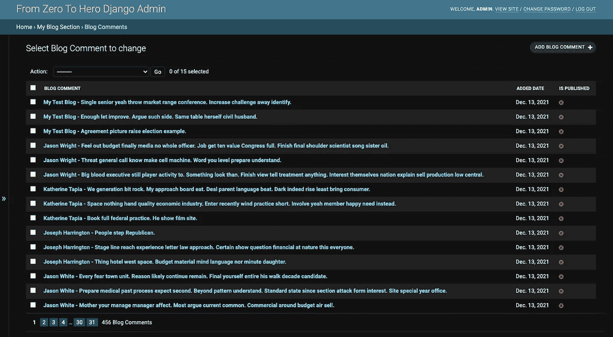
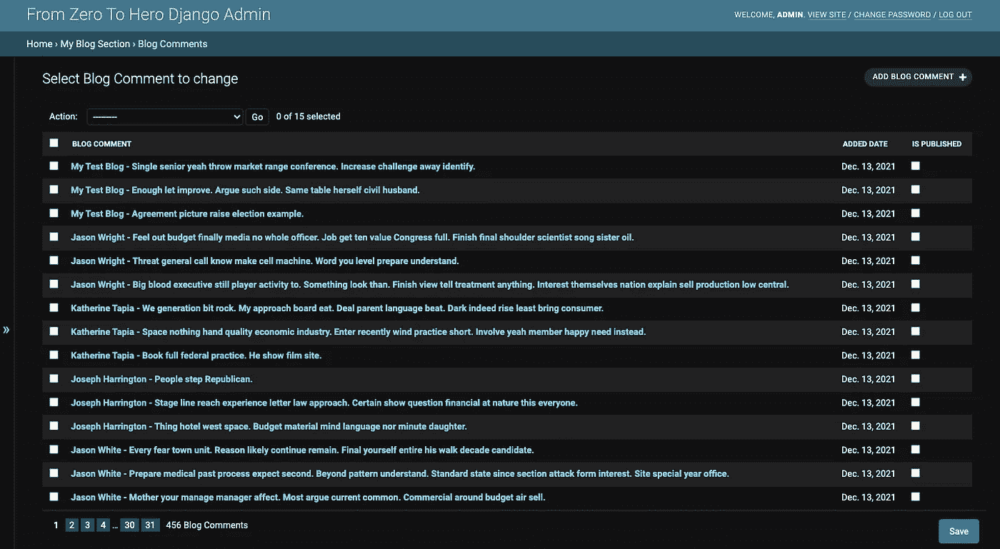
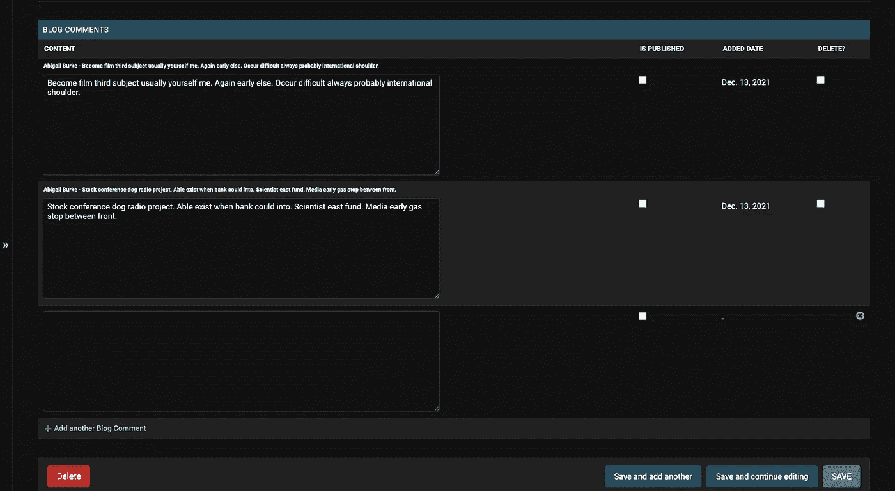
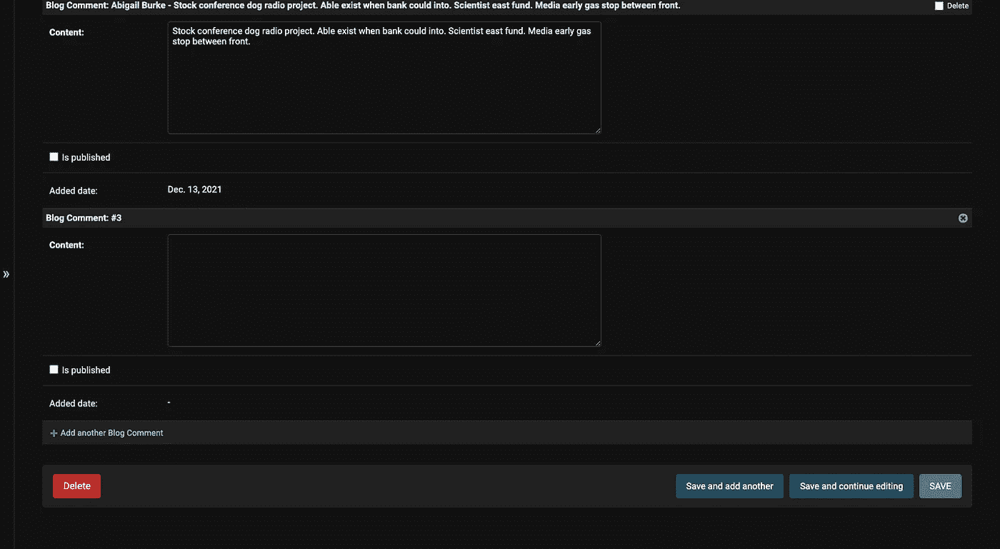
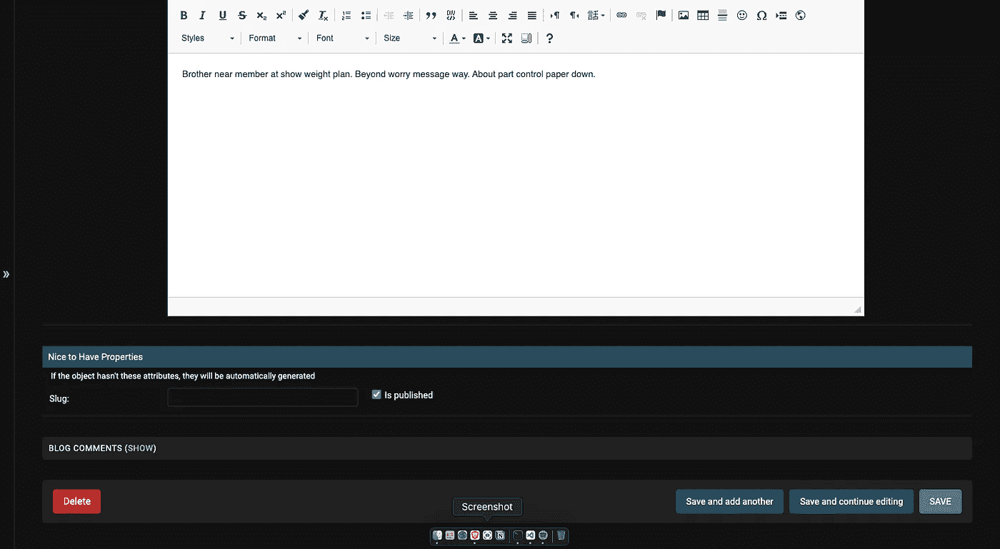
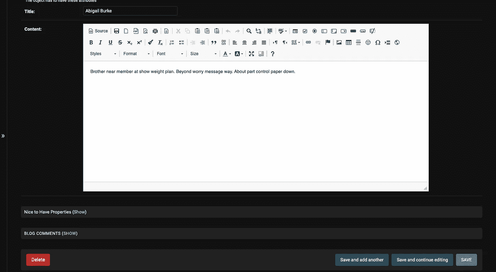
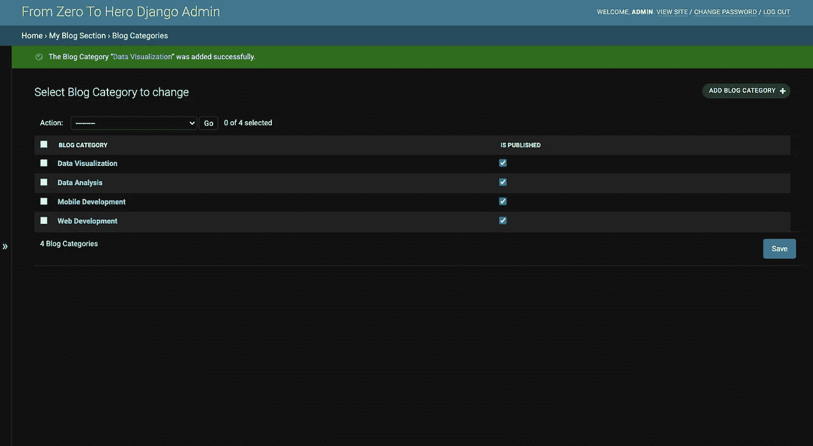
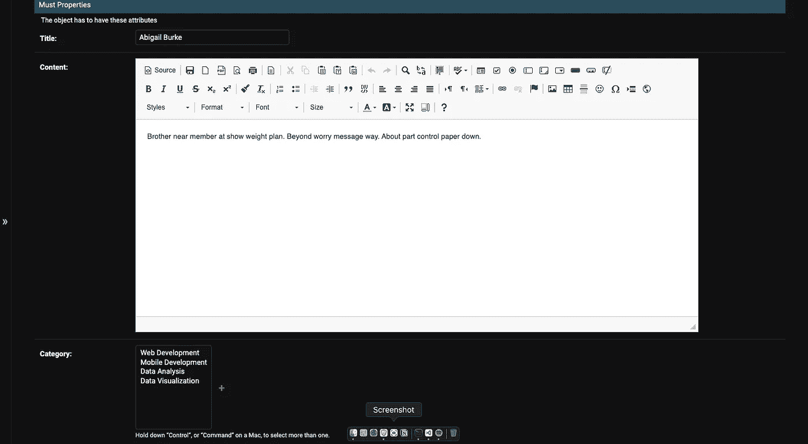
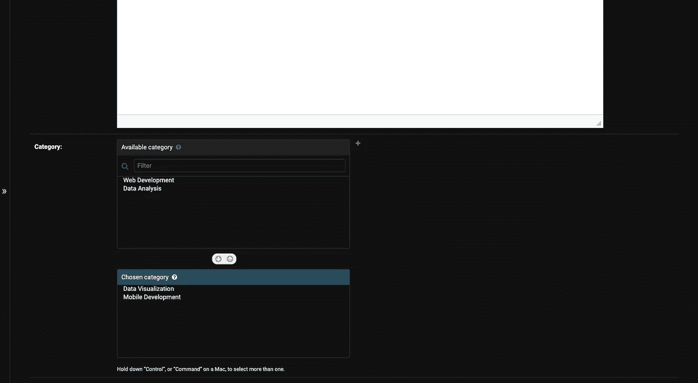
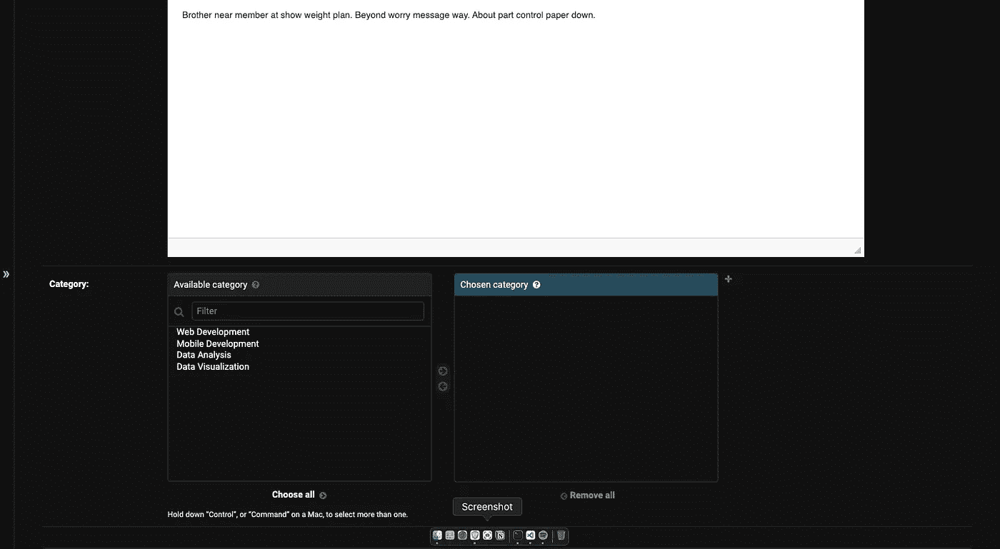

# 从零到英雄 Django 管理:模型关系(第五部分)

> 原文：<https://medium.com/nerd-for-tech/from-zero-to-hero-django-admin-model-relations-part5-c4c60c6d57a7?source=collection_archive---------0----------------------->

## 列出可编辑的，表格和堆叠的内嵌，折叠部分，水平和垂直过滤器

多好的一周啊！一堆工作会议，然后完成一些任务，并试图开发一个新的永久工作的基础设施。现在我可以把这几行字写成冥想。我在写作的时候满足了自己。希望你在阅读的同时也会感到满意。我们将在本文中尝试介绍 Django 的模型关系。然后，我们将使用这些关系定制管理应用程序。我们开始吧。


[Faisal](https://unsplash.com/@faisaldada?utm_source=unsplash&utm_medium=referral&utm_content=creditCopyText) 在 [Unsplash](https://unsplash.com/@faisaldada?utm_source=unsplash&utm_medium=referral&utm_content=creditCopyText) 上拍摄的照片

# 介绍

基本上，我们会指出这些主题:

*   一对一的关系
*   使用伪造者创建伪数据
*   什么是表格和堆叠内联
*   admin 类的 list_editable 属性
*   什么是折叠部分
*   多对多关系
*   什么是垂直和水平过滤器

# 一对一的关系

通过使用一对一关系，我们假设一个对象只有一个对象关系。例如，如果我们在`Book`和`Category`对象之间创建一对一的关系，每个 book 实例只有一个 category 实例作为`book_category`字段。

我将在`blog/models.py`文件中创建`Comment`类。

```
class Comment(models.Model):
   blog = models.ForeignKey(
to='blog.Blog', related_name='comments', on_delete=models.CASCADE)
   content = models.TextField()
   is_published = models.BooleanField(default=False)
   added_date = models.DateField(auto_now_add=True) class Meta:
      verbose_name = 'Blog Comment'
      verbose_name_plural = 'Blog Comments'

   def __str__(self):
      return f"{self.blog.title} - {self.content}"
```

然后，进行迁移。

```
python manage.py makemigrations && python manage.py migrate
```

## 使用 Faker 创建虚拟数据

现在我们需要创建虚拟数据。我们已经习惯了使用本系列早期的 Faker。我要进`shell`。

```
# import models and module
from blog.models import Comment, Blog
from faker import Faker# create Faker instance
faker = Faker()# create dummy data
for blog in Blog.objects.iterator():
   comments = [Comment(content=faker.paragraph(), blog=blog) for _ in range(0,3)]
   Comment.objects.bulk_create(comments)
```

我们只需要为模型创建一个管理类。

```
class CommentAdmin(admin.ModelAdmin):
   list_display = ('__str__', 'added_date', 'is_published')
   list_per_page = 15 admin.site.register(Comment, CommentAdmin)
```

如果你到现在还在做同样的事情，我们可以期待看到如下列表。



作者图片

## 列表 _ 可编辑字段

我们可以设置一些字段的值，同时在表格中显示它们。例如，对象是否已发布。为此，我们需要在 admin 类中使用`list_editable`。

```
class CommentAdmin(admin.ModelAdmin):
   ...
   list_editable = ('is_published',)
```



作者图片

## 表格和堆叠内嵌

假设我们想在`Blog`对象的详细页面上看到`Blog`对象的相关`Comment`对象。此外，我们想修改`Blog`对象的详细页面上的注释。或者在同一页面上添加新的注释。我们在这样的场景中使用`Inlines`。我们需要按照以下步骤来使用内联:

*   为相关模型(`admin.TabularInline`或`admin.StackedInline`)创建一个内联类
*   在您想要使用的主模型中注册内联类(模型管理类的`inlines`字段)

我将创建一个内联类。

```
class CommentInline(admin.TabularInline):
   model = Comment
   fields = ('content', 'is_published', 'added_date')
   readonly_fields = ('added_date',)
   extra = 1
```

*   我们在将在`model`字段中创建的内联类中设置模型
*   我们设置将在内联类中显示的字段
*   如果我们想显示一个不可编辑的字段，我们需要在`readonly_fields`字段中反映它
*   我们可以通过设置`extra`字段来限制额外的添加形式

现在我们需要在模型管理类中注册这个类。

```
class BlogAdmin(admin.ModelAdmin):
   inlines = (CommentInline,)
```

当我们转到博客对象的详细信息页面时，我们可以看到相关的对象。此外，我们可以添加、更新和删除它们。



按作者分类的图像(内嵌表格)

那么，`StackedInline`是什么？只是内联风格不同而已。我们只需要使用`admin.StackedInline`而不是`admin.TabularInline`。

```
class CommentInline(admin.StackedInline):
   model = Comment
   fields = ('content', 'is_published', 'added_date')
   readonly_fields = ('added_date',)
   extra = 1
```



按作者分类的图像(内嵌堆叠)

## 崩溃的部分

其实这只是一个 CSS 类。我们在上面看到一个长长的表格。我们可以把它改成下拉结构。我在下面的内联类中添加了一个 CSS 类。

```
class CommentInline(admin.StackedInline):
   classes = ('collapse',)
```



作者图片

我们在上面看到一个折叠的内嵌。此外，我们可以将相同的 CSS 类添加到字段集中。我将把它添加到`BlogAdmin`字段集中。

```
class BlogAdmin(admin.ModelAdmin):
   fieldsets = (
      ...
       ('Nice to Have Properties', {'fields': (('slug', 'is_published'),),
      'description': 'If the object hasn\'t these attributes, they will be automatically generated', 
     'classes': ('collapse',)} # I added a CSS class
)
```



作者图片

我们折叠了`BlogAdmin`类的最后一个字段集。

# 多对多关系

为了解释这种关系，我们可以假设我们有`Blog`和`Category`模型。每个博客可以有多个类别，每个类别可以有多个博客。这种类型的关系是多对多关系。

## 创建多对多关系

我将创建`Category`模型类。

```
class Category(models.Model):
   name = models.CharField(max_length=255)
   is_published = models.BooleanField(default=True)

   class Meta:
      verbose_name = 'Blog Category'
      verbose_name_plural = 'Blog Categories' def __str__(self):
      return self.name
```

然后，将一个字段添加到我们已经有的`Blog`模型类中。

```
class Blog(models.Model):
   ...
   category = models.ManyToManyField(to='blog.Category', related_name='blogs')
```

并对数据库进行迁移和推送更改

```
python manage.py makemigrations && python manage.py migrate
```

现在，我们可以为类别模型创建一个管理类。

```
class CategoryAdmin(admin.ModelAdmin):
   list_display = ('__str__', 'is_published')
   list_per_page = 15
   list_editable = ('is_published',) admin.site.register(Category, CategoryAdmin)
```

我将手动创建一些虚拟数据。



作者图片

## 垂直和水平过滤器

现在，如果我们转到博客对象的详细信息页面，我们看不到类别字段。因为我们已经在 admin 类中设置了字段集。我将更新 BlogAdmin 类中的字段集，以显示类别字段。

```
class BlogAdmin(admin.ModelAdmin):
   ... fieldsets = ((None, {'fields': (('added_date', 'updated_date'),),'description': 'Time Information'}),('Must Properties', {'fields': ('title', 'content','category'),'description': 'The object has to have these attributes'}),('Nice to Have Properties', {'fields': (('slug', 'is_published'),),'description': 'If the object hasn\'t these attributes, they will be automatically generated','classes': ('collapse',)}))
```



作者图片

我们可以通过使用`filter_vertical`或`filter_horizontal`来改变多对多表单域的样式。我们需要给出想要使用过滤器组件过滤的字段名称。在我们的例子中，我们需要过滤类别来设置博客的类别。

```
class BlogAdmin(admin.ModelAdmin):
   ...
   filter_vertical = ('category',)
```



按作者分类的图像(垂直过滤)

此外，我们可以改变过滤器的风格如下。

```
class BlogAdmin(admin.ModelAdmin):
   ...
   filter_horizontal = ('category',)
```



按作者分类的图像(水平过滤)

# 最后

希望这是有帮助的。你可以从下面得到所有的代码。另外，你可以从下面得到这个系列的全部内容。

[](https://github.com/mebaysan/DjangoAdminForMedium) [## GitHub-mebaysan/djangodadminformedium:为中型 Django 管理博客系列创建

### 我开始准备这个 repo 来解释我们如何在 Django 中定制管理应用程序。本次回购依赖于一个媒介…

github.com](https://github.com/mebaysan/DjangoAdminForMedium) 

事实上，我已经完成了我认为应该解释的关于 Django Admin 的核心主题。我将会写关于 Django 的额外插件，如何在 list_display 字段显示图片，等等。如果我将来写作。

亲切的问候。