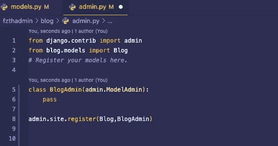
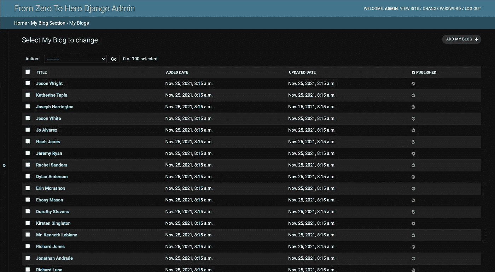
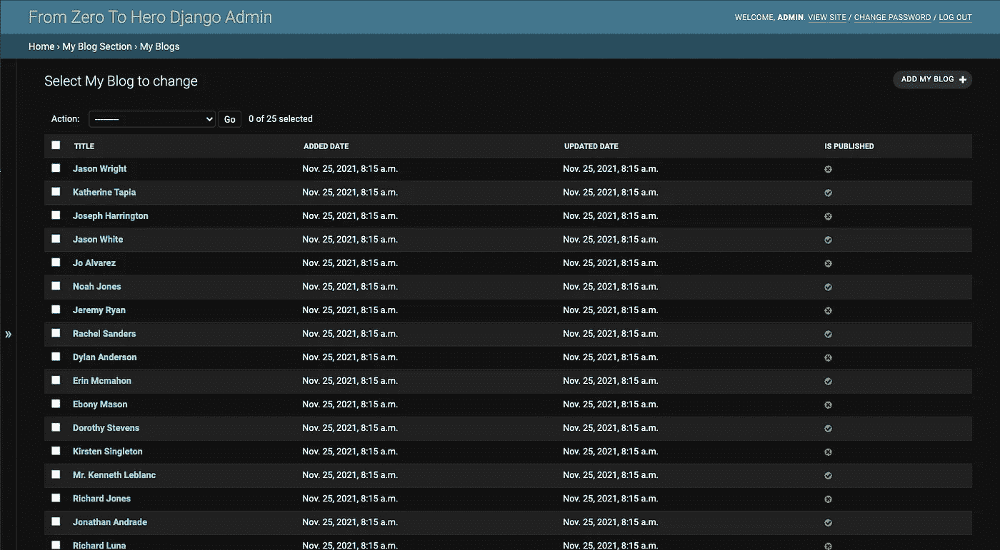
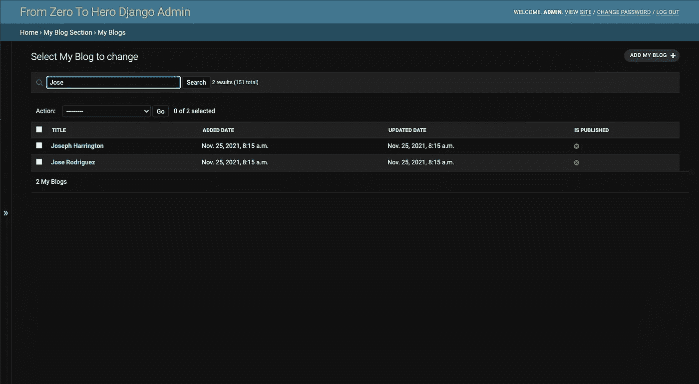
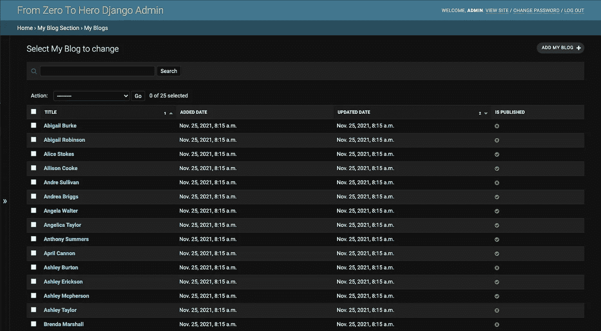
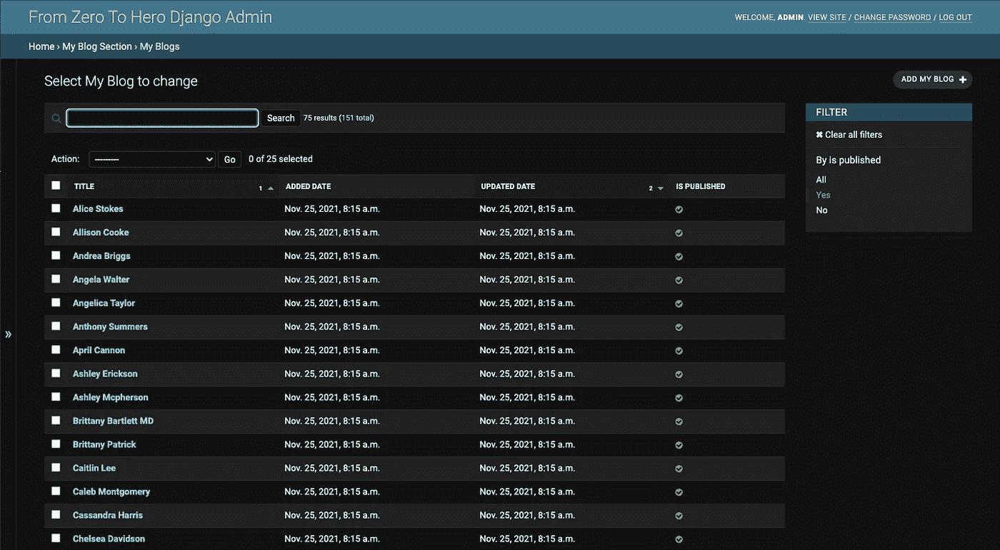
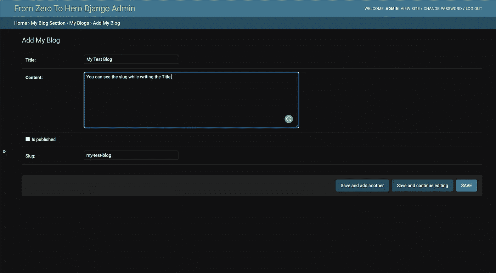
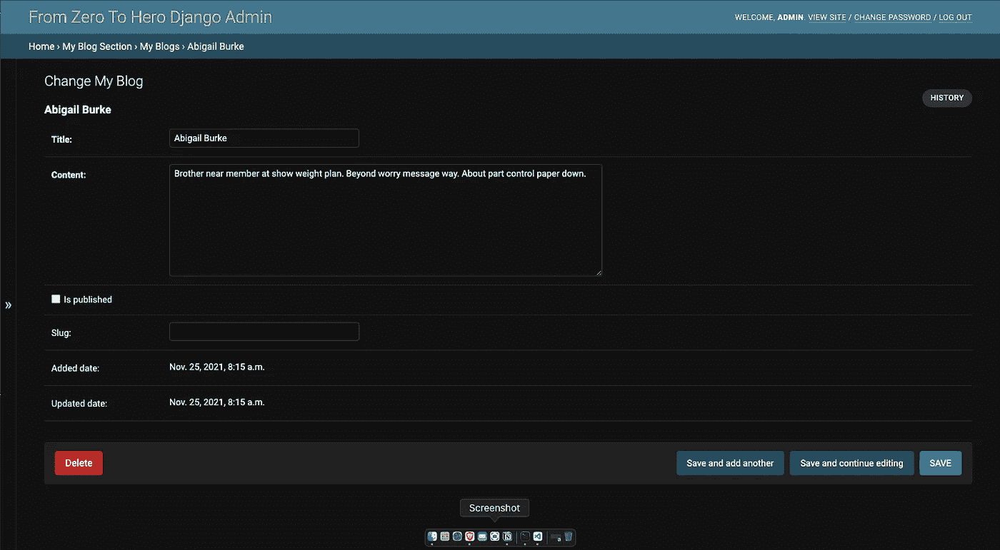

# 从零到英雄 Django Admin: ModelAdmin 类(第二部分)

> 原文：<https://medium.com/nerd-for-tech/from-zero-to-hero-django-admin-modeladmin-class-part2-2c8665d6cd5?source=collection_archive---------0----------------------->

## Faker 包，ModelAdmin 类，ModelAdmin 类的基本字段

在之前的故事中，我们已经深入到 Django 管理应用程序中。你可以从[这里](/nerd-for-tech/from-zero-to-hero-django-admin-set-up-part1-253cd3a5a723)进入。在这个故事中，我们将继续尝试理解什么是`ModelAdmin`类以及我们如何使用它。另外，您可以从下面获取代码。

[](https://github.com/mebaysan/DjangoAdminForMedium) [## GitHub-mebaysan/djangodadminformedium:为中型 Django 管理博客系列创建

### 此时您不能执行该操作。您已使用另一个标签页或窗口登录。您已在另一个选项卡中注销，或者…

github.com](https://github.com/mebaysan/DjangoAdminForMedium) 

[Faisal](https://unsplash.com/@faisaldada?utm_source=unsplash&utm_medium=referral&utm_content=creditCopyText) 在 [Unsplash](https://unsplash.com/@faisaldada?utm_source=unsplash&utm_medium=referral&utm_content=creditCopyText) 上拍摄的照片

# 介绍

在这一节中，我将说明我们在阅读这个故事时将会做些什么。

*   扩展`Blog`模型
*   安装`Faker`包并创建虚拟条目
*   基本`ModelAdmin`属性:`list_filter`、`list_display`、`list_per_page`、`ordering`、`search_fields`、`prepopulated_fields`、`readonly_fields`

# 扩展博客模型

我将创建`models.py`文件，并将`is_published`和`slug`字段添加到`Blog`模型中。这些字段将帮助我们过滤数据，以确定 blog 是否已发布，并展示我们如何使用一些 ModelAdmin 属性。

```
class Blog(models.Model): title = models.CharField(max_length=255) content = models.TextField() added_date = models.DateTimeField(auto_now_add=True) updated_date = models.DateTimeField(auto_now=True) is_published = models.BooleanField(default=False,null=False,blank=False)    

   slug = models.SlugField(null=True,blank=True) class Meta: verbose_name = 'My Blog' verbose_name_plural = 'My Blogs' def __str__(self): return self.title
```

然后，我执行下面的命令将更改推送到数据库。

```
python manage.py makemigrations && python manage.py migrate
```

# 安装 Faker 并创建虚拟条目

我使用`pip install Faker`在我的虚拟环境中安装`Faker`包。然后，我使用`python manage.py shell`进入 Django shell。我在打开的 shell 中执行下面的代码。

```
>>> from blog.models import Blog
>>> from faker import Faker>>> faker_instance = Faker()>>> for i in range(150):
...     Blog(title = faker_instance.name(), content=faker_instance.paragraph(), is_published = True if i % 2 == 0 else False).save()
```

通过上面的代码，我们创建了 151 个`Blog`条目。这似乎是非常基本的 Python 代码，因此我不会深入研究上面的代码。

# ModelAdmin 简介

此后，我们将只处理`admin.py`文件。我们使用`ModelAdmin`类来创建模型的管理界面。然后，正如我们在前面的故事中所做的那样，我们将接口类和原始模型类一起推送到`admin.site.register`函数。



作者图片

现在什么都不会改变，因为尽管我们一起注册了接口类和模型类，但是我们没有编写任何`ModelAdmin`属性。

# 模型管理属性

## 列表 _ 显示

如果你的代码和我的一样，当你进入`My Blogs`部分时，你应该会在屏幕上看到下面的内容。


图片作者。在您的计算机上，屏幕可能看起来发生了变化。我在 Mac 上使用了深色主题。

如果我们想在这个表中添加新的字段，我们需要使用`list_display`字段来管理接口类。

```
class BlogAdmin(admin.ModelAdmin): list_display =    ['title','added_date','updated_date','is_published']
```

现在我们可以在`My Blogs`部分看到表格上的字段。



## 每页列表

默认情况下，管理应用程序每页显示 100 个条目。我们可以通过使用管理接口类中的`list_per_page`字段来改变每页显示的条目数。

```
class BlogAdmin(admin.ModelAdmin):
   ...
   list_per_page = 25
```



作者图片

## 搜索 _ 字段

我们可以通过添加这个字段来添加一个搜索栏。我们需要在这个字段中设置我们的搜索字段。当我们在条目中搜索一些关键字时，管理应用程序将根据我们在管理接口类的`search_fields`中设置的字段进行搜索。

```
class BlogAdmin(admin.ModelAdmin):
   ...   
   search_fields = ['title','content']
```



作者图片

## 排序

我们可以改变表中的顺序。为此，我们需要在管理接口类中使用`ordering`字段。

```
class BlogAdmin(admin.ModelAdmin):
   ...
   ordering = ['title', '-updated_date']
```

我们按照 A-Z 和降序对条目进行排序`updated_date`。



作者图片

## 列表 _ 过滤器

我们还可以在右边栏添加过滤器。为此，我们应该在管理接口类中使用`list_filter`字段。我们可以将它用于非布尔字段，但我们将在后面看到这一点。

```
class BlogAdmin(admin.ModelAdmin):
   ...
   list_filter = ['is_published']
```



作者图片

## 预填充 _ 字段

我们用这个场同时操纵一些场。举个例子，我们有一个废料场。我们想在写标题的时候设置这个 slug。

```
class BlogAdmin(admin.ModelAdmin):
   ...
   prepopulated_fields = {'slug': ['title']}
```

与上面提到的字段不同，我们应该将其设置为字典类型。字典的键必须反映被操作的字段，字典的值必须反映将操作键字段的字段。



作者图片

## 只读字段

如果有些字段我们不想让它们可编辑，我们可以使用`readonly_fields`字段只显示它们。

```
class BlogAdmin(admin.ModelAdmin):
   ...
   readonly_fields = ['added_date', 'updated_date']
```



作者图片

# 最后

希望你在阅读的时候获得了一些信息，并且喜欢它。我喜欢写作，希望你也喜欢。您可以从下面访问 GitHub repo。

[](https://github.com/mebaysan/DjangoAdminForMedium) [## GitHub-mebaysan/djangodadminformedium:为中型 Django 管理博客系列创建

### 此时您不能执行该操作。您已使用另一个标签页或窗口登录。您已在另一个选项卡中注销，或者…

github.com](https://github.com/mebaysan/DjangoAdminForMedium) 

你可以在官方[文档](https://docs.djangoproject.com/en/3.2/ref/contrib/admin/)中获得更多细节。

亲切的问候。