# 从零到英雄 Django 管理:设置(第一部分)

> 原文：<https://medium.com/nerd-for-tech/from-zero-to-hero-django-admin-set-up-part1-253cd3a5a723?source=collection_archive---------5----------------------->

## 设置，模型注册，元关键字，应用程序部分，管理网站标题

大家好！想要喘口气，我决定在学习数据的同时开始写这个系列。


费萨尔在 [Unsplash](https://unsplash.com/s/photos/django?utm_source=unsplash&utm_medium=referral&utm_content=creditCopyText) 上拍摄的照片

我参加了一个为期 4 个月的机器学习训练营。在此期间，我想只关注与数据相关的主题。老实说，与此同时我仍然想继续 web 开发，但是我不能提高我关于 web 开发的新技术的知识，因为我不愿意在这段时间花精力在数据以外的事情上。因此，我决定开始这个系列。我将根据我已有的信息来写。这个系列将是关于“Django Admin”的定制。事实上，我已经有了一个关于这个话题的 [Youtube 视频系列](https://youtube.com/playlist?list=PLhbONZ0ITs2QKo-fFNhq5mTPISqLSIBei)和几个故事，[这个](https://mebaysan.medium.com/django-admin-dashboard-g%C3%B6r%C3%BCn%C3%BCm-eklemek-d2c6ab28f5d5)和[这个](https://mebaysan.medium.com/django-admin-dashboard-g%C3%B6r%C3%BCn%C3%BCmleri-%C3%B6zelle%C5%9Ftirmek-d2fbf36cae67)但是它们是土耳其语的。在用英语制作之前，我需要先提高它。为了达到这个英语水平，我的英语老师经常督促我写文章。


维塔利·塔拉诺夫在 [Unsplash](https://unsplash.com/s/photos/freelance-money?utm_source=unsplash&utm_medium=referral&utm_content=creditCopyText) 上拍摄的照片

其实我也不知道这个系列会包括多少部分。我会试着在“Django Admin”中触及细节。我将展示一些使我们的管理面板更有效的包。我们将触摸“模型管理”，“自定义模板”，“导入和导出”，添加新的视图到“Django 管理”等。我希望你会喜欢这次旅行。我已经开始享受这个旅程了，因为我看到了“Django Admin”的力量。我用“Django Admin”做了一些自由职业项目，得到了很好的客户反馈。如果您可以定制您的仪表板，您就不需要使用其他仪表板模板或实现仪表板前端。

# 让我们开始旅程吧

对于这个故事，我创建了一个虚拟环境“venv ”,并安装了 Django。你可以从[这里](https://github.com/mebaysan/DjangoAdminForMedium)访问该项目的 GitHub 链接。

```
pip install django
```

我将创建一个简单的 Django 项目并运行服务器。我将进行迁移并创建一个超级用户。

```
django-admin startproject fzthadmincd fzthadminpython manage.py migratepython manage.py createsuperuserpython manage.py runserver
```


在此之前，我们还没有做过任何有趣的事情。

# 创建模型

目前，我们的 Django 应用程序只有一个博客模型。我要创建一个新的应用程序。

> 正如你可能知道的，我们使用`startapp`命令在 Django 中创建新的应用。

```
python manage.py startapp blog
```

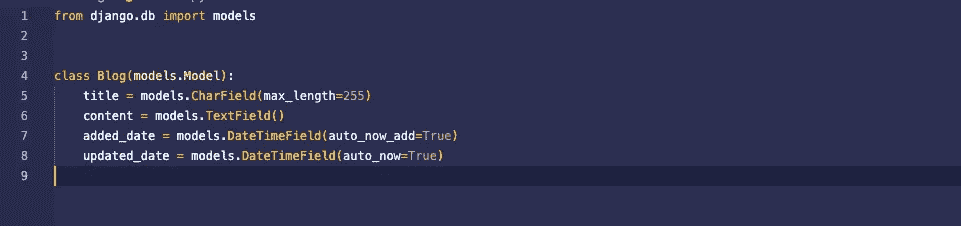

创建模型后，我们需要进行迁移。什么是迁移？我们可以说，我们让 Django 知道了数据库的修改。我们使用“makemigrations”命令让 Django 知道，并使用“migrate”命令将它们应用到数据库。首先，我们需要将博客应用程序保存到 Django 的已安装应用程序中。如果我们不这样做，Django 将不会理解我们有与博客应用程序相关的模型或东西。

为了将博客应用程序添加到已安装的应用程序中，我将使用`settings.py` 文件。正如我们所知，这个文件包含了 Django 项目的核心设置。我需要将应用程序添加到`INSTALLED_APPS`列表中。

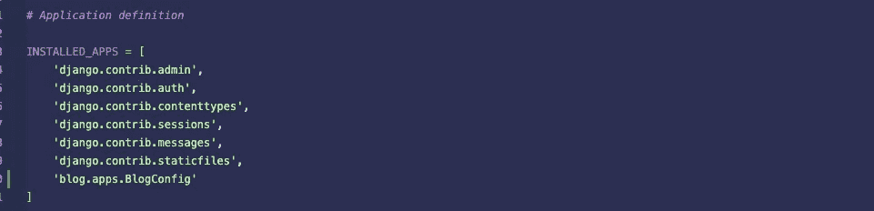

现在我可以执行`makemigrations`和`migrate`命令了。如果您看到如下输出，那么您的方法是正确的。

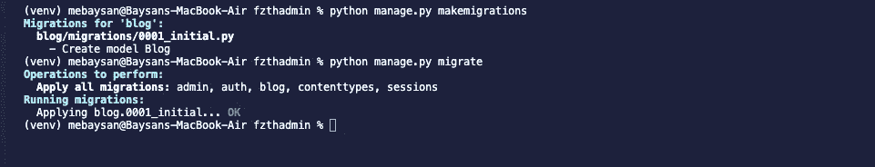

# 模型注册

在本节中，我们将把博客模型注册到 Django 管理应用程序中。为此，我将使用位于`blog`文件夹下的`admin.py`。我们使用这个文件来注册模型。每个 Django 应用都有自己的`admin.py`文件。

我在这个文件中导入了博客模型，并使用`admin.site.register`函数将它注册到管理应用程序中。该功能帮助我们将模型注册到管理应用程序中。

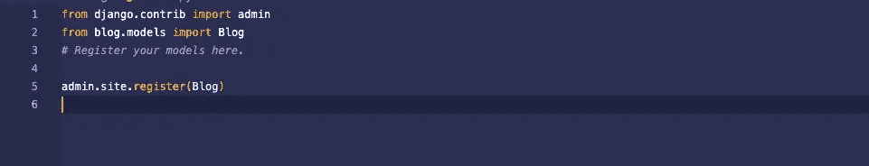

我要去管理仪表板，我可以看到“博客”部分，如果事情做得正确。


# 更改应用程序部分标题

在我们去元课堂之前，我想分享一个花絮。如果我们想改变应用程序的部分标题，我们需要进入它的`apps.py`文件并配置`AppConfig` 类。如果我设置了`verbose_name`字段，则部分标题将接受它。

```
from django.apps import AppConfigclass BlogConfig(AppConfig): default_auto_field = 'django.db.models.BigAutoField' name = 'blog' verbose_name = 'My Blog Section'
```

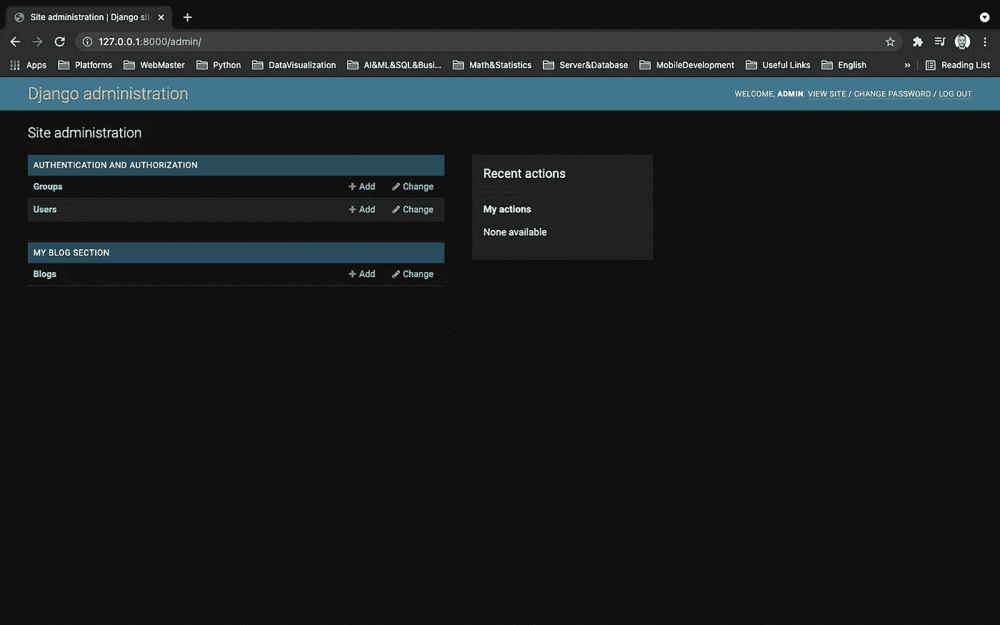

# 元类

在 Django，我们有“元”类。我不会解释什么是元类，但是我会提到在 Django admin 中使用元类可以做什么。你可以从 Django 的官方文档中获得更多信息。

我们可以在元类中改变模型的显示名称。

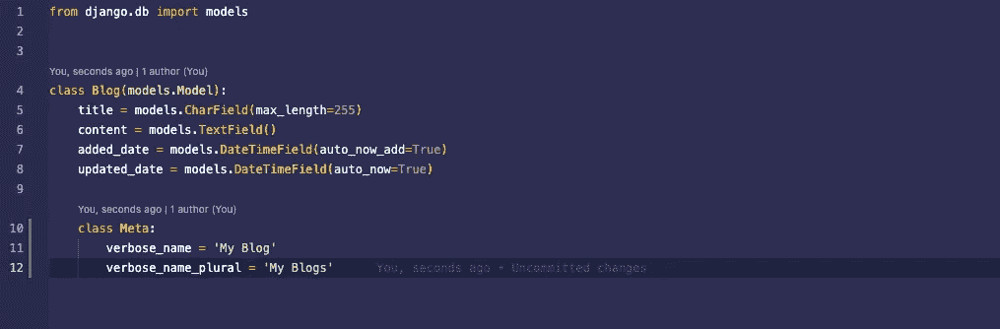

在这种情况下，我告诉 Django，在管理仪表板中更改模型的显示名称。如果有多个博客，Django 会说“我的博客”，如果只有一个博客，它会说“我的博客”，如下所示。

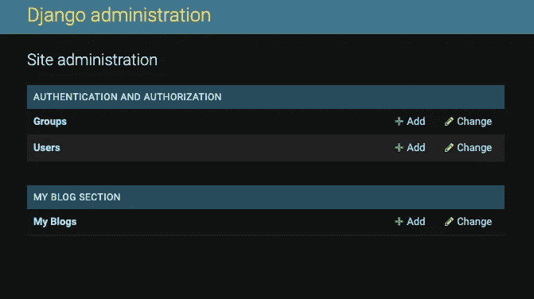

我会在我的应用程序中添加一些博客。

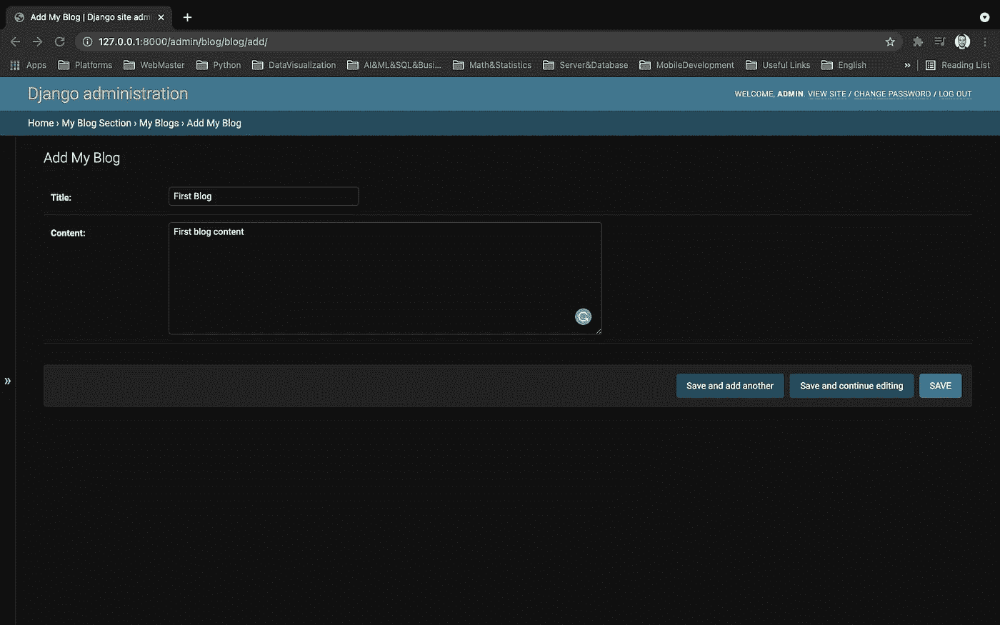

单个博客的示例

现在有另一件事可以让管理页面变得更好。如果我们转到“我的博客”页面，我们会在表格中看到类似于`Blog object(1)`的博客。

> 不要忘记进行迁移并应用它们，因为我们已经更改了模型类。

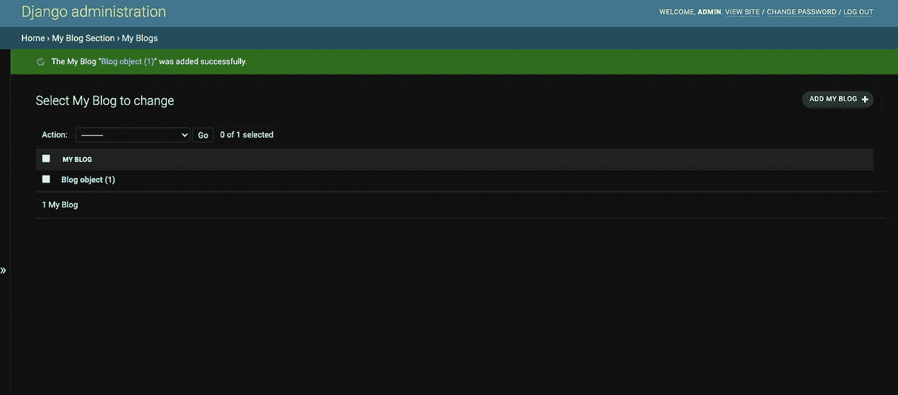

我们可以改变模型内部的`__str__`方法。这是一个纯粹的 Python 特性。如果不知道是什么，可以在这里[学习](https://www.educative.io/edpresso/what-is-the-str-method-in-python)。

```
def __str__(self): return self.title
```

我在上面的模型类中编写了代码，Django 会理解它必须将对象的`title`字段放到表中。这意味着它用它的标题来表示对象。如果我们从 Django shell 执行下面的代码，那么对象将由它的标题特性来表示。

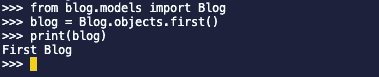

python manage.py shell

# 更改 Django 管理员头衔

在这一节中，我们将看到如何更改 Django admin 的头衔。

*   `admin.site.title`
*   `admin.site.header`
*   `admin.site.index_title`

对于这种情况，我们需要转到`urls.py`文件。下面的代码将改变管理仪表板的网站标题。

```
admin.site.site_title = 'From Zero To Hero Django Admin'
```

下面的代码将改变管理员的标题。

```
admin.site.site_header
```

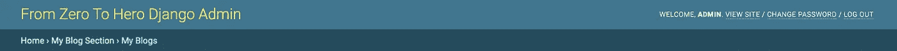

此部分是网站标题

下面的代码将改变索引页面的标题。

```
admin.site.index_title = 'Welcome To FZTH Django Admin'
```

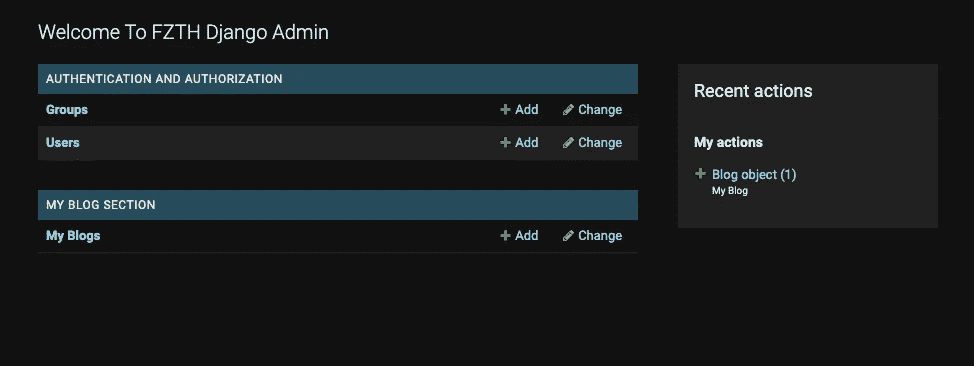

这是索引标题

# 最后的想法

希望你喜欢。正如我所说的，如果我们知道如何正确使用 Django admin，它会对我们的项目非常有用。下一个故事再见😇

亲切的问候。