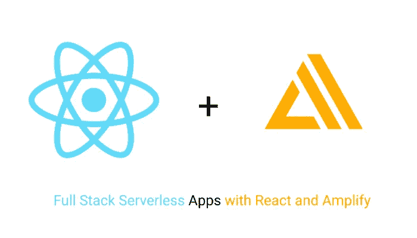
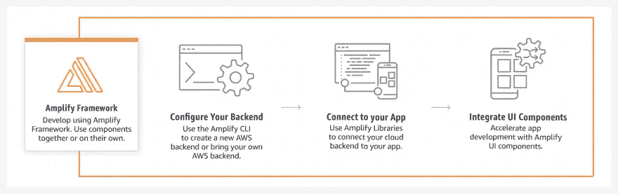
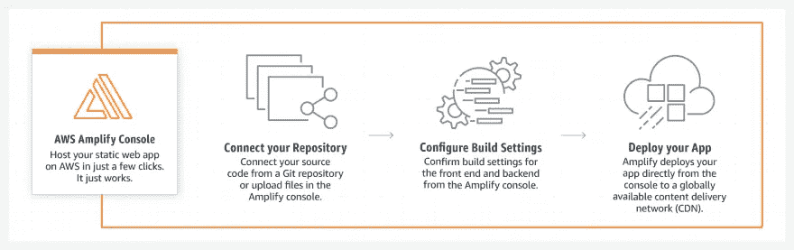
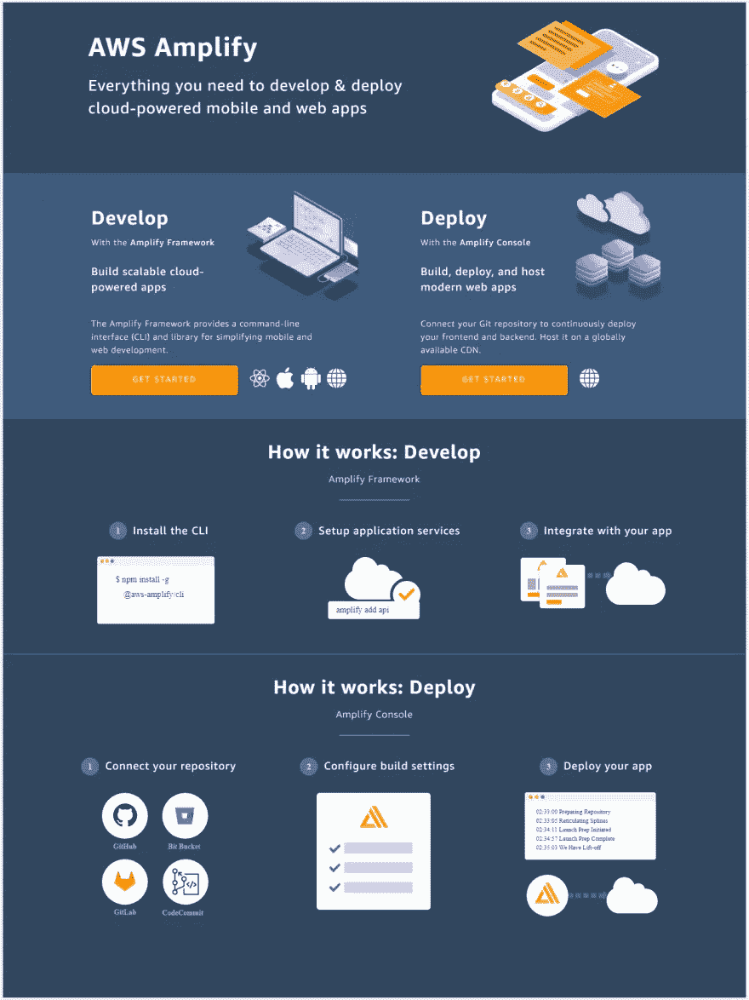

# 前端开发人员现在可以从零开始处理应用程序开发，直到部署。

> 原文：<https://medium.com/nerd-for-tech/front-end-developers-can-now-handle-the-application-development-from-scratch-till-deployment-456e28eef710?source=collection_archive---------8----------------------->

**AWS Amplify (AWS Cloud)** 将使前端开发人员的生活变得轻松，因为它允许以最快、最简单的方式开发可在 AWS Cloud 上扩展的移动和 web 应用程序。

**AWS Amplify** 是一套产品和工具，支持移动和前端 web 开发人员构建和部署安全、可扩展的全栈应用，由 AWS 提供支持。使用 AWS Amplify，您可以在几分钟内配置应用后端，只需几行代码就可以将它们连接到您的应用，并通过三个步骤部署静态 web 应用。借助 AWS Amplify 更快上市。

**AWS 放大优势:**

*   快速配置 AWS 后端
*   轻松连接到您的应用
*   只需几个步骤即可部署 web 应用
*   开发可扩展的移动和 web 应用的最快、最简单的方法

**AWS 放大功能:**

**Amplify 框架:**
**Amplify 库** — AWS Amplify 在 Amplify 框架中提供以用例为中心的开源库，用于构建云驱动的移动和 web 应用。Amplify 库由 AWS 服务提供支持，可以与使用 Amplify CLI 创建的新后端或您现有的 AWS 后端一起使用。

*   证明
*   数据存储
*   分析学
*   应用程序接口
*   相互作用
*   预言
*   公共订阅
*   推送通知
*   储存；储备
*   更多…

**Amplify UI Components**—Amplify UI Components 是一个开源的 UI 工具包，它将云连接的工作流封装在跨框架 UI 组件中。AWS Amplify 为您的应用程序提供了带有风格指南的嵌入式 UI 组件，可自动与您配置的云服务集成。

*   证明
*   储存；储备
*   相互作用
*   更多…

**Amplify CLI**—Amplify 命令行界面(CLI)是一个工具链，用于在 AWS 上创建和维护无服务器后端。通过遵循简单的交互式工作流来配置云功能，以指定应用功能，包括数据模型和身份验证要求。

*   后端配置
*   静态托管
*   API 定义

**静态 web 托管:** — AWS Amplify 控制台提供了一个 CICD 工作流，用于通过 AWS 控制台构建和部署全栈无服务器 Web 应用程序。一个全栈无服务器应用由一个后端和一个前端组成，后端由 GraphQL 或 REST APIs、文件和数据存储等云资源构建，前端由 React、Angular、Vue 等单页面应用框架构建。

*   功能分支部署
*   全球可用
*   自定义域设置
*   即时+原子部署
*   连续工作流
*   口令保护

**Amplify Framework 与多种平台或前端框架兼容:**
**Web:**

*   Java Script 语言
*   反应
*   有角的
*   某视频剪辑软件
*   Next.js

**手机:**

*   机器人
*   IOS
*   反应自然
*   离子的
*   摆动

**AWS Amplify 如何工作:**

开发应用程序

宿主 Web 应用程序

**只需几个 AWS Amplify CLI 命令(如下所示)就能让前端开发人员轻松工作，并让他们能够管理在 AWS 云上扩展的端到端应用程序开发&部署:**

*   注册一个 AWS 账户【https://portal.aws.amazon.com/billing/signup#/start
    T3
*   安装并配置 Amplify CLI
    NPM install-g @ AWS-Amplify/CLI
    Amplify configure
*   创建新的反应应用程序
    npm 创建-反应-应用程序反应-放大
    cd 反应-放大
    npm 开始
*   初始化一个新的后端
    放大初始化
*   添加和部署 API
    放大添加 api
    放大推送
*   添加认证/存储/更多
    放大添加认证
    放大添加存储
    放大推送
*   部署和托管应用程序
    放大添加托管
    放大发布

要开始使用 **AWS Amplify** 请访问:[https://docs.amplify.aws/start](https://docs.amplify.aws/start)