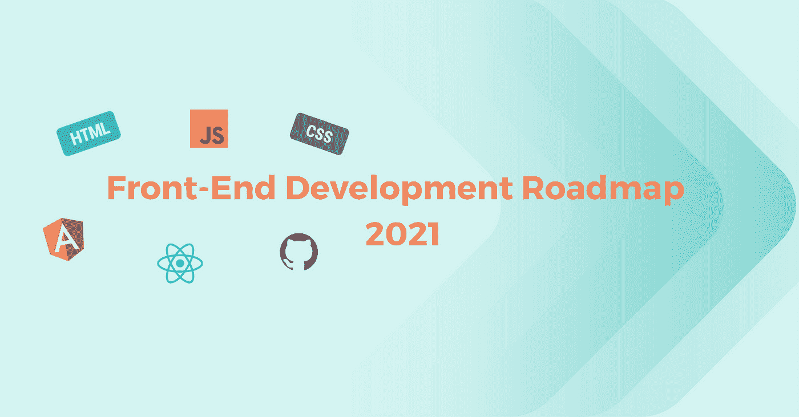
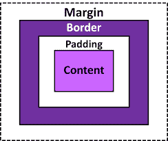
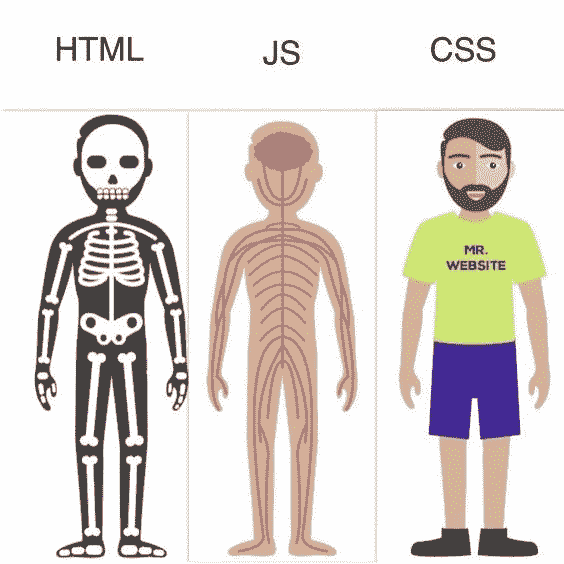

# 2021 年前端开发路线图

> 原文：<https://medium.com/nerd-for-tech/front-end-development-roadmap-for-2021-6ce976681f92?source=collection_archive---------2----------------------->

前端开发包括使用 HTML、CSS 和 JavaScript 来构建客户端应用程序。在线应用程序的客户端是 web 应用程序的可视部分，也是用户在应用程序打开时与之交互的部分:颜色、字体、按钮、导航、动画等。

前端开发包括应用程序的用户界面。用户访问网站时与之交互的所有内容，如登录或注册页面、主页、联系页面，都属于前端开发术语。

前端开发人员负责构建和实现网站或 web 应用程序的界面。他们使用 HTML、CSS 和 JavaScript 等 web 技术构建客户端应用程序。

然而在 2021 年，前端开发已经超越了 HTML、CSS 和 JavaScript。今年，作为一名前端开发人员，你需要学习很多 web 技术才能脱颖而出。

本文将涵盖 2021 年开始前端开发所需的全部内容。

# 基本终端用法(命令行)

终端是一个用于执行文本命令的接口，它让您可以访问底层操作系统。基本的终端使用是所有开发人员都需要的技能，不管他们的专业是什么。命令行非常重要，所以我强烈建议你多学习如何使用它。您对命令行越熟悉，作为前端开发人员的效率就越高。

## 以下是一些学习命令行的资源:

*   [命令行速成班](https://developer.mozilla.org/en-US/docs/Learn/Tools_and_testing/Understanding_client-side_tools/Command_line) — MDN web docs
*   [Linux 命令行入门](https://www.pluralsight.com/courses/getting-started-linux-command-line) — Pluralsight
*   [Linux 命令行基础](https://www.udacity.com/course/linux-command-line-basics%E2%80%93ud595) — Udacity
*   [学习终端](https://openclassrooms.com/en/courses/4614926-learn-the-command-line-in-terminal) — Openclassrooms 中的命令行
*   [学习命令行](https://www.codecademy.com/learn/learn-the-command-line) — Codecademy
*   [命令行速成班](https://www.youtube.com/watch?v=yz7nYlnXLfE) — Freecodecamp

# Git —版本控制

Git 是一个版本控制系统，使开发人员能够跟踪他们项目中的变更。Git 还帮助开发人员进行团队协作。开发人员之间需要 Git，以确保开发人员之间没有代码冲突。

## 这里有一些学习 Git 的资源:

*   [Git 手册](https://guides.github.com/introduction/git-handbook/) — Github 指南
*   [饭桶](https://git-scm.com/videos) —饭桶
*   [饭桶书](https://git-scm.com/book/en/v2) —饭桶
*   Git 简介 — Freecodecamp
*   [使用 Git 的版本控制](https://www.udacity.com/course/version-control-with-git%E2%80%93ud123) — Udacity
*   [Git & GitHub 初学者速成班](https://www.youtube.com/watch?v=SWYqp7iY_Tc&t=271s) — Traversy media
*   [15 分钟学会 Git](https://www.youtube.com/watch?v=USjZcfj8yxE)—柯尔特·斯蒂尔
*   [针对初学者的 Git 和 GitHub](https://www.youtube.com/watch?v=RGOj5yH7evk)—速成班—免费代码营

# 开源代码库

GitHub 是一个软件开发的代码托管平台。GitHub 让团队在项目上一起工作，它也用于版本控制。它可以在团队中用于项目协作。例如，一个开发团队想要构建一个 web 应用程序，并且每个人都被分配了一个任务，该任务必须在项目工作期间每天更新，在这种情况下，Github 帮助他们构建一个集中的存储库，每个团队成员都可以在其中进行更新或管理代码文件或存储库。

要开始，注册 [GitHub](https://www.works-hub.com/learn/front-end-development-roadmap-for-2021-b08ed) 。

## 以下是一些学习 Github 的资源:

*   [Github 指南](https://guides.github.com/activities/hello-world/) — Github 指南
*   [什么是 GitHub？](https://www.youtube.com/watch?v=w3jLJU7DT5E) — Github
*   针对初学者的 Git 和 GitHub—速成班—免费代码营

# 文本编辑器/ IDE(集成开发环境)

文本编辑器是您编写代码的地方。拥有合适的文本编辑器可以提高你的工作效率。

有许多 IDE 可供选择，但让我们来看几个:

*   [Visual studio 代码](https://code.visualstudio.com/) — visual studio 代码是前端开发的最佳 IDE。它适用于所有操作系统，如 macOS、Windows 和 Linux。Visual studio 代码附带了大量的扩展，这有助于提高前端开发人员的工作效率。
*   [Sublime text](https://www.sublimetext.com/) — sublime text 也可以在 macOS、Windows 和 Linux 上使用。它使用起来快速、简单、灵活。
*   Atom 是 Github 开发的用于 macOS、Linux 和 Windows 的开源代码编辑器，支持插件。

# 网络基础

在你开始学习任何技术之前，理解网络是如何工作的是很重要的。您应该了解以下内容:

*   [什么是互联网，它是如何工作的](https://developer.mozilla.org/en-US/docs/Learn/Common_questions/How_does_the_Internet_work)
*   [HTTP / HTTPS](https://en.wikipedia.org/wiki/Hypertext_Transfer_Protocol)
*   [浏览器及其工作原理](https://www.freecodecamp.org/news/web-application-security-understanding-the-browser-5305ed2f1dac/)

# 学习 HTML

HTML 代表超文本标记语言。它是构建网页的标记语言，也是网络的组成部分。HTML 易于学习和理解。只需要 HTML，你就可以建立一个基本的网站。

你需要学习 HTML 的基础知识，比如:

*   HTML 标题-这些是你用来在网页上显示标题或副标题的东西。它由最重要的标题和最不重要的标题组成。
*   HTML 表单— HTML 表单用于收集数据输入，如用户名、电子邮件和联系方式。
*   HTML 元素— HTML 元素定义 web 浏览器如何格式化和显示内容。`<i>`标签中的内容将以*斜体*显示，`<strong>`标签中的内容将以粗体显示。
*   HTML 属性— HTML 属性提供有关 HTML 元素的附加信息。例如，在
*   标签用于在网页中嵌入图像，src 属性将用于定义图像所在的路径。
*   HTML 布局— HTML 布局定义了网站显示内容的不同方式。建议使用语义 HTML 元素，如`<header><nav><section><article><footer>`，因为它向浏览器和开发人员清楚地描述了元素。

## 这里有一些学习 HTML 的资源:

*   [HTML 教程](https://www.w3schools.com/html/default.asp) — w3schools
*   [HTML 教程](https://www.works-hub.com/learn/javatpoint.com/html-tutorial)—Java point
*   [HTML 全程](https://www.youtube.com/watch?v=pQN-pnXPaVg&t=25s) — Freecodecamp
*   绝对初学者的 HTML 速成班

# 学习 CSS

CSS 代表级联样式表。是 HTML 之后要学习的技术。它被用来设计我们的 HTML。例如，我们可以使用 CSS 来分隔内容、颜色、字体等。

你需要学习的 CSS 基础是:

*   CSS 框模型—CSS 框模型由边距、边框、填充和内容组成。下图向我们展示了 CSS 盒子模型。

*   CSS 定位——CSS 定位帮助你将一个元素操作到不同的位置，比如固定的、相对的、绝对的、静态的、粘性的等等。下图显示了我们的 CSS 位置。
*   CSS 网格是一个有行和列的二维系统。CSS grid 使构建网页变得更加容易，而不需要使用浮动。
*   CSS Flexbox——Flexbox 是一个一维系统，允许我们选择行或列作为网页的主要布局或结构。CSS flexbox 还使构建网页更加灵活，而不必使用浮动。
*   响应式设计和媒体询问——响应式设计是一种应用程序构建或设计时应考虑用户需求的方法，与用户的环境无关，如屏幕尺寸/设备。响应式设计非常重要，每个开发人员在构建 web 应用程序时都应该考虑这一点。当您想要修改应用程序以适应台式机、平板电脑和手机等设备时，媒体查询非常有用。下图说明了使用响应式设计构建的应用程序在不同设备上的视图。

## CSS 预处理程序

*   Sass——Sass 代表语法上很棒的样式表。根据文档，Sass 是一种编译成 CSS 的样式表语言。它允许您使用变量、嵌套规则、混合、函数等等，所有这些都具有完全兼容 CSS 的语法。Sass 有助于保持大型样式表的良好组织，并使在项目内部和项目之间共享设计变得容易。
*   Less——Less 代表更精简的样式表，是 CSS 的向后兼容语言扩展。

## CSS 框架

*   Tailwind CSS——根据官方文档，Tailwind CSS 是一个实用程序优先的 CSS 框架，用于快速构建自定义用户界面。Tailwind 允许我们使用内联样式，在不使用一行 CSS 的情况下实现令人难以置信的效果。
*   Bootstrap——Bootstrap 帮助我们建立快速响应的网站。
*   Foundation — Foundation 是一个响应式前端框架，可以更轻松地在任何设备上设计响应式网站和应用程序。
*   布尔玛-布尔玛是一个基于 flexbox 布局的 CSS 框架。

## 这里有一些学习 CSS 的资源:

*   [CSS 教程](https://www.w3schools.com/css/default.asp) — w3schools
*   [绝对初学者 CSS 速成班](https://www.youtube.com/watch?v=yfoY53QXEnI&t=90s) — Traversy Media
*   [HTML5 & CSS 开发](https://www.youtube.com/watch?v=5bMdjkfvONE) — Udemy
*   [CSS 教程—零到英雄](https://www.youtube.com/watch?v=1Rs2ND1ryYc) — Freecodecamp
*   [萨斯教程](https://www.w3schools.com/sass/) — w3schools
*   [20 分钟内完成 Flexbox CSS](https://www.youtube.com/watch?v=JJSoEo8JSnc&t=167s)—遍历媒体
*   [CSS 网格布局速成班](https://www.youtube.com/watch?v=jV8B24rSN5o&t=287s) —旅行媒体
*   [少 CSS 预处理教程](https://www.youtube.com/watch?v=YD91G8DdUsw)
*   [顺风 CSS 速成班](https://www.youtube.com/results?search_query=tailwind+css) —穿越媒体
*   [自举 4](https://www.w3schools.com/bootstrap4/bootstrap_get_started.asp) — w3school
*   [基础框架速成班](https://www.youtube.com/watch?v=DEu5xYEZx18) —旅游媒体
*   [布尔玛 CSS 框架速成班](https://www.youtube.com/watch?v=IiPQYQT2-wg) - Traversy 媒体

# 学习 JavaScript

JavaScript 是世界上最流行的编程语言之一。它是网络语言。作为前端开发人员，需要学习 JavaScript。JavaScript 使我们能够创建动态内容。当你用 CSS 创建你的 HTML 结构和风格时，JavaScript 让网站变得动态而生动。

## 您需要学习的一些 JavaScript 基础知识是:

*   JavaScript 语法——每种编程语言都有自己的程序编写规则。JavaScript 的语法是一组规则，它们决定了程序员如何编写程序，浏览器如何解释程序。
*   DOM 操作——DOM 代表文档对象模型。根据 W3C(万维网联盟)标准，DOM 是一个平台和语言中立的接口，允许程序和脚本动态访问和更新文档的内容、结构和样式。DOM 是网页内容结构的一种表示。JavaScript 通过更新内容、样式、删除元素、添加新元素来操作 DOM。
*   学习获取 API — API 代表应用程序编程接口。API 是允许两个应用程序相互通信的媒介。作为一名前端开发人员，在构建一个 web 应用程序时，您可能需要处理外部数据，如第三方 API，fetch API 允许浏览器向 web 服务器发出 HTTP 请求。

## JavaScript 框架/库

学习了 JavaScript 的基础知识后，您可以选择任何 JavaScript 框架。但是我强烈推荐你选择 Vuejs，因为它对初学者更友好。

*   React——根据文档，用于构建用户界面的 JavaScript 库 React 允许您创建可重用的组件。
*   vue——vue js 是一个可接近的、通用的、高性能的 javascript 框架，它可以帮助你创建一个可维护的和可测试的代码库。Vuejs 也是初学者友好的。
*   Angular——根据文档，Angular 是一个应用程序设计框架和开发平台，用于创建高效和复杂的单页面应用程序。
*   Svelte——Svelte 为构建 web 应用程序提供了一种不同的方法。它帮助开发者构建快速的网页和优秀的用户界面。
*   Ember — Ember 允许开发人员创建可扩展的单页面应用程序。它包含了构建在任何设备上都能工作的丰富用户界面所需的一切。
*   PREACT——PREACT 是 REACT 的一个替代产品，但它有一个快速的 3kB 和相同的现代 API。

## 以下是一些学习 JavaScript 的资源:

*   [JavaScript 教程](https://www.w3schools.com/js/default.asp) — W3schools
*   [学习 JavaScript](https://www.youtube.com/watch?v=PkZNo7MFNFg&t=82s) — Freecodecamp
*   [JavaScript 初学者教程](https://www.youtube.com/watch?v=W6NZfCO5SIk) —用 Mosh 编程
*   初学者 JavaScript 教程——聪明的程序员
*   [面向初学者的 JavaScript 速成班](https://www.youtube.com/watch?v=hdI2bqOjy3c&t=122s) — Traversy media
*   [反应教程](https://reactjs.org/) —反应
*   [Vue 入门](https://vuejs.org/v2/guide/) — Vue 指南
*   [构建一个 Ember.js 应用程序](https://vuejs.org/v2/guide/)——与埃里克一起编程
*   [PREACT 入门](https://preactjs.com/guide/v10/getting-started/) — PREACT 指南
*   [苗条速成班](https://www.youtube.com/watch?v=uK2RnIzrQ0M) —旅行媒体
*   [角度碰撞课程](https://www.youtube.com/watch?v=Fdf5aTYRW0E) —穿越媒体

# 包管理器

软件包管理器是一种工具，允许用户安装、更新、配置和管理软件包和产品依赖关系。包装经理的例子是 NPM 和纱线。建议您学习其中一种的基础知识。

# 易接近

网页可访问性是让所有人都能使用你的网站的过程。Web 可访问性是前端开发的重要组成部分。作为前端开发人员，您需要在构建网页时考虑到可访问性，这一点很重要。当你在构建时考虑到可访问性，对任何人都没有限制。残疾人、网速慢的人、有视觉障碍的人、有听力障碍的人可以无障碍地访问网站上的所有信息。

## 这里有一些资源可以帮助您了解更多关于可访问性的信息:

*   [网络无障碍](https://www.udacity.com/course/web-accessibility%E2%80%93ud891) — Udacity
*   [网页可访问性介绍](https://www.classcentral.com/course/edx-introduction-to-web-accessibility-17252) —班级中心

# 表演

根据 MDN 的说法，web 性能就是让网站变得更快，包括让缓慢的过程看起来更快。一个好的网站/网络应用应该满足的标准之一是*快速页面渲染*。

Web 性能指的是应用程序在浏览器中呈现需要多长时间，以及它对用户交互的响应速度。为了更好的用户体验，建议开发者采用不同的 web 优化技术。这包括使用内容交付网络(CDN ),这是一种战略性的分布式 web 服务器，根据位置向用户交付内容。另一种选择是使用图像压缩工具，如 [imageOptim](https://imageoptim.com/online) 来减小图像尺寸，而不影响图像质量。

要采用的其他方法包括:

*   使用缓存——关于缓存的整个想法都围绕着临时保存数据和网页来提高页面性能。建议开发人员在最佳情况下实现缓存，以提高网站性能和整体用户体验。缓存的数据可以存储在本地存储器上，并在需要时检索。
*   尽量减少应用程序发出的 HTTP 请求的数量。
*   异步加载 CSS 和 JavaScript 文件。这将防止浏览器等待任何需要额外时间加载的元素。它将转而处理其他元素。
*   删除 CSS 和 JavaScript 文件中的垃圾代码和不需要的代码。

要获得 web 应用程序的准确性能数据，您可以使用下面列出的任何工具:

*   [装载视图](https://www.loadview-testing.com/)
*   [LoadNinja](https://loadninja.com/)
*   [新负载](https://www.neotys.com/)

所有上面列出的工具，虽然有不同的独特功能，将为您服务刚刚好。

# 测试您的应用

测试包括在开发过程中扫描一个软件的潜在缺陷。在测试过程中，测试人员在一个软件上执行一个动作，同时期待一个特定的结果。在应用程序中可能要测试的内容包括安全性、功能性和易用性等。测试并不能保证一个软件在任何情况下都能正常运行，但是它可以为我们提供在特定条件下它如何运行的信息。Jest 就是一个在您的应用程序中试用的测试工具的例子。Jest 是一个框架，用于为用 React、Nodejs、Angular、TypeScript、Vue 等构建的应用程序创建和运行 JavaScript 测试。多年来，它越来越受欢迎，已经成为最常用的测试工具之一。

其他可供尝试的测试工具和框架包括:

*   [摩卡](https://mochajs.org/)
*   [木偶师](https://pptr.dev/)
*   [茉莉](https://jasmine.github.io/)

# 网站部署

利用从 HTML、CSS 和 JavaScript 中获得的知识，您可以使用这些技术构建简单的网页。大多数时候，在构建之后，它仍然存在于我们的计算机或 Github repo 中，人们无法看到你构建了什么。但是通过 web 部署，您可以在互联网上托管您的简单应用程序。这是非常容易做到的。你可以使用像 [GitHub pages](https://pages.github.com/) 或者 [Netlify](https://www.netlify.com/) 这样的工具。

# 结论

恭喜您，您已经走到了 2021 年前端开发路线图的末尾！有了这里分享的知识，你就可以轻松构建实时网站应用。祝你好运！

本文最初发表于[https://www . works-hub . com/learn/front-end-development-roadmap-for-2021-b08ed](https://www.works-hub.com/learn/front-end-development-roadmap-for-2021-b08ed)