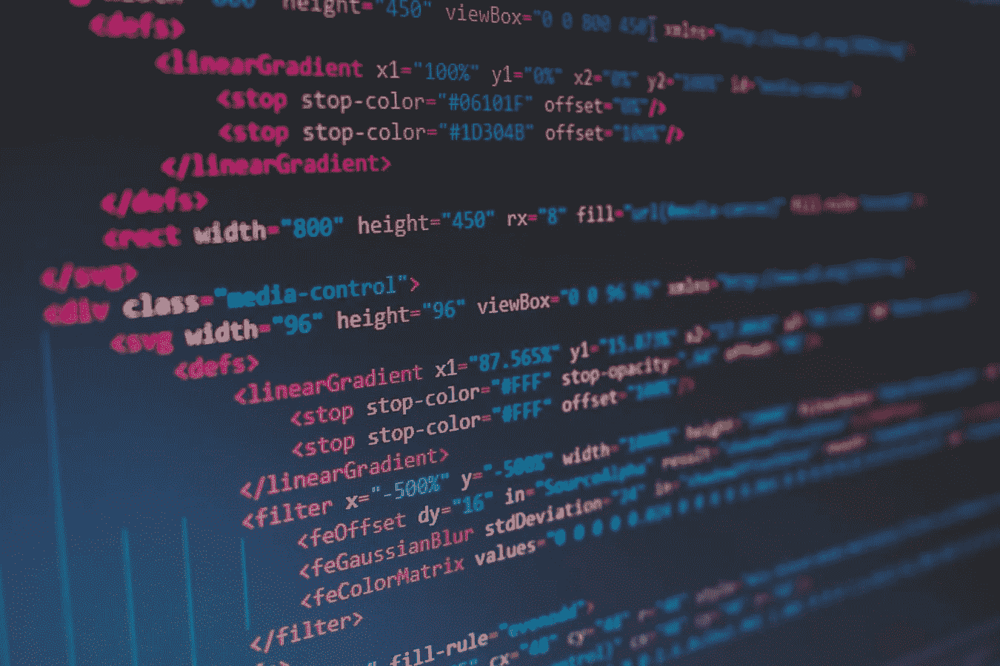
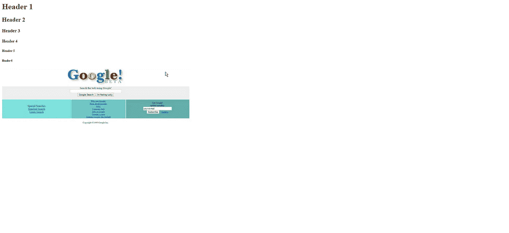
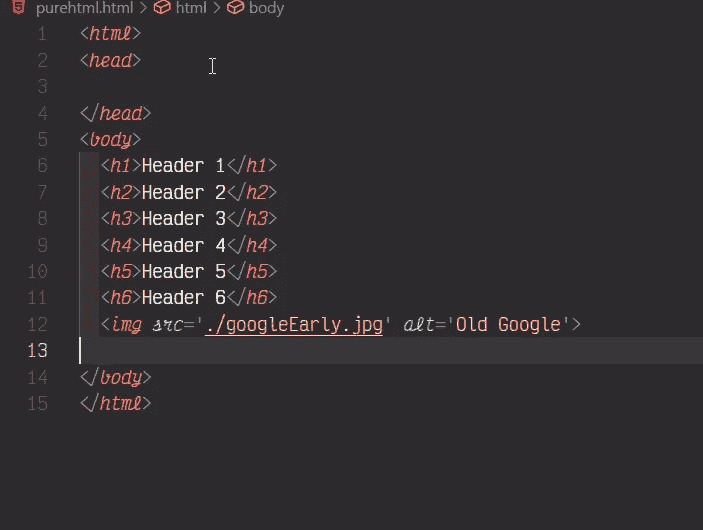
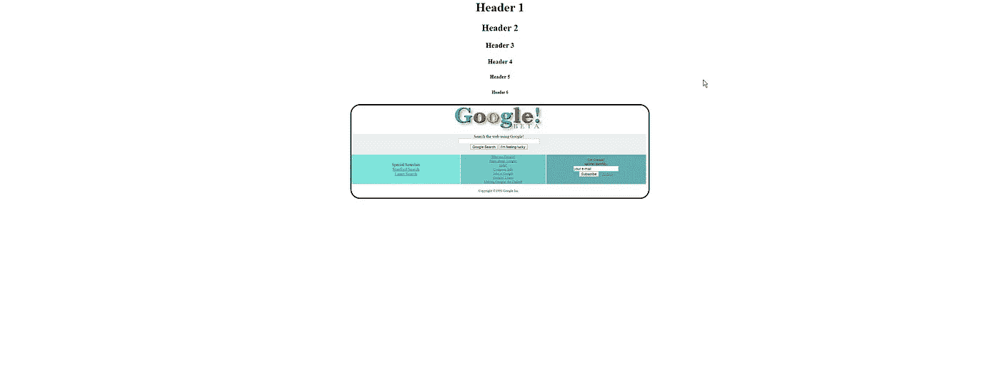
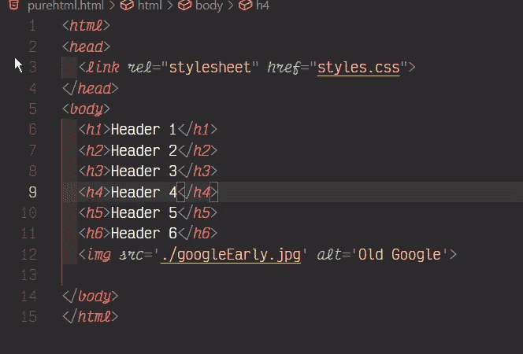
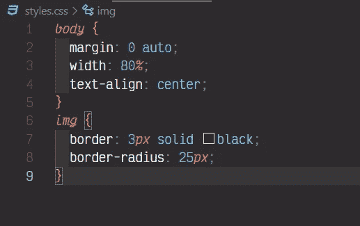

# 前端！—第一部分

> 原文：<https://medium.com/nerd-for-tech/front-end-part-one-856495ba3865?source=collection_archive---------31----------------------->

HTML 和 CSS

弗洛里安·奥利佛在 [Unsplash](https://unsplash.com/s/photos/html?utm_source=unsplash&utm_medium=referral&utm_content=creditCopyText) 上拍摄的照片

我早就计划深入研究这个问题，但遗憾的是我没有时间这样做。随着阵亡将士纪念日的到来，我想花点时间来开始这个系列可能是值得的。

作为免责声明:这些文章的写作质量不会像我平时写的那样清晰，因为我想快速浏览这些文章。我希望在传达信息的同时，不要花费数小时去重新发明轮子。有数以千计的关于这个信息的指南，所以我提供基本信息，一个指南指南，如果你愿意的话，然后推动你开始你自己的学习之旅！做你想被教导的老师。自学，然后建立，建立，建立更多！

这里的计划是分享一条途径，让人们从兴趣出发，开始走上建立技能组合的道路。我不想自称是受教育程度最高或经验最丰富的人，但我的计划是提供大量的资源来提高你的技能，这样你就可以自学，或者参加训练营或大学，并在你经历这些时助你一臂之力。

在我们深入了解最基本的内容之前，让我们先来看一下你需要真正锁定的几个要点。

1.  学会阅读文档！
2.  谷歌&栈溢出是你的朋友！
3.  构建>教程(包括 Udemy 课程)

超文本标记语言( **HTML** )是一组插入文件中的标记符号或代码，用于在互联网上显示。标记告诉 web 浏览器如何显示网页的文字和图像。

来源:[https://www.investopedia.com/terms/h/html.asp](https://www.investopedia.com/terms/h/html.asp)

HTML 是第一个需要真正理解的构建块，因为随着您在前端的进展，您需要理解各个部分是如何组合在一起的，以便您能够利用 JavaScript，并最终利用 JavaScript 框架/UI 库，如 React/Angular/Vue。

在一个非常基本的层面上，你必须明白 HTML 是丑陋的。这是文本和图像刚刚插入页面。你真的必须把 HTML 和 CSS 结合在一起才能有所作为。

让我们看一个纯 HTML 页面:

简单纯 Html 网站的图像

纯 HTML 示例的代码图像

我想让你注意到，在这个例子中，除了我们链接到页面的图片之外，实际上没有链接到外部文件。这意味着这个例子是完全无样式的，没有得到任何修改，使它看起来更好。你会注意到所有的内容都被推到了浏览器的左侧，并且是一行接一行的。这不是一个被缩小并被扔在页面上的图像，这是一个超宽显示器上的纯 HTML。由于没有 CSS，它不能伸展，或形成一个更有凝聚力的网页。

让我们看看如果我添加一点 CSS 会发生什么，然后我会开始转储一些链接供您探索学习概念。此外，我将强调我个人认为的关键组件，以确保您真正深入了解！

首先:这是页面的图像，现在 CSS 已经被混合在一起了！

Html 和 CSS 放在一起形成一个更干净的页面！

对原始代码的修改:

是的。添加到原始代码库中的一行代码(第 3 行)改变了整个页面。神奇！不完全是。查看第 3 行引用的 CSS 文件！

CSS 修改我们的纯 HTML 页面。

在这两个文件之间，我们总共添加了 10 行代码，其中几行是右括号。

这并不神奇，但我确实喜欢在一个项目中插入几行代码，突然之间，这些代码从最糟糕的东西变成了一个漂亮的、充实的页面，让我感到自豪。就我个人而言，页面外观对我来说非常重要。最后，我花了太多时间定期确保我的用户界面是像素完美的，看起来和感觉起来都是我想要的。我描述它的方式是在雷雨时盖上一条温暖的毯子，看着雨水拍打着窗户。这令人欣慰，同时也令人恐惧。

好吧，那么 HTML 的胜利秘诀是什么:

1.  语义 HTML

语义 HTML 相对于我们过去处理 HTML 的方式是一个巨大的进步。它为您提供了更精确的标签，而不是每个分隔符都使用 DIV。它允许您更快地浏览您的或其他人的代码，并获得您需要修改的代码部分，并了解他们在用它做什么。

1.  易接近

照顾最终用户非常重要，我怎么强调都不为过。确保我们的视障人士能够使用您的页面/网站/应用程序至关重要。请确保您关注所有的最终用户！

如果您要播放音频，那么请确保您在视觉上向听力受损者展示有音频播放。如果你要在页面上使用频闪效果，那么确保你有一个闪屏页面，带有一个模态警告，提示页面上有潜在的诱发癫痫的图形。如果你将有任何成人材料或潜在的触发诱导材料，请确保你没有注意到这一点！

确保你所有的图片都有 Alt 标签，并确保你使用 aria 角色！

1.  组织

组织您的页面，使相似的内容组合在一起。确保你的网页有一个一致的结构，以确保当有人使用你的网站时，他们能够了解你是如何组织的，这样他们就可以尽可能轻松地快速找到你想要的东西。

确保你不是为你自己，而是为你的最终用户设计你的项目。这是一把关键的钥匙。

资源:从这里开始，学习并理解所有标签的用途。这两个资源为您快速构建一个简单的纯 HTML 页面提供了足够多的信息。

 [## HTML 教程

### HTML 是网页的标准标记语言。使用 HTML，你可以创建自己的网站。HTML 很好学…

www.w3schools.com](https://www.w3schools.com/html/default.asp)  [## 用 HTML 构建 web-学习 web 开发| MDN

### 要建立网站，你应该了解 HTML -用来定义网页结构的基本技术…

developer.mozilla.org](https://developer.mozilla.org/en-US/docs/Learn/HTML) 

CSS 键:

1.  响应式设计
2.  FlexBox
3.  CSS 网格
4.  类别与 ID
5.  箱式模型

现在我不打算像对 HTML 那样详细说明，但我会简单地说:CSS 可以说是你的页面的皮肤。当你进行前端项目时，你将会使用一些 CSS 或 CSS 预处理程序或组件库。慢慢来，有扎实的 CSS 基础。

资源:
[https://www.w3schools.com/css/](https://www.w3schools.com/css/)

 [## CSS 第一步-学习 web 开发| MDN

### CSS(层叠样式表)用于设计网页的样式和布局——例如，改变字体、颜色、大小和…

developer.mozilla.org](https://developer.mozilla.org/en-US/docs/Learn/CSS/First_steps)  [## 指南存档| CSS-技巧

### HTML 中的元素用于显示表格数据。您可以将其视为描述和显示数据的一种方式…

css-tricks.com](https://css-tricks.com/guides/) 

当我忘记一些事情时(这是会发生的), CSS Tricks 网站是我的参考指南。！！).浏览整个网站，你会学到很多东西，这些东西最终会以你无法想象的方式帮助你。

当我们结束前端的第一部分时，我会给你一些想法，这样你就可以向自己证明你学到了一些东西。

没有功能建立一个谷歌搜索页面
建立几个营销页面(商业网站)
建立一个 HTML/CSS 组合
学习一个 CSS 预处理器如 Sass
学习一个 UI 组件库如 Bootstrap