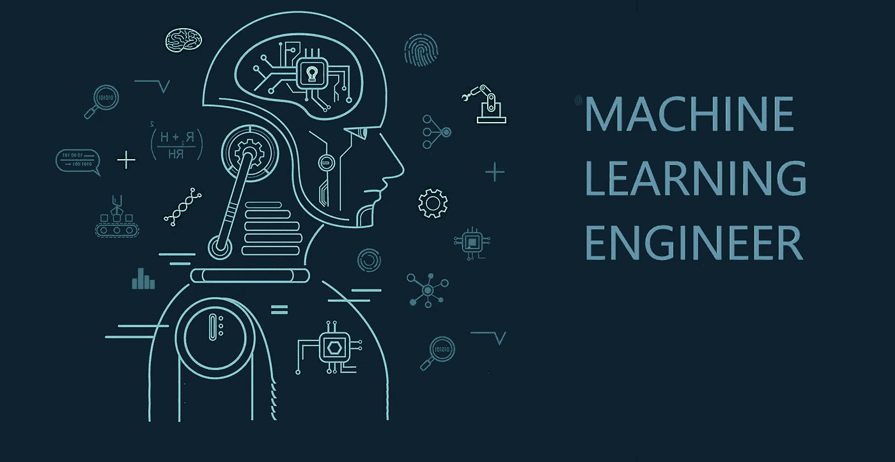
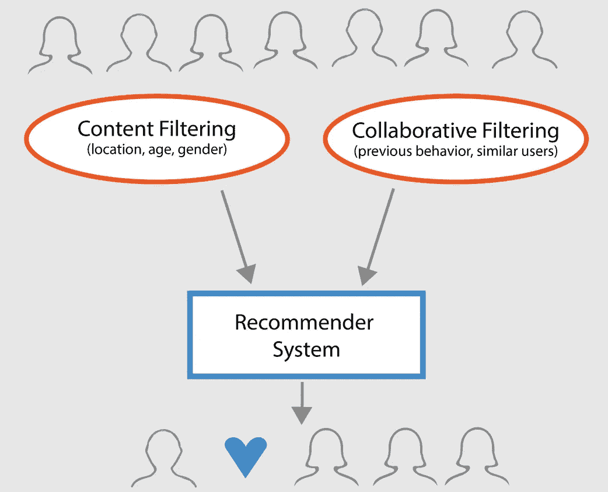
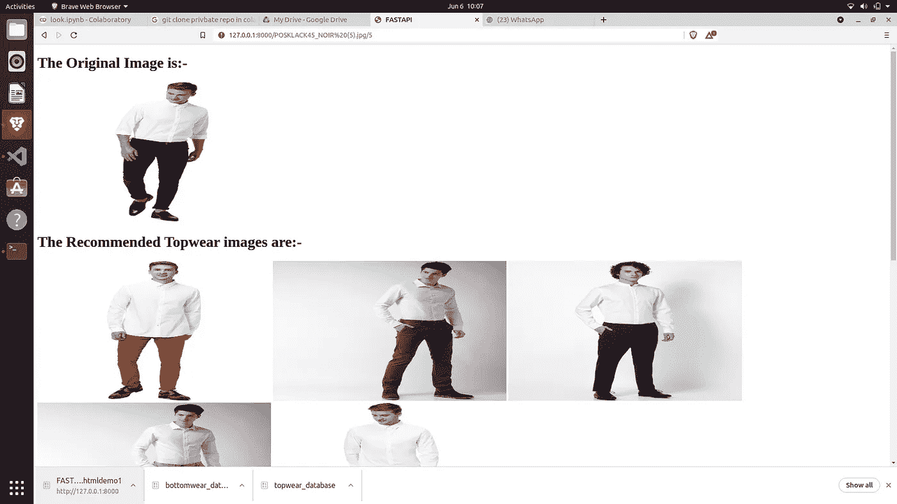
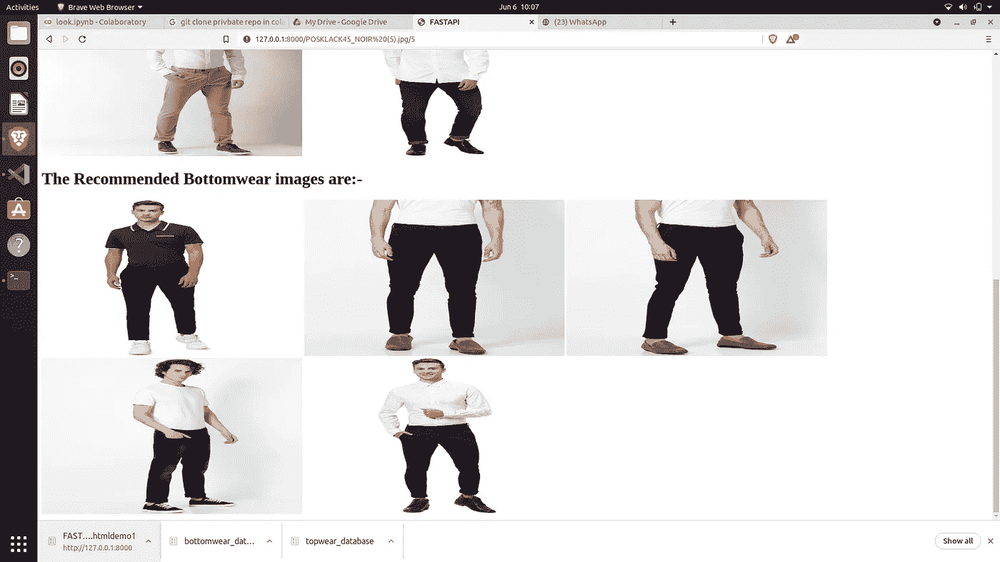
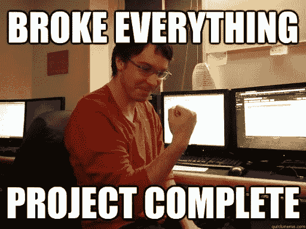

# 作为 ML 工程师，从零开始全面开发推荐系统。

> 原文：<https://medium.com/nerd-for-tech/full-scale-development-of-recommendation-system-as-ml-engineer-from-scratch-ba66c05b1f4b?source=collection_archive---------18----------------------->



从许多方面来看，推荐系统都是最重要和最复杂的软件工程系统之一。这是网飞、youtube 等巨头成功的原因之一。

将一个全面的推荐系统作为一个工作中的公司的现成可部署产品，需要深度学习、逻辑编程、数据库和领域的大量知识，除此之外，您还应该具备部署和维护所需的软件工程和开发知识。[“是的，这些我都知道，哈哈”]


大家好，我是 Aditya Raj，目前是阿拉哈巴德 IIIT 大学的二年级学生，同时也是 yellowbacks.com 大学的机器学习工程师。

我现在已经工作了 5 个月，感到非常幸运能在一家成长中的初创公司工作，我学到了很多东西，并有机会设计、制作和部署一些有趣的基于人工智能的系统。

好吧，在这里我将谈论我最喜欢的项目，它让我真正成为了一名完整的软件工程师。好吧，我会试着从头开始解释，但基本的工程和数学知识不会让你觉得狗屎。

在这里，有价值的计算机视觉知识是优选的。如果你没有，下面是另一个博客的链接。

此外，我将保持事情的小基本相比，原来的项目，以便任何人都可以参考他们未来的项目。

推荐系统:-推荐系统是基于人工智能的软件系统，它根据产品的特征或用户的特征或两者向用户推荐产品。



在基于项目的推荐系统中，我们发现项目的特征，然后根据特征之间的相似性进行推荐。(内容过滤)

在基于用户中，我们发现用户的特征，然后向相似的用户推荐相似的产品。(协同过滤)

混合推荐系统是一个使用两者的系统。我正在开发混合推荐系统。

今天，我将解释基于内容的部分，我仍然在努力将其转换为混合之一。我做的推荐系统是为一个时尚创业公司，所以它是一个基于视觉的产品(计算机视觉的东西)。它基本上是在亚马逊上以“你可能也会喜欢”的形式向你展示产品的东西。

我的工作系统的基本演示



现在把它与一家大型科技公司的相比较


嗯，谢谢，我知道我很好……..

不要为设计而哭泣，因为它只是一个 **api** 还没有嵌入到一个漂亮的软件中。

现在我们来学习。

因此，我将在这些部分解释整个系统:-

1.  高级外观和设计
2.  R&E(研究和实验)
3.  深度学习和数据工程
4.  后端编码和 API 制作
5.  部署

# **高级外观和设计**

所以，这部分对我来说是最难写的，让我们试试:-

简单地说，考虑时尚网站的每个图像都存储在数据库服务器中。假设每个图像都被转换成 2048 维的数学向量(或者对于编码器来说是具有 2048 个元素的数组)。现在假设一个用户正在为他的女朋友看一条牛仔裤，而我的人工智能系统必须向他推荐相似的牛仔裤，那会怎样呢？

很简单，计算当前 jean 向量与所有图像向量之间的距离，并输出距离最小的图像。

因此，我必须设计和编写一个算法，为每张图片寻找嵌入(向量)，并将其保存在数据库和另一个基本代码，以寻找向量之间的距离，并推荐距离较小的图片。

这并不简单，为每张图像寻找嵌入需要大量的深度学习、机器学习知识和经验，最重要的是耐心。

# 研究和实验部分

这一部分包括更多地研究和理解 github、colab、medium 和其他开源平台上的现有系统和模型。

现在解释我所有的研究和实验肯定会让你厌烦，所以直接下结论吧。

我从研究和实验中学到的

1.  我应该使用迁移学习法，以时尚图像分类为基础。
2.  DeepFashion 数据集是可用的最佳选项。
3.  迁移学习架构应修改为与分类并行的对象检测或包围盒架构，以忽略背景以及分别推荐每个时尚子部分。
4.  嵌入应该是一维的，并且被排列以使得数据库更便宜并且使得距离计算更快。
5.  系统的延迟应该是低的，欧几里德距离在这里是简单、容易和有效的方法。
6.  对象检测和裁剪也应该非常有效地完成，因为在我的情况下，需要推荐上装和下装，所以我使用了脸书·艾的 detectron 2 进行裁剪(“我很先进”)。
7.  对于 detectron 2，deepfashion 2 用于多目标检测。

# 深度学习和数据工程

这部分涉及到项目最复杂的方面，即获得嵌入(数学向量)。

如果你不知道计算机视觉的基础知识，我很抱歉，我有另一个博客给你，将在描述中提供。

在计算向量之前，我们需要从图像中裁剪出下穿和上穿图像。我们将使用 detectron:

步骤 1:-预处理深度时尚 2:-

```
**from** **PIL** **import** Image
**import** **numpy** **as** **np**
**import** **json**

dataset = {
    "info": {},
    "licenses": [],
    "images": [],
    "annotations": [],
    "categories": []
}

lst_name = ['short_sleeved_shirt', 'long_sleeved_shirt', 'short_sleeved_outwear', 'long_sleeved_outwear',
            'vest', 'sling', 'shorts', 'trousers', 'skirt', 'short_sleeved_dress',
            'long_sleeved_dress', 'vest_dress', 'sling_dress']

**for** idx, e  **in** enumerate(lst_name):
    dataset['categories'].append({
        'id': idx + 1,
        'name': e,
        'supercategory': "clothes",
        'keypoints': ['**%i**' % (i) **for** i **in** range(1, 295)],
        'skeleton': []
    })

num_images = 32153 *#191961* 
sub_index = 0  *# the index of ground truth instance*
**for** num **in** range(1, num_images + 1):
    json_name = '/content/validation/annos/' + str(num).zfill(6) + '.json'
    image_name = '/content/validation/image/' + str(num).zfill(6) + '.jpg'

    **if** (num >= 0):
        imag = Image.open(image_name)
        width, height = imag.size
        **with** open(json_name, 'r') **as** f:
            temp = json.loads(f.read())
            pair_id = temp['pair_id']

            dataset['images'].append({
                'coco_url': '',
                'date_captured': '',
                'file_name': str(num).zfill(6) + '.jpg',
                'flickr_url': '',
                'id': num,
                'license': 0,
                'width': width,
                'height': height
            })
            **for** i **in** temp:
                **if** i == 'source' **or** i == 'pair_id':
                    **continue**
                **else**:
                    points = np.zeros(294 * 3)
                    sub_index = sub_index + 1
                    box = temp[i]['bounding_box']
                    w = box[2] - box[0]
                    h = box[3] - box[1]
                    x_1 = box[0]
                    y_1 = box[1]
                    bbox = [x_1, y_1, w, h]
                    cat = temp[i]['category_id']
                    style = temp[i]['style']
                    seg = temp[i]['segmentation']
                    landmarks = temp[i]['landmarks']

                    points_x = landmarks[0::3]
                    points_y = landmarks[1::3]
                    points_v = landmarks[2::3]
                    points_x = np.array(points_x)
                    points_y = np.array(points_y)
                    points_v = np.array(points_v)
                    case = [0, 25, 58, 89, 128, 143, 158, 168, 182, 190, 219, 256, 275, 294]
                    idx_i, idx_j = case[cat - 1], case[cat]

                    **for** n **in** range(idx_i, idx_j):
                        points[3 * n] = points_x[n - idx_i]
                        points[3 * n + 1] = points_y[n - idx_i]
                        points[3 * n + 2] = points_v[n - idx_i]

                    num_points = len(np.where(points_v > 0)[0])

                    dataset['annotations'].append({
                        'area': w * h,
                        'bbox': bbox,
                        'category_id': cat,
                        'id': sub_index,
                        'pair_id': pair_id,
                        'image_id': num,
                        'iscrowd': 0,
                        'style': style,
                        'num_keypoints': num_points,
                        'keypoints': points.tolist(),
                        'segmentation': seg,
                    })

json_name = '/content/deepfashion2_train.json'
**with** open(json_name, 'w') **as** f:
    json.dump(dataset, f)
```

步骤 2 :-在深度时尚 2 上培训侦探 2:-

```
cfg = get_cfg()

cfg.merge_from_file(model_zoo.get_config_file("COCO-Detection/faster_rcnn_R_101_FPN_3x.yaml"))
cfg.DATASETS.TRAIN = ("deepfashion_train",)
cfg.DATASETS.TEST = ()
cfg.MODEL.WEIGHTS = model_zoo.get_checkpoint_url("COCO-Detection/faster_rcnn_R_101_FPN_3x.yaml")  *# Let training initialize from model zoo*

cfg.SOLVER.IMS_PER_BATCH = 4
cfg.SOLVER.BASE_LR = 0.001
cfg.SOLVER.WARMUP_ITERS = 1000
cfg.SOLVER.MAX_ITER = 1500
cfg.SOLVER.STEPS = (1000,1500)
cfg.SOLVER.GAMMA = 0.05
cfg.MODEL.ROI_HEADS.BATCH_SIZE_PER_IMAGE = 64
cfg.MODEL.ROI_HEADS.NUM_CLASSES = 13

cfg.TEST.EVAL_PERIOD = 500os.makedirs(cfg.OUTPUT_DIR, exist_ok=**True**)
trainer = DefaultTrainer(cfg) 
trainer.resume_or_load(resume=**False**)
trainer.train()
```

步骤 3:-将准备好的模型和配置保存在 zip 文件中

```
**import** **shutil**
shutil.make_archive('fashion_model', 'zip', '/content/output')
%**cp** "/content/fashion_model.zip" "/content/drive/My Drive/"
```

现在，让我们开发一个裁剪功能，在训练有素的 detectron 模型的帮助下，将任何图像裁剪成上装和下装。

现在我们已经把上衣和下装的图像分开了，我们必须为嵌入训练模型。

这是一个适当的深度学习项目。使用一个 resnet 50 型号的 keras，在 Deepfashion 上微调最后几层。现在，为了有更好的效果，我们将添加 2 层的边界框，最后在深度时尚上进行分类检测。

## model _ resnet = resnet 50(weights = ' imagenet '，include_top=False，pooling='avg ')

## 对于 model_resnet.layers[:-12]中的层:

## layer.trainable = False

## x =模型 _resnet .输出

## x = Dense(512，activation='elu '，kernel _ regulator = L2(0.001))(x)#这里是 elu，不是 RELU

## y = Dense(46，activation='softmax '，name='img')(x)

## x_bbox =模型 _resnet .输出

## x_bbox = Dense(512，activation='relu '，kernel _ regulator = L2(0.001))(x _ bbox)

## x_bbox = Dense(128，activation='relu '，kernel _ regulator = L2(0.001))(x _ bbox)

## bbox = Dense(4，kernel_initializer='normal '，name='bbox')(x_bbox)

## final _ Model = Model(inputs = Model _ resnet . input，

## 输出=[y，bbox])

## 以前的建筑

_ _ _ _ _ _ _ _ _ _ _ _ _ _ _ _ _ _ _ _ _ _ _ _ _ _ _ _ _ _ _ _ _ _ _ _ _ _ _ _ _ _ _ _ _ _ _ _ _ _ _ _ _ _ _ _ _ _ _ _ _ _ _ _ _ _ _ _ _ _ _ _ _ _ _ _ _ _ _ _ _ _ _ _ _ _ _ _ _ con V5 _ block 3 _ 3 _ bn(BatchNormali(无，无，无，2 8192 con V5 _ block 3 _ 3 _ conv[0][0]_ _ _ _ _ _ _ _ _ _ _ _ _ _ _ _ _ _ _ _ _ _ _ _ _ _ _ _ _ _ _ _ _ _ _ _ _ _ _ _ _ _ _ _ _ _ _ _ _ _ _ _ _ _ _ _ _ _ _ _ _ _ _ _ _ _ _ _ _ _ _ _ _ _ _ con V5 _ block 3 _ Add(Add)(无，无，无，2 0

该架构在 deepfashion 数据集上的 gpu 上训练了 120 个时代。

## 之后的建筑:-

con V5 _ block 3 _ 3 _ bn(BatchNormali(None，None，None，2 8192 con V5 _ block 3 _ 3 _ conv[0][0]_ _ _ _ _ _ _ _ _ _ _ _ _ _ _ _ _ _ _ _ _ _ _ _ _ _ _ _ _ _ _ _ _ _ _ _ _ _ _ _ _ _ _ _ _ _ _ _ _ _ _ con V5 _ block 3 _ Add(Add)(None，None，None，2 0 con V5 _ block 2 _ out[0][0]con V5 _ block 3 _ 3 _ bn[0]_ _ _ _ _ _ _ _ _ _ _ _ _ _ _

训练后从这个修改的模型输出的 2048 长度向量将被用作图像的嵌入。

深度学习部分在这里完成，现在我们将转移到后端编码部分。

# 后端编码和 API 开发

让我们首先使用我们在对象检测部分所做的检测器硬件来获得裁剪图像功能

```
def crop_images(image):
  config_file_path = "config.yaml"
  model_path = "model_final.pth"

  lst_name = ['short_sleeved_shirt', 'long_sleeved_shirt', 'short_sleeved_outwear', 'long_sleeved_outwear',
              'vest', 'sling', 'shorts', 'bottom_wear', 'skirt', 'short_sleeved_dress',
              'long_sleeved_dress', 'vest_dress', 'sling_dress']

  bottom = ['shorts', 'bottom_wear', 'skirt']
  top = ['short_sleeved_shirt', 'long_sleeved_shirt', 'short_sleeved_outwear', 'long_sleeved_outwear','vest','short_sleeved_dress',
              'long_sleeved_dress', 'vest_dress']

  cfg = get_cfg()
  cfg.merge_from_file(config_file_path)
  cfg.MODEL.WEIGHTS =  model_path
  cfg.DATASETS.TEST = ("deepfashion_val", )
  cfg.MODEL.ROI_HEADS.SCORE_THRESH_TEST = 0.55   # set the testing threshold for this model
  predictor = DefaultPredictor(cfg)

  im = cv2.imread(image)
  outputs = predictor(im)

  boxes = {}
  for coordinates in outputs["instances"].to("cpu").pred_boxes:
    coordinates_array = []
    for k in coordinates:
      coordinates_array.append(int(k))

    boxes[uuid.uuid4().hex[:].upper()] = coordinates_array

  image_batch = []
  image_details = []
  for k,v in boxes.items():
    crop_img = im[v[1]:v[3], v[0]:v[2], :]
    image_batch.append(crop_img)

  for i in range(0,len(boxes)):
      image_details.append(lst_name[outputs['instances'][i].pred_classes.item()])

  botret = []
  topret = []
  for i in np.arange(0,len(image_batch)):
    if image_details[i] in bottom:
      botret.append(image_batch[i])
    if image_details[i] in top:
      topret.append(image_batch[i])

  print("Cropping Successful")
  return topret,botret
```

得到裁剪后的图像后，它的嵌入时间。

让我们看看在裁剪图像和这个模型的帮助下生成嵌入数据库的代码

```
for items in os.listdir('images'):
    if items in rotten:
        continue
    else:
        top,bottom = crop.crop_images('images/'+items)

        for img in top[:1]:
            img = img.reshape(1,img.shape[0],img.shape[1],img.shape[2])
            topwear_database[items] = embed(img).numpy()[0]

        for img in bottom[:1]:
            img = img.reshape(1,img.shape[0],img.shape[1],img.shape[2])
            bottomwear_database[items] = embed(img).numpy()[0]

        im = cv2.imread('images/'+items)
        img = im.reshape(1,im.shape[0],im.shape[1],im.shape[2])
        main_database[items] = embed(img).numpy()[0]
```

经过这个漫长的过程，数据库已经准备好了。

现在，我们只需要获取用户图像，并根据嵌入向量的距离推荐相似的图像。

用于获得 k 个相似推荐的函数:-

```
def similar_k(image_id,k):

  toprecommended = []
  bottomrecommended = []
  output1 = topwear_database[image_id]
  output2 = bottomwear_database[image_id]

  dis_dict = {}
  for key in topwear_database:
    dis_dict[key] = euclidean_distance(topwear_database[key],output1)

  sorted_dis_dict = dict(sorted(dis_dict.items(), key=lambda item: item[1]))
  i = 0

  for key in sorted_dis_dict:
    if i == k:
      break
    if key == image_id:
      continue;
    else:
        toprecommended.append(key)

    i = i+1

  dis_dict = {}
  for key in bottomwear_database:
    dis_dict[key] = euclidean_distance(bottomwear_database[key],output2)

  sorted_dis_dict = dict(sorted(dis_dict.items(), key=lambda item: item[1]))
  i = 0

  for key in sorted_dis_dict:
    if i == k:
      break
    if key == image_id:
      continue;
    else:
        bottomrecommended.append(key)

    i = i+1

  return toprecommended,bottomrecommended
```

在 fastAPI 的帮助下开发的 API 中使用了以下所有代码功能。fastapi 的代码工作非常简单，无需讨论。

# 部署:

我必须将 api 部署到 docker 上，以便其他开发人员可以使用它来集成。

Docker 是一种可以在服务器和系统之间转移的虚拟容器。

首先，我将我的所有需求设置到 requirements.txt 文件中，然后创建一个 docker 文件。

API 可以直接使用和集成，但是对于数据库制作和嵌入生成我们当然需要 Docker。

```
FROM ubuntu:20.04

RUN apt update && apt install -y htop python3
RUN apt install -y python3-pip

RUN pip install torch==1.5.0+cpu torchvision==0.6.0+cpu -f https://download.pytorch.org/whl/torch_stable.html
RUN pip install detectron2==0.1.3+cpu -f https://dl.fbaipublicfiles.com/detectron2/wheels/cpu/index.html

COPY requirements.txt ./requirements.txt

RUN pip install -r requirements.txt
COPY . .

RUN python3 database.py && python3 test.py
```

将构建上下文发送到 Docker 守护进程 613.5MB
步骤 1/9:从 Ubuntu:20.04
—>7 E0 aa 2d 69 a 15
步骤 2/9:运行 apt 更新&&apt install-y htop python 3
—>使用缓存
—>75031337 f4ce
步骤 3/9:运行 apt install -y python3-pip 【T6 缓存
—>CB 2 ab 85 a 33 c 0
第 5/9 步:运行 pip 安装检测器 2 = = 0 . 1 . 3+CPU-f[https://dl . fbaipublicfiles . com/detectron 2/wheels/CPU/index . html](https://dl.fbaipublicfiles.com/detectron2/wheels/cpu/index.html)
—>使用缓存
—>1059 CFF 99453
第 6/9 步:复制需求. txt。 /requirements.txt
— - >使用缓存
— - > 1ef1b3763905
第 7/9 步:运行 pip install-r requirements . txt
—->使用缓存
—>54 aafe 521 f90
第 8/9 步:复制。。
—>4f 991 a 474 a 99
第 9/9 步:运行 python 3 database . py&&python 3 test . py
—>运行于 391ab8cfe128

# 《我们准备好了》



任何疑问，评论，建议，感谢将不胜感激

我的 whatsapp 号码:- 8292098293

电子邮件 Id:-adityaraj20008@gmail.com

目标检测和计算机视觉基础的博客链接:-[https://aditya 007 . medium . com/research-summary-object-detection-up-fast-rcnn-43d 5944 F4 f6f](https://aditya007.medium.com/research-summary-object-detection-upto-fast-rcnn-43d5944f4f6f)

不要忘记喜欢和分享我的内容，谢谢…