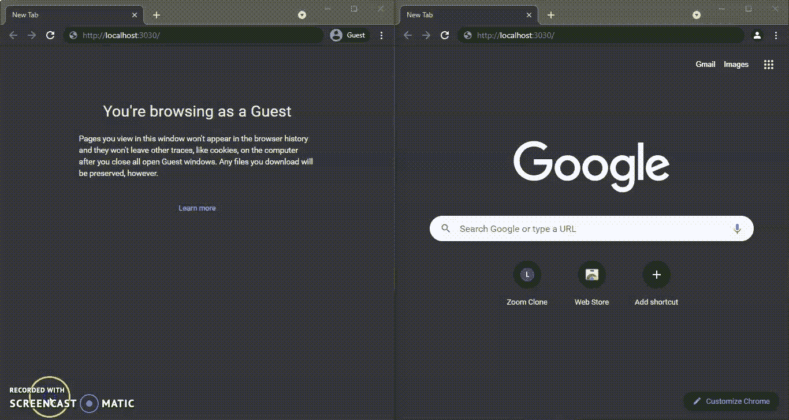
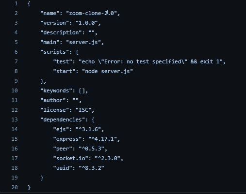
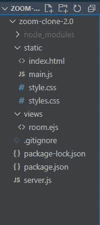

# 全栈缩放克隆

> 原文：<https://medium.com/nerd-for-tech/full-stack-zoom-clone-943289af8f7d?source=collection_archive---------2----------------------->



大家好，最近我用 node js，Express，peer js 创建了自己的 Zoom 克隆。这些概念可能有点难，但我会尽力解释。但是在开始之前，让我们先了解一下它的一些核心特性:

*   **加入或主持会议的介绍页面**
*   **视频和语音聊天**
*   **文字聊天**

现在，在开始之前，我假设您对 node js、Html、Css 和 Javascript 有一些了解。你可以从[这里](https://nodejs.org/en/download/)安装 node js。我个人更喜欢使用 [Visual Studio 代码](https://code.visualstudio.com/download)，但是你可以使用任何你选择的 IDE。好了，现在让我们安装我们将要使用的所有模块。

# 模块说明和安装

首先，让我们使用以下命令创建 package.json 文件:

```
npm init
```

它将包含关于项目依赖项的所有信息(这些依赖项是在项目构建之前安装的)。*注意:当它询问你你的 app 入口点* ***时，输入 server.js。***
现在我们来安装一些模块:

*   ***EJS***

使用 ejs，我们可以将数据作为 javascript 对象传递，我们可以在 HTML 文档中使用这些对象的键来传递数据。但是你的页面应该在。ejs 的格式。因此，基本上，我们将数据定义到模板中，模板呈现一个 HTML 文档，我们可以在其中使用我们定义的数据。

**安装*安装*安装**

```
npm install ejs
```

*   ***UUID***

UUID 用于创建唯一的 ID，我们将使用这些唯一的 id 来创建房间。因此，如果一个用户想“主持一个新的会议”，一个新的独特的链接将为他使用 UUID 创建，否则他可以加入已经由其他用户一次。

***安装***

```
npm install uuid
```

*   ***表示***

Express 是最流行的框架之一，用于创建单页面或多页面 web 应用程序。它主要用于以不同的方法(GET、POST、PUT、DELETE)处理不同路由的请求。我们还可以将不同的模板引擎与 express 集成，express 允许我们将数据输入到 HTML 文件中(在我们的例子中，我们使用的是 Ejs 模板引擎)。
现在让我们安装 express

***安装***

```
npm install express --save
```

*   【T42*socket . io*

Socket.io 用于客户端(浏览器)和服务器之间的实时和基于事件的通信。

***安装***

```
npm install socket.io
```

*   ***同行 js***

> **PeerJS** 简化了 WebRTC **对等**到**对等**的数据、视频和音频通话。 **PeerJS** 包装了浏览器的 WebRTC 实现，以提供一个完整的、可配置的、易于使用的**对等**到**对等**连接 API

首先，那么什么是 **webrtc** ？
Webrtc 用于设备间的实时媒体通信(语音和视频聊天)。webrtc 允许我们捕获设备的麦克风、摄像头或屏幕，我们可以与其他用户共享这些数据。

所以 peer js 允许我们毫不费力地完成所有这些功能。因此，peer js 包装了浏览器的 webrtc 实现，基本上为我们的语音和视频聊天提供了对等连接。

如果你现在有疑问，你一定会用代码来理解。现在让我们安装它

***安装***

```
npm install peer
```

你的包裹。安装完所有模块后，Json 可能看起来像这样



## ***现在让我们开始编码***

首先，让我们从服务器端编码开始。因此，如果您还没有创建 server.js 文件，那么就创建它。供您参考，这将是该应用程序的 ***总文件结构*** 。

# ***应用程序的文件结构***



让我们开始对我们项目的 ***server.js 文件*** 进行编码，其解释在这个代码片段下面

# S ***erver.js 代码***

这里的代码相当简单:) ***我已经在评论*** 中解释了所有的代码，但是在代码片段的第 13 行需要注意的是，我们只是告诉 express 使用 ejs 作为我们之前安装的模板引擎。默认情况下，express 将在 views 文件夹中查找我们的 ejs 文件(如果有疑问[请再次查看图片](#77fc))。但是，如果您想通过以下方式更改视图的默认路径:

```
app.set('views', path.join(__dirname, '/yourViewDirectory'));
```

因此，创建一个视图文件夹，这个视图文件夹将包含您的 ejs 文件。我已通过 ejs 文件命名为“房间”。“ejs”但是你可以随意命名它，只需在第 40 行相应地更改名称。

现在，让我们在 ***视图文件夹*** 中创建我们的 ejs 文件(用于主克隆页面)

# ***Ejs 文件***

在文件的第 21 行和第 22 行，我们只是在 main.js 文件中添加了我们需要的变量。我们在这个格式 *varName* % >之间添加我们在 server.js 中定义的变量来获取数据。现在，让我们也添加我们的 ***styles.css*** 文件(对于主克隆页面)这是 ***静态文件夹***

# ***Styles.css 文件为 Ejs 文件***

现在，你可能会说，我们的介绍页面的 HTML 和 CSS 文件怎么办？是的，我完全忘记了，让我们把它添加到静态文件夹中，命名为 index.html。如有疑问，请再次检查[文件结构](#77fc)

# ***介绍页面的 Html 文件***

现在它的造型怎么样？现在，让我们为我们的介绍页面添加 ***Style.css***

# ***Style.css 文件用于介绍页面***

好了，这就是这个项目所有的 CSS 和 HTML。现在是 main.js 文件的时候了，它将在客户机的浏览器中执行。我已经检查了大部分代码👇👇在评论里。

# ***客户端*** 的 Main.js 文件

我已经在评论中解释了上面所有的代码，但是如果你有任何其他的疑问，你当然可以评论和提问。所有这些代码在我的 [***Github 页面***](https://www.github.com/harsh317) 上也有。因此，只需克隆回购进行测试

所以，就这些了。您可以随意增强这个缩放克隆，并测试您自己的创造力。比如当用户关闭视频时，你可以发出一个改变视频的函数。

## 在那之前保持安全，保持健康

## 谢谢你